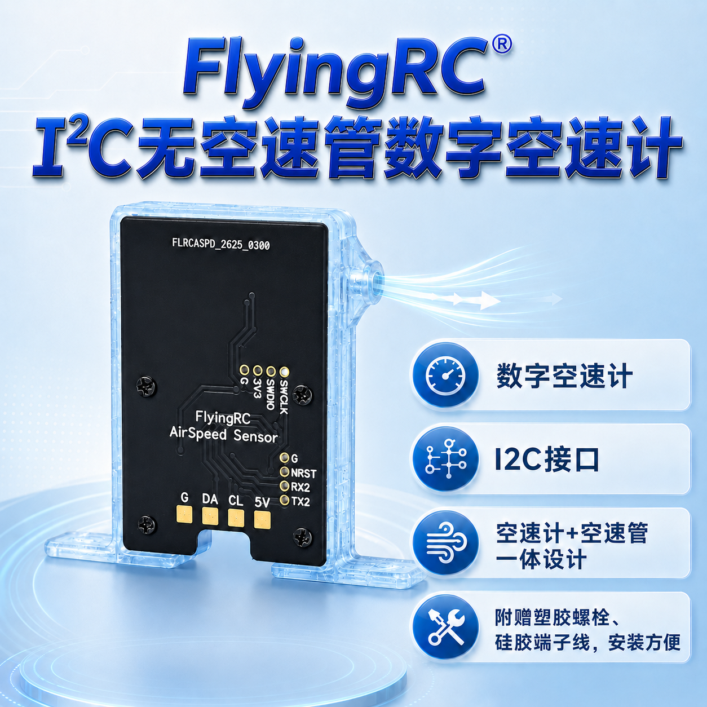
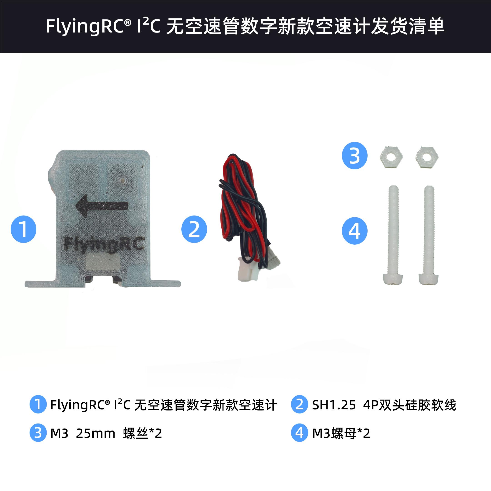

# FlyingRC® I²C无空速管数字新款空速计产品手册

> 状态：在售 · 类别：module · 内容自原 WPS 说明书迁入

---

## 一、FlyingRC介绍

## 二、产品概述

**1. 技术参数:**

| 技术参数 |  |  |  |
|------|------|------|------|
| 产品尺寸 | 32.34mm*37.34mm*7.74mm | 产品重量 | 5g |
| 刷新率 | 8Hz | 采样率 | 512Hz |
| 温度补偿 | √ | 压力测量精度 | 0.5Pa(RMS) |
| 芯片 | MS4525D | 接口 | I2C |

**2. 途用：**

作为飞机标准仪表之一的空速计，是用来测量飞机相对空气的速度，为飞机安全提供了保障。

防止飞机顺风失速；

提高抛飞成功率；

提高飞机续航；

通过判断空速精准帮助完成垂起平飞转换；

ardupilot 自动盘上升气流；

**3. 产品特点:**

MS4525D芯片

数字空速计

I2C接口

空速计+空速管 一体设计

附赠硅胶端子线，安装方便

发货清单：

## 三、使用方法

FlyingRC®空速计在Ardupilot固件上面的设置和使用

首先飞机和飞控应该是已经完全调试，并且试飞完成的状态再考虑安装空速计。请在首飞成功完成后，再安装空速传感器。

空速计安装位置参考:

安装好空速计的首飞设置

ARSPD_TYPE = 1 （修改保存并重连后其他参数才可见）

ARSPD_OPTIONS = 15 (勾选DisableVoltageCorrection)

ARSPD_AUTOCAL = 1

ARSPD_SKIP_CAL = 1

上述参数一次性都改完后, 请立刻保存并给飞控重新上电, 重新上电之后再检查参数ARSPD_OFFSET是否等于0, 如果不是需要立刻设置为0之后保存并重新上电。

每一只空速计发货前都会精调校准漂移，所以可以把ARSPD_SKIP_CAL设置为1，这样飞控上电时也不用刻意的罩住空速计，也不怕地面上电时被风吹到。

首飞自动校准

起飞后用RTL模式或者Loiter模式上天绕圈至少5分钟，让飞控进行自动校准(每2分钟自动保存一次校准值，校准值会保存到参数ARSPD_RATIO)， 在自动校准过程中OSD会有提示。

空速计自动校准完场降落之后

降落后关闭空速计自动校准(正常飞行中一定要关闭自动校准) ARSPD_AUTOCAL = 0 并检查参数ARSPD_RATIO。 如果调整了空速计安装角度，或者更换了空速计，请重置参数ARSPD_RATIO=2.0, 并重新自动校准。

使用空速计的正常飞行

空速计完成自动校准之后才能打开空速计控制 ARSPD_USE=1 或者 2 如果ARSPD_USE设置为2时，只有油门为0的时候飞控才读取空速值，这种模式专门针对部分滑翔机（空速计在机头螺旋桨后面的情况） 。

打开ARSPD_USE之后，空速计才会在自动油门模式(AUTO,CRUISE,FBWB,RTL)下参与飞机油门控制。

请谨慎设置以下参数，且仅在适合您机型的安全飞行条件下进行操作。以下参数都以直接修改参数的形式说明, 如果通过图形界面修改请自行换算单位:

AIRSPEED_CRUISE: 自动油门模式下的目标空速(单位 : 米/秒 M/s ) (Ardupilot4.5以前的参数名TRIM_ARSPD_CM,注意这个旧参数单位厘米/s)

AIRSPEED_MIN: 自动油门模式下的最小空速(用于爬升和降高)，需设置大于失速空速20%的空速。(单位: 米/秒 M/s)(Ardupilot4.5以前的参数名ARSPD_FWB_MIN)

AIRSPEED_MAX: 自动油门模式下的最大空速(用于爬升和降高)，需高于AIRSPEED_MIN 至少50%的值，才能在自动爬升时获得足够油门。 (单位: 米/秒 M/s)(Ardupilot4.5以前的参数名ARSPD_FWB_MAX)

技术问题咨询

若遇技术问题，建议先查阅产品说明书；也可前往AI平台、B站等渠道获取帮助。同时欢迎群友互相协助，分享已知解决方案。

请注意：本产品Ardupilot固件提供有限技术支持，INAV和BF固件无技术支持

## 五、维修服务

本品不提供售后维修服务

## 六、FlyingRC® 其它产品介绍

---

## 安全须知

--8<-- "shared/safety.md"

---

## 首次使用检查

--8<-- "shared/first-use-check.md"

---

## 技术支持

--8<-- "shared/support.md"

---

## 售后与保修

--8<-- "shared/warranty.md"

---

## FlyingRC® 其它产品

--8<-- "shared/other-products.md"

---

## 免责声明

--8<-- "shared/disclaimer.md"

