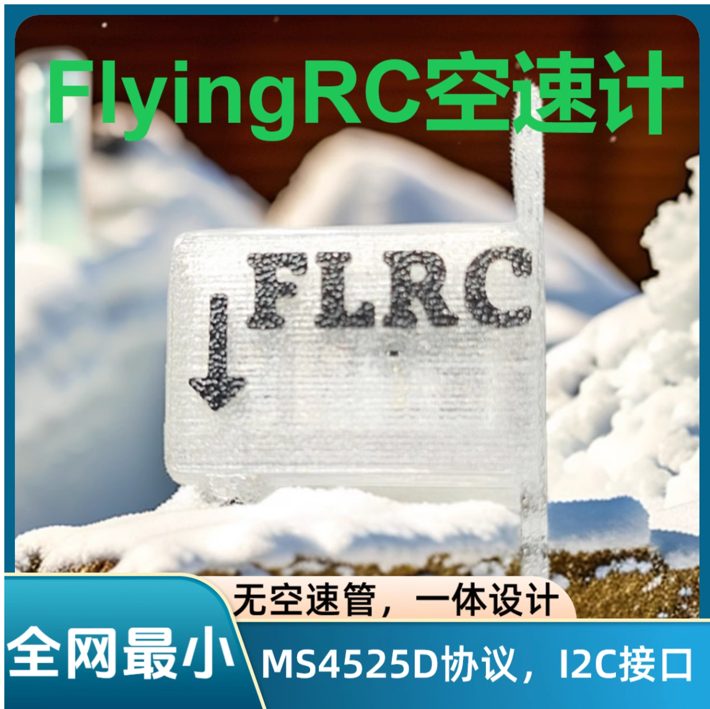
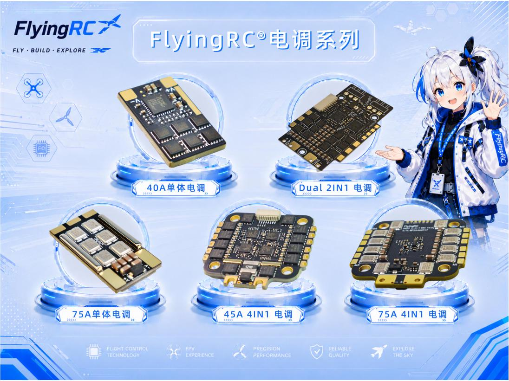
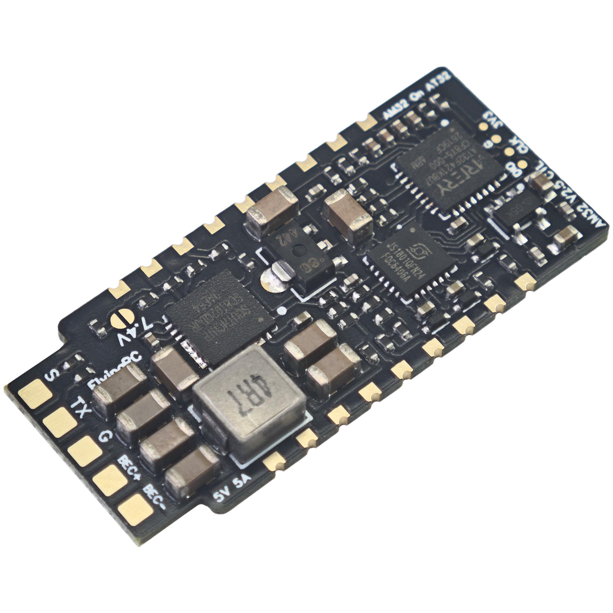
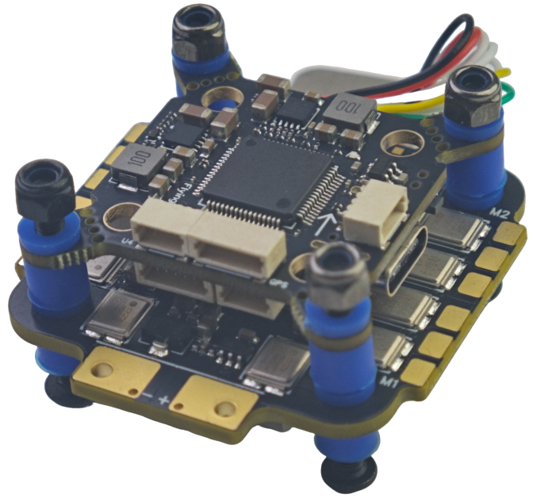
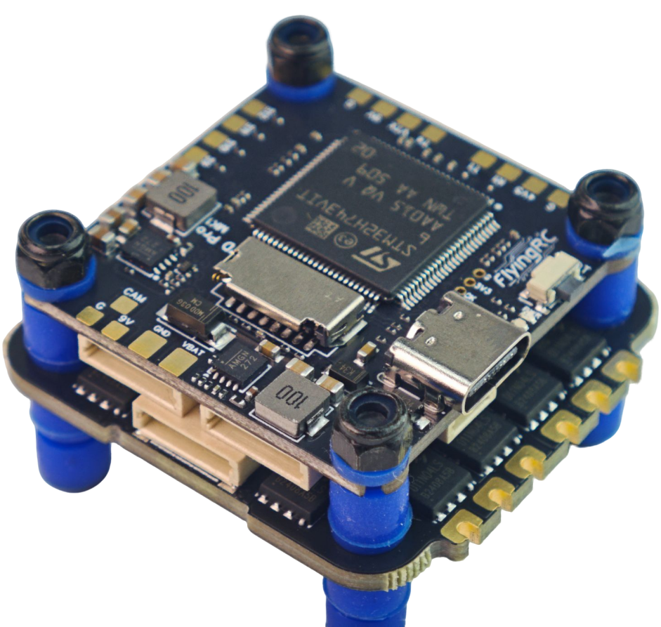
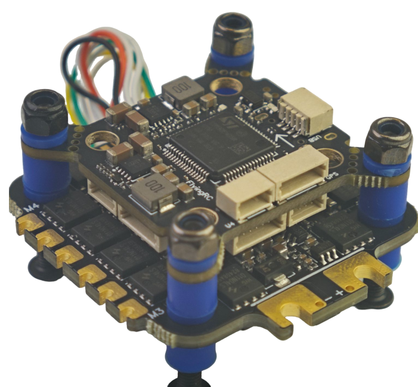

# FlyingRC® I2C无空速管数字新款空速计产品手册

> 状态：在售 · 类别：module · 内容自原 WPS 说明书迁入

---

## 一、FlyingRC介绍

## 二、产品概述

**1. 技术参数:**

产品尺寸：25mm*15mm*5mm

产品重量：2.8g

刷新率：8Hz

采样率：512Hz

带温度补偿修正

压力测量精度：0.5Pa(RMS)

**2. 途用：**

作为飞机标准仪表之一的空速计，是用来测量飞机相对空气的速度，为飞机安全提供了保障。

防止飞机顺风失速；

提高抛飞成功率；

提高飞机续航；

通过判断空速精准帮助完成垂起平飞转换；

ardupilot 自动盘上升气流；

**3. 产品特点:**

MS4525D协议

数字空速计

I2C接口

空速计+空速管 一体设计

全网最小空速计

附赠塑胶螺栓，硅胶端子线，安装方便

## 三、使用方法

FlyingRC®空速计在Ardupilot固件上面的设置和使用

首先飞机和飞控应该是已经完全调试，并且试飞完成的状态再考虑安装空速计。请在首飞成功完成后，再安装空速传感器。

空速计安装位置参考:

安装好空速计的首飞设置

ARSPD_TYPE = 1 （修改保存并重连后其他参数才可见）

ARSPD_OPTIONS = 15 (勾选DisableVoltageCorrection)

ARSPD_AUTOCAL = 1

ARSPD_SKIP_CAL = 1

上述参数一次性都改完后, 请立刻保存并给飞控重新上电, 重新上电之后再检查参数ARSPD_OFFSET是否等于0, 如果不是需要立刻设置为0之后保存并重新上电。

每一只空速计发货前都会精调校准漂移，所以可以把ARSPD_SKIP_CAL设置为1，这样飞控上电时也不用刻意的罩住空速计，也不怕地面上电时被风吹到。

首飞自动校准

起飞后用RTL模式或者Loiter模式上天绕圈至少5分钟，让飞控进行自动校准(每2分钟自动保存一次校准值，校准值会保存到参数ARSPD_RATIO)， 在自动校准过程中OSD会有提示。

空速计自动校准完场降落之后

降落后关闭空速计自动校准(正常飞行中一定要关闭自动校准) ARSPD_AUTOCAL = 0 并检查参数ARSPD_RATIO。 如果调整了空速计安装角度，或者更换了空速计，请重置参数ARSPD_RATIO=2.0, 并重新自动校准。

使用空速计的正常飞行

空速计完成自动校准之后才能打开空速计控制 ARSPD_USE=1 或者 2 如果ARSPD_USE设置为2时，只有油门为0的时候飞控才读取空速值，这种模式专门针对部分滑翔机（空速计在机头螺旋桨后面的情况） 。

打开ARSPD_USE之后，空速计才会在自动油门模式(AUTO,CRUISE,FBWB,RTL)下参与飞机油门控制。

请谨慎设置以下参数，且仅在适合您机型的安全飞行条件下进行操作。以下参数都以直接修改参数的形式说明, 如果通过图形界面修改请自行换算单位:

AIRSPEED_CRUISE: 自动油门模式下的目标空速(单位 : 米/秒 M/s ) (Ardupilot4.5以前的参数名TRIM_ARSPD_CM,注意这个旧参数单位厘米/s)

AIRSPEED_MIN: 自动油门模式下的最小空速(用于爬升和降高)，需设置大于失速空速20%的空速。(单位: 米/秒 M/s)(Ardupilot4.5以前的参数名ARSPD_FWB_MIN)

AIRSPEED_MAX: 自动油门模式下的最大空速(用于爬升和降高)，需高于AIRSPEED_MIN 至少50%的值，才能在自动爬升时获得足够油门。 (单位: 米/秒 M/s)(Ardupilot4.5以前的参数名ARSPD_FWB_MAX)

## 四、技术问题咨询

若遇技术问题，建议先查阅产品说明书；也可前往AI平台、B站等渠道获取帮助。同时欢迎群友互相协助，分享已知解决方案。

请注意：本产品Ardupilot固件提供有限技术支持，INAV和BF固件无技术支持

## 五、维修服务

本品本品不提供售后维修服务

## 六、FlyingRC® 其它产品介绍

**1. 飞控类38**

**2. 电调类41**

**3. 飞塔类43**

4. BEC 降压电路类47

5. 模块类49

6. 其他类50

飞控类

全新升级、功能更强

FlyingRC官方零售价：140元

中文说明书   Product Manual   去淘宝购买

经典产品、设计独特、好评如潮

中文说明书  Product Manual

性能强劲，双陀螺仪

FlyingRC官方零售价：299元

中文说明书  Product Manual

性能强劲，双陀螺仪,BEC输出能力强

FlyingRC官方零售价：259元

中文说明书  Product Manual  去淘宝购买

2025年 爆款产品,设计感爆棚,全网最Mini

FlyingRC官方零售价：89元

中文说明书   Product Manual  去淘宝购买

全新升级、功能更强

FlyingRC官方零售价：269元/299元

中文说明书 Product Manual 去淘宝购买

算力强大 飞行稳定精准 接口丰富 操控自如

中文说明书   Product Manual

算力强大 飞行稳定精准 接口丰富 操控自如

FlyingRC官方零售价：129元

中文说明书   Product Manual  去淘宝购买

电调类

本店销量No.4

高端产品,英飞凌金封MOS,工艺最佳,单路持续75AFlyingRC官方零售价：269元

中文说明书 Product Manual 去淘宝购买

性能出色，性价比高，入门首选

FlyingRC官方零售价：149元

中文说明书 Product Manual  去淘宝购买

设计独特，独家产品 用于无人机等空中、陆地、水上双动力设备    FlyingRC官方零售价：89元

中文说明书 Product Manual 去淘宝购买

英飞凌金封MOS 工艺出色 过流能力强大

FlyingRC官方零售价：87元（不带BEC版本）

中文说明书 Product Manual 去淘宝购买

客户可以用自己的功率板，制作不同规格电调

FlyingRC官方零售价：47元

中文说明书 Product Manual 去淘宝购买

超Mini 用于小型和微型机 过流能力强 运行稳定 FlyingRC官方零售价：43元

中文说明书 Product Manual 去淘宝购买

飞塔类

H743穿越机飞控+四合一穿越机75A金封电调

专业飞行首选，旗舰用料工艺，良心价格

FlyingRC官方零售价：528元

飞控中文说明书   电调中文说明书

FC Product Manual  ESC Product Manual

去淘宝购买

F405穿越机飞控+四合一穿越机75A金封电调

爆款组合，性能出色，良心价格

FlyingRC官方零售价：398元

飞控中文说明书    电调中文说明书

FC Product Manual ESC Product Manual

去淘宝购买

H743穿越机飞控+四合一穿越机45A电调

爆款组合，性能出色，价格亲民

FlyingRC官方零售价：408元

飞控中文说明书     电调中文说明书

FC Product Manual  ESC Product Manual

去淘宝购买

F405穿越机飞控+四合一穿越机45A电调

爆款组合，实惠之选，价格亲民

FlyingRC官方零售价：278元

飞控中文说明书     电调中文说明书

FC Product Manual  ESC Product Manual

去淘宝购买

F4WSE PRO飞控+二合一40A电调

独特设计、独家产品、爆款组合

FlyingRC官方零售价：237元

飞控中文说明书      电调中文说明书

FC Product Manual   ESC Product Manual

去淘宝购买

BEC 降压电路类

多电压可选 行业首选，物美价廉

FlyingRC官方零售价：74元

中文说明书 Product Manual 去淘宝购买

多电压可选 行业首选，物美价廉

FlyingRC官方零售价：36元

中文说明书 Product Manual 去淘宝购买

多电压可选，持续5A输出

FlyingRC官方零售价：17元

中文说明书  Product Manual  去淘宝购买

独立降压，稳定供电，让飞行更安全

FlyingRC官方零售价：18元

中文说明书  Product Manual  去淘宝购买

模块类

超高分辨率、低功耗、行业首选

FlyingRC官方零售价：129元

中文说明书  Product Manual  去淘宝购买

行业首选，物美价廉

FlyingRC官方零售价：199元

中文说明书 Product Manual 去淘宝购买

其他类

行业首选，物美价廉

FlyingRC官方零售价：109元

中文说明书  Product Manual 去淘宝购买

真分集接收,温度补偿，高功率接收

FlyingRC官方零售价：109元

中文说明书  Product Manual  去淘宝购买

支持BL，BL32，AM32 简单好用

FlyingRC官方零售价：9.9元/7.9元（A口/C口）焊好

FlyingRC官方零售价：6.9元/5.9元（A口/C口）自己焊

中文说明书 Product Manual 去淘宝购买

一体设计，全网最Mini MS4525D协议，I2C接口

FlyingRC官方零售价：95元

中文说明书  Product Manual  去淘宝购买

一体设计，全网最Mini MS4525D协议，I2C接口

FlyingRC官方零售价：    95元

中文说明书  Product Manual  去淘宝购买

一体设计，全网最Mini MS4525D协议，I2C接口

FlyingRC官方零售价：39元

中文说明书  Product Manual  去淘宝购买

长距离传输，高速率，稳定性强

FlyingRC官方零售价：46元

中文说明书  Product Manual  去淘宝购买

支持各种开源飞控 多尺寸可选 搜星能力强 性价高

FlyingRC官方零售价：68元(18*18mm款)

中文说明书  Product Manual  去淘宝购买

FlyingRC®官网

www.FlyingRC®.cn

淘宝店铺

闲鱼店铺

群号1016199449

电话:021-58204886 手机:13122492475   微信:13122492475、18019464804

---

## 安全须知

--8<-- "shared/safety.md"

---

## 首次使用检查

--8<-- "shared/first-use-check.md"

---

## 技术支持

--8<-- "shared/support.md"

---

## 售后与保修

--8<-- "shared/warranty.md"

---

## FlyingRC® 其它产品

--8<-- "shared/other-products.md"

---

## 免责声明

--8<-- "shared/disclaimer.md"

