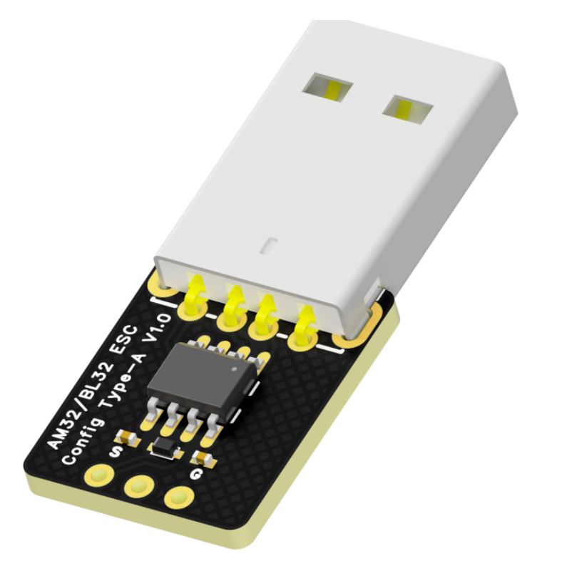
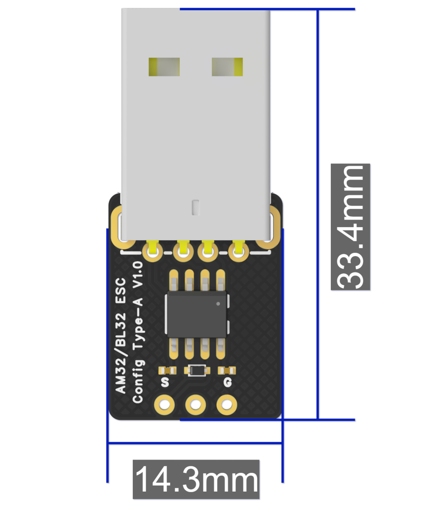
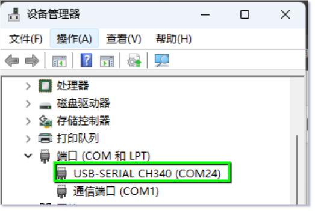
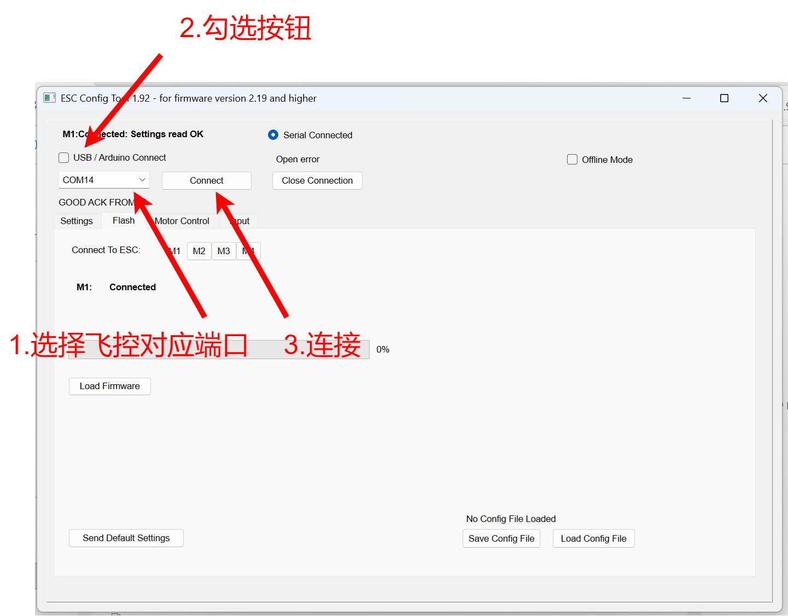
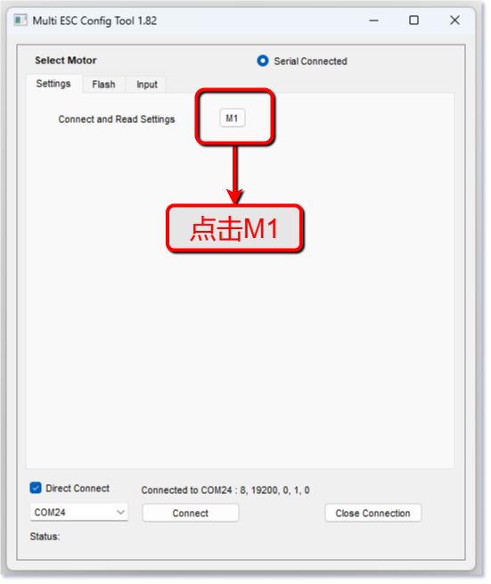
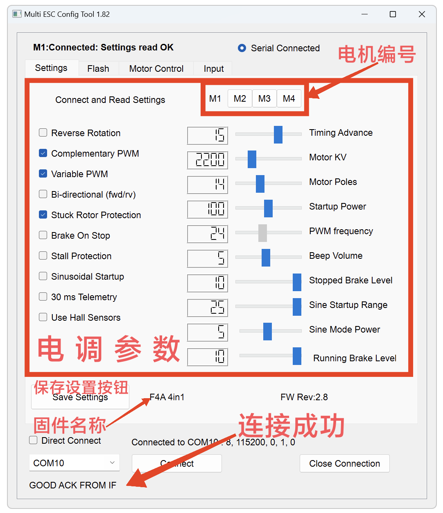
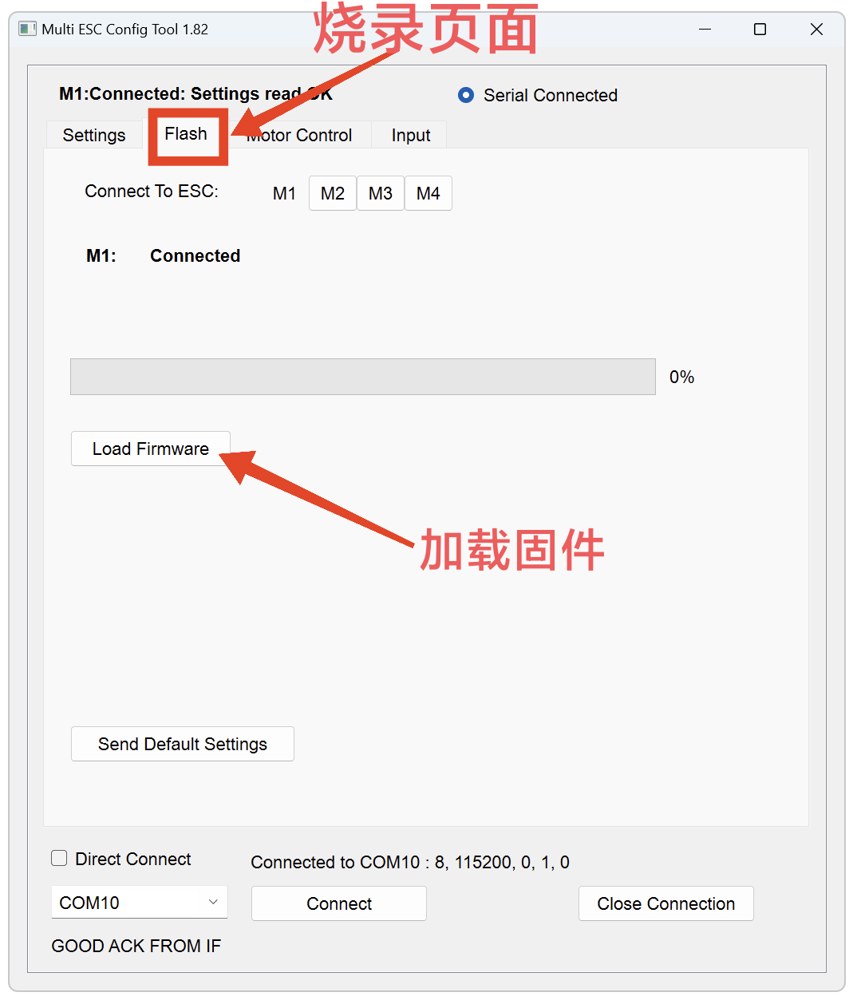
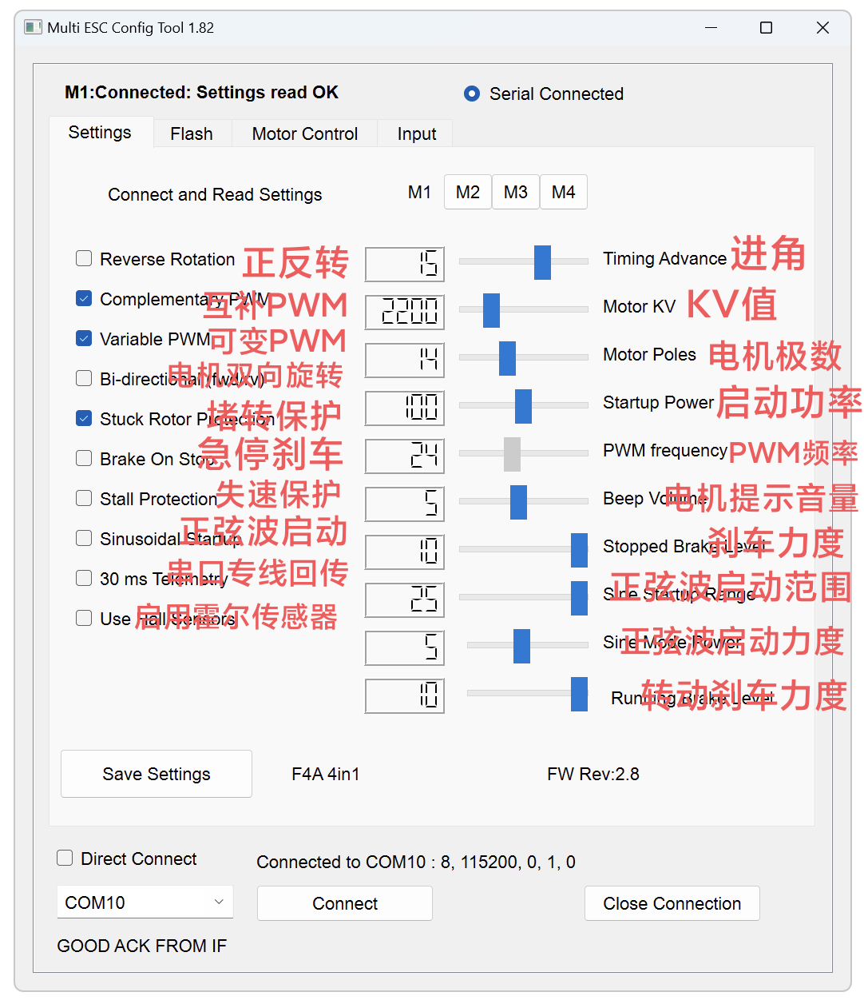
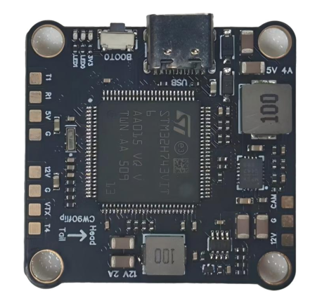

# FlyingRC® AM32电调调参器产品手册

> 状态：在售 · 类别：accessory · 内容自原 WPS 说明书迁入

---

## 一、FlyingRC介绍

## 产品概述

## 技术参数

产品尺寸： 33.4mm*14.3mm

产品重量：3.1g

板子层数: 2

板厚：1.6mm

尺寸图

产品用途

FlyingRC® AM32调参器是一款专门用于对相关设备（如无刷电机电调等）进行参数调整的工具，能够精准、高效地实现各项参数配置，满足不同用户在多种应用场景下的使用需求，广泛应用于航模、车模、船模等领域，为模型爱好者和专业玩家提供稳定、可靠的参数调节服务。

适用于各种无人机和模型车。它能够帮助你轻松调整电调参数，提升设备性能，优化飞行或驾驶体验。

无人机调参：适用于多轴飞行器、直升机、固定翼等各种飞行设备，帮助调整电调参数，提升飞行稳定性和效率。专业的无人机电调调参工具，帮助优化电调参数，提升飞行性能，延长电池寿命。

模型车调参：适用于各种电动模型车，帮助调整电调参数，提升加速性能和操控体验。

## 产品特点

操作简便：无需复杂操作，轻松连接电调进行参数调整，即使是新手也能快速上手。

小巧便携：体积小巧，方便携带，随时随地进行调参。

高兼容性：兼容市面上大多数AM32电调，适应广泛应用需求。

## 使用方法

与电调连接图

硬件连接：使用USB线将调参器与电脑连接，确保连接稳定；将调参器的信号线对应连接到电调的信号端口（注意正负极不要接反，负极对应电调负极，S对应信号线）。请注意：调参时电调应连接动力电，电压输入范围见对应电调说明书。如调参时电调已连接至电机，请固定电机。

注意事项：调参时原则上电机不应装桨，避免错误操作可能导致的电机突然旋转而可能造成的伤害。

驱动安装：如果是首次使用，需在电脑上安装调参器的驱动程序,（官方链接：https://www.wch.cn/downloads/ch341ser_exe.html）。安装完成后，打开电脑设备管理器，确认端口显示正常（如显示CH340端口）。

软件操作：打开调参软件，在软件中勾选选择端口，选择对应的M1端口，即可连接上设备。连接成功后，可在软件界面中看到各种参数设置选项，如油门行程设置、固件更新等，根据实际需求进行参数修改，修改完成后记得点击保存。

请在群文件内下载AM32-ESC-Tools，解压到本地，双击打开SerialPortConnector.exe。

在电调调参软件右下角找到飞控对应端口编号（COMx），点击Connect，此时若无错误提示，电调调参软件成功连接飞控。

需要打开“Direct Connect”

烧录固件前，请提前下载好电调的新版本固件，固件下载链接（github，或群文件内下载）

电调调参软件：点击“Flash”（烧录页面）。

点击M1，“Load Firmware”，在弹出框中找到下载好的新版电调固件，双击确认。点击“Flash Firmware”，耐心等待进度条走完。点击“Send Defalut Settings”以恢复电调默认参数，*跨多版本更新固件时建议不要省略此步骤。

为M2，M3，M4重复上述步骤。

注意！请勿使用网页版调参软件，更新固件时有可能导致电调MCU损坏，已经发现多起案例，这种情况下需要返厂付费维修。

参数设置

参数解说图

主要参数：

KV值：需调整至电机KV值附近，与实际KV值偏差不超过30%。KV值设置偏差如超过100% 可能会导致电机不能正常旋转，甚至导致电调硬件损坏。

进角：禁止调整。熟练玩家可通过调整进角使电机效率更高，但错误调整进角会导致电调损坏，并且这种损坏通常是无法维修的。

失速保护：若使用低KV值电机（KV值<500），可开启，或开启正弦波启动需开启此选项。

正弦波启动：对于常见的穿越机，无需启用。

注意事项

调参过程中，请仔细阅读参数说明，谨慎修改参数，避免因参数设置不当导致设备损坏或性能异常 。

不同型号的电调和电机可能需要不同的参数配置，请根据实际设备情况进行调整。

调参器应避免在高温、潮湿、强磁场等恶劣环境下使用，以免影响其性能和寿命。

如在使用过程中遇到问题，可参考产品附带的常见问题解答文档或联系我们的客服人员。

## 四、技术问题咨询

若遇技术问题，建议先查阅产品说明书；也可前往AI平台、B站等渠道获取帮助。同时欢迎群友互相协助，分享已知解决方案。

请注意：本产品Ardupilot固件提供有限技术支持，INAV和BF固件无技术支持

## 五、维修服务

本品不提供售后维修服务

## 六、FlyingRC® 其它产品介绍

**1. 飞控类38**

**2. 电调类41**

**3. 飞塔类43**

4. BEC 降压电路类47

5. 模块类49

6. 其他类50

飞控类

全新升级、功能更强

FlyingRC官方零售价：140元

中文说明书   Product Manual   去淘宝购买

经典产品、设计独特、好评如潮

中文说明书  Product Manual

性能强劲，双陀螺仪

FlyingRC官方零售价：299元

中文说明书  Product Manual

性能强劲，双陀螺仪,BEC输出能力强

FlyingRC官方零售价：259元

中文说明书  Product Manual  去淘宝购买

2025年 爆款产品,设计感爆棚,全网最Mini

FlyingRC官方零售价：89元

中文说明书   Product Manual  去淘宝购买

全新升级、功能更强

FlyingRC官方零售价：269元/299元

中文说明书 Product Manual 去淘宝购买

算力强大 飞行稳定精准 接口丰富 操控自如

中文说明书   Product Manual

算力强大 飞行稳定精准 接口丰富 操控自如

FlyingRC官方零售价：129元

中文说明书   Product Manual  去淘宝购买

电调类

本店销量No.4

高端产品,英飞凌金封MOS,工艺最佳,单路持续75AFlyingRC官方零售价：269元

中文说明书 Product Manual 去淘宝购买

性能出色，性价比高，入门首选

FlyingRC官方零售价：149元

中文说明书 Product Manual  去淘宝购买

设计独特，独家产品 用于无人机等空中、陆地、水上双动力设备    FlyingRC官方零售价：89元

中文说明书 Product Manual 去淘宝购买

英飞凌金封MOS 工艺出色 过流能力强大

FlyingRC官方零售价：87元（不带BEC版本）

中文说明书 Product Manual 去淘宝购买

客户可以用自己的功率板，制作不同规格电调

FlyingRC官方零售价：47元

中文说明书 Product Manual 去淘宝购买

超Mini 用于小型和微型机 过流能力强 运行稳定 FlyingRC官方零售价：43元

中文说明书 Product Manual 去淘宝购买

飞塔类

H743穿越机飞控+四合一穿越机75A金封电调

专业飞行首选，旗舰用料工艺，良心价格

FlyingRC官方零售价：528元

飞控中文说明书   电调中文说明书

FC Product Manual  ESC Product Manual

去淘宝购买

F405穿越机飞控+四合一穿越机75A金封电调

爆款组合，性能出色，良心价格

FlyingRC官方零售价：398元

飞控中文说明书    电调中文说明书

FC Product Manual ESC Product Manual

去淘宝购买

H743穿越机飞控+四合一穿越机45A电调

爆款组合，性能出色，价格亲民

FlyingRC官方零售价：408元

飞控中文说明书     电调中文说明书

FC Product Manual  ESC Product Manual

去淘宝购买

F405穿越机飞控+四合一穿越机45A电调

爆款组合，实惠之选，价格亲民

FlyingRC官方零售价：278元

飞控中文说明书     电调中文说明书

FC Product Manual  ESC Product Manual

去淘宝购买

F4WSE PRO飞控+二合一40A电调

独特设计、独家产品、爆款组合

FlyingRC官方零售价：237元

飞控中文说明书      电调中文说明书

FC Product Manual   ESC Product Manual

去淘宝购买

BEC 降压电路类

多电压可选 行业首选，物美价廉

FlyingRC官方零售价：74元

中文说明书 Product Manual 去淘宝购买

多电压可选 行业首选，物美价廉

FlyingRC官方零售价：36元

中文说明书 Product Manual 去淘宝购买

多电压可选，持续5A输出

FlyingRC官方零售价：17元

中文说明书  Product Manual  去淘宝购买

独立降压，稳定供电，让飞行更安全

FlyingRC官方零售价：18元

中文说明书  Product Manual  去淘宝购买

模块类

超高分辨率、低功耗、行业首选

FlyingRC官方零售价：129元

中文说明书  Product Manual  去淘宝购买

行业首选，物美价廉

FlyingRC官方零售价：199元

中文说明书 Product Manual 去淘宝购买

其他类

行业首选，物美价廉

FlyingRC官方零售价：109元

中文说明书  Product Manual 去淘宝购买

真分集接收,温度补偿，高功率接收

FlyingRC官方零售价：109元

中文说明书  Product Manual  去淘宝购买

支持BL，BL32，AM32 简单好用

FlyingRC官方零售价：9.9元/7.9元（A口/C口）焊好

FlyingRC官方零售价：6.9元/5.9元（A口/C口）自己焊

中文说明书 Product Manual 去淘宝购买

一体设计，全网最Mini MS4525D协议，I2C接口

FlyingRC官方零售价：95元

中文说明书  Product Manual  去淘宝购买

一体设计，全网最Mini MS4525D协议，I2C接口

FlyingRC官方零售价：    95元

中文说明书  Product Manual  去淘宝购买

一体设计，全网最Mini MS4525D协议，I2C接口

FlyingRC官方零售价：39元

中文说明书  Product Manual  去淘宝购买

长距离传输，高速率，稳定性强

FlyingRC官方零售价：46元

中文说明书  Product Manual  去淘宝购买

支持各种开源飞控 多尺寸可选 搜星能力强 性价高

FlyingRC官方零售价：68元(18*18mm款)

中文说明书  Product Manual  去淘宝购买

FlyingRC®官网

www.FlyingRC®.cn

淘宝店铺

闲鱼店铺

群号1016199449

电话:021-58204886 手机:13122492475   微信:13122492475、18019464804

---

## 安全须知

--8<-- "shared/safety.md"

---

## 技术支持

--8<-- "shared/support.md"

---

## 售后与保修

--8<-- "shared/warranty.md"

---

## FlyingRC® 其它产品

--8<-- "shared/other-products.md"

---

## 免责声明

--8<-- "shared/disclaimer.md"

