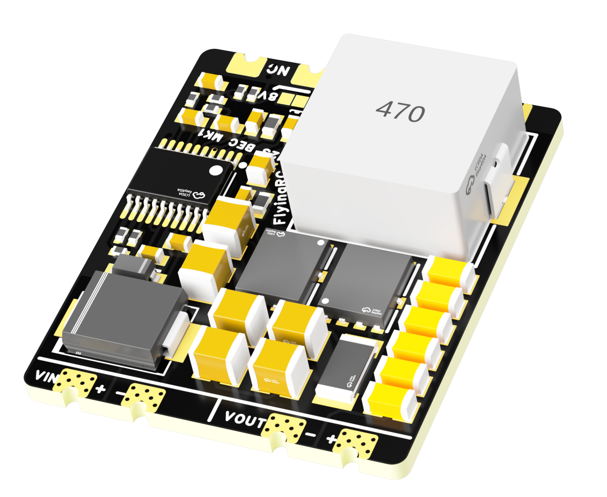
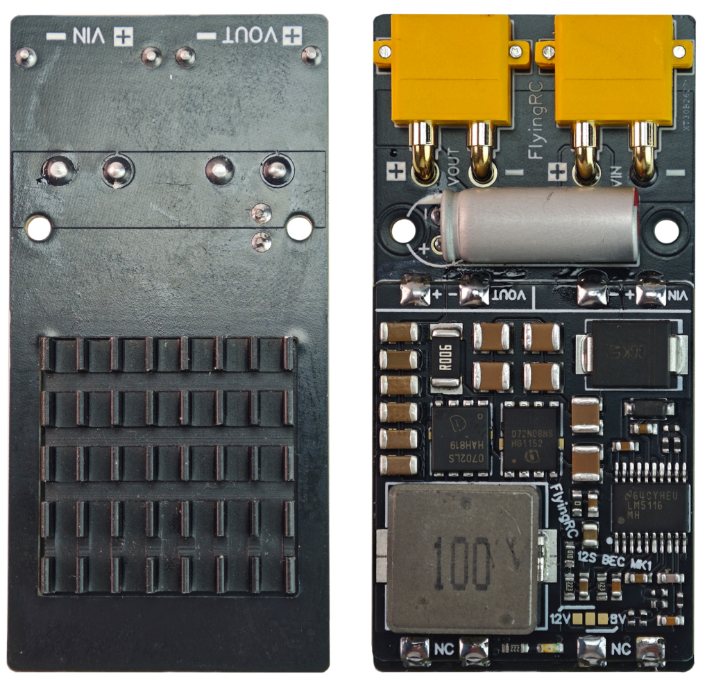
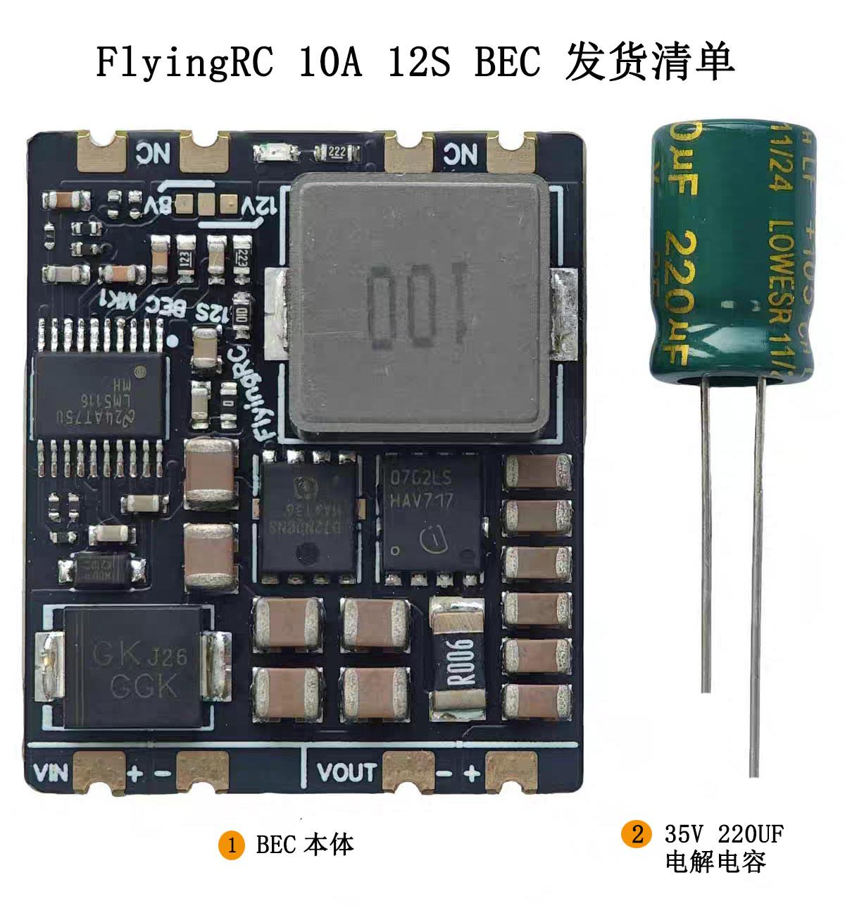
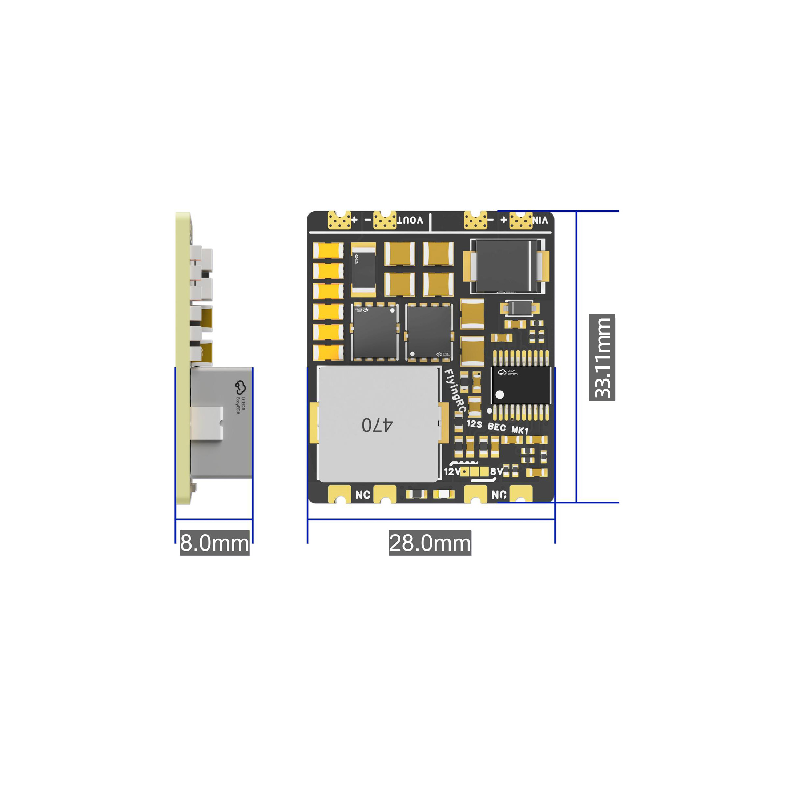
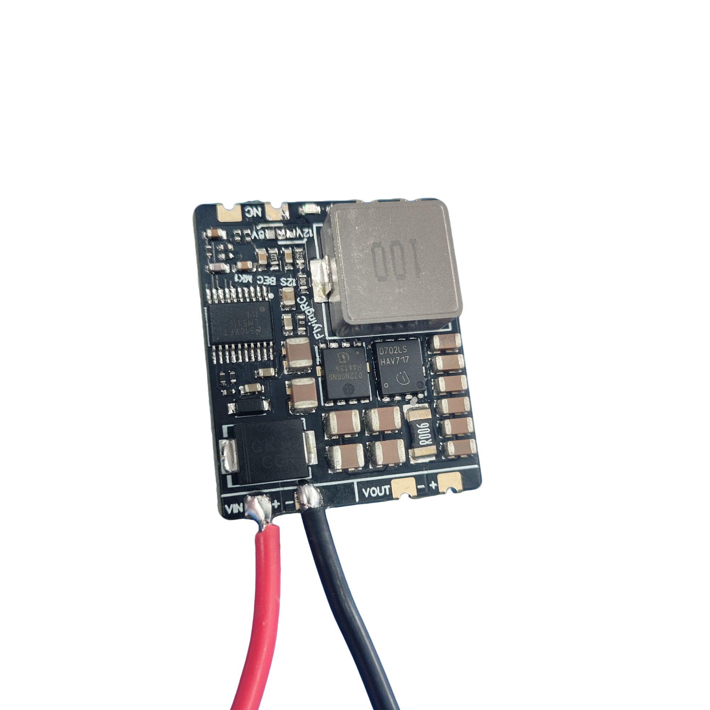
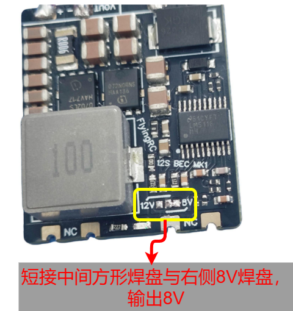
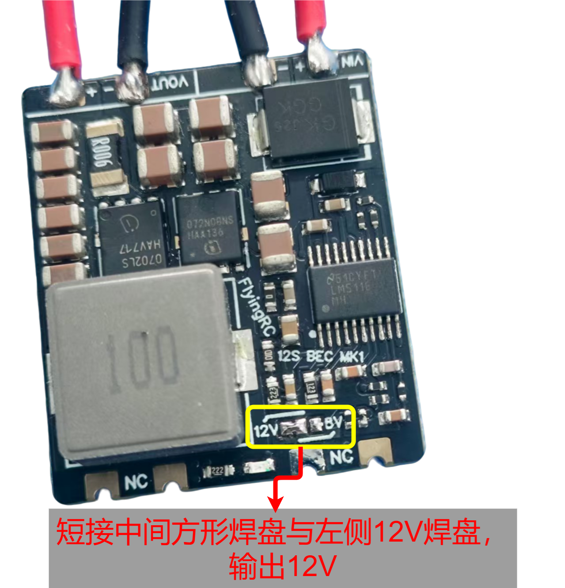
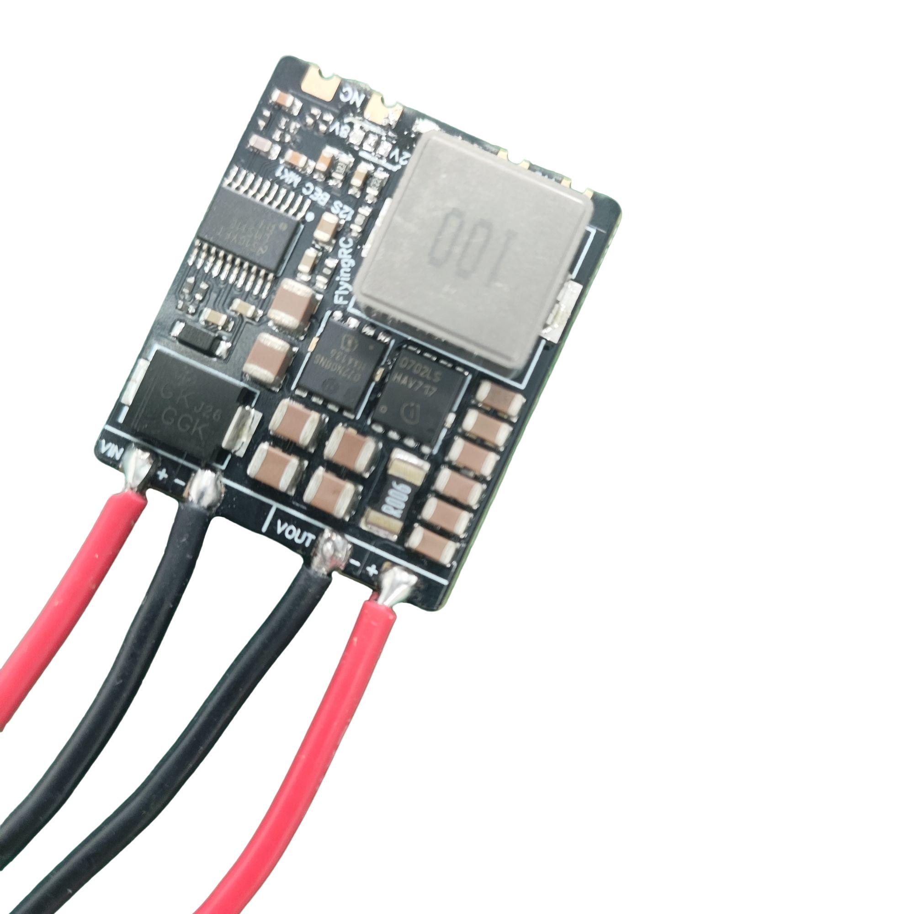
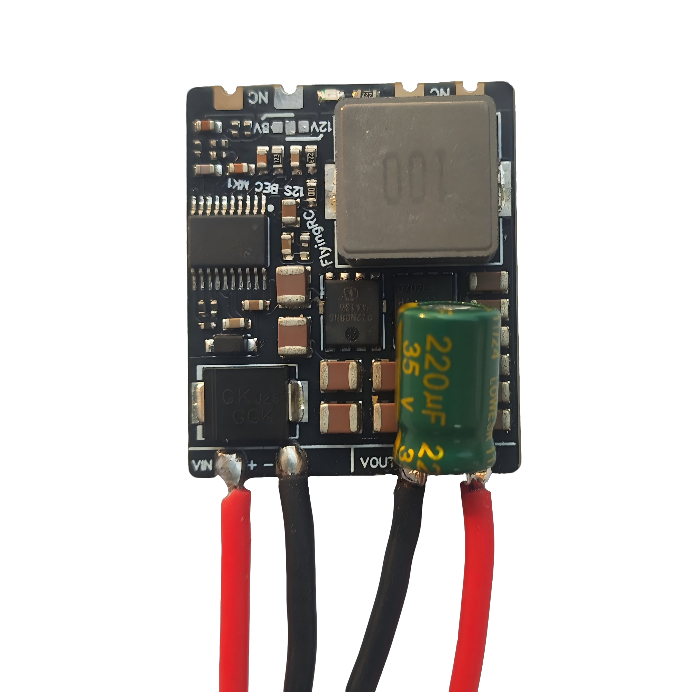
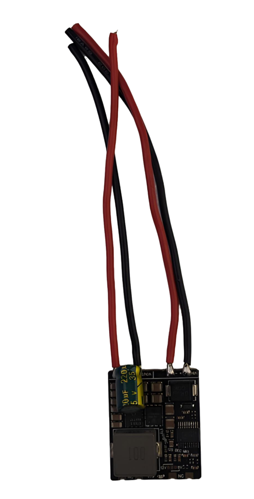

# FlyingRC® 10A 2-12S BEC V1降压模块产品手册

> 状态：在售 · 类别：bec · 内容自原 WPS 说明书迁入

---

## 一、FlyingRC介绍

## 产品概述

焊好-XT30输入输出底板贴好散热片（电容为25V 820UF固态电容）

## 技术参数

产品尺寸：30.4mm*28mm*8mm

产品重量：11.9g（不含电容）,12.5g（含电容）

板子层数:4层

板厚1.60mm

是否沉金:是 1μm

发货内容：BEC*1，35V 220UF电解电容*1

## 产品特点

FlyingRC® 10A 12S BEC V1小体积、高性能的BEC降压模块。

采用TI LM5116芯片，耐压80V。

电流环控制，响应能力MAX，适合给舵机供电。

外置双英飞凌80V耐压MOS

最大瞬间可输出12A电流

无散热可持续输出8A

有散热可持续输出10A

输入电容：6颗1210 10uF MLCC并联

输出电容：6颗1206 47uF MLCC并联

输入电压：6-60V，2-12SLiPo（输入电压需高于设定输出电压+0.8V）

输出电压：5.2V，8V，12V可选。默认输出5.2V，通过跳线焊盘可选择输出其它三种电压。

不短接跳线焊盘，默认输出5.2V。

通过短接跳线焊盘选择其它输出电压。

输出电流（持续）

无散热（无散热片，无风）:5.2V10A，8V10A，12V9A

有散热（有散热片或有风）：5.2V12A，8V12A，12V11A

输出电流（瞬间）：5.2V14A，8V14A，12V13A

## 使用方法

焊接电源输入线

通过跳线焊盘选择电压输出（如需5V电压输出请跳过此步骤）不短接跳线焊盘，默认输出5V。

通过短接跳线焊盘选择其它输出电压。

选择8V焊盘时，实际输出电压为8.02V； 选择12V焊盘时，实际输出电压为12.02V。

焊接电源输出线

焊接电容(电容左- 右+）VIN接电池，VOUT接负载 请注意：电容焊在负载端。长引脚是电容正极。

输入、输出线默认采用18awg长度10cm硅胶线

技术问题咨询

若遇技术问题，建议先查阅产品说明书；也可前往AI平台、B站等渠道获取帮助。同时欢迎群友互相协助，分享已知解决方案。

请注意：本产品Ardupilot固件提供有限技术支持，INAV和BF固件无技术支持

## 五、维修服务

本品不提供售后维修服务

## 六、FlyingRC® 其它产品介绍

---

## 安全须知

--8<-- "shared/safety.md"

---

## 焊接注意

--8<-- "shared/soldering.md"

---

## 首次使用检查

--8<-- "shared/first-use-check.md"

---

## 技术支持

--8<-- "shared/support.md"

---

## 售后与保修

--8<-- "shared/warranty.md"

---

## FlyingRC® 其它产品

--8<-- "shared/other-products.md"

---

## 免责声明

--8<-- "shared/disclaimer.md"

