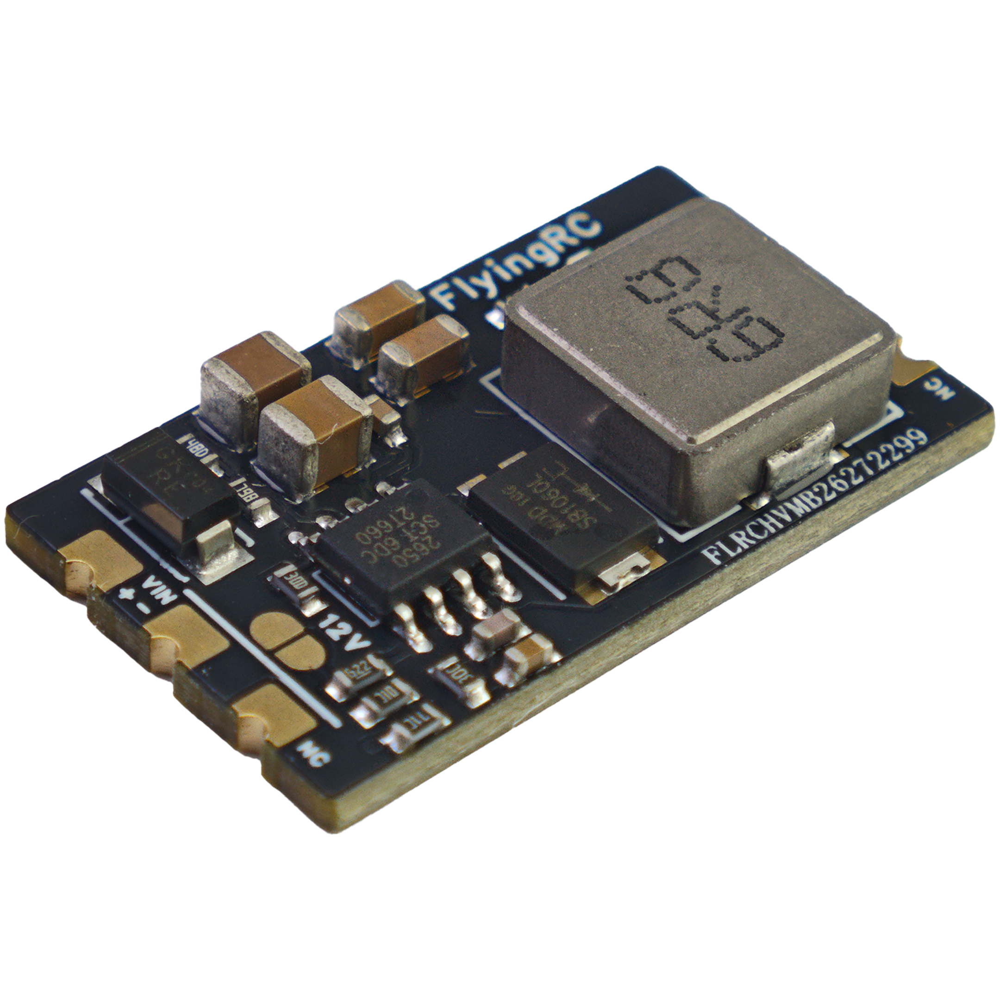
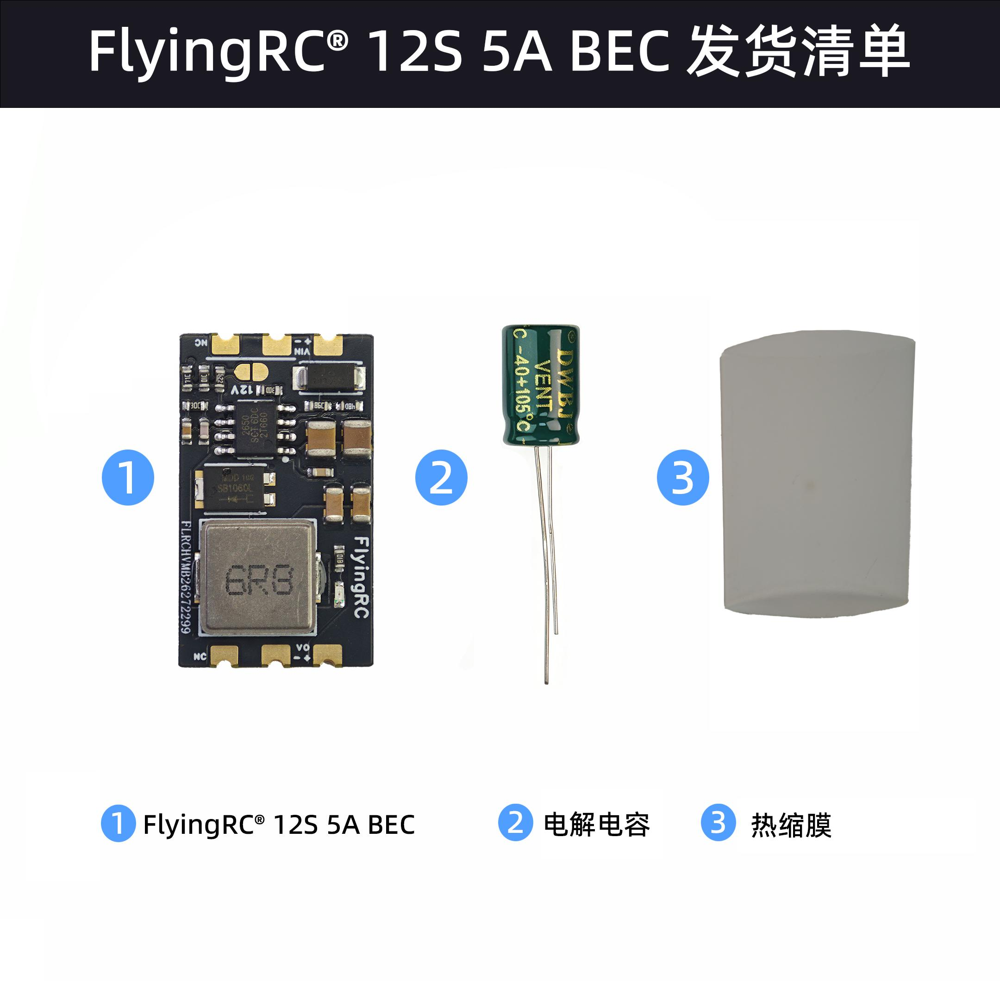
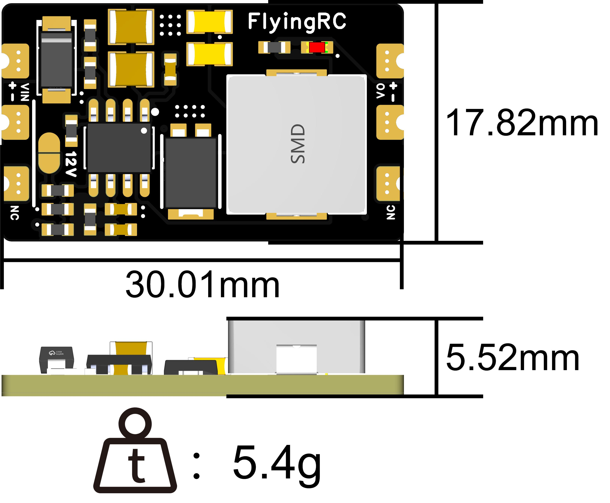
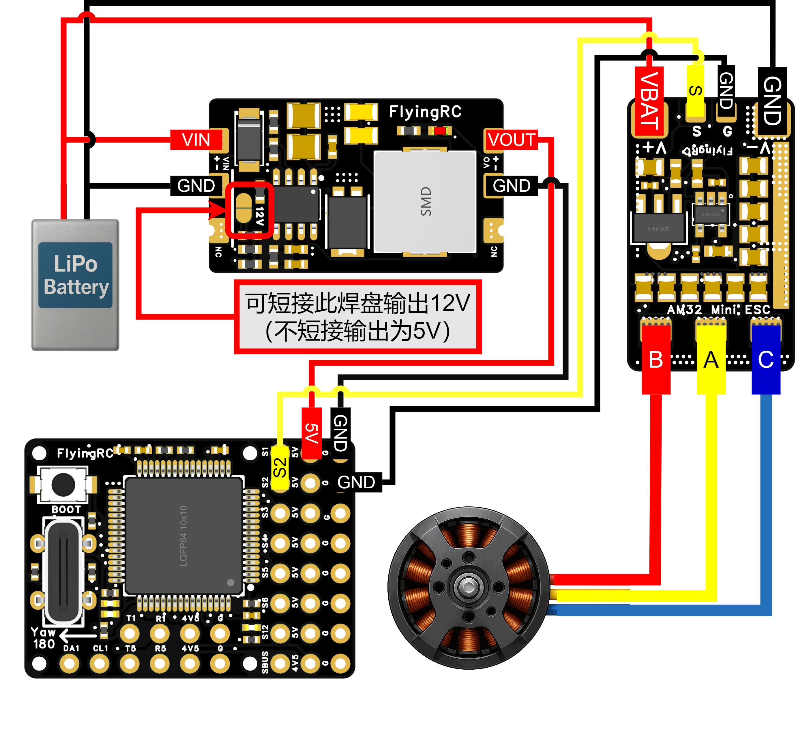
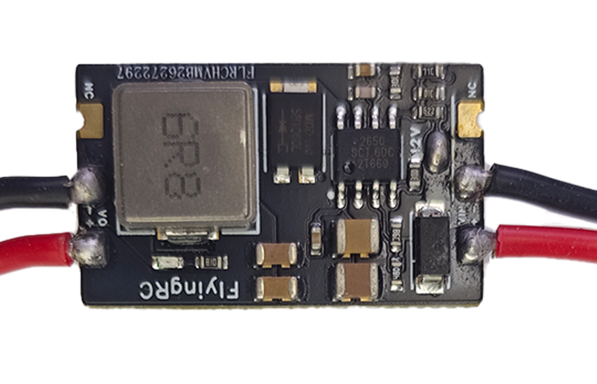
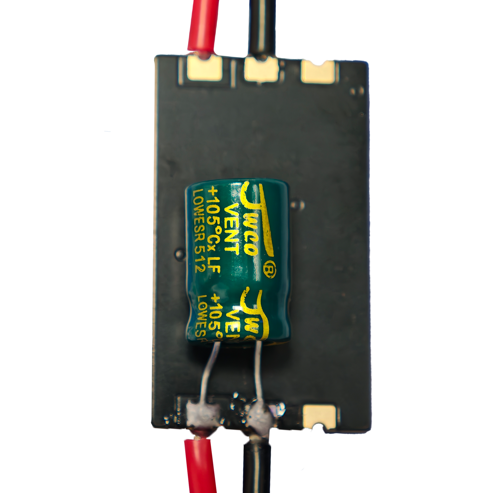
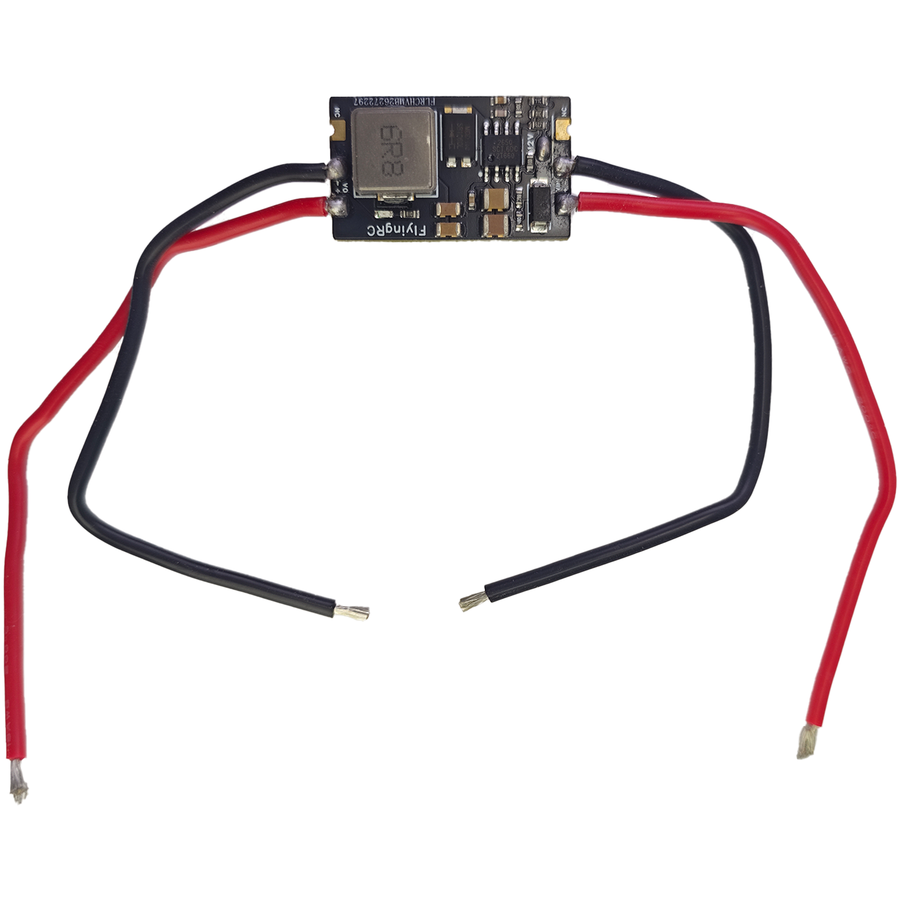

# FlyingRC® 5A 2-12S BEC 降压模块产品手册

> 状态：在售 · 类别：bec · 内容自原 WPS 说明书迁入

---

## 一、FlyingRC介绍

## 产品概述

## 技术参数

产品尺寸：30.01mm*17.82mm*5.52mm

产品重量：5.4g（不含电容）,6g（含电容）

板子层数:4层

板厚1.60mm

是否沉金:是 1μm

发货内容：BEC*1，35V 220UF电解电容*1

## 产品特点

FlyingRC® 5A 12S BEC V1小体积、高性能的BEC降压模块。

输入电压：6-60V，2-12SLiPo（输入电压需高于设定输出电压+0.8V）

输出电压：5V，12V可选。默认输出5V，通过跳线焊盘可选择输出9V。

不短接跳线焊盘，默认输出5V。

输出电流（持续）

12S输入，输出5V@3.5A，12V@3A

6S输入，输出5V@5A，12V@4A

## 使用方法

焊接电源输入线

通过跳线焊盘选择电压输出（如需5V电压输出请跳过此步骤）不短接跳线焊盘，默认输出5V。

通过短接跳线焊盘选择其它输出电压。

选择12V焊盘时，实际输出电压为12V。

短接此焊盘输出12V

焊接电源输出线

焊接电容(电容左- 右+）VIN接电池，VO接负载 请注意：电容焊在负载端。长引脚是电容正极。

输入、输出线默认采用20awg长度10cm硅胶线

技术问题咨询

若遇技术问题，建议先查阅产品说明书；也可前往AI平台、B站等渠道获取帮助。同时欢迎群友互相协助，分享已知解决方案。

## 五、维修服务

本品不提供售后维修服务

## 六、FlyingRC® 其它产品介绍

---

## 安全须知

--8<-- "shared/safety.md"

---

## 焊接注意

--8<-- "shared/soldering.md"

---

## 首次使用检查

--8<-- "shared/first-use-check.md"

---

## 技术支持

--8<-- "shared/support.md"

---

## 售后与保修

--8<-- "shared/warranty.md"

---

## FlyingRC® 其它产品

--8<-- "shared/other-products.md"

---

## 免责声明

--8<-- "shared/disclaimer.md"

