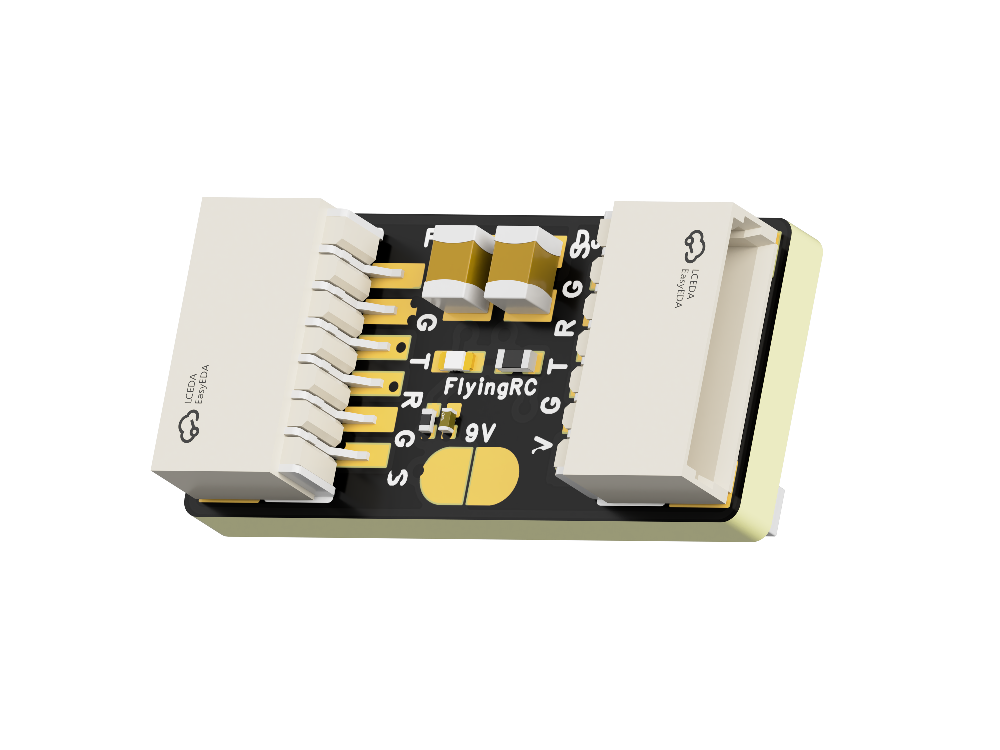
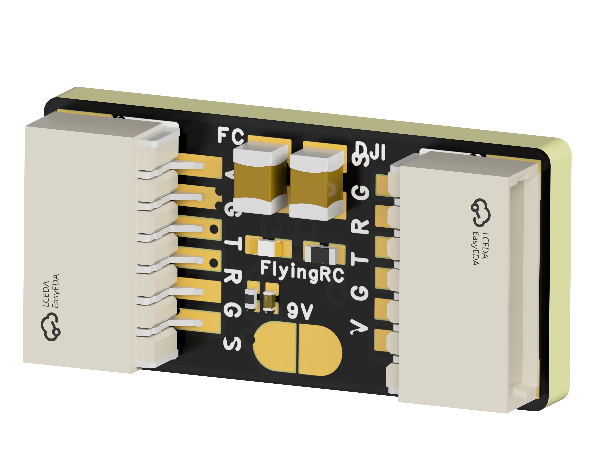
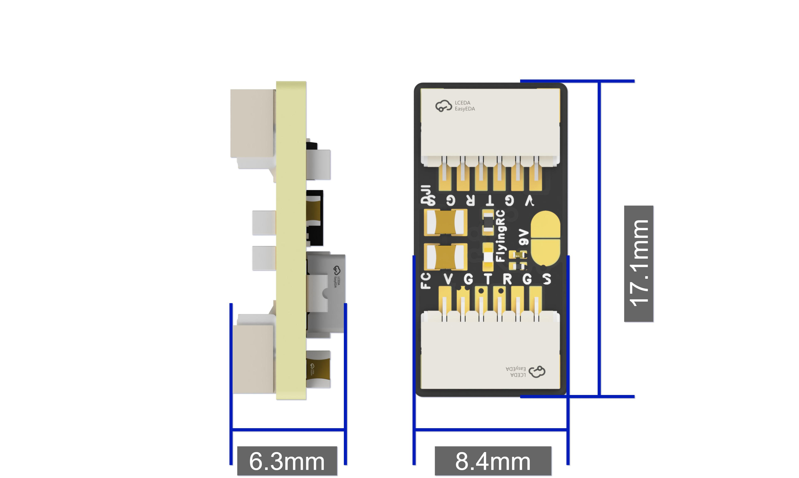
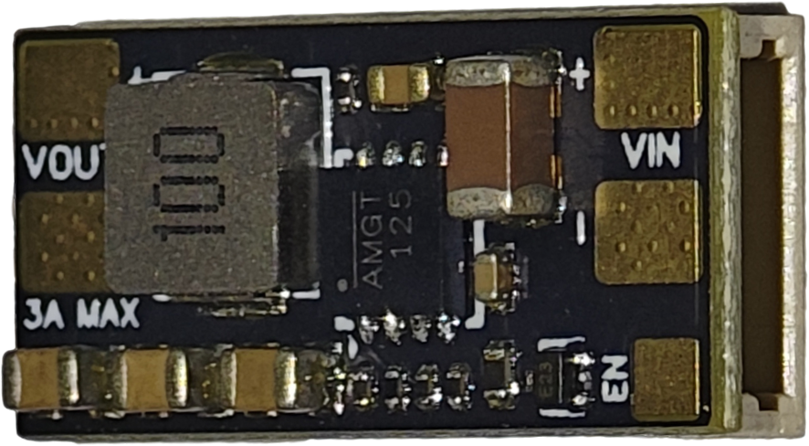
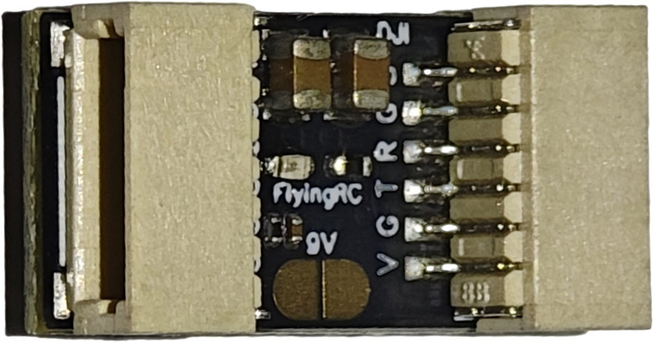
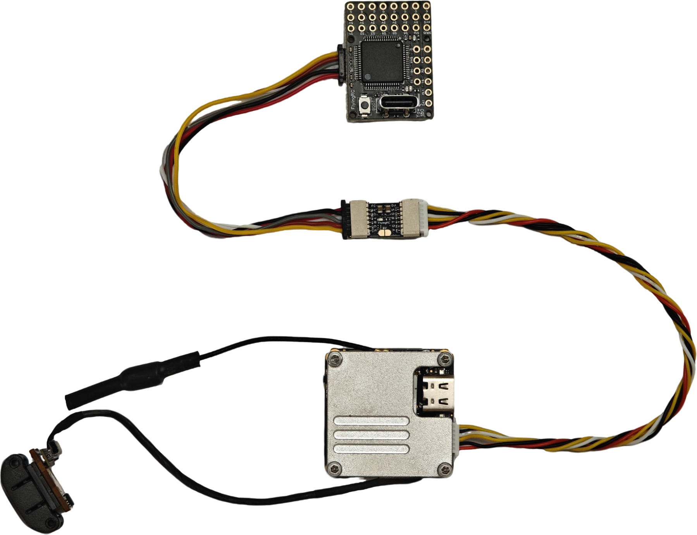
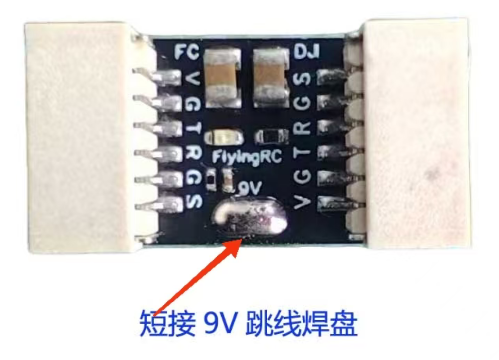
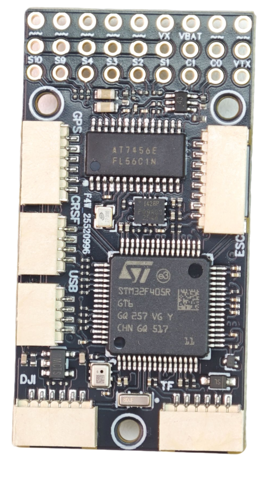
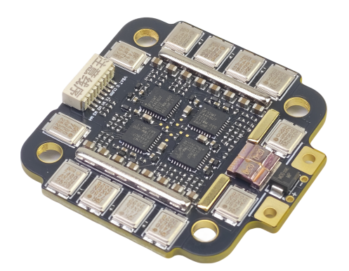

# FlyingRC® Mini BEC For DJI O4降压模块产品手册 [IMG:media/image3.jpeg]

> 状态：在售 · 类别：bec · 内容自原 WPS 说明书迁入

---

## 一、FlyingRC介绍

## 产品概述

产品尺寸图

## 技术参数

输入电压：7-36V(2-8S锂电池)输入

输出电压：5V/2A;9V/2A，默认输出5V,焊接跳线输出9V。

尺寸：8.4mm × 17.1mm × 6.3mm

重量：1g

发货清单：模块，热缩膜

## 产品特点

适配DJI O4/O4 PRO/O3数字图传

直插连接，原厂线序即插即用！

输入电压：7~36V，2~8SLiPo （输入电压需高于设定输出电压0.8V，否则输出电压比输入电压低0.8V）

输出电压：5V，9V可选。默认输出5V，通过跳线焊盘可选择输出9V电压。

输出电流（持续）： 5V/2A;9V/2A

正面图

反面图

## 使用方法

输入输出连接图

FC端接不带BEC的飞控，Dji端接大疆天空端

通过跳线焊盘选择电压输出。不短接跳线焊盘，默认输出5V。

3.通过短接跳线焊盘输出电压为9V。

技术问题咨询

若遇技术问题，建议先查阅产品说明书；也可前往AI平台、B站等渠道获取帮助。同时欢迎群友互相协助，分享已知解决方案。

请注意：本产品Ardupilot固件提供有限技术支持，INAV和BF固件无技术支持

维修服务

本品不提供售后维修服务

## 六、FlyingRC® 其它产品介绍

**1. 飞控类38**

**2. 电调类41**

**3. 飞塔类43**

4. BEC 降压电路类47

5. 模块类49

6. 其他类50

飞控类

全新升级、功能更强

FlyingRC官方零售价：140元

中文说明书   Product Manual   去淘宝购买

经典产品、设计独特、好评如潮

中文说明书  Product Manual

性能强劲，双陀螺仪

FlyingRC官方零售价：299元

中文说明书  Product Manual

性能强劲，双陀螺仪,BEC输出能力强

FlyingRC官方零售价：259元

中文说明书  Product Manual  去淘宝购买

2025年 爆款产品,设计感爆棚,全网最Mini

FlyingRC官方零售价：89元

中文说明书   Product Manual  去淘宝购买

全新升级、功能更强

FlyingRC官方零售价：269元/299元

中文说明书 Product Manual 去淘宝购买

算力强大 飞行稳定精准 接口丰富 操控自如

中文说明书   Product Manual

算力强大 飞行稳定精准 接口丰富 操控自如

FlyingRC官方零售价：129元

中文说明书   Product Manual  去淘宝购买

电调类

本店销量No.4

高端产品,英飞凌金封MOS,工艺最佳,单路持续75AFlyingRC官方零售价：269元

中文说明书 Product Manual 去淘宝购买

性能出色，性价比高，入门首选

FlyingRC官方零售价：149元

中文说明书 Product Manual  去淘宝购买

设计独特，独家产品 用于无人机等空中、陆地、水上双动力设备    FlyingRC官方零售价：89元

中文说明书 Product Manual 去淘宝购买

英飞凌金封MOS 工艺出色 过流能力强大

FlyingRC官方零售价：87元（不带BEC版本）

中文说明书 Product Manual 去淘宝购买

客户可以用自己的功率板，制作不同规格电调

FlyingRC官方零售价：47元

中文说明书 Product Manual 去淘宝购买

超Mini 用于小型和微型机 过流能力强 运行稳定 FlyingRC官方零售价：43元

中文说明书 Product Manual 去淘宝购买

飞塔类

H743穿越机飞控+四合一穿越机75A金封电调

专业飞行首选，旗舰用料工艺，良心价格

FlyingRC官方零售价：528元

飞控中文说明书   电调中文说明书

FC Product Manual  ESC Product Manual

去淘宝购买

F405穿越机飞控+四合一穿越机75A金封电调

爆款组合，性能出色，良心价格

FlyingRC官方零售价：398元

飞控中文说明书    电调中文说明书

FC Product Manual ESC Product Manual

去淘宝购买

H743穿越机飞控+四合一穿越机45A电调

爆款组合，性能出色，价格亲民

FlyingRC官方零售价：408元

飞控中文说明书     电调中文说明书

FC Product Manual  ESC Product Manual

去淘宝购买

F405穿越机飞控+四合一穿越机45A电调

爆款组合，实惠之选，价格亲民

FlyingRC官方零售价：278元

飞控中文说明书     电调中文说明书

FC Product Manual  ESC Product Manual

去淘宝购买

F4WSE PRO飞控+二合一40A电调

独特设计、独家产品、爆款组合

FlyingRC官方零售价：237元

飞控中文说明书      电调中文说明书

FC Product Manual   ESC Product Manual

去淘宝购买

BEC 降压电路类

多电压可选 行业首选，物美价廉

FlyingRC官方零售价：74元

中文说明书 Product Manual 去淘宝购买

多电压可选 行业首选，物美价廉

FlyingRC官方零售价：36元

中文说明书 Product Manual 去淘宝购买

多电压可选，持续5A输出

FlyingRC官方零售价：17元

中文说明书  Product Manual  去淘宝购买

独立降压，稳定供电，让飞行更安全

FlyingRC官方零售价：18元

中文说明书  Product Manual  去淘宝购买

模块类

超高分辨率、低功耗、行业首选

FlyingRC官方零售价：129元

中文说明书  Product Manual  去淘宝购买

行业首选，物美价廉

FlyingRC官方零售价：199元

中文说明书 Product Manual 去淘宝购买

其他类

行业首选，物美价廉

FlyingRC官方零售价：109元

中文说明书  Product Manual 去淘宝购买

真分集接收,温度补偿，高功率接收

FlyingRC官方零售价：109元

中文说明书  Product Manual  去淘宝购买

支持BL，BL32，AM32 简单好用

FlyingRC官方零售价：9.9元/7.9元（A口/C口）焊好

FlyingRC官方零售价：6.9元/5.9元（A口/C口）自己焊

中文说明书 Product Manual 去淘宝购买

一体设计，全网最Mini MS4525D协议，I2C接口

FlyingRC官方零售价：95元

中文说明书  Product Manual  去淘宝购买

一体设计，全网最Mini MS4525D协议，I2C接口

FlyingRC官方零售价：    95元

中文说明书  Product Manual  去淘宝购买

一体设计，全网最Mini MS4525D协议，I2C接口

FlyingRC官方零售价：39元

中文说明书  Product Manual  去淘宝购买

长距离传输，高速率，稳定性强

FlyingRC官方零售价：46元

中文说明书  Product Manual  去淘宝购买

支持各种开源飞控 多尺寸可选 搜星能力强 性价高

FlyingRC官方零售价：68元(18*18mm款)

中文说明书  Product Manual  去淘宝购买

FlyingRC®官网

www.FlyingRC®.cn

淘宝店铺

闲鱼店铺

群号1016199449

电话:021-58204886 手机:13122492475   微信:13122492475、18019464804

---

## 安全须知

--8<-- "shared/safety.md"

---

## 焊接注意

--8<-- "shared/soldering.md"

---

## 首次使用检查

--8<-- "shared/first-use-check.md"

---

## 技术支持

--8<-- "shared/support.md"

---

## 售后与保修

--8<-- "shared/warranty.md"

---

## FlyingRC® 其它产品

--8<-- "shared/other-products.md"

---

## 免责声明

--8<-- "shared/disclaimer.md"

