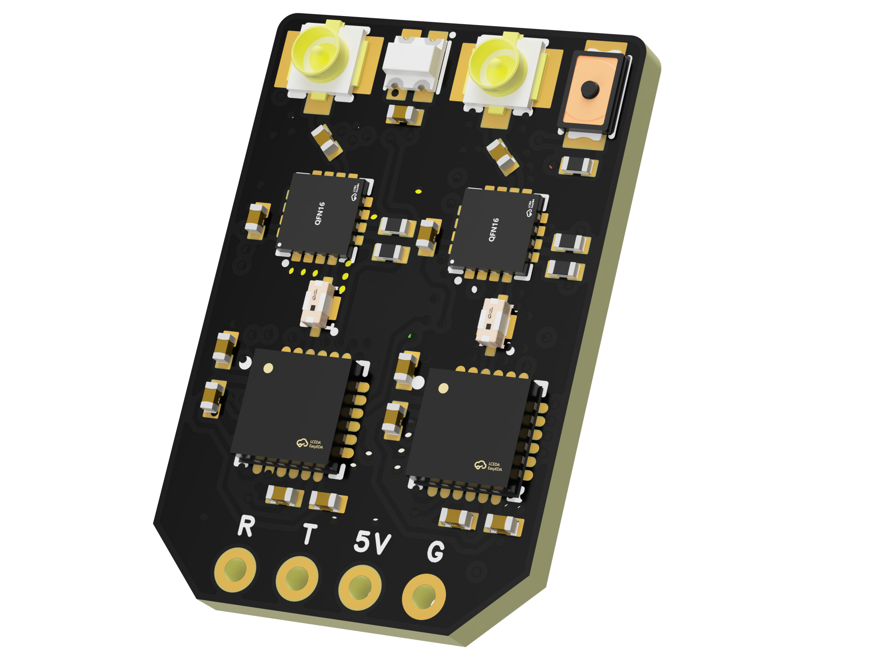
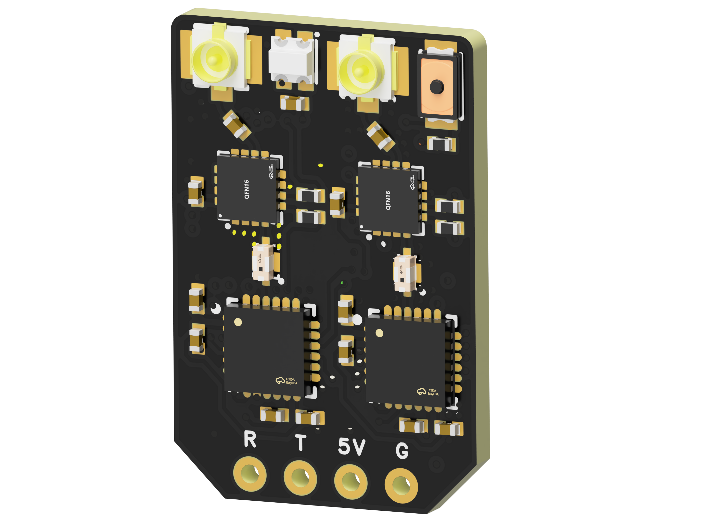
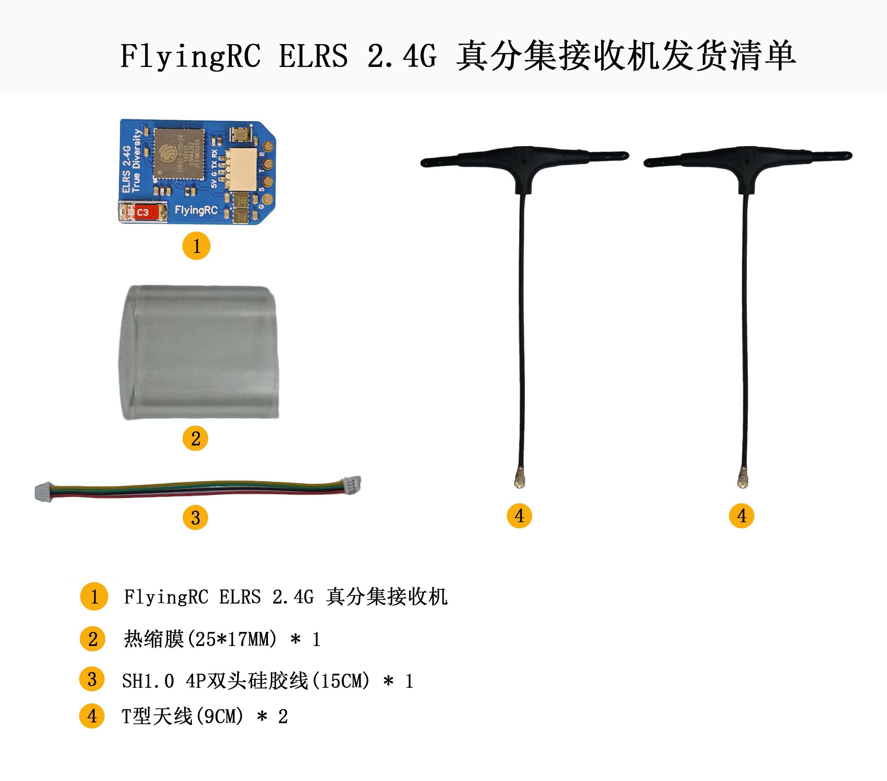
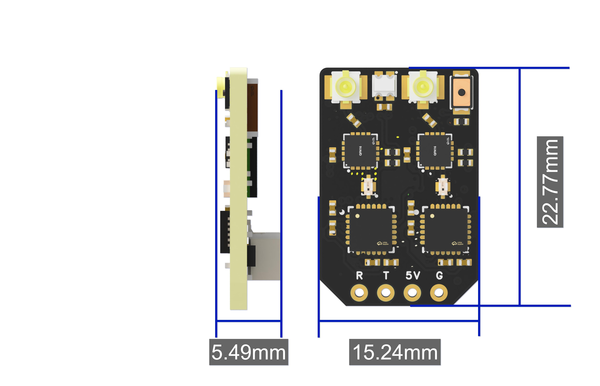
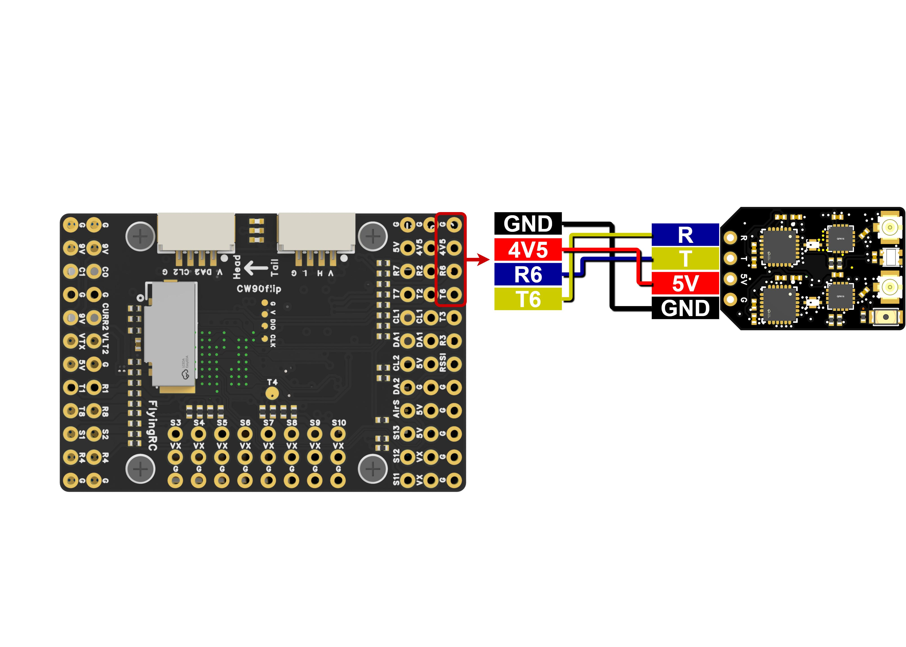
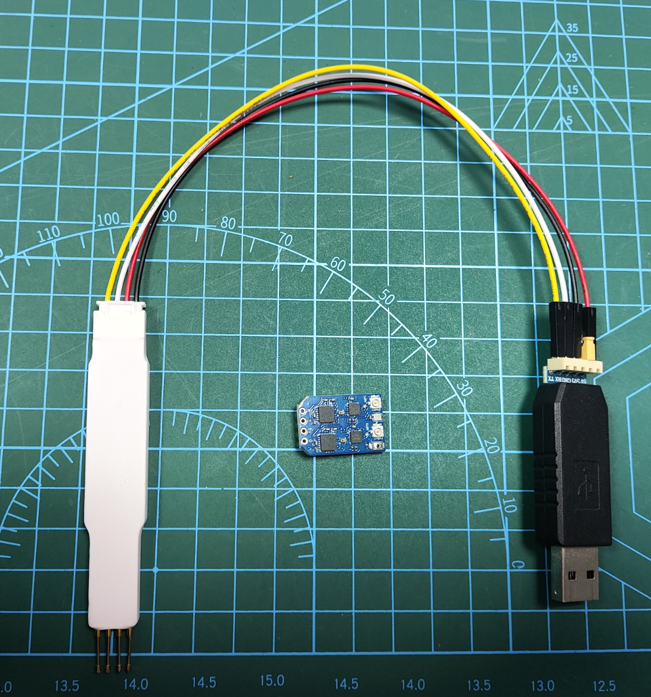
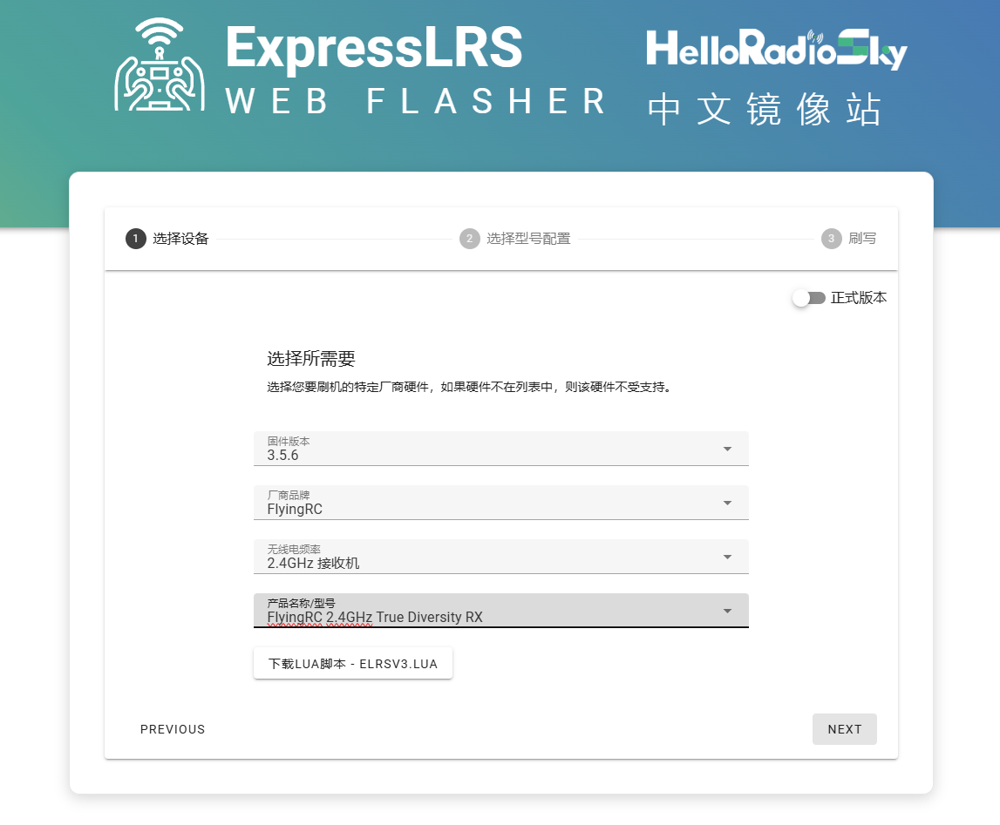
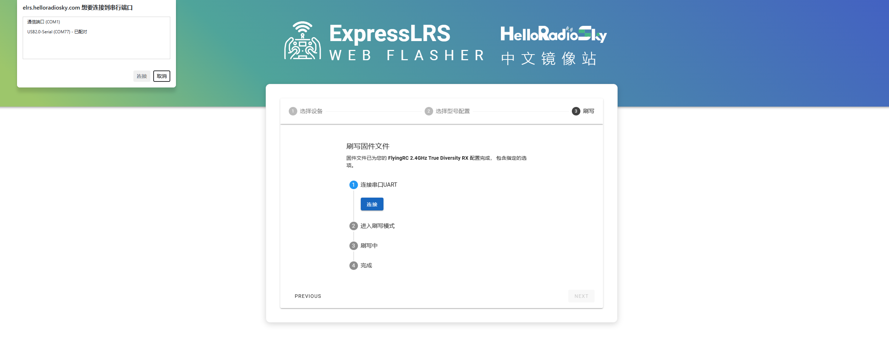
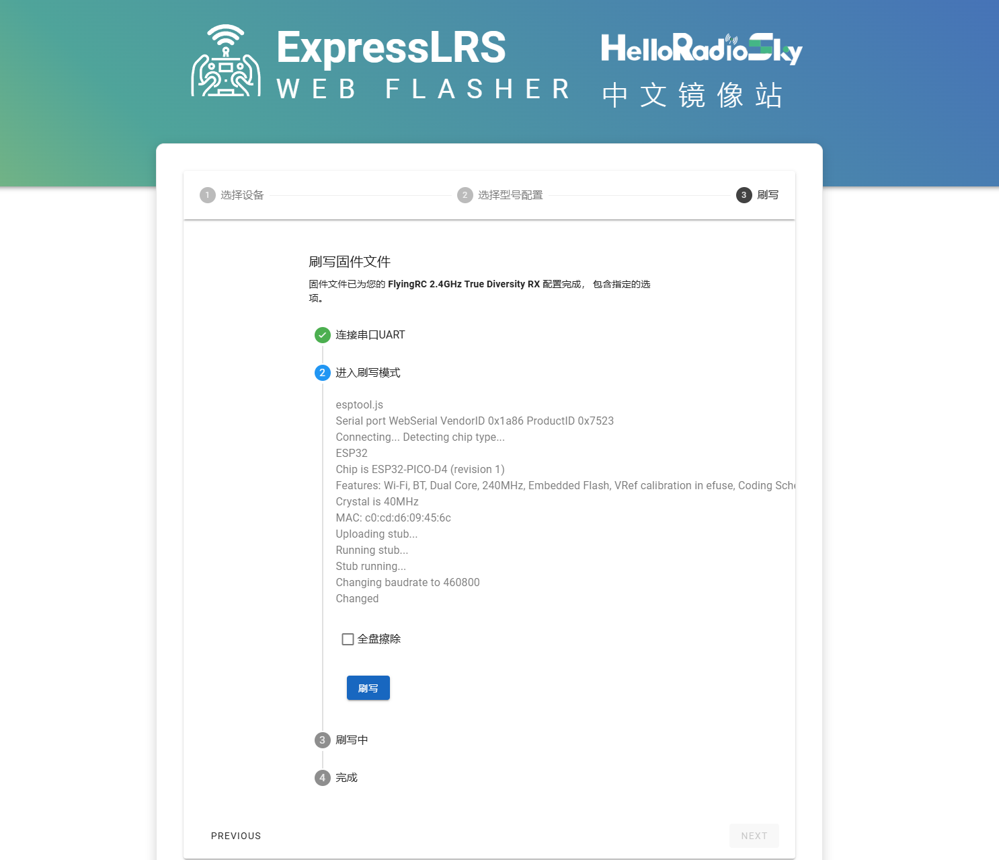
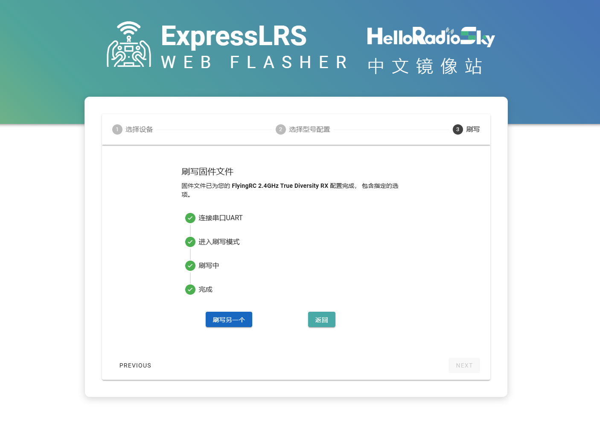

# FlyingRC® ELRS 2.4G 真分集 产品手册

> 状态：在售 · 类别：receiver · 内容自原 WPS 说明书迁入

---

FlyingRC介绍

## 产品概述

## 技术参数

产品尺寸：22.77mm*15.24mm*5.49mm

产品重量：1.7g

板子层数:4层

板厚1.60mm

是否沉金:是 1μm

发货内容：接收机，T型天线*2，SH1.0 4P双头连接线，热缩膜

频率范围：2.4GHz

刷新速率：可达50Hz-1000Hz，高刷新率能实现更精准的操控，让飞行体验更加流畅。

通信协议：支持CRSF协议，兼容性良好，可与多种飞控及遥控设备配合使用。

芯片组：采用ESP32-Pico-D4、SX1281等芯片，确保接收机高效运行，保障信号处理与传输的稳定性。

## 产品特点

真分集接收：采用双天线设计，有两个独立的射频接收链路，能实时监测链路质量，动态选择信号较好的路径，提高信号稳定性，减少信号丢失和干扰。

温度补偿：内置TCXO温度补偿晶体振荡器，避免温度变化引起的频率偏移，在不同环境温度下都能保持稳定的性能。

高功率输出：内置PA功率放大器，2.4GHz型号遥测发射功率最高可达100mW；搭配LNA低噪声放大器，大幅提升信号传输距离与接收稳定性。

多种工作模式：支持FLRC模式下的F1000、F500等数据速率，以及DVDA模式下的D500、D250等数据速率，可满足不同飞行需求。

接口丰富：配备IPEX1天线接口、SH1.0连接器等，方便连接天线和飞控等设备，实现快速安装与调试。

### 单独设备接线图

FlyingRC® F4WSE PRO 飞控 - 查看产品说明书和购买链接

与 FlyingRC® F4WSE PRO 飞控连接接线图

FlyingRC® H7Wlite H743飞控 - 查看产品说明书和购买链接

与FlyingRC® H7Wlite H743飞控连接接线图

FlyingRC® F4Wing Mini 飞控 - 查看产品说明书和购买链接

与FlyingRC® F4Wing Mini 飞控连接接线图

## 使用方法

刷写固件：

准备好接收机和USB转TTL工具

打开刷固件网址：https://elrs.helloradiosky.com 如下图

点击右下角：NEXT进入“选择设备”页面, 如下图

固件版本:选择 3.5.6

厂商品牌:选择 FlyingRC

无线电频率:选择 2.4GHz接收机

产品名称/型号:选择 FlyingRC 2.4GHz True Diversity RX

点击右下角：NEXT进入“选择型号配置”如下图

Region:选择FCC

刷写方式:选择 串口UART刷写

点击右下角：NEXT进入“刷写”页面 如下图

点击蓝色背景的“连接”按钮

页面左上角会出现弹出框：

在想要链接的串行端口中选择“USB2.0-Serial (COM77) - 已配对”

，选择后“连接”按钮变成黑色，此时点击“连接”按钮，进入下个页面。

如下图：点击“刷写”按钮，等待刷写完成。

刷写完成后进入下一个页面。如下图：

可以继续刷写其他接收机，如果点击“返回”按钮，完成本次刷写。

固件升级：接收机出厂固件版本为3.5.5，需将TX模块固件升级到3.x以上，以确保兼容性。

进入绑定模式：连续对接收机进行三次通断电操作，每次间隔1秒，当RGB指示灯快速闪烁两次时，接收机进入绑定模式。

绑定设置：配置遥控或发射模块与接收机进行绑定，绑定成功后，接收机RGB指示灯常亮。

注意事项

请勿在高温、潮湿或强电磁干扰的环境下使用接收机，以免影响设备性能和使用寿命。

避免接收机受到剧烈撞击或跌落，防止内部硬件损坏。

定期检查接收机的连接线路，确保连接牢固，无松动或损坏。

在使用过程中，如发现设备异常，应立即停止使用，并联系专业技术人员进行检修。

技术问题咨询

若遇技术问题，建议先查阅产品说明书；也可前往AI平台、B站等渠道获取帮助。同时欢迎群友互相协助，分享已知解决方案。

请注意：本产品Ardupilot固件提供有限技术支持，INAV和BF固件无技术支持

维修服务

本品不提供售后维修服务

## 六、FlyingRC® 其它产品介绍

飞控类

| 产品1.FlyingRC® F4WSE F405 Pro主控固定翼飞控            本店销量No.1 / 全新升级、功能更强 / FlyingRC官方零售价：140元 / 中文说明书   Product Manual   去淘宝购买 |  |

|------|------|

| 产品2.FlyingRC® F4WSE - F405主控固定翼飞控(停产) / 经典产品、设计独特、好评如潮 / 中文说明书  Product Manual |  |

| 产品3.FlyingRC® H7Wlite H743主控固定翼飞控(停产) / 性能强劲，双陀螺仪 / FlyingRC官方零售价：299元 / 中文说明书  Product Manual |  |

| 产品4.FlyingRC® H7Wlite Pro H743主控固定翼飞控         本店销量No.7 / 性能强劲，双陀螺仪,BEC输出能力强 / FlyingRC官方零售价：259元 / 中文说明书  Product Manual  去淘宝购买 |  |

| 产品5.FlyingRC® F4Wing Mini F405主控固定翼飞控           本店销量No.2 / 2025年 爆款产品,设计感爆棚,全网最Mini / FlyingRC官方零售价：89元 / 中文说明书   Product Manual  去淘宝购买 |  |

| 产品6.FlyingRC® H7D Pro H743主控穿越机飞控                 本店销量No.3 / 全新升级、功能更强 / FlyingRC官方零售价：269元/299元 / 中文说明书 Product Manual 去淘宝购买 |  |

| 产品7.FlyingRC® H7D MK1 H743主控双陀螺仪穿越机飞控(停产) / 算力强大 飞行稳定精准 接口丰富 操控自如 / 中文说明书   Product Manual |  |

| 产品8.FlyinRC® F4D MK1 F405主控 20\30.5孔距 穿越机飞控    本店销量No.9 / 算力强大 飞行稳定精准 接口丰富 操控自如 / FlyingRC官方零售价：129元 / 中文说明书   Product Manual  去淘宝购买 |  |

电调类

| 产品9.FlyingRC® 4IN1 75A ESC 四合一穿越机金封电调 / 本店销量No.4 / 高端产品,英飞凌金封MOS,工艺最佳,单路持续75AFlyingRC官方零售价：269元 / 中文说明书 Product Manual 去淘宝购买 |  |

|------|------|

| 产品10.FlyingRC® 4IN1 45A ESC  四合一穿越机电调 / 性能出色，性价比高，入门首选 / FlyingRC官方零售价：149元 / 中文说明书 Product Manual  去淘宝购买 |  |

| 产品11.FlyingRC® AM32 Dual ESC 40A 二合一电调                本店销量No.12 / 设计独特，独家产品 用于无人机等空中、陆地、水上双动力设备    FlyingRC官方零售价：89元 / 中文说明书 Product Manual 去淘宝购买 |  |

| 产品12.FlyingRC® AM32 ESC 75A V2.5单体金封电调                 本店销量No.6 / 英飞凌金封MOS 工艺出色 过流能力强大 / FlyingRC官方零售价：87元（不带BEC版本） / 中文说明书 Product Manual 去淘宝购买 |  |

| 产品13.FlyingRC® AM32 ESC单体金封电调控制板(带BEC) / 客户可以用自己的功率板，制作不同规格电调 / FlyingRC官方零售价：47元 / 中文说明书 Product Manual 去淘宝购买 |  |

| 产品14.FlyingRC® AM32 Mini ESC 40A V1单体电调           本店销量No.10 / 超Mini 用于小型和微型机 过流能力强 运行稳定 FlyingRC官方零售价：43元 / 中文说明书 Product Manual 去淘宝购买 |  |

飞塔类

| 产品15.FlyingRC® 高阶版飞塔套装 / H743穿越机飞控+四合一穿越机75A金封电调 / 专业飞行首选，旗舰用料工艺，良心价格 / FlyingRC官方零售价：528元 / 飞控中文说明书   电调中文说明书 / FC Product Manual  ESC Product Manual / 去淘宝购买 |  |

|------|------|

| 产品16.FlyingRC® 进阶版飞塔套装 / F405穿越机飞控+四合一穿越机75A金封电调 / 爆款组合，性能出色，良心价格 / FlyingRC官方零售价：398元 / 飞控中文说明书    电调中文说明书 / FC Product Manual ESC Product Manual / 去淘宝购买 |  |

| 产品17.FlyingRC® 进阶版飞塔套装 / H743穿越机飞控+四合一穿越机45A电调 / 爆款组合，性能出色，价格亲民 / FlyingRC官方零售价：408元 / 飞控中文说明书     电调中文说明书 / FC Product Manual  ESC Product Manual / 去淘宝购买 |  |

| 产品18.FlyingRC® 基础版飞塔套装 / F405穿越机飞控+四合一穿越机45A电调 / 爆款组合，实惠之选，价格亲民 / FlyingRC官方零售价：278元 / 飞控中文说明书     电调中文说明书 / FC Product Manual  ESC Product Manual / 去淘宝购买 |  |

| 产品19.FlyingRC® 固定翼飞塔套装 / F4WSE PRO飞控+二合一40A电调 / 独特设计、独家产品、爆款组合 / FlyingRC官方零售价：237元 / 飞控中文说明书      电调中文说明书 / FC Product Manual   ESC Product Manual / 去淘宝购买 |  |

BEC 降压电路类

| 产品20.FlyingRC® 10A 12S BEC降压模块 / 多电压可选 行业首选，物美价廉 / FlyingRC官方零售价：74元 / 中文说明书 Product Manual 去淘宝购买 |  |

|------|------|

| 产品21.FlyingRC® 10A 8S BEC降压模块 / 多电压可选 行业首选，物美价廉 / FlyingRC官方零售价：36元 / 中文说明书 Product Manual 去淘宝购买 |  |

| 产品22.FlyingRC® 5A 6S BEC降压模块  本店销量No.5 / 多电压可选，持续5A输出 / FlyingRC官方零售价：17元 / 中文说明书  Product Manual  去淘宝购买 |  |

| 产品23.FlyingRC® Mini BEC For DJI O4 / 独立降压，稳定供电，让飞行更安全 / FlyingRC官方零售价：18元 / 中文说明书  Product Manual  去淘宝购买 |  |

模块类

| 产品24.FlyingRC® RM3100 SPI Module 罗盘模块 / 超高分辨率、低功耗、行业首选 / FlyingRC官方零售价：129元 / 中文说明书  Product Manual  去淘宝购买 |  |

|------|------|

| 产品25.FlyingRC® L4CAN RM3100 CAN总线罗盘模块 / 行业首选，物美价廉 / FlyingRC官方零售价：199元 / 中文说明书 Product Manual 去淘宝购买 |  |

其他类

| 产品26.FlyingRC® 10A 12S 400A穿越机分电板                      本店销量No.8 / 行业首选，物美价廉 / FlyingRC官方零售价：109元 / 中文说明书  Product Manual 去淘宝购买 |  |

|------|------|

| 产品27.FlyingRC®  ELRS 2.4G 分集ELIS接收机                 本店销量No.11 / 真分集接收,温度补偿，高功率接收 / FlyingRC官方零售价：109元 / 中文说明书  Product Manual  去淘宝购买 |  |

| 产品28.FlyingRC®  AM32电调调参器 / 支持BL，BL32，AM32 简单好用 / FlyingRC官方零售价：9.9元/7.9元（A口/C口）焊好 / FlyingRC官方零售价：6.9元/5.9元（A口/C口）自己焊 / 中文说明书 Product Manual 去淘宝购买 |  |

| 产品29.FlyingRC® I2C无空速管数字新款空速计 / 一体设计，全网最Mini MS4525D协议，I2C接口 / FlyingRC官方零售价：95元 / 中文说明书  Product Manual  去淘宝购买 |  |

| 产品30.FlyingRC® 无空速管数字空速计 / 一体设计，全网最Mini MS4525D协议，I2C接口 / FlyingRC官方零售价：    95元 / 中文说明书  Product Manual  去淘宝购买 |  |

| 产品31.FlyingRC® I2C 外置电流计 / 一体设计，全网最Mini MS4525D协议，I2C接口 / FlyingRC官方零售价：39元 / 中文说明书  Product Manual  去淘宝购买 |  |

| 产品32.FlyingRC® L4 CAN RC/GPS Adapter  CAN总线串口&PWM扩展板 / 长距离传输，高速率，稳定性强 / FlyingRC官方零售价：46元 / 中文说明书  Product Manual  去淘宝购买 |  |

| 产品33.FlyingRC® U-Blox M10 GPS / 支持各种开源飞控 多尺寸可选 搜星能力强 性价高 / FlyingRC官方零售价：68元(18*18mm款) / 中文说明书  Product Manual  去淘宝购买 |  |

| FlyingRC®官网 / www.FlyingRC®.cn | 淘宝店铺 | 闲鱼店铺 | 群号1016199449 |

|------|------|------|------|

电话:021-58204886 手机:13122492475   微信:13122492475、18019464804

---

## 接收机连接

--8<-- "shared/flight-controller/receiver-wiring.md"

---

## 安全须知

--8<-- "shared/safety.md"

---

## 首次使用检查

--8<-- "shared/first-use-check.md"

---

## 技术支持

--8<-- "shared/support.md"

---

## 售后与保修

--8<-- "shared/warranty.md"

---

## FlyingRC® 其它产品

--8<-- "shared/other-products.md"

---

## 免责声明

--8<-- "shared/disclaimer.md"

