# FlyingRC® 4IN1 75A ESC [IMG:media/image3.jpeg]

> 状态：在售 · 类别：esc · 内容自原 WPS 说明书迁入

---

## 一、 FlyingRC®介绍1

## 二、 产品概述2

## 三、 使用方法8

## 四、 技术问题咨询15

## 五、 FlyingRC®

产品售后服务条款16

## 一、FlyingRC介绍

## 产品概述

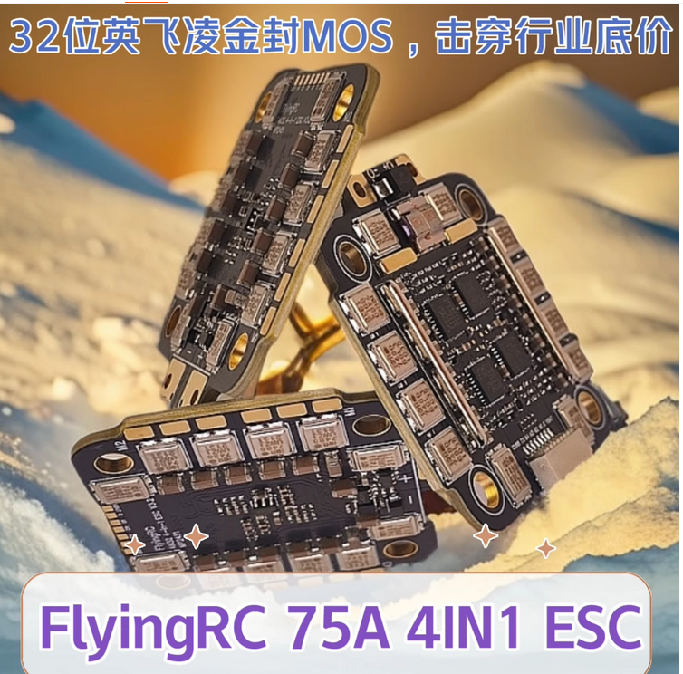

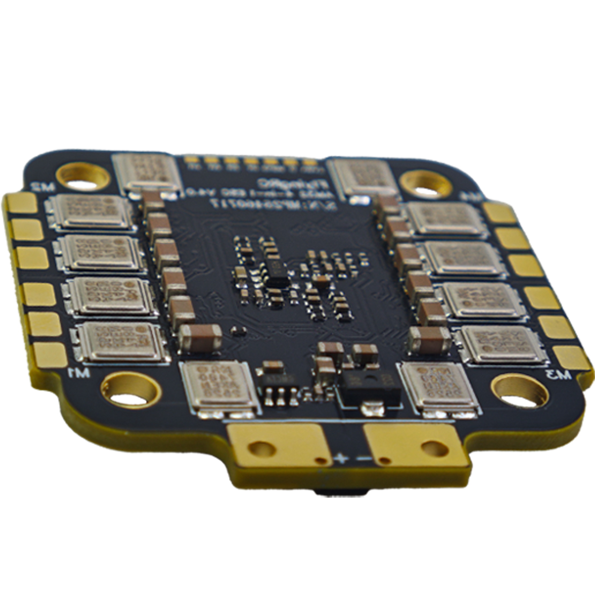

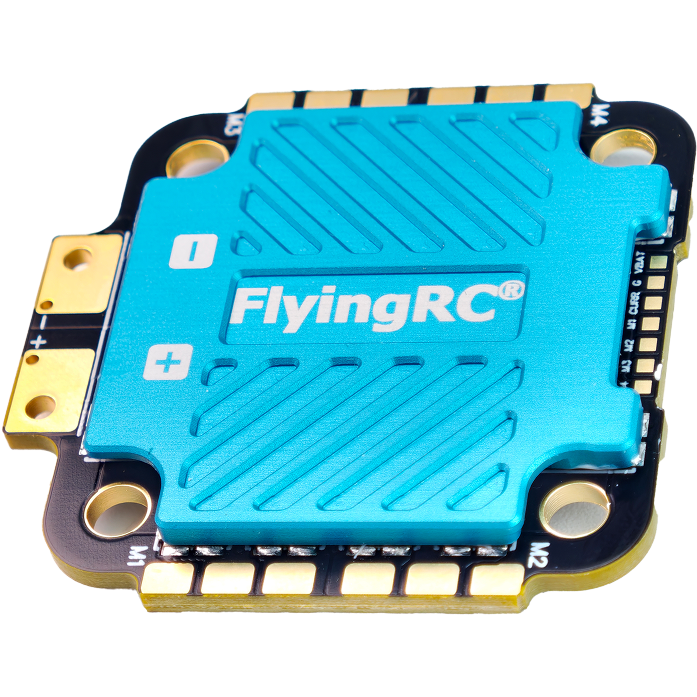

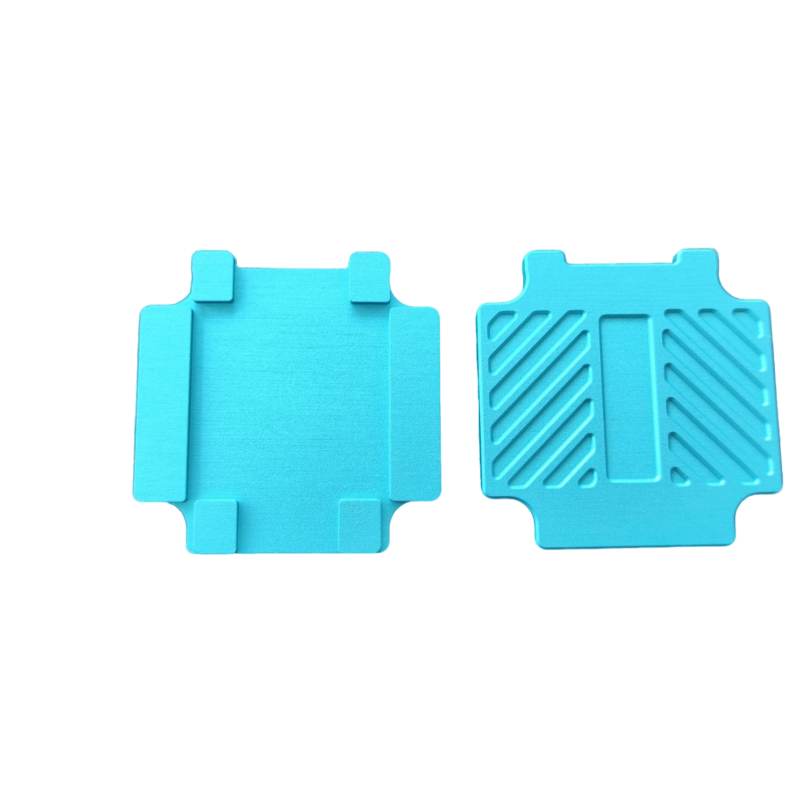

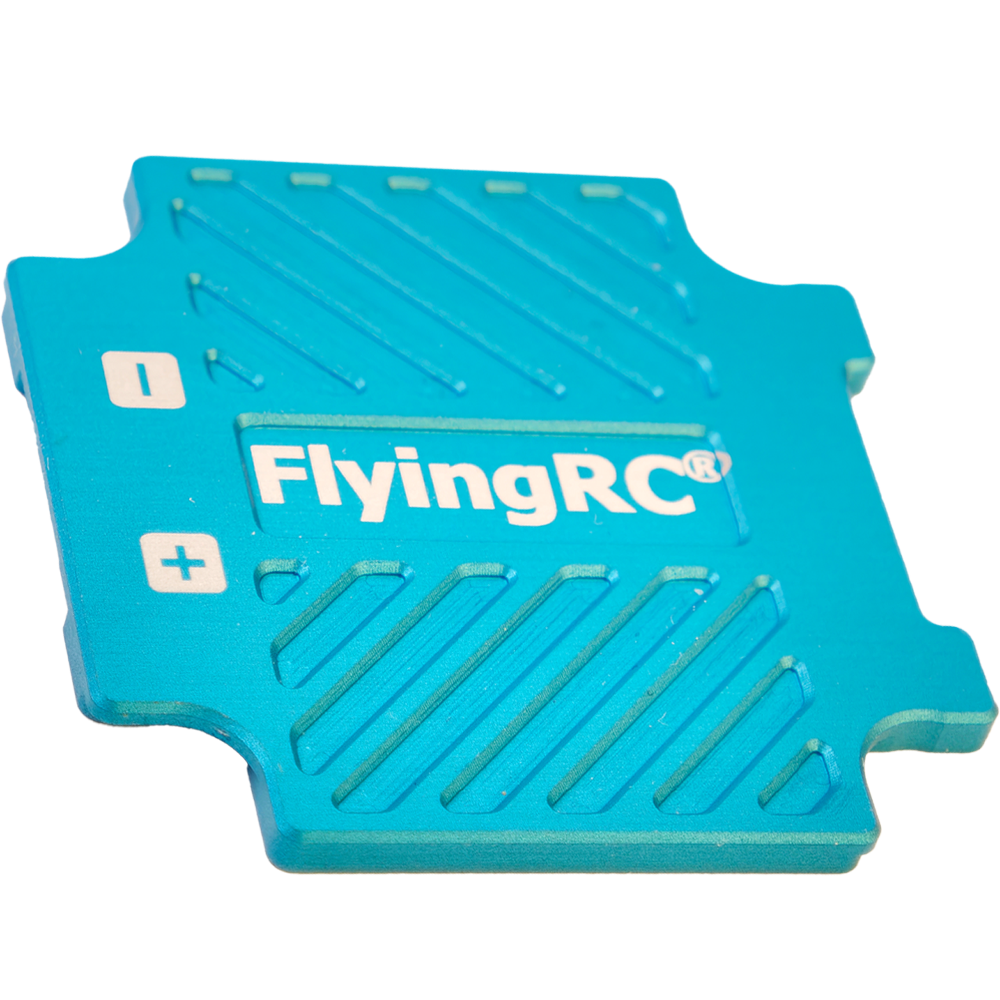

加CNC铝合金散热片（散热片仅重3.8g）

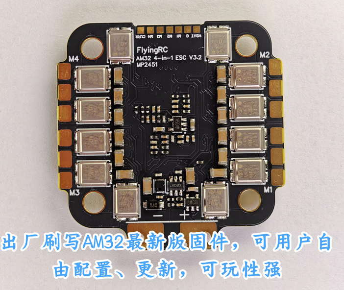

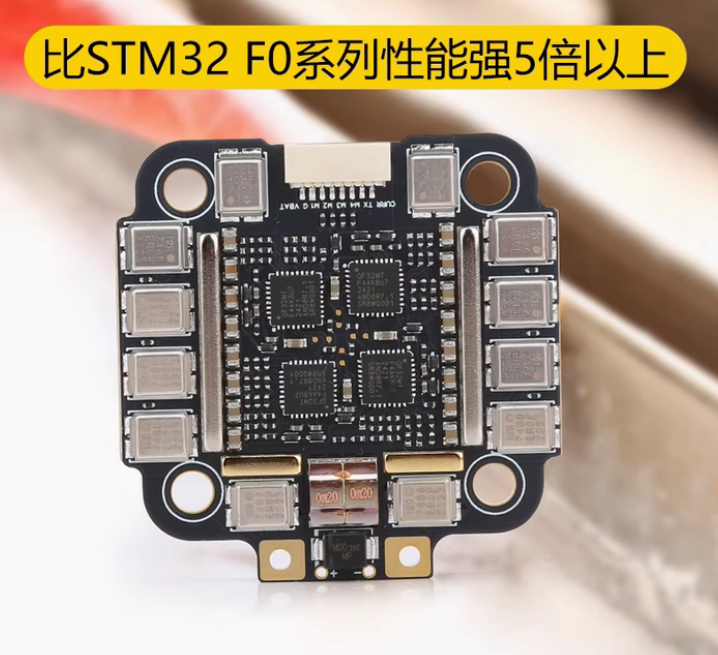

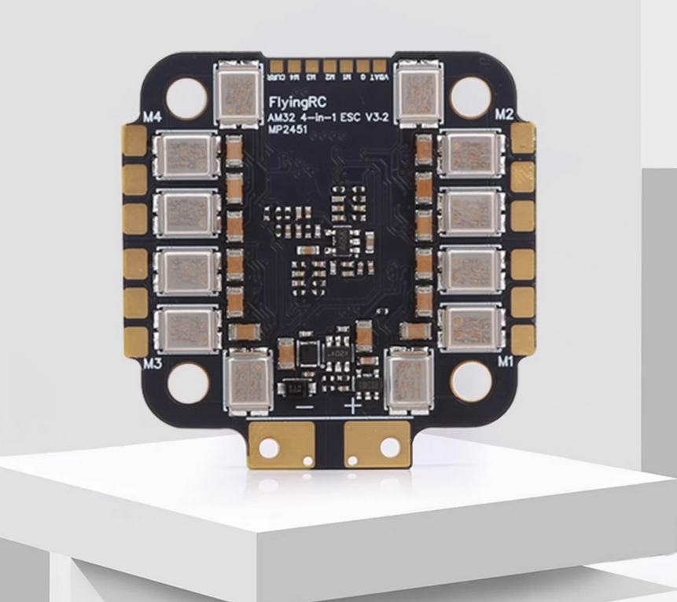

## 技术参数

主控QF32F4AK8U7，集成栅极驱动器ID6288，场效应管IRF7480；

支持正弦波启动，低速大扭矩；

支持多种协议：DSHOT150/300/600、OneShot、PWM 等

尺寸：45mm×45.2mm×5.67mm

安装孔距：30.5mm×30.5mm

重量：18.6g

### 电气参数

输入电压： 9~30V (3~7S LiPo / 3~6S LiHV)

额定电流：75A×4 (5S)

单路瞬时电流：＞85A

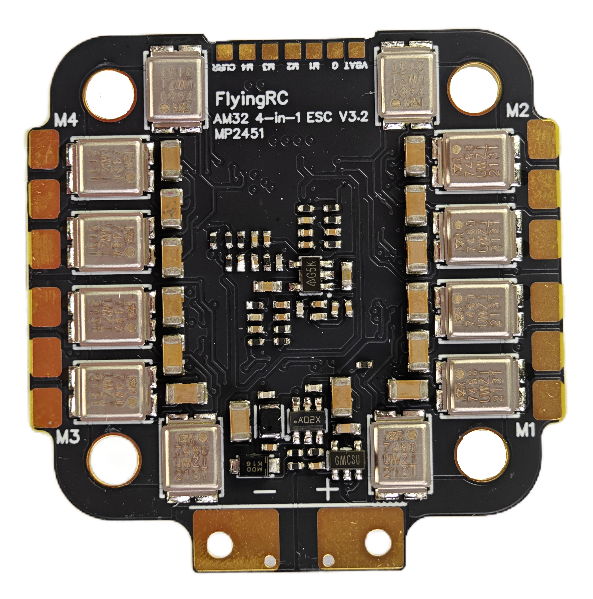

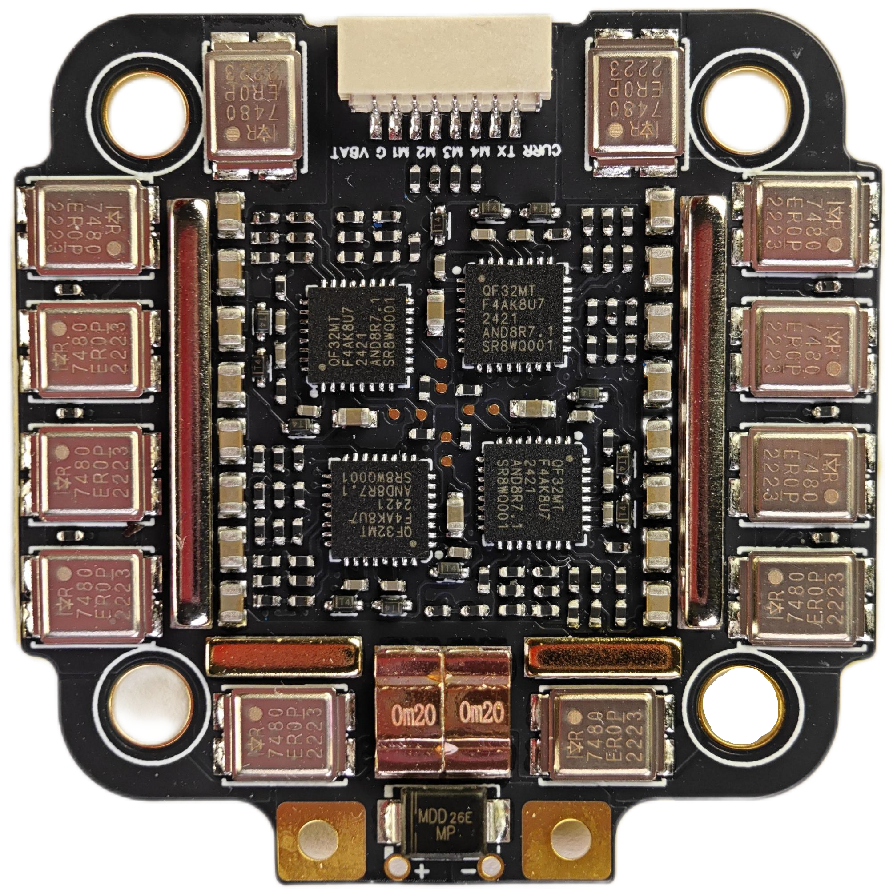

电调正反面

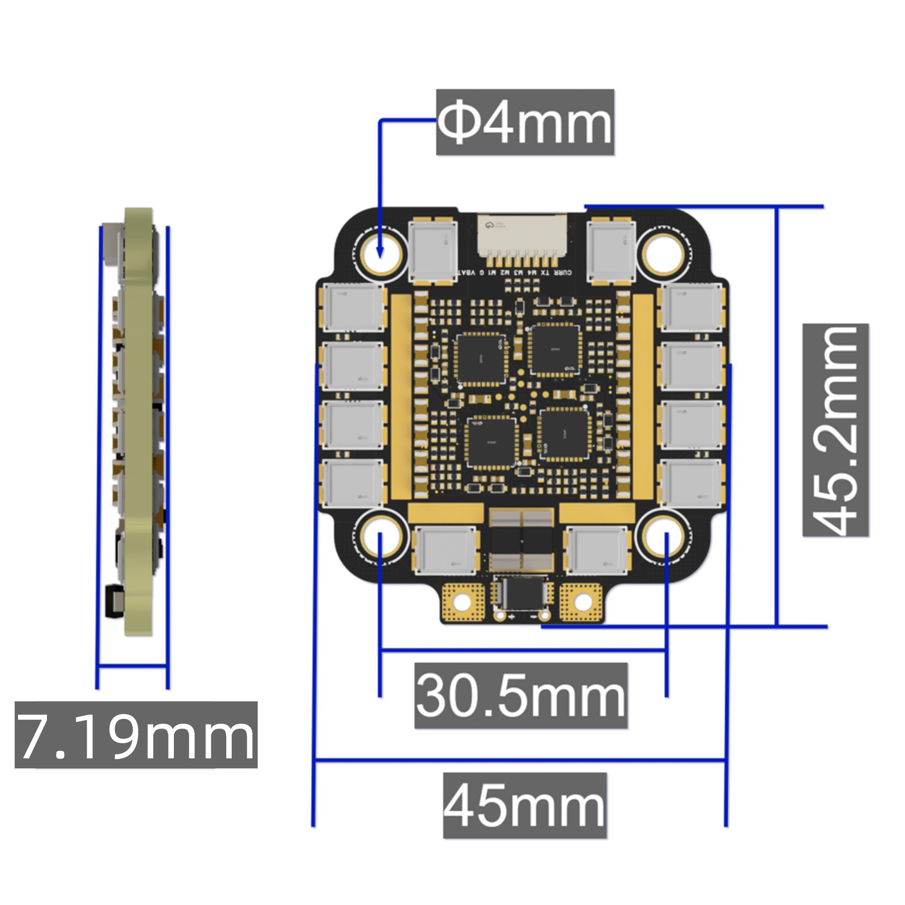

## 基础参数

电压-电流

型 号

FlyingRC® 4IN1 75A ESC

VBAT供电范围

9-30V DC IN  3-7S LiPo

尺 寸

45mm*45.2mm*7.19mm

单路持续电流

75A *45秒 (测试条件：4S)

安装孔位

30.5mm   M3

单路瞬间电流

85A (测试条件：4S)

质 量

18.6g

电流计比例值

100 (1/10mV/A Betaflight)

100 (A/V Ardupilot)

主要元件

固件

主控芯片

QF32F4AK8U7   32位

AM32

支持

主频

120MHz

控制信号输入

支持DSHOT150、300、600，OneShot，PWM等多种协议

Flash

64 KB

工作环境

RAM

16 KB

工作温度范围

-10-100℃

栅极驱动器

ID6288

存储温度范围

0-40℃

场效应管/MOS

英飞凌IRF7480 金封MOS

## 产品特点

工艺

PCB为10 层 2oz 黑色阻焊，过孔塞树脂，盘中孔，沉金，同类型产品中工艺最佳，为强大持续过流能力奠基

贴片铜条

板载 4 根 2 种不同尺寸，镀金、镀镍防氧化；辅助 PCB 过流，对比无铜条设计，电阻减小至少 80%，因 PCB 电阻产生的发热降低 80%

金封MOS

英飞凌 IRF7480，超低 Rdson 仅 0.95mΩ@10V ，1D 双面散热（Double - sided Cooling）330A ；对比未采用金封 MOS 的同类型电调，导通内阻明显降低、发热减小显著；金属外壳，MOS 管内部晶圆直触外壳，散热更好

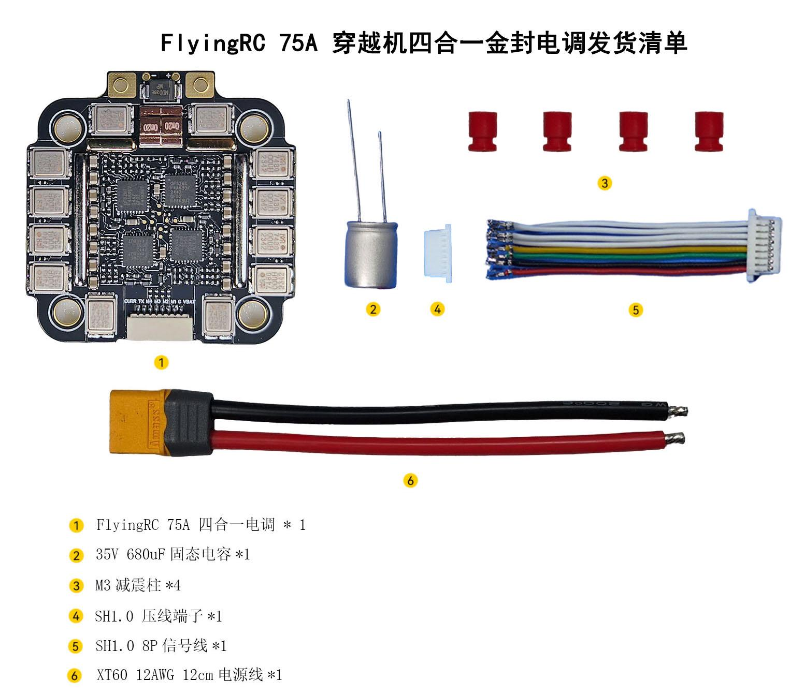

## 产品特点

PCB为10层2oz工艺:同类型产品中工艺最佳，为强大的持续过流能力奠定基础。在2.2mm板材的限制下基本是最顶级的工艺，其它工艺信息：黑色阻焊，过孔塞树脂，盘中孔，沉金。

板载4根2种不同尺寸的贴片铜条（镀金，镀镍防止氧化），辅助PCB过流，对比无铜条设计，电阻减小至少80%，对应的因PCB电阻产生的发热降低80%。

英飞凌IRF7480金封MOS，超低Rdson仅0.95mΩ@10V，ID双面散热(Double-sided Cooling)330A，大电流无压力。对比同类型电调（未采用金封MOS）导通内阻明显降低，发热减小显著。金属外壳，MOS管内部晶圆直触外壳，散热更好。

QF32MTF4AK8U7主控，集成ID6288栅极驱动器，32位主控，性能强悍。

出厂刷写AM32固件，可用户自由配置、更新，可玩性强。

## 三、使用方法

本产品目前有V3.2和V4.0两个版本，接线顺序有所区别，V4.0符合BF线序规范。因为两个版本共用一个说明书，所以飞友请注意V3.2和V4.0的外观区别.

**1.V4.0的8P插座上印有“注意线序”的字样**

V3.2                           V4.0

**2.两个版本上均印有版本号**

**3.V4.0上印有S/N码**

V3.2                           V4.0

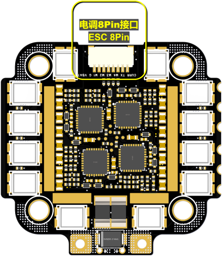

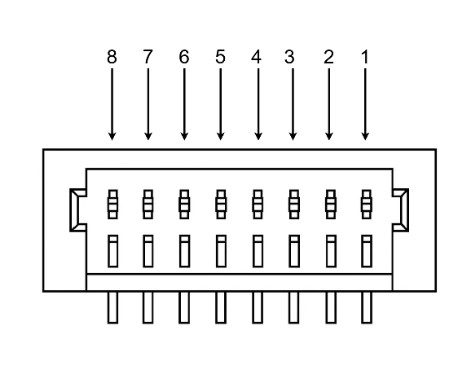

电调SH1.0 8P接口

引脚序号

引脚名称

引脚定义

1

VBAT

电池电压输入

2

G

GND （负极）

3

M1

电调1 信号引脚

4

M2

电调2信号引脚

5

M3

电调3信号引脚

6

M4

电调4信号引脚

7

TX

电调回传TX口

8

CURR

模拟电流计输出信号引脚

V3.2引脚定义表

电调SH1.0 8P接口

引脚序号

引脚名称

引脚定义

1

VBAT

电池电压输入

2

G

GND （负极）

3

CURR

模拟电流计输出信号引脚

4

TX

电调回传TX口

5

M1

电调1 信号引脚

6

M2

电调2信号引脚

7

M3

电调3信号引脚

8

M4

电调4信号引脚

V4.0引脚定义表

**1. 使用前准备**

工具及耗材准备：

数控烙铁/焊台（推荐T12系列或者936系列），焊锡丝（推荐63%含锡量），固态电容35V 680uF（包装内附赠），XT60电源插头线（包装内附赠）。

焊接电源线及电容：注意电容正负极，请勿焊反，电容头上红色标记是负极。

请点击：焊接视频教程链接。

备注：因焊盘面积大，镀金导热性强，新手及焊接工具欠佳的飞友可以拍代焊选项。

焊接后展示图

制作信号排线

视频教程：链接

包装内附赠的信号线为SH1.0 8P双头线。一端已插入端子（线序，颜色与电调的线序，功能匹配），另一端未插入端子，包装内有附带SH1.0 8P空端子，需要根据飞控插口的定义自己更改线序。

FlyingRC® 4IN1 75A ESC V3.2与FlyingRC® H7D飞控接线

安装减震柱

装机，并焊接电机线。注意电机线不要碰到金封MOS的外壳！金封MOS是导电的。

电流计设置:

Betaflight电流计比例值：100 （1/10mV/A）

Ardupilot电流计比例值：100 （A/V）

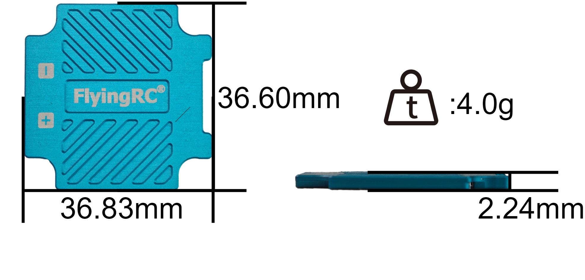

如何粘贴散热片  准备好电调、散热片、导热胶

导热胶：推荐使用导热系数＞3.8W/m.k;扯断强度1.5MPA；表面硫化时间10MIN/25℃

本品为导热、绝缘性能优良的单组分室温硫化硅胶，导热性能出色，使用温度范围宽（-60~250℃），短期可耐 500℃ 高温。产品还具有表面固化时间短、粘接力强、保质期长、无毒等特点，可安全用于电子、电器、仪表、LED、散热器件等领域，实现弹性粘接、散热、绝缘与封装。

使用方法：

1、使用时直接将导热胶挤出，擦与被粘物表面，用后立即盖好，以备再次试用；

2、表面固话速度与空气中的相对湿度和温度有关；温度越高，固化速度越快，反之越慢；

3、建议涂抹厚度：0.1-0.5mm，越薄越好。

4、使用前被粘接物表面请用溶剂清洁（如酒精），切忌用清洁剂清洗，待表面干净后方可涂抹

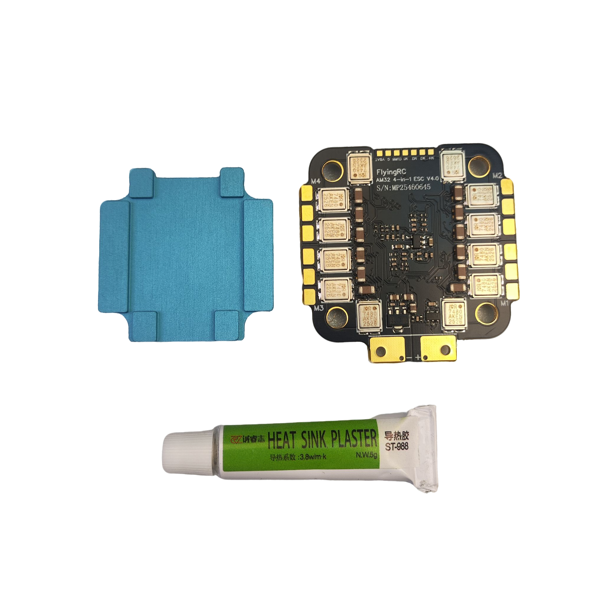

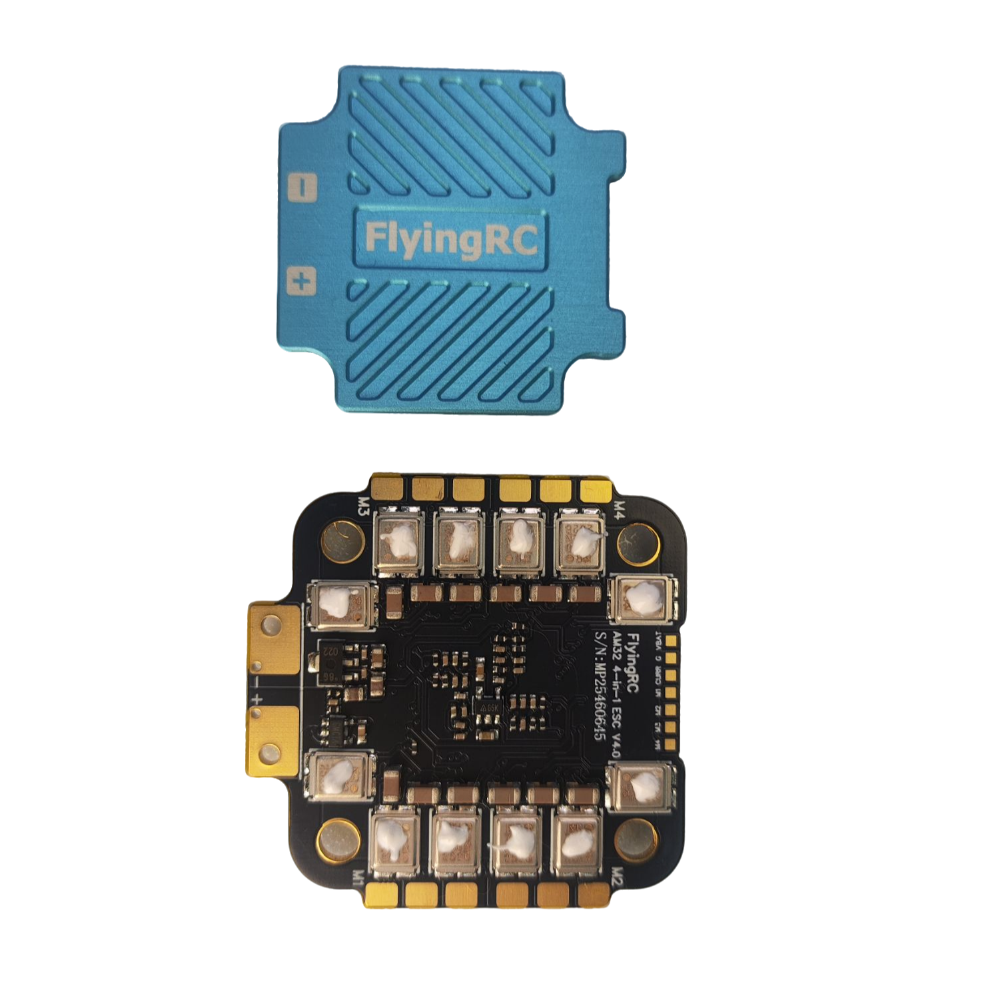

导热胶涂在被粘物表面

贴后效果图

**2.接线图**

(1)V3.2接线图与FlyingRC® F4D飞控连接- 查看产品说明书和购买链接

### V3.2与FlyingRC® F4D飞控连接接线图

(2)V3.2接线图与FlyingRC® H7D飞控连接- 查看产品说明书和购买链接

### V3.2与FlyingRC® H7D飞控连接接线图

(3)V4.0接线图与FlyingRC® F4D飞控连接- 查看产品说明书和购买链接

### V4.0接线图与FlyingRC® F4D飞控连接

(4)V4.0接线图与FlyingRC® H7D飞控连接- 查看产品说明书和购买链接

### V4.0接线图与FlyingRC® H7D飞控连接

更新固件说明

使用电调调参软件时请关闭BF地面站以释放飞控端口。电调调参/烧录固件时需要链接动力电池供电，请取下螺旋桨。

请在群文件内下载AM32-ESC-Tools，解压到本地，双击打开SerialPortConnector.exe。

在电调调参软件右下角找到飞控对应端口编号（COMx），点击Connect，此时若无错误提示，电调调参软件成功连接飞控。

烧录固件前，请提前下载好电调的新版本固件，固件下载链接（github，或群文件内下载）

电调调参软件：点击“Flash”（烧录页面）。

点击M1，“Load Firmware”，在弹出框中找到下载好的新版电调固件，双击确认。点击“Flash Firmware”，耐心等待进度条走完。点击“Send Defalut Settings”

以恢复电调默认参数，*跨多版本更新固件时建议不要省略此步骤。

为M2，M3，M4重复上述步骤。

注意！请勿使用网页版调参软件，更新固件时有可能导致电调MCU损坏，已经发现多起案例，这种情况下需要返厂付费维修。

参数设置

调参软件及如何连接见3.更新固件说明

参数解说图

主要参数：

KV值：需调整至电机KV值附近，与实际KV值偏差不超过30%。KV值设置偏差如超过100% 可能会导致电机不能正常旋转，甚至导致电调硬件损坏。

进角：禁止调整。熟练玩家可通过调整进角使电机效率更高，但错误调整进角会导致电调损坏，并且这种损坏通常是无法维修的。

失速保护：若使用低KV值电机（KV值<500），可开启，或开启正弦波启动需开启此选项。

正弦波启动：对于常见的穿越机，无需启用。

备注：

所有电调均出厂前刷写最新正式版AM32固件，并通过多电压旋转测试。

需要使用离线版调参工具刷写固件；

电调在运行过程中存在显著的产热现象，为确保其高效散热，禁止包覆热缩膜和防水处理，此类防护手段易会阻碍电调与外界的热交换，由此造成的损坏不在保修范围。

当电调工作环境参数（如温度、湿度、气压、通风性等）偏离额定工况时，其内部功率器件的载流能力将受到限制，最大持续工作电流将低于标称值。为保障电调稳定可靠运行，必须采取足够的散热措施。

注意电调安装时不要与其它导体（碳纤维板，电池插头，其他电路板）相连，以免造成外部短路导致损坏。

信号线需使用硅胶线，飞控接线端子型号为SH1.0，体积较小，插拔时请用手抵住插座后部，以防插座受力脱落。

## 四、技术问题咨询

若遇技术问题，建议先查阅产品说明书；也可前往AI平台、B站等渠道获取帮助。同时欢迎群友互相协助，分享已知解决方案。

## 五、售后服务

保修服务期限及内容

·  已焊接产品、人为损坏不享受免费保修。

·  配套易损配件不在保修范围内，可至 FlyingRC® 淘宝店另行购买。

若首次使用后没有发现产品存在问题，视为产品性能正常，不存在质量问题。后续使用中出现任何问题，视为用户不规范操作的所致。FlyingRC®提供两种售后服务供用户选择。

适用条件：用户购买产品1年内，可享受1次优惠以旧换新，需寄回故障产品。

折扣规则：按淘宝店正常售价7折购买全新同款同配置产品；换新品不再享受维修和售后服务。

付费维修寄送要求：

客户寄修前请先电话或微信联系工作人员，说明电路损坏原因与故障情况，确认是否可修。

产品寄出后，请主动提供运单号。未与维修工程师沟通直接寄回，若出现快递丢失、无法维修等情况，损失由客户自行承担。

随货请附纸条，注明：产品具体故障、故障原因、操作过程，并填写联系方式、回寄地址。拒收顺丰及到付件。

未附纸条导致无法联系、无法维修的，后果由客户承担。客户超过 3 个月未联系的，产品将按无主件报废处理。

因客户参数设置错误导致产品异常，工程师重新刷固件或校正参数的，将收取检测费 10–20 元。

维修内容

项目编号

更换芯片型号

材料费+手工费=维修费

飞控主控

1

STM32F405RGT6

30+15=45

2

STM32H743VIT6

50+30=80

3

STM32H743VIH6

65+45=110

电调主控

4

QF32F4AK8U7

8+10=18

5

AT32F421K8U7

6+10=16

飞控传感器

6

ICM-42688-P

70+12=82

7

ICM-42605

50+12=62

8

SPL06

4+10=16

9

DPS310/DPS368

25+12=37

飞控电源芯片

10

MP9943

7+10=17

11

MP9447

10+10=20

12

MP9942

8+10=18

13

LM25148

26+15=41

14

LDO

4+5=9

电调场效应管

15

IRF7480

5+5=10

16

HYG022N04LS1C1

3+5=8

其它元器件

17

电阻、电容、插座等

2+5=7

注：表格里是单一原件维修价格。

请注意：自行维修、打胶、PCB烧坏/击穿（全部芯片烧毁）和进水（元器件/PCB腐蚀）的飞控没有继续使用和维修价值，FlyingRC®不提供维修服务,客户可以选择7折以旧换新。

## 六、FlyingRC® 其它产品介绍

## 一、FlyingRC介绍1

## 二、 产品概述3

## 四、技术问题咨询30

## 五、 维修服务31

## 六、 FlyingRC® 其它产品介绍34

**1. 飞控类38**

**2. 电调类41**

**3. 飞塔类43**

4. BEC 降压电路类47

5. 模块类49

6. 其他类50

飞控类

全新升级、功能更强

FlyingRC官方零售价：140元

中文说明书   Product Manual   去淘宝购买

经典产品、设计独特、好评如潮

中文说明书  Product Manual

性能强劲，双陀螺仪

FlyingRC官方零售价：299元

中文说明书  Product Manual

性能强劲，双陀螺仪,BEC输出能力强

FlyingRC官方零售价：259元

中文说明书  Product Manual  去淘宝购买

2025年 爆款产品,设计感爆棚,全网最Mini

FlyingRC官方零售价：89元

中文说明书   Product Manual  去淘宝购买

全新升级、功能更强

FlyingRC官方零售价：269元/299元

中文说明书 Product Manual 去淘宝购买

算力强大 飞行稳定精准 接口丰富 操控自如

中文说明书   Product Manual

算力强大 飞行稳定精准 接口丰富 操控自如

FlyingRC官方零售价：129元

中文说明书   Product Manual  去淘宝购买

电调类

本店销量No.4

高端产品,英飞凌金封MOS,工艺最佳,单路持续75AFlyingRC官方零售价：269元

中文说明书 Product Manual 去淘宝购买

性能出色，性价比高，入门首选

FlyingRC官方零售价：149元

中文说明书 Product Manual  去淘宝购买

设计独特，独家产品 用于无人机等空中、陆地、水上双动力设备    FlyingRC官方零售价：89元

中文说明书 Product Manual 去淘宝购买

英飞凌金封MOS 工艺出色 过流能力强大

FlyingRC官方零售价：87元（不带BEC版本）

中文说明书 Product Manual 去淘宝购买

客户可以用自己的功率板，制作不同规格电调

FlyingRC官方零售价：47元

中文说明书 Product Manual 去淘宝购买

超Mini 用于小型和微型机 过流能力强 运行稳定 FlyingRC官方零售价：43元

中文说明书 Product Manual 去淘宝购买

飞塔类

H743穿越机飞控+四合一穿越机75A金封电调

专业飞行首选，旗舰用料工艺，良心价格

FlyingRC官方零售价：528元

飞控中文说明书   电调中文说明书

FC Product Manual  ESC Product Manual

去淘宝购买

F405穿越机飞控+四合一穿越机75A金封电调

爆款组合，性能出色，良心价格

FlyingRC官方零售价：398元

飞控中文说明书    电调中文说明书

FC Product Manual ESC Product Manual

去淘宝购买

H743穿越机飞控+四合一穿越机45A电调

爆款组合，性能出色，价格亲民

FlyingRC官方零售价：408元

飞控中文说明书     电调中文说明书

FC Product Manual  ESC Product Manual

去淘宝购买

F405穿越机飞控+四合一穿越机45A电调

爆款组合，实惠之选，价格亲民

FlyingRC官方零售价：278元

飞控中文说明书     电调中文说明书

FC Product Manual  ESC Product Manual

去淘宝购买

F4WSE PRO飞控+二合一40A电调

独特设计、独家产品、爆款组合

FlyingRC官方零售价：237元

飞控中文说明书      电调中文说明书

FC Product Manual   ESC Product Manual

去淘宝购买

BEC 降压电路类

多电压可选 行业首选，物美价廉

FlyingRC官方零售价：74元

中文说明书 Product Manual 去淘宝购买

多电压可选 行业首选，物美价廉

FlyingRC官方零售价：36元

中文说明书 Product Manual 去淘宝购买

多电压可选，持续5A输出

FlyingRC官方零售价：17元

中文说明书  Product Manual  去淘宝购买

独立降压，稳定供电，让飞行更安全

FlyingRC官方零售价：18元

中文说明书  Product Manual  去淘宝购买

模块类

超高分辨率、低功耗、行业首选

FlyingRC官方零售价：129元

中文说明书  Product Manual  去淘宝购买

行业首选，物美价廉

FlyingRC官方零售价：199元

中文说明书 Product Manual 去淘宝购买

其他类

行业首选，物美价廉

FlyingRC官方零售价：109元

中文说明书  Product Manual 去淘宝购买

真分集接收,温度补偿，高功率接收

FlyingRC官方零售价：109元

中文说明书  Product Manual  去淘宝购买

支持BL，BL32，AM32 简单好用

FlyingRC官方零售价：9.9元/7.9元（A口/C口）焊好

FlyingRC官方零售价：6.9元/5.9元（A口/C口）自己焊

中文说明书 Product Manual 去淘宝购买

一体设计，全网最Mini MS4525D协议，I2C接口

FlyingRC官方零售价：95元

中文说明书  Product Manual  去淘宝购买

一体设计，全网最Mini MS4525D协议，I2C接口

FlyingRC官方零售价：    95元

中文说明书  Product Manual  去淘宝购买

一体设计，全网最Mini MS4525D协议，I2C接口

FlyingRC官方零售价：39元

中文说明书  Product Manual  去淘宝购买

长距离传输，高速率，稳定性强

FlyingRC官方零售价：46元

中文说明书  Product Manual  去淘宝购买

支持各种开源飞控 多尺寸可选 搜星能力强 性价高

FlyingRC官方零售价：68元(18*18mm款)

中文说明书  Product Manual  去淘宝购买

FlyingRC®官网

www.FlyingRC®.cn

淘宝店铺

闲鱼店铺

群号1016199449

电话:021-58204886 手机:13122492475   微信:13122492475、18019464804

464804

---

## AM32 固件与调参

--8<-- "shared/esc/am32-setup.md"

---

## 电机转向与协议

--8<-- "shared/esc/motor-direction.md"

---

## 安全须知

--8<-- "shared/safety.md"

---

## 焊接注意

--8<-- "shared/soldering.md"

---

## 首次使用检查

--8<-- "shared/first-use-check.md"

---

## 技术支持

--8<-- "shared/support.md"

---

## 售后与保修

--8<-- "shared/warranty.md"

---

## FlyingRC® 其它产品

--8<-- "shared/other-products.md"

---

## 免责声明

--8<-- "shared/disclaimer.md"

