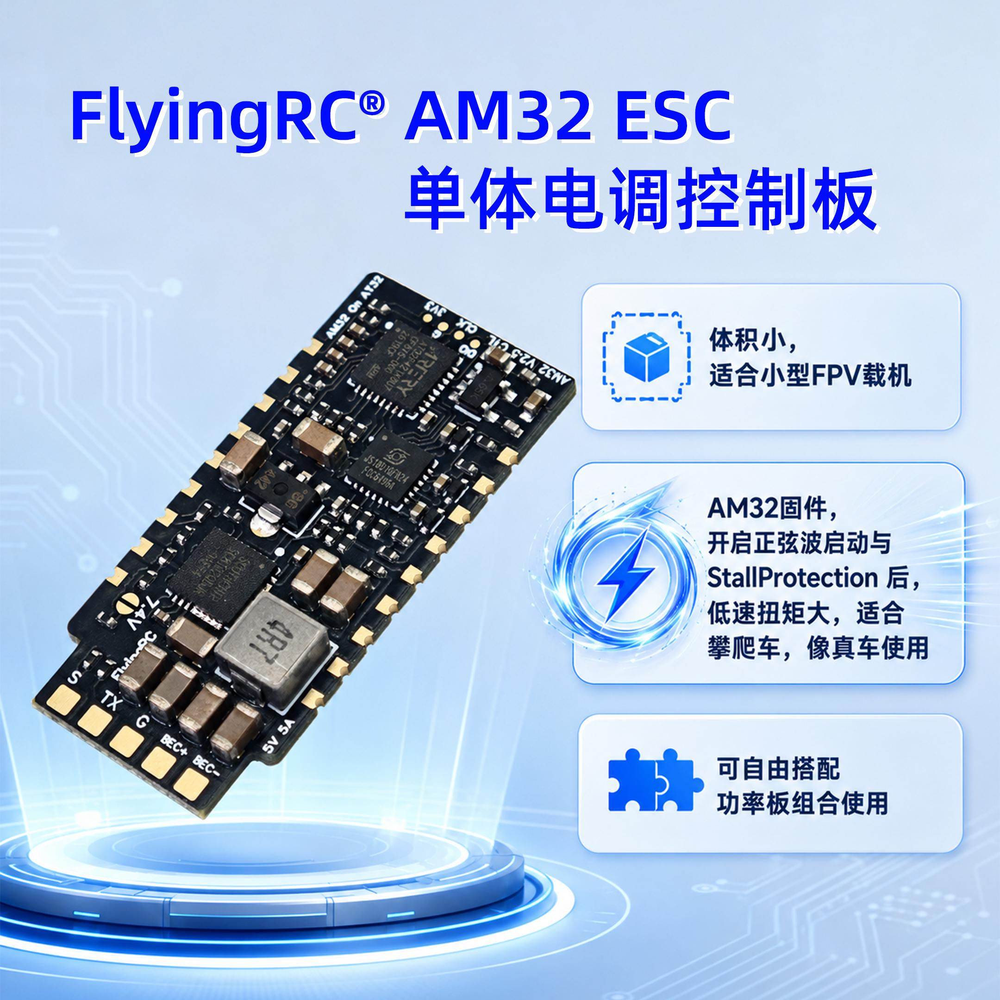
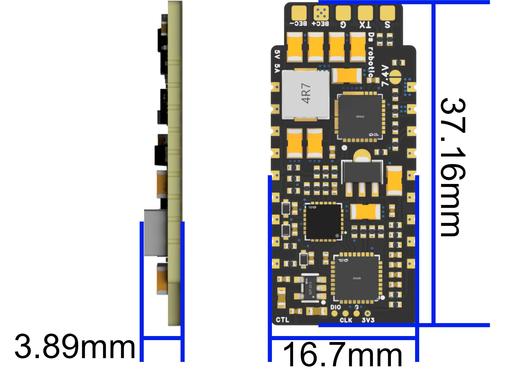
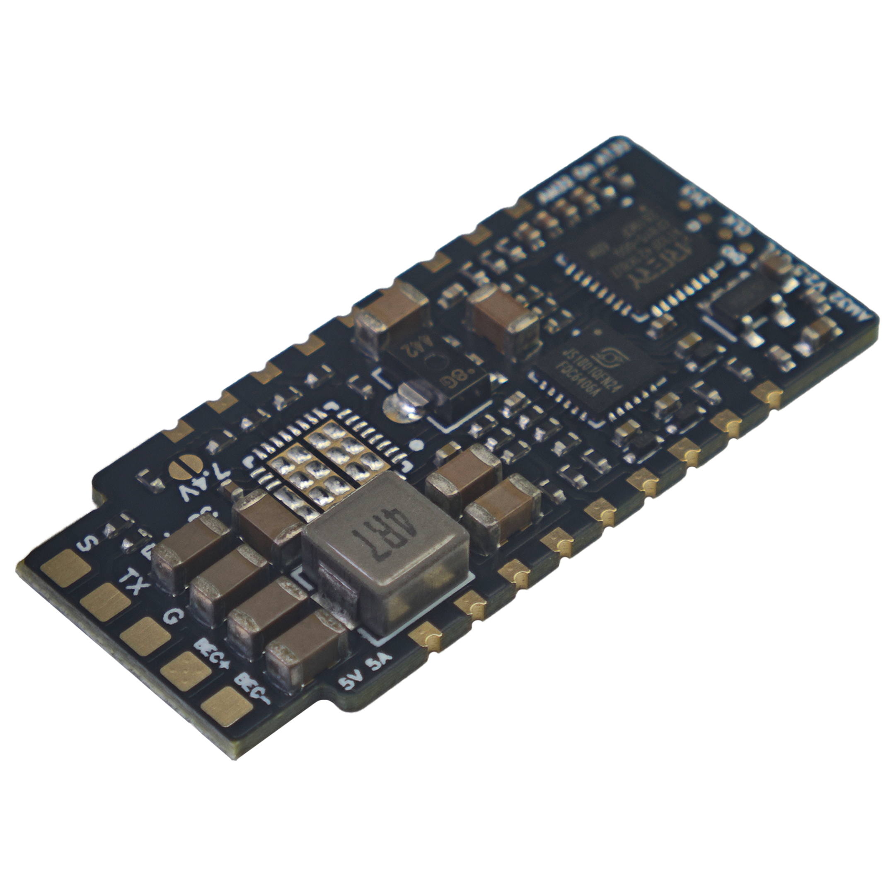
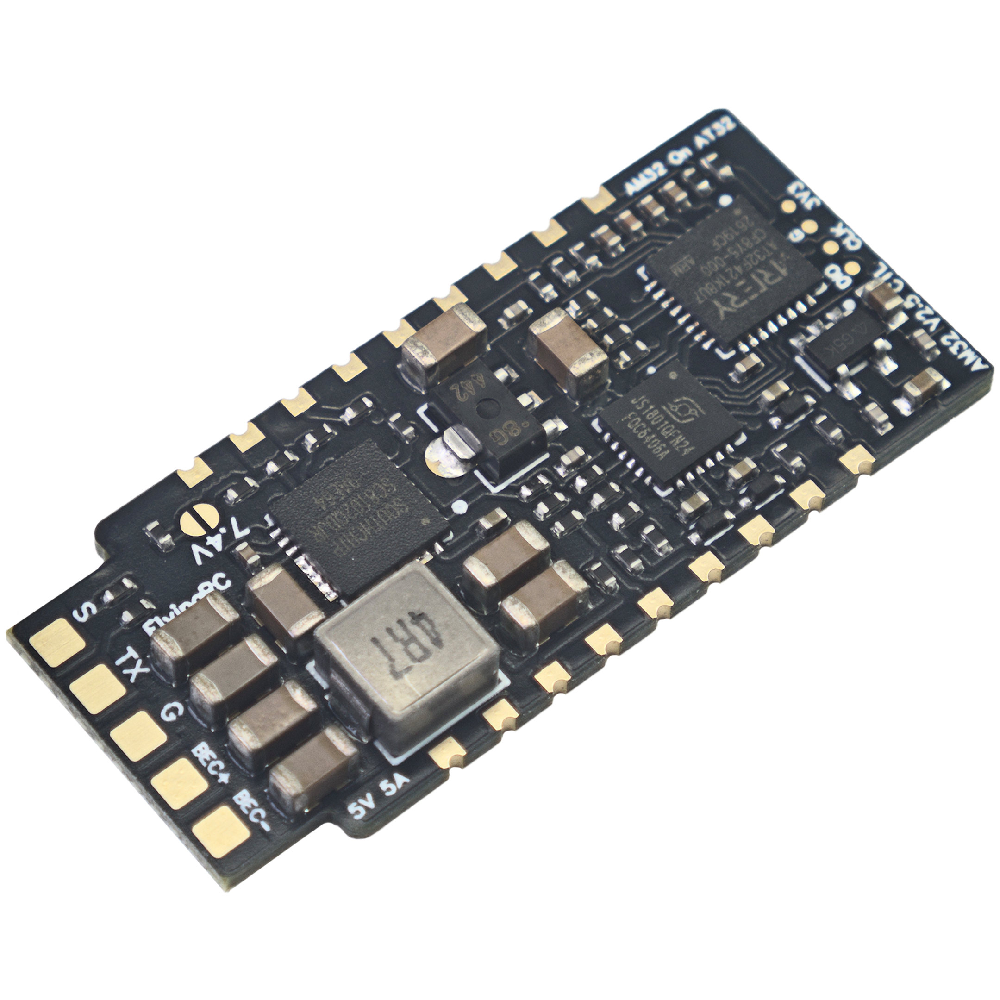
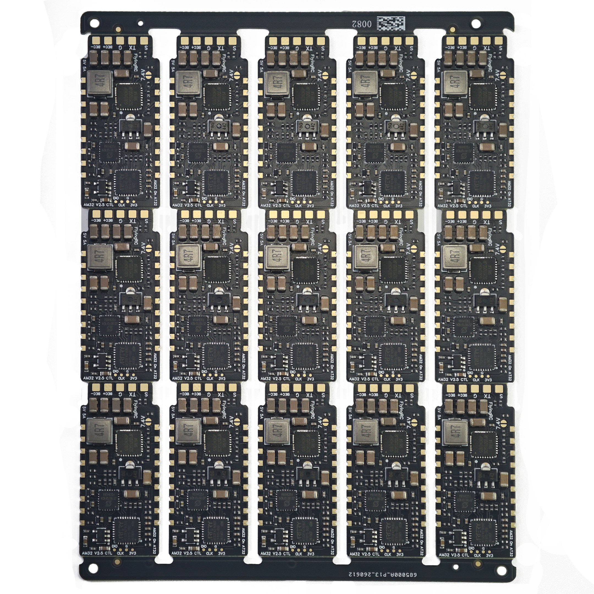
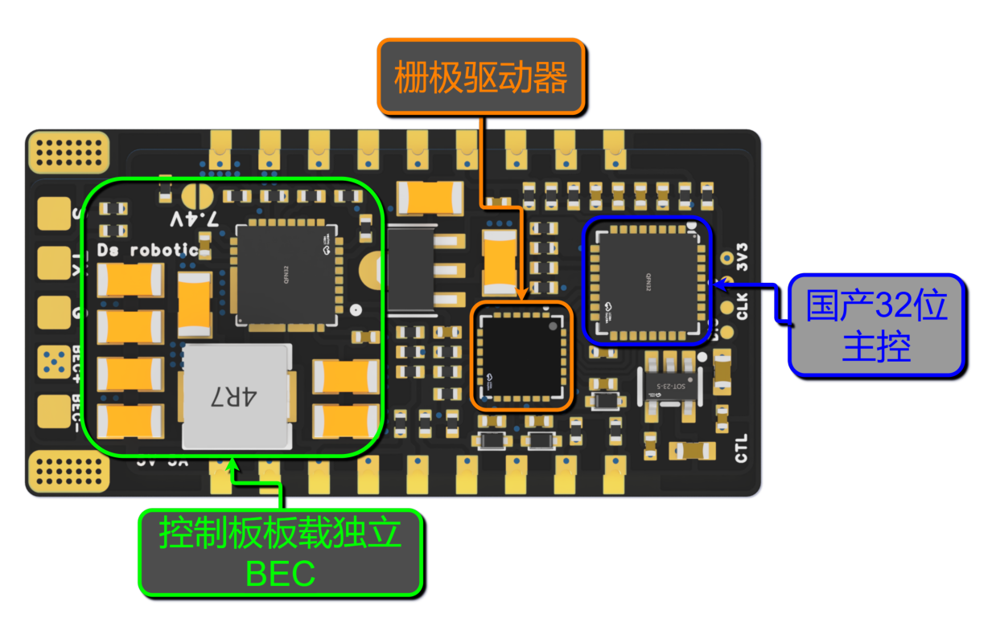
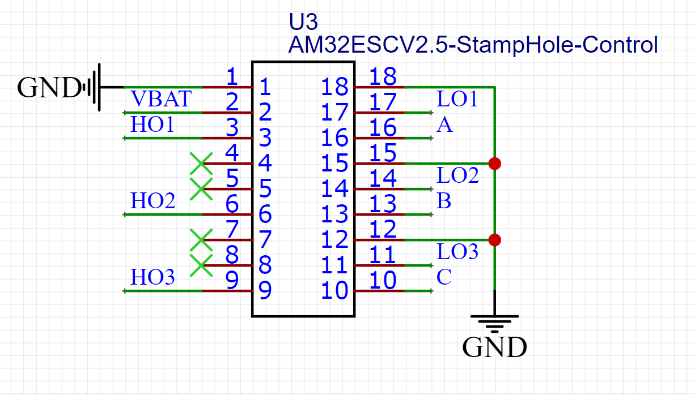
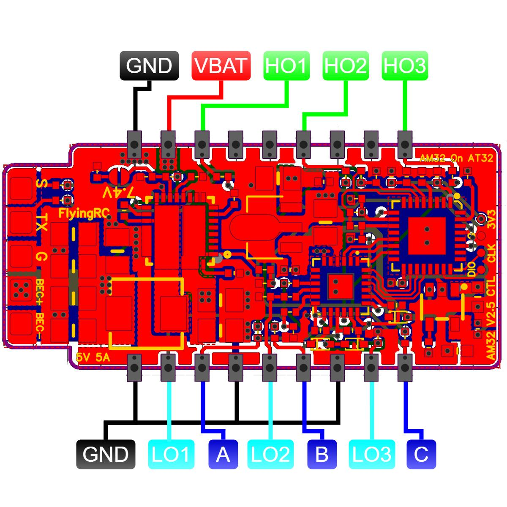
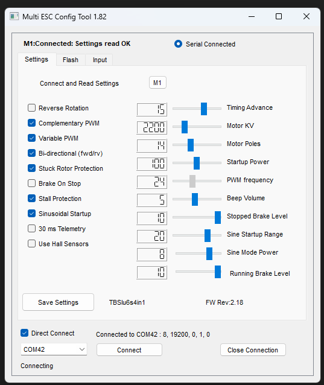
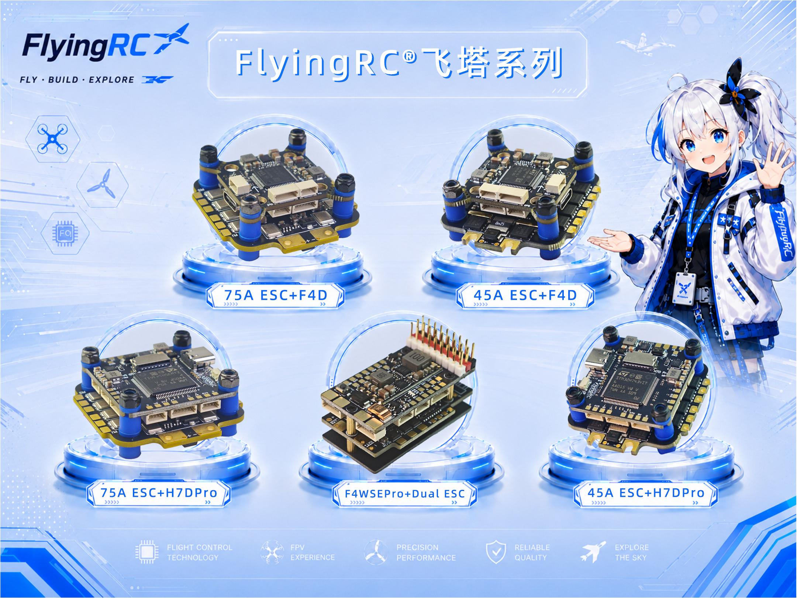

# FlyingRC® AM32 ESC单体电调控制板产品手册

> 状态：在售 · 类别：esc · 内容自原 WPS 说明书迁入

---

## 一、FlyingRC介绍

## 产品概述

## 技术参数

主控AT32F421K8U7，栅极驱动器FD6288/JSM6288Q

正弦波启动，低速大扭矩

支持DSHOT150，300，OneShot，PWM等多种协议

板载BEC，SC8102方案，5V4A/7V3A，可用于给车用舵机供电

尺寸及重量：37.16mm*16.7mm*3.89mm，2.6g

| 基础参数 |  |  |  |
|------|------|------|------|
| 型 号 | FlyingRC® AM32 ESC Control Plate |  |  |
| 尺 寸 | 37.16mm*16.7mm*3.89mm |  |  |
| 质 量 | 2.6g |  |  |
| 主要元件 | 固件 |  |  |
| 主控芯片 | AT32F421K8U7   32位 | AM32 | 支持 |
| 主频 | 120MHz | 控制信号输入 | 支持DSHOT150、300、600，OneShot，PWM等多种协议 |
| Flash | 64 KB |  |  |
| RAM | 16 KB |  |  |
| 栅极驱动器 | FD6288/JSM6288Q | 工作环境 |  |
| BEC | SC8102  5V4A 可调至7V3A | 工作温度范围 | -10-100℃ |
| 遥测回传 | 有转速回传 | 存储温度范围 | 0-40℃ |
| 产品特点 |  |  |  |
| 工艺 | PCB 为黑色阻焊，过孔塞树脂，盘中孔，沉金同类型产品中工艺最佳，为强大的持续过流能力奠定基础 |  |  |

整板 - 带BEC

## 产品特点

体积小，适合小型FPV载机。

AM32固件，开启正弦波启动与StallProtection后，低速扭矩大，适合攀爬车，像真车使用。

可自由搭配功率板组合使用。

## 使用方法

### 1.布局/LAYOUT

电调控制板3D示意图

焊盘定义

| 焊盘序号 | 焊盘名称 | 焊盘定义 |
|------|------|------|
| 1 | S | PWM/Dshot 信号输入 |
| 2 | TX | 电调回传TX |
| 3 | G | GND（负极） |
| 4 | BEC+ | 5V / 7.4V BEC 正极5V / 7.4V BEC Positive |
| 5 | BEC- | 5V / 7.4V BEC 负极 |

原理图：

| 定义 | 释义 |
|------|------|
| GND | 接地 |
| VBAT | 电池电压（8~30V） |
| HO1\HO2\HO3 | MOS上管栅极 |
| LO1\LO2\LO3 | MOS下管栅极 |
| A\B\C | 相线 |

**4.接线图：**

FlyingRC® AM32调参器 - 查看产品说明书和购买链接

### 与FlyingRC® AM32调参器连接接线图

**3.固件**

出厂默认已经刷好AM32 V2.19固件，参数默认。

最新稳定版（截至2026/6/30）固件下载链接：

固件下载: AM32_TBS_6S_4IN1_F421_2.20

BootLoader：AM32_F421_BOOTLOADER_PB4_V17

更新固件说明

使用电调调参软件时请关闭BF地面站以释放飞控端口。电调调参/烧录固件时需要链接动力电池供电，务必先取下螺旋桨。

请在群文件内下载AM32-ESC-Tools，解压到本地，双击打开SerialPortConnector.exe。

在电调调参软件右下角找到飞控对应端口编号（COMx），点击Connect，此时若无错误提示，电调调参软件成功连接飞控。

烧录固件前，请提前下载好电调的新版本固件，固件下载链接（github，或群文件内下载）

电调调参软件：点击“Flash”（烧录页面）。

点击M1，“Load Firmware”，在弹出框中找到下载好的新版电调固件，双击确认。点击“Flash Firmware”，耐心等待进度条走完。点击“Send Defalut Settings”以恢复电调默认参数，*跨多版本更新固件时建议不要省略此步骤。

为M2，M3，M4重复上述步骤。

FlyingRC®出厂攀爬车参数截图：

### 攀爬车参数

注意！请勿使用网页版调参软件，更新固件时有可能导致电调MCU损坏，已经发现多起案例，这种情况下需要返厂付费维修。

（6）参数设置：  调参软件及如何连接见5.更新固件说明

参数解说图

主要参数：

KV值：需调整至电机KV值附近，与实际KV值偏差不超过30%。KV值设置偏差如超过100% 可能会导致电机不能正常旋转，甚至导致电调硬件损坏。

进角：禁止调整。熟练玩家可通过调整进角使电机效率更高，但错误调整进角会导致电调损坏，并且这种损坏通常是无法维修的。

失速保护：若使用低KV值电机（KV值<500），可开启，或开启正弦波启动需开启此选项。

正弦波启动：对于常见的穿越机，无需启用。

备注：

所有电调均出厂前刷写正式版AM32固件，并通过多电压旋转测试。

需要使用离线版调参工具刷写固件；

电调在运行过程中存在显著的产热现象，为确保其高效散热，禁止包覆热缩膜和防水处理，此类防护手段易会阻碍电调与外界的热交换，由此造成的损坏不在保修范围。

当电调工作环境参数（如温度、湿度、气压、通风性等）偏离额定工况时，其内部功率器件的载流能力将受到限制，最大持续工作电流将低于标称值。为保障电调稳定可靠运行，必须采取足够的散热措施。

注意电调安装时不要与其它导体（碳纤维板，电池插头，其他电路板）相连，以免造成外部短路导致损坏。

技术问题咨询

若遇技术问题，建议先查阅产品说明书；也可前往AI平台、B站等渠道获取帮助。同时欢迎群友互相协助，分享已知解决方案。

维修服务

保修服务期限及内容

·  已焊接产品、人为损坏不享受免费保修。

·  配套易损配件不在保修范围内，可至 FlyingRC® 淘宝店另行购买。

若首次使用后没有发现产品存在问题，视为产品性能正常，不存在质量问题。后续使用中出现任何问题，视为用户不规范操作的所致。FlyingRC®提供两种售后服务供用户选择。

适用条件：用户购买产品1年内，可享受1次优惠以旧换新，需寄回故障产品。

折扣规则：按淘宝店正常售价7折购买全新同款同配置产品；换新品不再享受维修和售后服务。

付费维修寄送要求：

客户寄修前请先电话或微信联系工作人员，说明电路损坏原因与故障情况，确认是否可修。

产品寄出后，请主动提供运单号。未与维修工程师沟通直接寄回，若出现快递丢失、无法维修等情况，损失由客户自行承担。

随货请附纸条，注明：产品具体故障、故障原因、操作过程，并填写联系方式、回寄地址。拒收顺丰及到付件。

未附纸条导致无法联系、无法维修的，后果由客户承担。客户超过 3 个月未联系的，产品将按无主件报废处理。

因客户参数设置错误导致产品异常，工程师重新刷固件或校正参数的，将收取检测费 10–20 元。

| 维修内容 | 项目编号 | 更换芯片型号 | 材料费+手工费=维修费 |
|------|------|------|------|
| 飞控主控 | 1 | STM32F405RGT6 | 30+15=45 |
|  | 2 | STM32H743VIT6 | 50+30=80 |
|  | 3 | STM32H743VIH6 | 65+45=110 |
| 电调主控 | 4 | QF32F4AK8U7 | 8+10=18 |
|  | 5 | AT32F421K8U7 | 6+10=16 |
| 飞控传感器 | 6 | ICM-42688-P | 70+12=82 |
|  | 7 | ICM-42605 | 50+12=62 |
|  | 8 | SPL06 | 4+10=16 |
|  | 9 | DPS310/DPS368 | 25+12=37 |
| 飞控电源芯片 | 10 | MP9943 | 7+10=17 |
|  | 11 | MP9447 | 10+10=20 |
|  | 12 | MP9942 | 8+10=18 |
|  | 13 | LM25148 | 26+15=41 |
|  | 14 | LDO | 4+5=9 |
| 电调场效应管 | 15 | IRF7480 | 5+5=10 |
|  | 16 | HYG022N04LS1C1 | 3+5=8 |
| 其它元器件 | 17 | 电阻、电容、插座等 | 2+5=7 |

注：表格里是单一原件维修价格。

请注意：自行维修、打胶、PCB烧坏/击穿（全部芯片烧毁）和进水（元器件/PCB腐蚀）的飞控没有继续使用和维修价值，FlyingRC®不提供维修服务,客户可以选择7折以旧换新。

FlyingRC® 其它产品介绍

飞控类

| 产品1.FlyingRC® F4WSE F405 Pro主控固定翼飞控            本店销量No.1 / 全新升级、功能更强 / FlyingRC官方零售价：140元 / 中文说明书   Product Manual   去淘宝购买 |  |
|------|------|
| 产品2.FlyingRC® F4WSE - F405主控固定翼飞控(停产) / 经典产品、设计独特、好评如潮 / 中文说明书  Product Manual |  |
| 产品3.FlyingRC® H7Wlite H743主控固定翼飞控(停产) / 性能强劲，双陀螺仪 / FlyingRC官方零售价：299元 / 中文说明书  Product Manual |  |
| 产品4.FlyingRC® H7Wlite Pro H743主控固定翼飞控         本店销量No.7 / 性能强劲，双陀螺仪,BEC输出能力强 / FlyingRC官方零售价：259元 / 中文说明书  Product Manual  去淘宝购买 |  |
| 产品5.FlyingRC® F4Wing Mini F405主控固定翼飞控           本店销量No.2 / 2025年 爆款产品,设计感爆棚,全网最Mini / FlyingRC官方零售价：89元 / 中文说明书   Product Manual  去淘宝购买 |  |
| 产品6.FlyingRC® H7D Pro H743主控穿越机飞控                 本店销量No.3 / 全新升级、功能更强 / FlyingRC官方零售价：269元/299元 / 中文说明书 Product Manual 去淘宝购买 |  |
| 产品7.FlyingRC® H7D MK1 H743主控双陀螺仪穿越机飞控(停产) / 算力强大 飞行稳定精准 接口丰富 操控自如 / 中文说明书   Product Manual |  |
| 产品8.FlyinRC® F4D MK1 F405主控 20\30.5孔距 穿越机飞控    本店销量No.9 / 算力强大 飞行稳定精准 接口丰富 操控自如 / FlyingRC官方零售价：129元 / 中文说明书   Product Manual  去淘宝购买 |  |

电调类

| 产品9.FlyingRC® 4IN1 75A ESC 四合一穿越机金封电调 / 本店销量No.4 / 高端产品,英飞凌金封MOS,工艺最佳,单路持续75AFlyingRC官方零售价：269元 / 中文说明书 Product Manual 去淘宝购买 |  |
|------|------|
| 产品10.FlyingRC® 4IN1 45A ESC  四合一穿越机电调 / 性能出色，性价比高，入门首选 / FlyingRC官方零售价：149元 / 中文说明书 Product Manual  去淘宝购买 |  |
| 产品11.FlyingRC® AM32 Dual ESC 40A 二合一电调                本店销量No.12 / 设计独特，独家产品 用于无人机等空中、陆地、水上双动力设备    FlyingRC官方零售价：89元 / 中文说明书 Product Manual 去淘宝购买 |  |
| 产品12.FlyingRC® AM32 ESC 75A CAN总线单体金封电调 / 设计独特，独家产品 用于无人机等空中、陆地、水上双动力设备    FlyingRC官方零售价：89元 / 中文说明书 Product Manual 去淘宝购买 |  |
| 产品12.FlyingRC® AM32 ESC 75A V2.5单体金封电调                 本店销量No.6 / 英飞凌金封MOS 工艺出色 过流能力强大 / FlyingRC官方零售价：87元（不带BEC版本） / 中文说明书 Product Manual 去淘宝购买 |  |
| 产品13.FlyingRC® AM32 ESC单体金封电调控制板(带BEC) / 客户可以用自己的功率板，制作不同规格电调 / FlyingRC官方零售价：47元 / 中文说明书 Product Manual 去淘宝购买 |  |
| 产品14.FlyingRC® AM32 Mini ESC 40A V1单体电调           本店销量No.10 / 超Mini 用于小型和微型机 过流能力强 运行稳定 FlyingRC官方零售价：43元 / 中文说明书 Product Manual 去淘宝购买 |  |

飞塔类

| 产品15.FlyingRC® 高阶版飞塔套装 / H743穿越机飞控+四合一穿越机75A金封电调 / 专业飞行首选，旗舰用料工艺，良心价格 / FlyingRC官方零售价：528元 / 飞控中文说明书   电调中文说明书 / FC Product Manual  ESC Product Manual / 去淘宝购买 |  |
|------|------|
| 产品16.FlyingRC® 进阶版飞塔套装 / F405穿越机飞控+四合一穿越机75A金封电调 / 爆款组合，性能出色，良心价格 / FlyingRC官方零售价：398元 / 飞控中文说明书    电调中文说明书 / FC Product Manual ESC Product Manual / 去淘宝购买 |  |
| 产品17.FlyingRC® 进阶版飞塔套装 / H743穿越机飞控+四合一穿越机45A电调 / 爆款组合，性能出色，价格亲民 / FlyingRC官方零售价：408元 / 飞控中文说明书     电调中文说明书 / FC Product Manual  ESC Product Manual / 去淘宝购买 |  |
| 产品18.FlyingRC® 基础版飞塔套装 / F405穿越机飞控+四合一穿越机45A电调 / 爆款组合，实惠之选，价格亲民 / FlyingRC官方零售价：278元 / 飞控中文说明书     电调中文说明书 / FC Product Manual  ESC Product Manual / 去淘宝购买 |  |
| 产品19.FlyingRC® 固定翼飞塔套装 / F4WSE PRO飞控+二合一40A电调 / 独特设计、独家产品、爆款组合 / FlyingRC官方零售价：237元 / 飞控中文说明书      电调中文说明书 / FC Product Manual   ESC Product Manual / 去淘宝购买 |  |

BEC 降压电路类

| 产品20.FlyingRC® 10A 12S BEC降压模块 / 多电压可选 行业首选，物美价廉 / FlyingRC官方零售价：74元 / 中文说明书 Product Manual 去淘宝购买 |  |
|------|------|
| 产品21.FlyingRC® 10A 8S BEC降压模块 / 多电压可选 行业首选，物美价廉 / FlyingRC官方零售价：36元 / 中文说明书 Product Manual 去淘宝购买 |  |
| 产品22.FlyingRC® 5A 6S BEC降压模块  本店销量No.5 / 多电压可选，持续5A输出 / FlyingRC官方零售价：17元 / 中文说明书  Product Manual  去淘宝购买 |  |
| 产品23.FlyingRC® Mini BEC For DJI O4 / 独立降压，稳定供电，让飞行更安全 / FlyingRC官方零售价：18元 / 中文说明书  Product Manual  去淘宝购买 |  |

模块类

| 产品24.FlyingRC® RM3100 SPI Module 罗盘模块 / 超高分辨率、低功耗、行业首选 / FlyingRC官方零售价：129元 / 中文说明书  Product Manual  去淘宝购买 |  |
|------|------|
| 产品25.FlyingRC® L4CAN RM3100 CAN总线罗盘模块 / 行业首选，物美价廉 / FlyingRC官方零售价：199元 / 中文说明书 Product Manual 去淘宝购买 |  |

其他类

| 产品26.FlyingRC® 10A 12S 400A穿越机分电板                      本店销量No.8 / 行业首选，物美价廉 / FlyingRC官方零售价：109元 / 中文说明书  Product Manual 去淘宝购买 |  |
|------|------|
| 产品27.FlyingRC®  ELRS 2.4G 分集ELIS接收机                 本店销量No.11 / 真分集接收,温度补偿，高功率接收 / FlyingRC官方零售价：109元 / 中文说明书  Product Manual  去淘宝购买 |  |
| 产品28.FlyingRC®  AM32电调调参器 / 支持BL，BL32，AM32 简单好用 / FlyingRC官方零售价：9.9元/7.9元（A口/C口）焊好 / FlyingRC官方零售价：6.9元/5.9元（A口/C口）自己焊 / 中文说明书 Product Manual 去淘宝购买 |  |
| 产品29.FlyingRC® I2C无空速管数字新款空速计 / 一体设计，全网最Mini MS4525D协议，I2C接口 / FlyingRC官方零售价：95元 / 中文说明书  Product Manual  去淘宝购买 |  |
| 产品30.FlyingRC® 无空速管数字空速计 / 一体设计，全网最Mini MS4525D协议，I2C接口 / FlyingRC官方零售价：    95元 / 中文说明书  Product Manual  去淘宝购买 |  |
| 产品31.FlyingRC® I2C 外置电流计 / 一体设计，全网最Mini MS4525D协议，I2C接口 / FlyingRC官方零售价：39元 / 中文说明书  Product Manual  去淘宝购买 |  |
| 产品32.FlyingRC® L4 CAN RC/GPS Adapter  CAN总线串口&PWM扩展板 / 长距离传输，高速率，稳定性强 / FlyingRC官方零售价：46元 / 中文说明书  Product Manual  去淘宝购买 |  |
| 产品33.FlyingRC® U-Blox M10 GPS / 支持各种开源飞控 多尺寸可选 搜星能力强 性价高 / FlyingRC官方零售价：68元(18*18mm款) / 中文说明书  Product Manual  去淘宝购买 |  |

| FlyingRC®官网 / www.FlyingRC®.cn | 淘宝店铺 | 闲鱼店铺 | 群号1016199449 |
|------|------|------|------|

电话:021-58204886 手机:13122492475   微信:13122492475、18019464804

---

## AM32 固件与调参

--8<-- "shared/esc/am32-setup.md"

---

## 电机转向与协议

--8<-- "shared/esc/motor-direction.md"

---

## 安全须知

--8<-- "shared/safety.md"

---

## 焊接注意

--8<-- "shared/soldering.md"

---

## 首次使用检查

--8<-- "shared/first-use-check.md"

---

## 技术支持

--8<-- "shared/support.md"

---

## 售后与保修

--8<-- "shared/warranty.md"

---

## FlyingRC® 其它产品

--8<-- "shared/other-products.md"

---

## 免责声明

--8<-- "shared/disclaimer.md"

