# FlyingRC® AM32 Dual 40A ESC 二合一电调 [IMG:media/image3.jpeg]

> 状态：在售 · 类别：esc · 内容自原 WPS 说明书迁入

---

## 一、FlyingRC介绍

## 二、产品概述

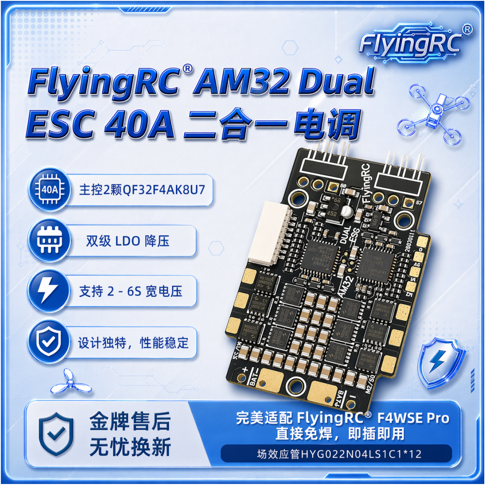

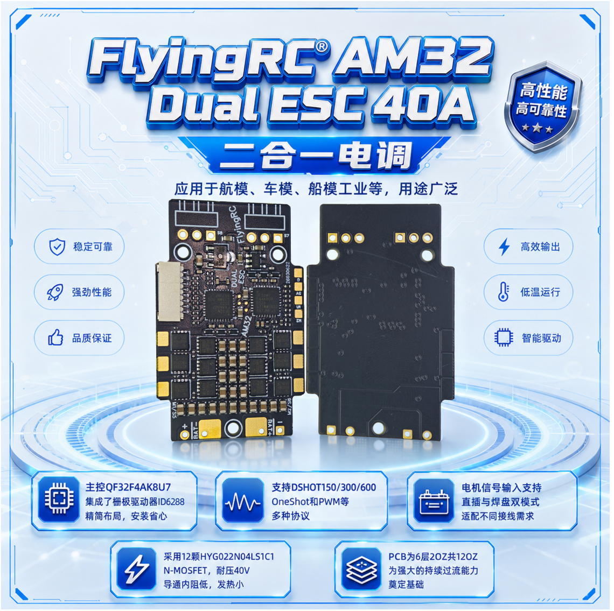

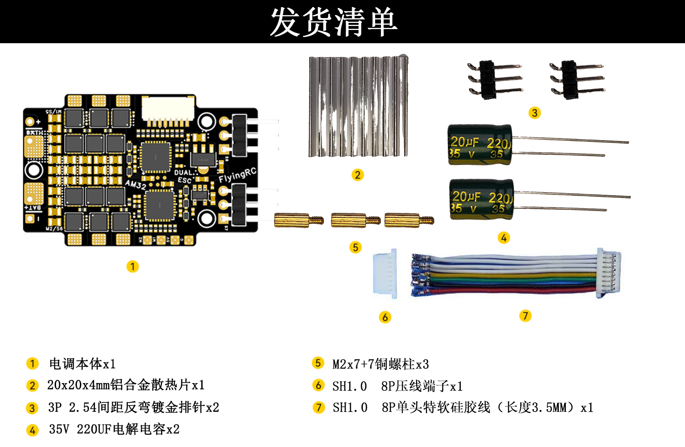

发货清单：1、电调本体x1

2、35V 220UF电解电容x2

3、20x20x4mm铝合金散热片x1

M2x7+7铜螺柱x3

SH1.0  8P单头特软硅胶线（长度3.5CM）x1

6、SH1.0  8P压线端子x1

7、3P 2.54间距反弯镀金排针x2

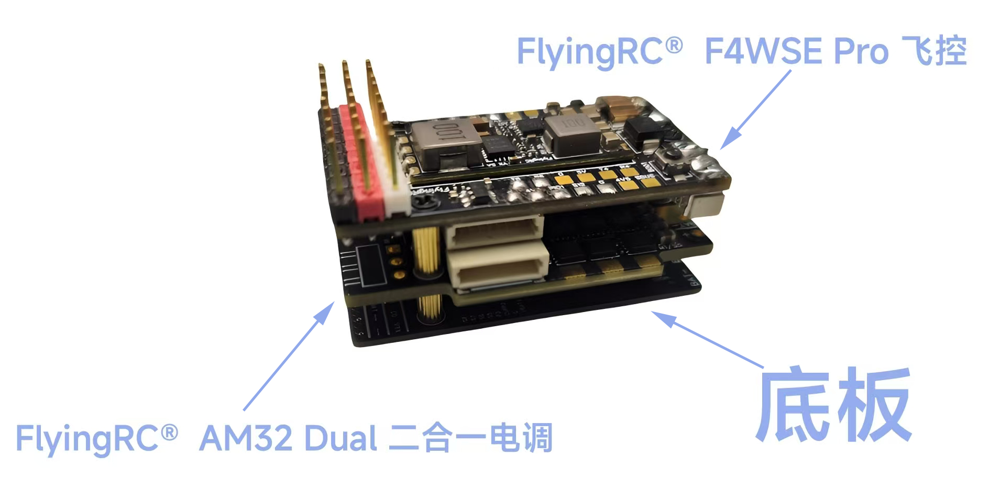

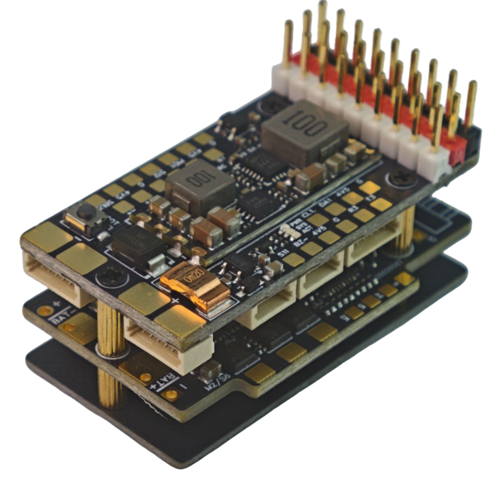

与Flying RC F4WSE PRO组装成飞塔图

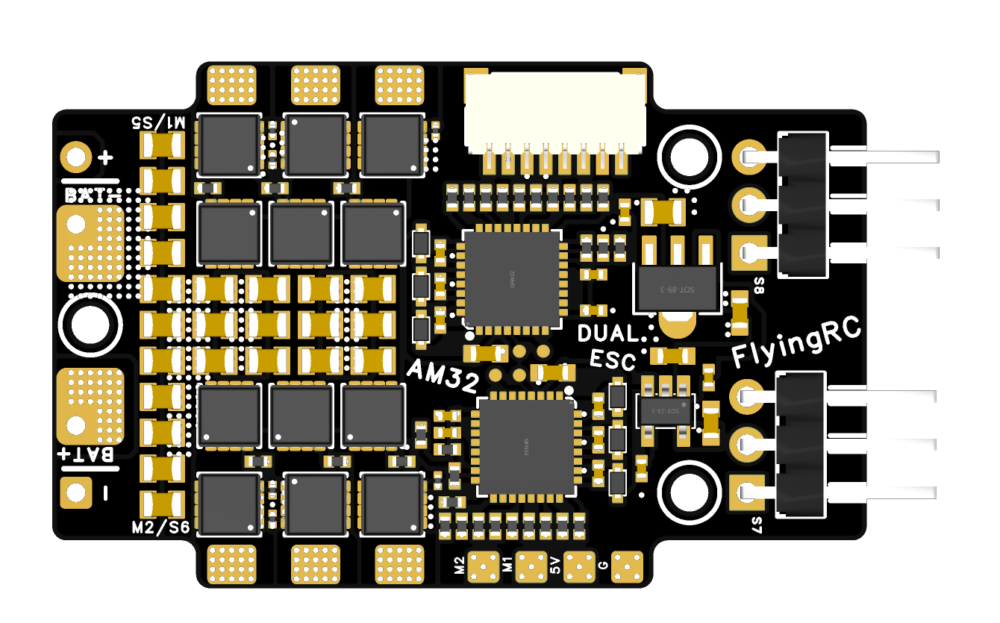

## 技术参数

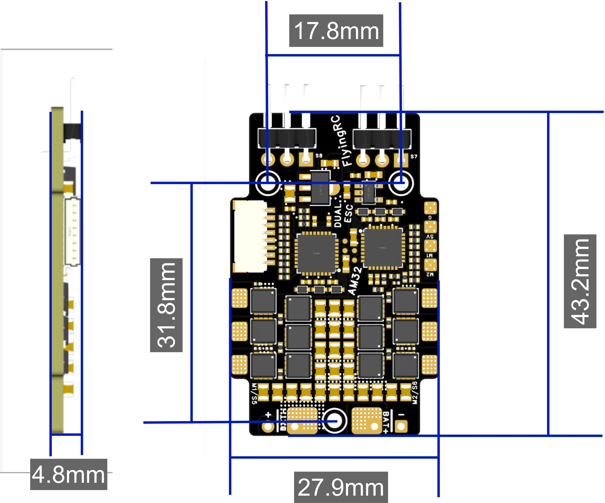

双主控(QF32F4AK8U7 × 2)，集成栅极驱动器ID6288;场效应管HYG022N04LS1C1×12；

支持正弦波启动，低速大扭矩；

支持DSHOT150、300、600，OneShot，PWM等多种协议；

6~30V DC IN（2~6S LiPo）；

尺寸及重量：43.2mm*27.9mm*4.8mm, 7.0g

厚铜板PCB，6层内外2oz共12oz；

## 基础参数

电压-电流

型 号

FlyingRC® Dual 40A ESC

VBAT供电范围

6-26V DC IN  2-6S LiPo

尺 寸

43.2mm*27.9mm*4.8mm

持续电流

40A (测试条件：4S)

质 量

7.0g

瞬间电流

50A 持续5秒 (测试条件：4S)

主要元件

固件

主控芯片

2×QF32F4AK8U7   32位

AM32

支持

主频

120MHz

控制信号输入

支持DSHOT150、300、600，OneShot，PWM等多种协议

Flash

64 KB

工作环境

RAM

16 KB

工作温度范围

-10-100℃

主控集成栅极驱动器

2×ID6288

存储温度范围

0-40℃

场效应管/MOS

12×HYG022N04LS1C1

## 产品特点

工艺

PCB 为 6 层 2oz 黑色阻焊，过孔塞树脂，盘中孔，沉金同类型产品中工艺最佳，为强大的持续过流能力奠定基础

### 精简布局

使用集成栅极驱动器的 MCU 减小非功率器件占用的 PCB 面积，增强了 PCB 的过流能力

场效应管 / MOS

采用 12 颗 HYG022N04LS1C1 N-MOSFET，导通内阻仅 2.0mR，耐压 40V（对于支持 6S 非常重要）

支持宽电压输入

采用双级 LDO 降压的方案为栅极驱动器及 MCU 供电，支持 2 - 6S 宽电压。

## 产品特点

使用集成栅极驱动器的MCU减小非功率器件占用的PCB面积，增强了PCB的过流能力。

AM32固件，开启正弦波启动与StallProtection后，低速扭矩大。

电机信号输入支持直插与焊盘双模式，适配不同接线需求。

采用12颗 HYG022N04LS1C1 N-MOSFET，导通电压仅2.0mR，耐压40V（对于支持6S非常重要），对比同类型电调采用的MOS导通内阻明显降低，发热减小显著。

采用双级LDO降压的方案为栅极驱动器及MCU供电，支持2~6S宽电压。对比同类型电调仅采用单LDO降压，发热更为集中，支持的电压仅最高4S。

PCB为6层2oz共12oz，是同类型产品中工艺最佳的，为强大的持续过流能力奠定基础。PCB正负极过流处均有开窗设计，辅助散热。

## 三、使用方法

### 1.布局/LAYOUT：

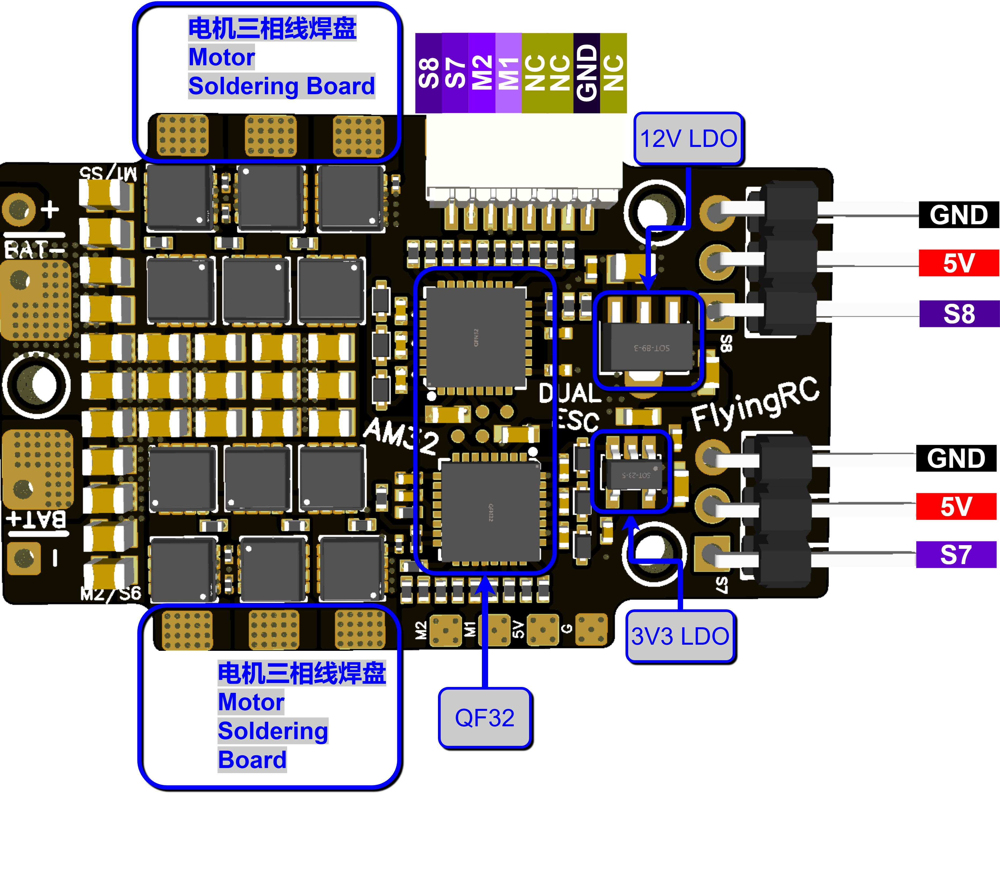

正面3D渲染示意图

除电机三相线焊盘外的焊盘定义

焊盘序号

焊盘名称

焊盘定义

1

BAT+

接电池/电容正极

2

BAT-

接电池/电容负极

3

+

接电容正极

4

-

接电容负极

5

M2

PWM/Dshot 信号输入

6

M1

PWM/Dshot 信号输入

6

G

GND（负极）

电调焊接视频请点击：焊接视频教程

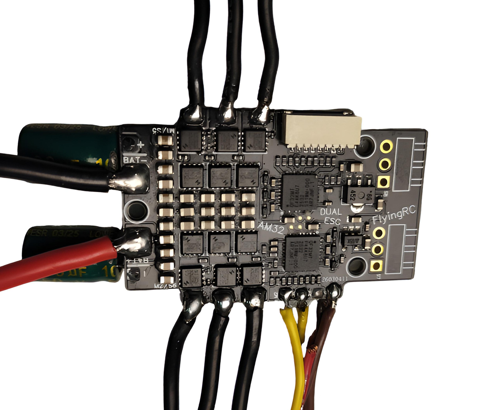

焊接后展示

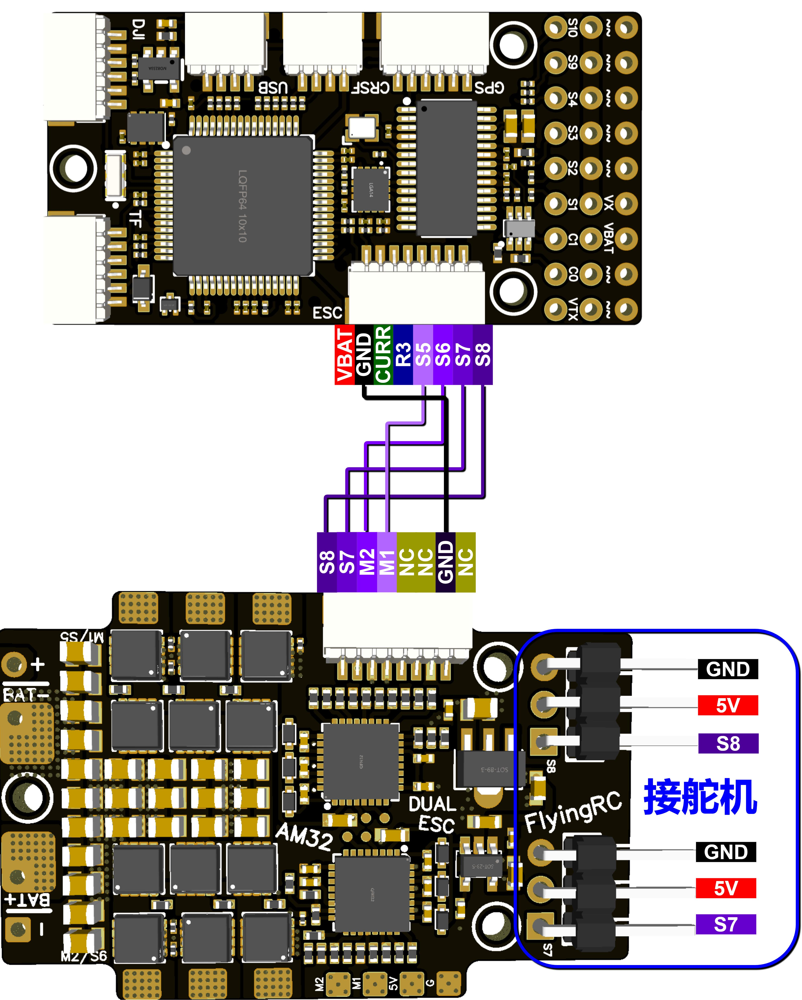

### 与Flying RC F4WSE PRO接线图

**2.更新固件说明**

使用电调调参软件时请关闭BF地面站以释放飞控端口。电调调参/烧录固件时需要链接动力电池供电，请取下螺旋桨。

请在群文件内下载AM32-ESC-Tools，解压到本地，双击打开SerialPortConnector.exe。

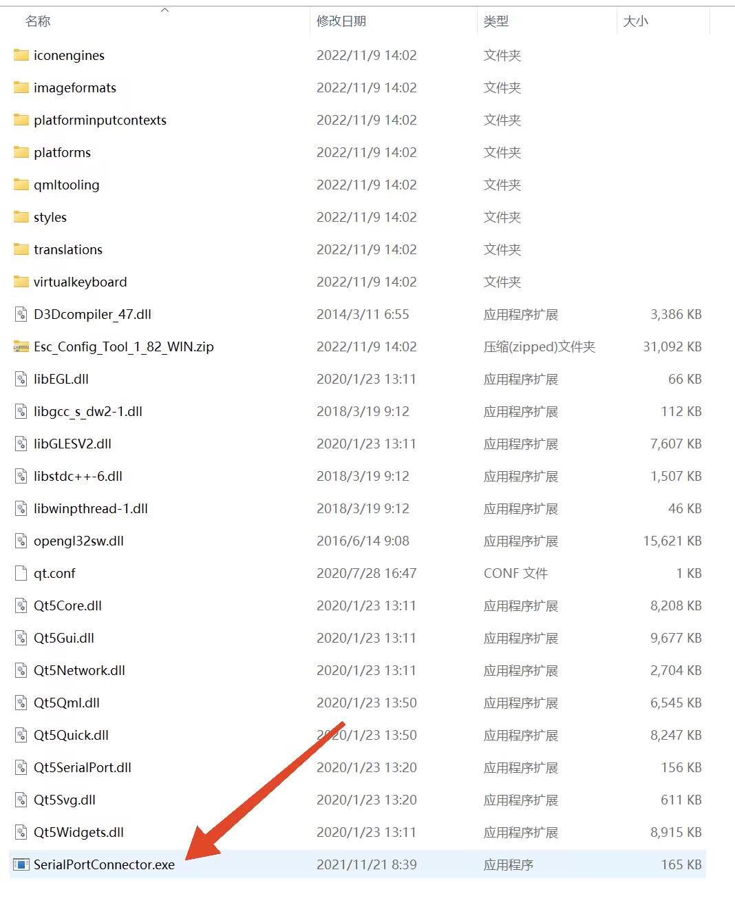

在电调调参软件右下角找到飞控对应端口编号（COMx），点击Connect，此时若无错误提示，电调调参软件成功连接飞控。

烧录固件前，请提前下载好电调的新版本固件，固件下载链接（github，或群文件内下载）AM32_F4A_4IN1_F421

电调调参软件：点击“Flash”（烧录页面）。

点击M1，“Load Firmware”，在弹出框中找到下载好的新版电调固件，双击确认。点击“Flash Firmware”，耐心等待进度条走完。点击“Send Defalut Settings”以恢复电调默认参数，*跨多版本更新固件时建议不要省略此步骤。

为M2，M3，M4重复上述步骤。

FlyingRC®出厂攀爬车参数截图：

### 攀爬车参数

注意！请勿使用网页版调参软件，更新固件时有可能导致电调MCU损坏，已经发现多起案例，这种情况下需要返厂付费维修。

**3.参数设置**

调参软件及如何连接见2.更新固件说明

参数解说图

主要参数：

KV值：需调整至电机KV值附近，与实际KV值偏差不超过30%。KV值设置偏差如超过100% 可能会导致电机不能正常旋转，甚至导致电调硬件损坏。

进角：禁止调整。熟练玩家可通过调整进角使电机效率更高，但错误调整进角会导致电调损坏，并且这种损坏通常是无法维修的。

失速保护：若使用低KV值电机（KV值<500），可开启，或开启正弦波启动需开启此选项。

正弦波启动：对于常见的穿越机，无需启用。

备注：

所有电调均出厂前刷写最新正式版AM32固件，并通过多电压旋转测试。

出厂固件为AM32 2.8/2.18版本，目前最新稳定版为2.18，固件下载连接，需要使用离线版调参工具刷写固件；

电调在运行过程中存在显著的产热现象，为确保其高效散热，禁止包覆热缩膜和防水处理，此类防护手段易会阻碍电调与外界的热交换，由此造成的损坏不在保修范围。

当电调工作环境参数（如温度、湿度、气压、通风性等）偏离额定工况时，其内部功率器件的载流能力将受到限制，最大持续工作电流将低于标称值。为保障电调稳定可靠运行，必须采取足够的散热措施。

注意电调安装时不要与其它导体（碳纤维板，电池插头，其他电路板）相连，以免造成外部短路导致损坏。

## 四、技术问题咨询

若遇技术问题，建议先查阅产品说明书；也可前往AI平台、B站等渠道获取帮助。同时欢迎群友互相协助，分享已知解决方案。

维修服务

保修服务期限及内容

·  已焊接产品、人为损坏不享受免费保修。

·  配套易损配件不在保修范围内，可至 FlyingRC® 淘宝店另行购买。

若首次使用后没有发现产品存在问题，视为产品性能正常，不存在质量问题。后续使用中出现任何问题，视为用户不规范操作的所致。FlyingRC®提供两种售后服务供用户选择。

适用条件：用户购买产品1年内，可享受1次优惠以旧换新，需寄回故障产品。

折扣规则：按淘宝店正常售价7折购买全新同款同配置产品；换新品不再享受维修和售后服务。

付费维修寄送要求：

客户寄修前请先电话或微信联系工作人员，说明电路损坏原因与故障情况，确认是否可修。

产品寄出后，请主动提供运单号。未与维修工程师沟通直接寄回，若出现快递丢失、无法维修等情况，损失由客户自行承担。

随货请附纸条，注明：产品具体故障、故障原因、操作过程，并填写联系方式、回寄地址。拒收顺丰及到付件。

未附纸条导致无法联系、无法维修的，后果由客户承担。客户超过 3 个月未联系的，产品将按无主件报废处理。

因客户参数设置错误导致产品异常，工程师重新刷固件或校正参数的，将收取检测费 10–20 元。

维修内容

项目编号

更换芯片型号

材料费+手工费=维修费

飞控主控

1

STM32F405RGT6

30+15=45

2

STM32H743VIT6

50+30=80

3

STM32H743VIH6

65+45=110

电调主控

4

QF32F4AK8U7

8+10=18

5

AT32F421K8U7

6+10=16

飞控传感器

6

ICM-42688-P

70+12=82

7

ICM-42605

50+12=62

8

SPL06

4+10=16

9

DPS310/DPS368

25+12=37

飞控电源芯片

10

MP9943

7+10=17

11

MP9447

10+10=20

12

MP9942

8+10=18

13

LM25148

26+15=41

14

LDO

4+5=9

电调场效应管

15

IRF7480

5+5=10

16

HYG022N04LS1C1

3+5=8

其它元器件

17

电阻、电容、插座等

2+5=7

注：表格里是单一原件维修价格。

请注意：自行维修、打胶、PCB烧坏/击穿（全部芯片烧毁）和进水（元器件/PCB腐蚀）的飞控没有继续使用和维修价值，FlyingRC®不提供维修服务,客户可以选择7折以旧换新。

FlyingRC® 其它产品介绍

**1. 飞控类38**

**2. 电调类41**

**3. 飞塔类43**

4. BEC 降压电路类47

5. 模块类49

6. 其他类50

飞控类

全新升级、功能更强

FlyingRC官方零售价：140元

中文说明书   Product Manual   去淘宝购买

经典产品、设计独特、好评如潮

中文说明书  Product Manual

性能强劲，双陀螺仪

FlyingRC官方零售价：299元

中文说明书  Product Manual

性能强劲，双陀螺仪,BEC输出能力强

FlyingRC官方零售价：259元

中文说明书  Product Manual  去淘宝购买

2025年 爆款产品,设计感爆棚,全网最Mini

FlyingRC官方零售价：89元

中文说明书   Product Manual  去淘宝购买

全新升级、功能更强

FlyingRC官方零售价：269元/299元

中文说明书 Product Manual 去淘宝购买

算力强大 飞行稳定精准 接口丰富 操控自如

中文说明书   Product Manual

算力强大 飞行稳定精准 接口丰富 操控自如

FlyingRC官方零售价：129元

中文说明书   Product Manual  去淘宝购买

电调类

本店销量No.4

高端产品,英飞凌金封MOS,工艺最佳,单路持续75AFlyingRC官方零售价：269元

中文说明书 Product Manual 去淘宝购买

性能出色，性价比高，入门首选

FlyingRC官方零售价：149元

中文说明书 Product Manual  去淘宝购买

设计独特，独家产品 用于无人机等空中、陆地、水上双动力设备    FlyingRC官方零售价：89元

中文说明书 Product Manual 去淘宝购买

英飞凌金封MOS 工艺出色 过流能力强大

FlyingRC官方零售价：87元（不带BEC版本）

中文说明书 Product Manual 去淘宝购买

客户可以用自己的功率板，制作不同规格电调

FlyingRC官方零售价：47元

中文说明书 Product Manual 去淘宝购买

超Mini 用于小型和微型机 过流能力强 运行稳定 FlyingRC官方零售价：43元

中文说明书 Product Manual 去淘宝购买

飞塔类

H743穿越机飞控+四合一穿越机75A金封电调

专业飞行首选，旗舰用料工艺，良心价格

FlyingRC官方零售价：528元

飞控中文说明书   电调中文说明书

FC Product Manual  ESC Product Manual

去淘宝购买

F405穿越机飞控+四合一穿越机75A金封电调

爆款组合，性能出色，良心价格

FlyingRC官方零售价：398元

飞控中文说明书    电调中文说明书

FC Product Manual ESC Product Manual

去淘宝购买

H743穿越机飞控+四合一穿越机45A电调

爆款组合，性能出色，价格亲民

FlyingRC官方零售价：408元

飞控中文说明书     电调中文说明书

FC Product Manual  ESC Product Manual

去淘宝购买

F405穿越机飞控+四合一穿越机45A电调

爆款组合，实惠之选，价格亲民

FlyingRC官方零售价：278元

飞控中文说明书     电调中文说明书

FC Product Manual  ESC Product Manual

去淘宝购买

F4WSE PRO飞控+二合一40A电调

独特设计、独家产品、爆款组合

FlyingRC官方零售价：237元

飞控中文说明书      电调中文说明书

FC Product Manual   ESC Product Manual

去淘宝购买

BEC 降压电路类

多电压可选 行业首选，物美价廉

FlyingRC官方零售价：74元

中文说明书 Product Manual 去淘宝购买

多电压可选 行业首选，物美价廉

FlyingRC官方零售价：36元

中文说明书 Product Manual 去淘宝购买

多电压可选，持续5A输出

FlyingRC官方零售价：17元

中文说明书  Product Manual  去淘宝购买

独立降压，稳定供电，让飞行更安全

FlyingRC官方零售价：18元

中文说明书  Product Manual  去淘宝购买

模块类

超高分辨率、低功耗、行业首选

FlyingRC官方零售价：129元

中文说明书  Product Manual  去淘宝购买

行业首选，物美价廉

FlyingRC官方零售价：199元

中文说明书 Product Manual 去淘宝购买

其他类

行业首选，物美价廉

FlyingRC官方零售价：109元

中文说明书  Product Manual 去淘宝购买

真分集接收,温度补偿，高功率接收

FlyingRC官方零售价：109元

中文说明书  Product Manual  去淘宝购买

支持BL，BL32，AM32 简单好用

FlyingRC官方零售价：9.9元/7.9元（A口/C口）焊好

FlyingRC官方零售价：6.9元/5.9元（A口/C口）自己焊

中文说明书 Product Manual 去淘宝购买

一体设计，全网最Mini MS4525D协议，I2C接口

FlyingRC官方零售价：95元

中文说明书  Product Manual  去淘宝购买

一体设计，全网最Mini MS4525D协议，I2C接口

FlyingRC官方零售价：    95元

中文说明书  Product Manual  去淘宝购买

一体设计，全网最Mini MS4525D协议，I2C接口

FlyingRC官方零售价：39元

中文说明书  Product Manual  去淘宝购买

长距离传输，高速率，稳定性强

FlyingRC官方零售价：46元

中文说明书  Product Manual  去淘宝购买

支持各种开源飞控 多尺寸可选 搜星能力强 性价高

FlyingRC官方零售价：68元(18*18mm款)

中文说明书  Product Manual  去淘宝购买

FlyingRC®官网

www.FlyingRC®.cn

淘宝店铺

闲鱼店铺

群号1016199449

电话:021-58204886 手机:13122492475   微信:13122492475、18019464804

---

## AM32 固件与调参

--8<-- "shared/esc/am32-setup.md"

---

## 电机转向与协议

--8<-- "shared/esc/motor-direction.md"

---

## 安全须知

--8<-- "shared/safety.md"

---

## 焊接注意

--8<-- "shared/soldering.md"

---

## 首次使用检查

--8<-- "shared/first-use-check.md"

---

## 技术支持

--8<-- "shared/support.md"

---

## 售后与保修

--8<-- "shared/warranty.md"

---

## FlyingRC® 其它产品

--8<-- "shared/other-products.md"

---

## 免责声明

--8<-- "shared/disclaimer.md"

