# FlyingRC® F435Wing Mini固定翼飞控产品手册

> 状态：在售 · 类别：flight-controller · 内容自原 WPS 说明书迁入

---

## 一、FlyingRC介绍

## 二、产品概述

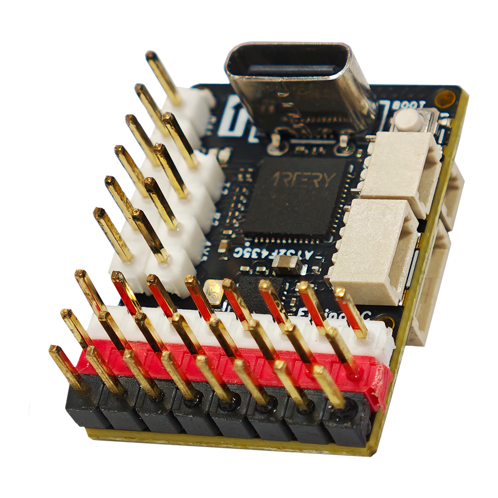

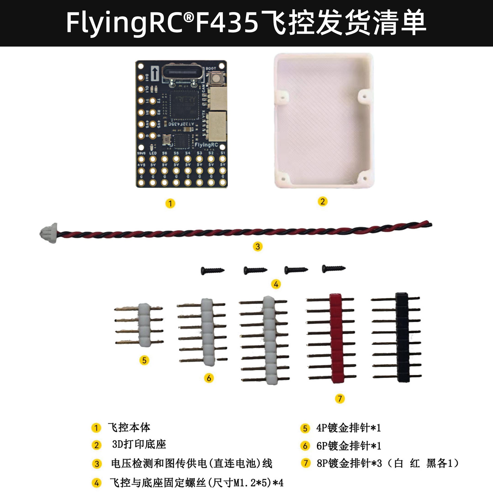

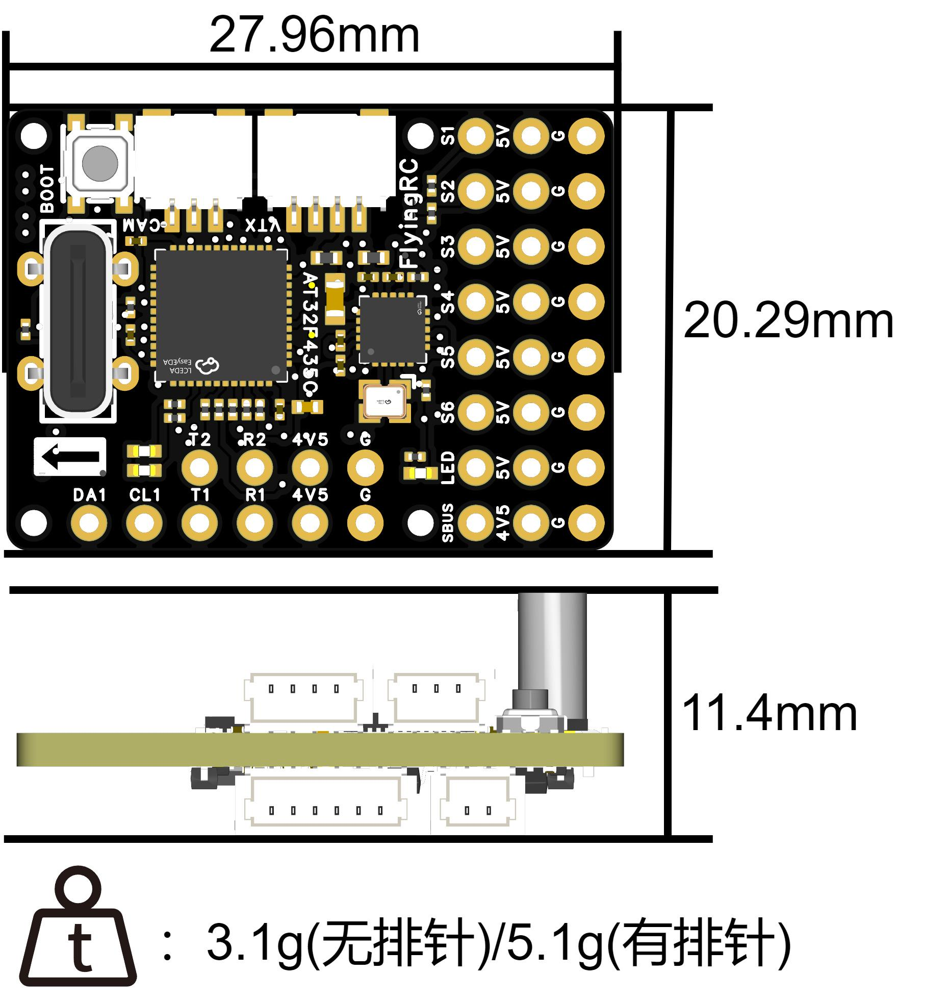

## 基础参数

传  感  器

型      号

FlyingRC® F435Wing Mini

IMU(陀螺仪和加速度计)

BMI270

尺      寸

27.96mm*20.29mm*11.4mm

气 压 计

SPA06-003

安  装 孔

17.8mm*17.8mm  M1.2

磁 力 计

无

未焊排针质量

**3.1g**

模拟OSD

AT7456F

焊好排针质量

5.1g

焊好排针+底座质量

6.1g

主       控

电源输出

主控芯片

AT32F435CGU7（CMU7）

板载降压模块 BEC

无

主频

288 MHz

Flash

1MB（4MB）

RAM

384k

接       口

固件支持

UART

3组串口（UART1，UART4 - DJI高清图传接口，UART5）

INAV

支持

PWM

7（其中一个为LED接口）

Ardupilot

不支持

I2C

1

Betaflight

不支持

电流 ADC 采样

无

PX4

不支持

SWD 调试

无

蜂鸣器接口

1

工作环境

LED 灯带接口

支持WS2812

VBAT 供电范围

**2.5-30V，1-6S LiPo**

USB - TYPE - C

板载直插

电  源  输  入

5V

黑匣子存储

无

工作温度范围

-10-100℃

SBUS

1

存储温度范围

0-40℃

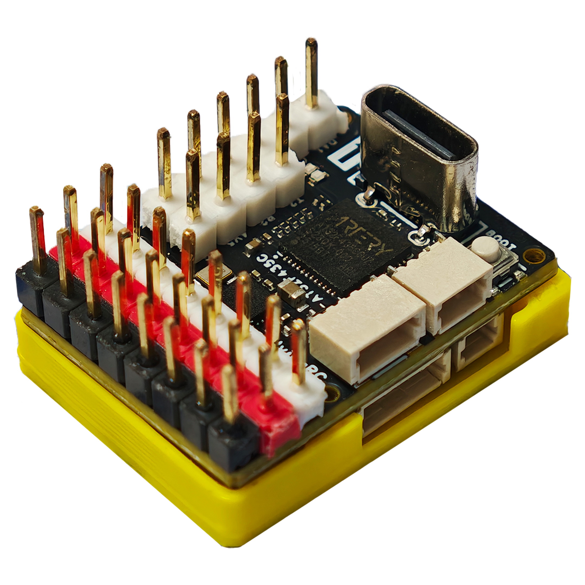

焊排针，安装底座

新品上市，收货后发3图30字以上好评返现金40元，限22个名额。

与FlyingRC® F4WING Mini飞控相比增加了如下功能：

1.采用国产AT F435主控，主频更高、SRAM大一倍

2.业内首家采用全新的迷你OSD AT7456F芯片，支持模拟图传

**3.增加了无源蜂鸣器接口**

## 技术参数

主控：AT32F435CGU7

BMI270陀螺仪

SPA06-003气压计

板载双LDO，传感器独立供电，飞行更稳定。

HD OSD，3*UARTs，1*SBUS，6*PWM，1*I2C

电流计：外置I2C电流计

模拟OSD：AT7456F

电压计：2.5~30V，1~6S LiPo

电源输入：5V

尺寸27.9mm*20.3mm*11.4mm

重量：3.1g（未焊排针）、5.1g（焊好排针）

## 产品特点

超Mini体积：27.9*20.3*11.4mm，仅重3.1克（不含排针，焊完排针后约5.1克）。

适用于小型及微型固定翼机型，包括F80、微爪等专用机型，以及Arwing Mini等改装手抛机。

支持模拟OSD图传

AT32F435C8U76主控，288Mhz主频，256KB Flash。

BMI270陀螺仪，第三代TDK传感器，专为固定翼无人机应用优化。

SPA06气压计，国产高精度气压计。

板载双LDO，传感器独立供电，飞行更稳定。

7PWM输出，3.5串口（SBUS只能算半个串口）。

TypeC接口直插飞控，连接稳定，寿命更长，可通过双C线连接手机，通过手机版地面站调参（AP固件建议使用QGroundControl App）。

无模拟电流计功能（可以外接I2C协议电流计），SH1.0 2P接口支持电池电压输入，电池电压仅为高清图传直插端口供电，最高支持6s；

飞控需要5V外部供电。

支持高清直插（SH1.0 6P接口），高清OSD（大疆高清，蜗牛高清，OpenIPC等），支持模拟OSD。

可直插ELRS接收机，极致减小体积。

支持INAV固件。

嘉立创量产SMT，PCB工艺：黑色阻焊，沉金，树脂塞孔，4层板

## 三、使用方法

请注意：安装时C口朝向机头方向

### 布局/LAYOUT

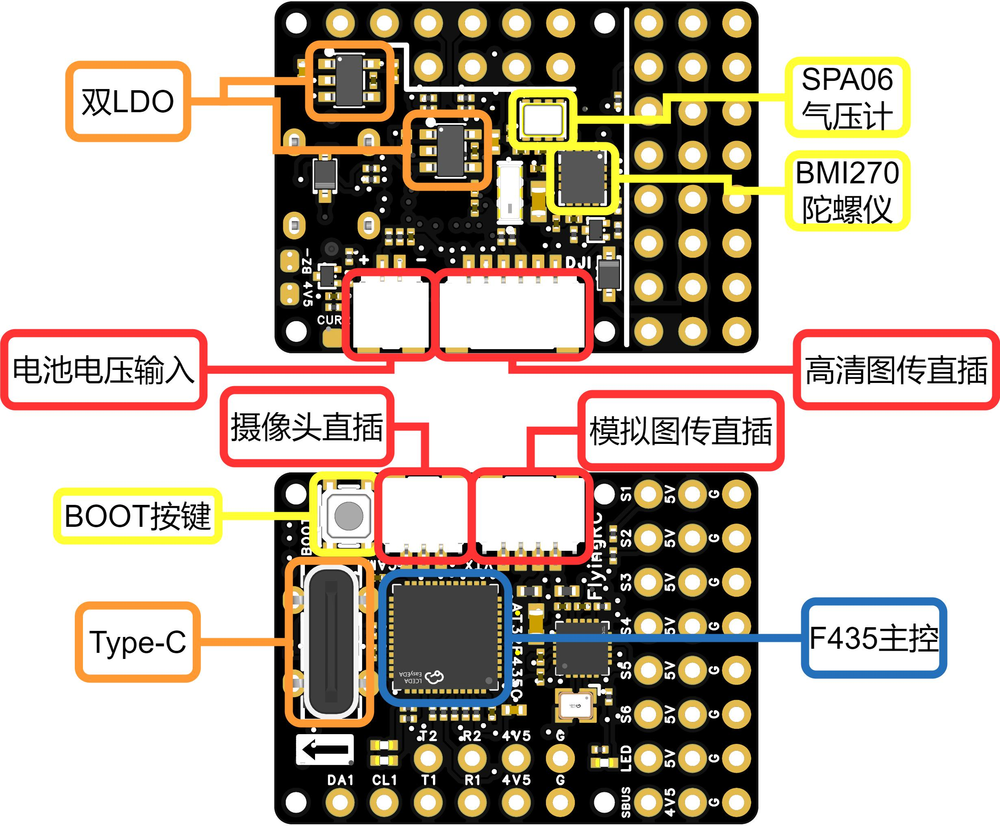

飞控3D示意图-反面

连接器功能示意图

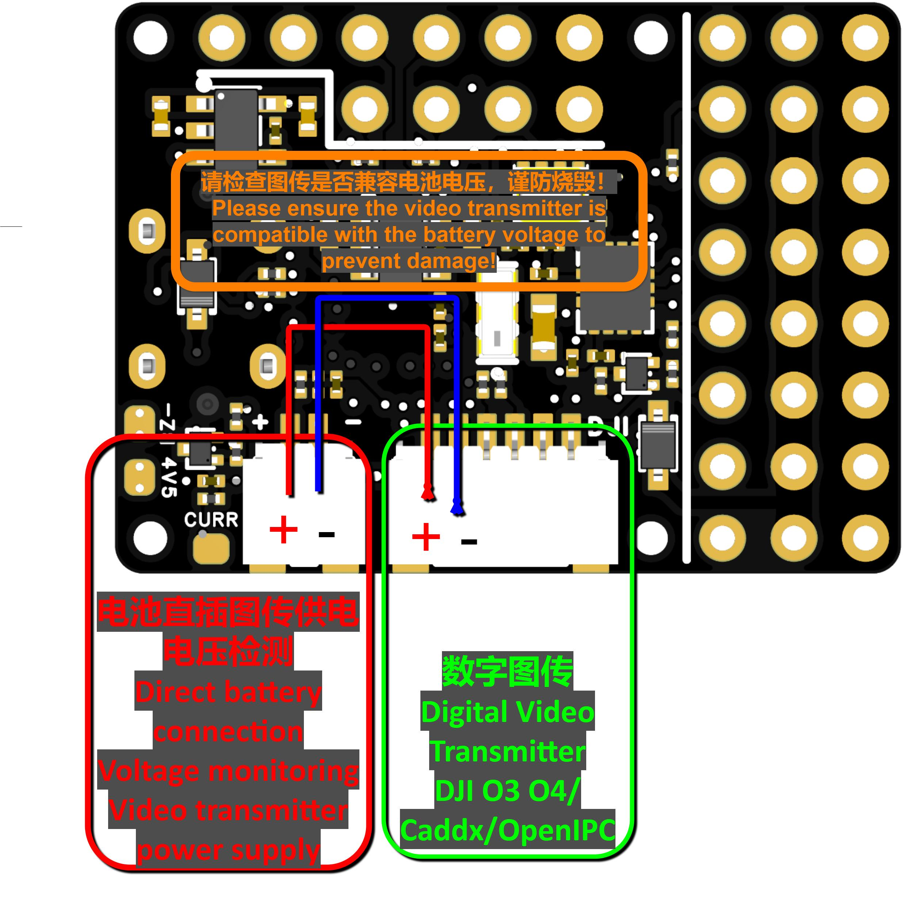

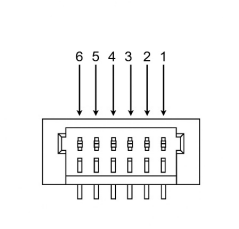

**1.电池电压输入引脚定义**

引脚序号

引脚名称

引脚定义

1

-

接电池负极

2

+

接电池正极，仅飞控供电与电压传感器监测

**2.高清图传直插引脚定义**

引脚序号

引脚名称

引脚定义

1

SBUS

DJI SBUS遥控信号输入 (UART2)

2

G

GND （负极）

3

R4

OSD MSP RX (UART4)

4

T4

OSD MSP

5

G

GND （负极）

6

V

电池直连供电

### 飞控接线及固件

AP固件具体设置请参考飘飘大佬教程：FlyingRC® F4Wing Mini MK1飞控

使用ArduPilot固件固定翼调参保姆教程

固定翼推荐使用ArduPlane固件及INAV固件，出厂默认已经刷好ArduPlane固件，固件请在官方QQ群文件或官网内下载

点击链接下载固件：Open-firmware UAV hardware | FlyingRC Official

固件可通过地面站如：Mission Planner刷写

下面接线会使用AP固件举例。

### 外置独立BEC完整接线示意图

（SBUS接收机或ELRS接收机，带罗盘GPS，高清图传）

外置独立BEC可以选择店内售卖的FlyingRC® 5A BEC V1

插口功能定义表

丝印

插口

定义

功能

说明

DJI

数字图传

VCC

图传电源输入

主供电，直接接动力电池正极

GND

图传地

主功率地，与动力电池负极相连

TX

串口发送 TX

飞控→图传下行数据

RX

串口接收 RX

图传→飞控上行回传数据

GND

信号参考地

图传信号专用地线，抗干扰

SBUS

SBUS 遥控信号输入

接收机 SBUS 信号线接入，接收遥控器指令

+-

电源输入

+

电源正极

直接连接电池，注意图传是否兼容电池电压

-

电源负极

直接连接电池，注意图传是否兼容电池电压

排针功能定义表（MCU左侧）

功能

丝印

定义

功能

说明

GPS（I2C）

DA1

SDA

I2C 数据总线

连接板载 / 外置电子罗盘，读取地磁航向数据

CL1

SCL

I2C 时钟总线

罗盘 I2C 通信时钟信号

T5

TX

串口 5 发送 TX

飞控 TX→GPS 模块 RX，下发配置指令

R5

RX

串口 5 接收 RX

GPS 模块 TX→飞控 RX，读取定位坐标数据

4V5

4V5

GPS 模块供电

4.5V 稳压输出，给 GPS供电

GND

GND

GPS 模块地

GPS接地

CRSF接收机

T1

TX

串口 1 发送 TX

飞控 TX→接收机 模块 RX，下发指令

R1

RX

串口 1 接收 RX

接收机 模块 TX→飞控 RX，读取数据

4V5

4V5

接收机 模块供电

4.5V 稳压输出，给 接收机供电

GND

GND

接收机 模块地

接收机接地

排针功能定义表（MCU下侧）

功能

丝印

定义

功能

说明

SBUS接收机

SBUS

SBUS

SBUS 遥控信号

**3.3V 稳压电源，给存储卡模块供电**

4V5

4V5

接收机 模块供电

4.5V 稳压输出，给 接收机供电

G

GND

接收机 模块地

接收机接地

5V供电

S1

——

——

5V

5V

5VBEC输入>飞控供电

GND

GND

接地

电机&舵机

S2-S6/S12

S2-S6/S12

电机&舵机信号

5V

5V

电机&舵机供电

G

GND

接地

### 电调内置BEC完整接线图

（SBUS接收机或ELRS接收机，带罗盘GPS，高清图传）

注意电调BEC输出需要>3A；

3A BEC 可为2-3个9克舵机供电；5A BEC可为4-5个9克舵机供电

可以选择店内售卖的FlyingRC® 75A ESC V2.5 (带BEC版)，板载4.5A BEC

PWM输出功能

Group1

PWM  5V

tolerant I/O

S1

PWM1 GPIO50

TIM8_CH4

DMA/DShot

S2

PWM2 GPIO51

TIM8_CH3

DMA/DShot

Group2

S3

PWM3 GPIO52

TIM1_CH3N

DMA/DShot

S4

PWM4 GPIO53

TIM1_CH1

DMA/DShot

Goup3

S5

PWM5 GPIO54

TIM2_CH4

DMA/DShot

S6

PWM6 GPIO55

TIM2_CH3

DMA/DShot

Goup7

LED pad

PWM12 GPIO61

TIM3_CH4

DMA/DShot

SERVO12_FUNCTION 120, NTF_LED_TYPES neopixel

输出通道对DShot与常规PWM混合工作模式设有分组限制：即对某一分组内的任一输出通道启用DShot协议时，该分组下所有输出通道均需统一配置并作为DShot通道使用，不可与PWM通道混用。

若同一分组内同时接入舵机与电机，需确保该分组按照舵机规格参数运行最低PWM频率。例如：若舵机最高支持50Hz，则该分组下的电调也必须工作在50Hz。

S12端口可接LED，通过WS2812灯带显示飞控状态（AP固件）

同组（Group）的PWM端口不可同时用于Dshot电调和50Hz PWM舵机

全部接口均可用于DSHOT

串口映射

UART 5V tolerant I/O

USB

USB

console

SERIAL0

TX1 RX1

USART1

with DMA

RC input/Receiver

SERIAL1

TX5 RX5

UART5

NO DMA

GPS1

SERIAL3

TX4 RX4

UART4

NO DMA

MSP OSD

SERIAL4

SBUS

USART2

with DMA

NOT Available

SERIAL6

BRD_ALT_CONFIG 0 Default

Sbs pad

SBUS

Ardupilot固件UART/USART与SERIAL对应关系，及其默认功能

飞控反面高清直插接口的串口为RX4，TX4（Serial4）

推荐设备连接：ELRS接RX1，TX1（Serial1），GPS接RX5，TX5（Serial3）

I2C设备

I2C

I2C1

5V tolerant I/O

Compass

COMPASS_AUTODEC

1

onboard Baro SPL06 - 001

Address

0x76

Digital Airspeed I2C

ARSPD_BUS

1

MS4525

ARSPD_TYPE

1

DLVLR - L10D

ARSPD_TYPE

9

内置气压计占用0x76地址，不可在外部接入任何地址为0x76的设备

排针焊接指导

工具及耗材准备：

数控烙铁/焊台（推荐T12系列或者936系列），焊锡丝（推荐63%含锡量），排针若干（飞控内包含）

焊接指导视频：【FlyingRC® F4Wing Mini 排针焊接演示视频-哔哩哔哩】

焊接Tips：

烙铁刀头比尖头焊接更方便；

不要在焊锡上省钱，好的焊锡比好的烙铁更重要！

当然有一把好的烙铁也很重要，可以选择T12烙铁；

如果锡的流动性变差，可以加焊油（淘宝搜索BGA焊油，可以买安立信品牌）；

注意焊接时不要黏连焊点周围得元器件；

推荐选择焊好排针选项。

备注：信号线需使用硅胶线，飞控接线端子型号为SH1.0，体积较小，插拔时请用手抵住插座后部，以防插座受力脱落。

## 四、技术问题咨询

若遇技术问题，建议先查阅产品说明书；也可前往AI平台、B站等渠道获取帮助。同时欢迎群友互相协助，分享已知解决方案。

请注意：本产品仅Ardupilot固件提供有限技术支持，INAV，BF无技术支持

## 五、维修服务

保修服务期限及内容

·  已焊接产品、人为损坏不享受免费保修。

·  配套易损配件不在保修范围内，可至 FlyingRC® 淘宝店另行购买。

适用条件：用户购买产品1年内，可享受1次优惠以旧换新，需寄回故障产品。

折扣规则：按淘宝店正常售价7折购买全新同款同配置产品；换新品不再享受维修和售后服务。

## 六、FlyingRC® 其它产品介绍

**1. 飞控类38**

**2. 电调类41**

**3. 飞塔类43**

4. BEC 降压电路类47

5. 模块类49

6. 其他类50

飞控类

全新升级、功能更强

FlyingRC官方零售价：140元

中文说明书   Product Manual   去淘宝购买

经典产品、设计独特、好评如潮

中文说明书  Product Manual

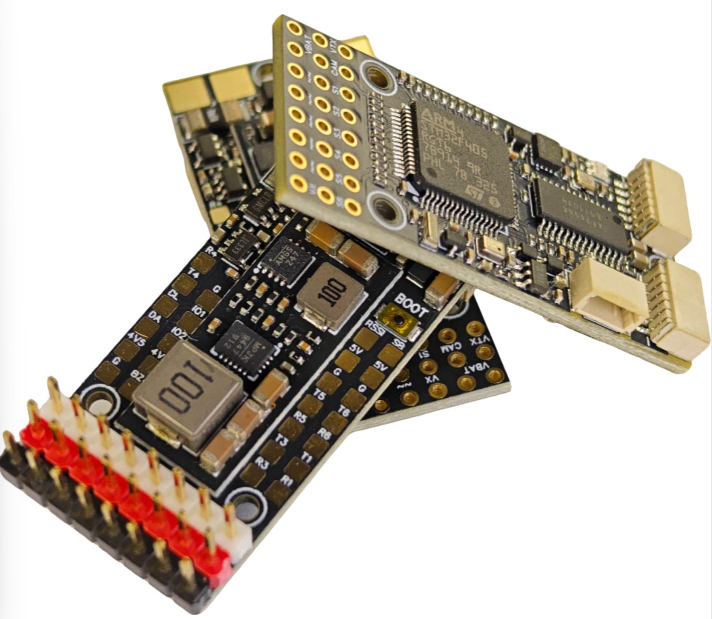

性能强劲，双陀螺仪

FlyingRC官方零售价：299元

中文说明书  Product Manual

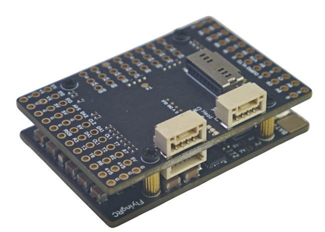

性能强劲，双陀螺仪,BEC输出能力强

FlyingRC官方零售价：259元

中文说明书  Product Manual  去淘宝购买

2025年 爆款产品,设计感爆棚,全网最Mini

FlyingRC官方零售价：89元

中文说明书   Product Manual  去淘宝购买

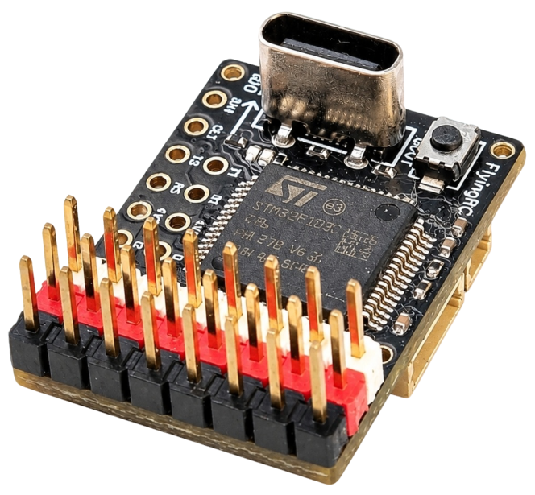

全新升级、功能更强

FlyingRC官方零售价：269元/299元

中文说明书 Product Manual 去淘宝购买

算力强大 飞行稳定精准 接口丰富 操控自如

中文说明书   Product Manual

算力强大 飞行稳定精准 接口丰富 操控自如

FlyingRC官方零售价：129元

中文说明书   Product Manual  去淘宝购买

电调类

本店销量No.4

高端产品,英飞凌金封MOS,工艺最佳,单路持续75AFlyingRC官方零售价：269元

中文说明书 Product Manual 去淘宝购买

性能出色，性价比高，入门首选

FlyingRC官方零售价：149元

中文说明书 Product Manual  去淘宝购买

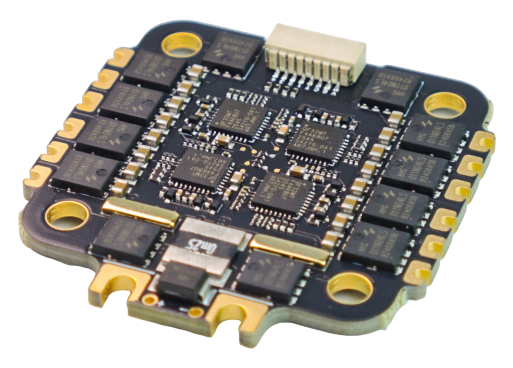

设计独特，独家产品 用于无人机等空中、陆地、水上双动力设备    FlyingRC官方零售价：89元

中文说明书 Product Manual 去淘宝购买

英飞凌金封MOS 工艺出色 过流能力强大

FlyingRC官方零售价：87元（不带BEC版本）

中文说明书 Product Manual 去淘宝购买

客户可以用自己的功率板，制作不同规格电调

FlyingRC官方零售价：47元

中文说明书 Product Manual 去淘宝购买

超Mini 用于小型和微型机 过流能力强 运行稳定 FlyingRC官方零售价：43元

中文说明书 Product Manual 去淘宝购买

飞塔类

H743穿越机飞控+四合一穿越机75A金封电调

专业飞行首选，旗舰用料工艺，良心价格

FlyingRC官方零售价：528元

飞控中文说明书   电调中文说明书

FC Product Manual  ESC Product Manual

去淘宝购买

F405穿越机飞控+四合一穿越机75A金封电调

爆款组合，性能出色，良心价格

FlyingRC官方零售价：398元

飞控中文说明书    电调中文说明书

FC Product Manual ESC Product Manual

去淘宝购买

H743穿越机飞控+四合一穿越机45A电调

爆款组合，性能出色，价格亲民

FlyingRC官方零售价：408元

飞控中文说明书     电调中文说明书

FC Product Manual  ESC Product Manual

去淘宝购买

F405穿越机飞控+四合一穿越机45A电调

爆款组合，实惠之选，价格亲民

FlyingRC官方零售价：278元

飞控中文说明书     电调中文说明书

FC Product Manual  ESC Product Manual

去淘宝购买

F4WSE PRO飞控+二合一40A电调

独特设计、独家产品、爆款组合

FlyingRC官方零售价：237元

飞控中文说明书      电调中文说明书

FC Product Manual   ESC Product Manual

去淘宝购买

BEC 降压电路类

多电压可选 行业首选，物美价廉

FlyingRC官方零售价：74元

中文说明书 Product Manual 去淘宝购买

多电压可选 行业首选，物美价廉

FlyingRC官方零售价：36元

中文说明书 Product Manual 去淘宝购买

多电压可选，持续5A输出

FlyingRC官方零售价：17元

中文说明书  Product Manual  去淘宝购买

独立降压，稳定供电，让飞行更安全

FlyingRC官方零售价：18元

中文说明书  Product Manual  去淘宝购买

模块类

超高分辨率、低功耗、行业首选

FlyingRC官方零售价：129元

中文说明书  Product Manual  去淘宝购买

行业首选，物美价廉

FlyingRC官方零售价：199元

中文说明书 Product Manual 去淘宝购买

其他类

行业首选，物美价廉

FlyingRC官方零售价：109元

中文说明书  Product Manual 去淘宝购买

真分集接收,温度补偿，高功率接收

FlyingRC官方零售价：109元

中文说明书  Product Manual  去淘宝购买

支持BL，BL32，AM32 简单好用

FlyingRC官方零售价：9.9元/7.9元（A口/C口）焊好

FlyingRC官方零售价：6.9元/5.9元（A口/C口）自己焊

中文说明书 Product Manual 去淘宝购买

一体设计，全网最Mini MS4525D协议，I2C接口

FlyingRC官方零售价：95元

中文说明书  Product Manual  去淘宝购买

一体设计，全网最Mini MS4525D协议，I2C接口

FlyingRC官方零售价：    95元

中文说明书  Product Manual  去淘宝购买

一体设计，全网最Mini MS4525D协议，I2C接口

FlyingRC官方零售价：39元

中文说明书  Product Manual  去淘宝购买

长距离传输，高速率，稳定性强

FlyingRC官方零售价：46元

中文说明书  Product Manual  去淘宝购买

支持各种开源飞控 多尺寸可选 搜星能力强 性价高

FlyingRC官方零售价：68元(18*18mm款)

中文说明书  Product Manual  去淘宝购买

FlyingRC®官网

www.FlyingRC®.cn

淘宝店铺

闲鱼店铺

群号1016199449

电话:021-58204886 手机:13122492475   微信:13122492475、18019464804

---

## USB 驱动与连接

--8<-- "shared/flight-controller/usb-driver.md"

---

## 接收机连接

--8<-- "shared/flight-controller/receiver-wiring.md"

---

## 安全须知

--8<-- "shared/safety.md"

---

## 首次使用检查

--8<-- "shared/first-use-check.md"

---

## 技术支持

--8<-- "shared/support.md"

---

## 售后与保修

--8<-- "shared/warranty.md"

---

## FlyingRC® 其它产品

--8<-- "shared/other-products.md"

---

## 免责声明

--8<-- "shared/disclaimer.md"

