# FlyingRC® F4D MK1 F405主控 20\30.5孔距

> 状态：在售 · 类别：flight-controller · 内容自原 WPS 说明书迁入

---

## 一、FlyingRC介绍

## 产品概述

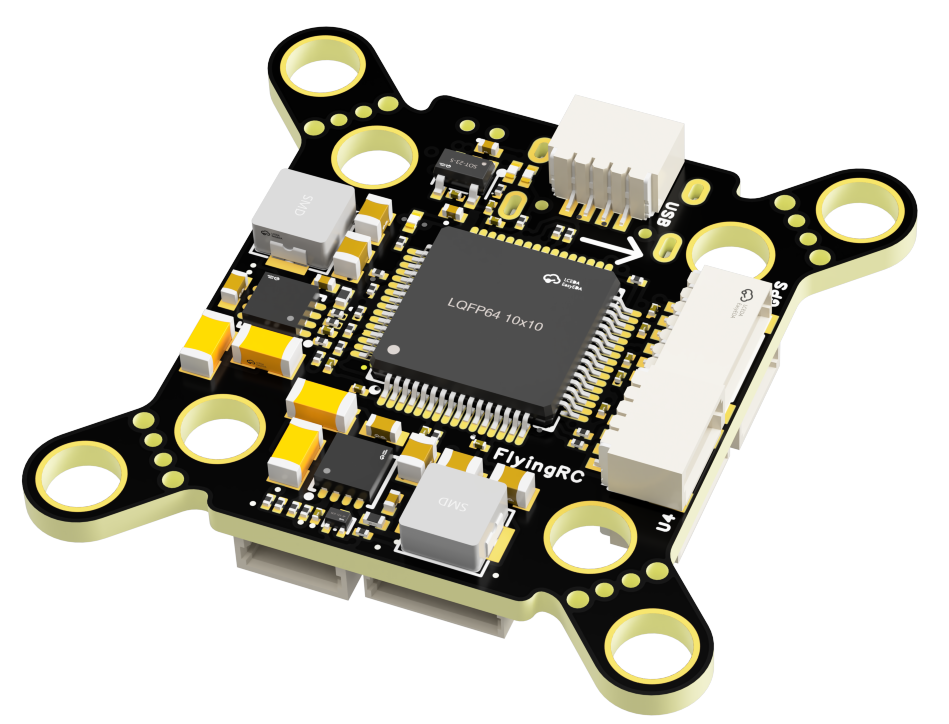

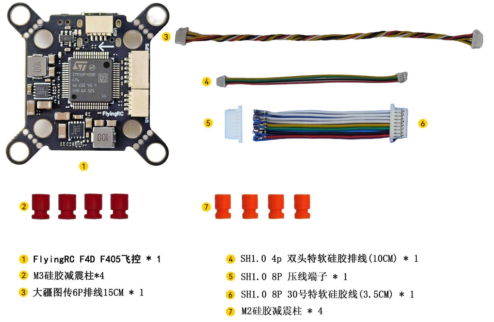

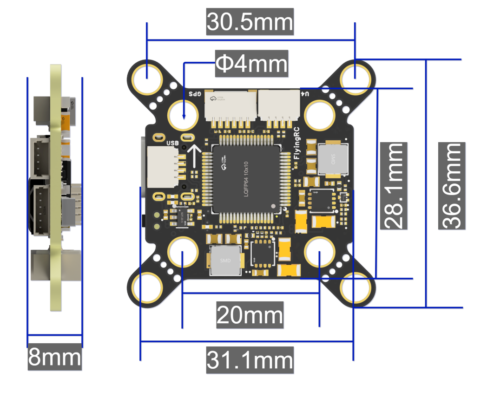

| 基础参数 | 传感器 |  |  |

|------|------|------|------|

| 型 号 | FlyingRC® F4D | IMU(陀螺仪和加速度计) | Invensense 3代 ICM-42688-P |

| 尺 寸 | 36.6*36.6*8.0剪断后28.1*31.1/*8.0mm | 气 压 计 | Goertek SPA06-003 |

| 孔距 | 30.5 / 20 mm | 磁 力 计 | 无板载磁力计 |

| 质 量 | 6.3g | 模拟OSD | AT7465E |

| 主控 | 电源输出 |  |  |

| 主控芯片 | 主控STM32F405RGT6 | BEC芯片型号 | MP9943+MP9943 |

| 主频 | 168 MHz | 板载降压模块BEC-设备 | 5V3A |

| Flash | 1 MB | 板载降压模块BEC-图传 | 9V2A |

| RAM | 192 KB |  |  |

| 接口 | 固件支持 |  |  |

| UART | 6组串口 | Betaflight | 支持(出厂默认) |

|  | UART3仅引出RX | INAV | 支持 |

| PWM | 5个（包括1个LED） | Ardupilot | 支持 |

| I2C | 1 | PX4 | 不支持 |

| 电流 ADC 采样 | 支持 |  |  |

| SWD调试 | 无 | 工作环境 |  |

| 蜂鸣器接口 | 无 | VBAT供电范围 | 7-28V DC IN  2-6S LiPo |

| LED灯带接口 | 支持WS2812，需焊接 | 电源输入 | 同VBAT供电范围 |

| USB-TYPE-C | 板载直插 | 工作温度范围 | -10-100℃ |

| 黑匣子存储 | 板载NOR Flash，16MB | 存储温度范围 | 0-40℃ |

| SBUS | 支持 |  |  |

## 技术参数

主控STM32F405RGT6，陀螺仪ICM-42688-P，Goertek SPA06-003国产高精度气压计

Analog/HD OSD，6xUARTs（UART3仅引出RX），5PWMs（4 ESC + 1LED），1I2C，1ADC（电流计），板载5V3A/9V2A BEC

黑匣子：板载NOR Flash，16MB

7-28V DC IN（2-6S LiPo，注意，在使用2S或3S Lipo电池时，需要注意图传BEC输入电压需大于9.8V才可提供稳定输出，建议使用3s-6s Lipo）

Dual BEC，MP9943 + MP9943方案，5V3A（设备）& 9V2A（图传，摄像头）

尺寸及重量：36.6mm*36.6mm*8.0mm，6.3g，剪断安装耳后28.1mm*31.1mm*8.0mm

**2. 产品特点**

STM32F405RGT6主控，支持AP，BF，INAV固件，出厂刷好BF固件。

Invensense第三代ICM-42688-P陀螺仪，精度更高，更稳定，专为无人机优化。

Goertek SPA06-003国产高精度气压计。

兼容30.5mm M4标准孔位（装配减震球后适配M3螺丝）与20mm M4孔位（装配减震球后适配M2/M3螺丝），支持2–12寸穿越机，机架兼容性极强。

4+1PWM输出，支持连接4合1电调，6串口（UART3仅引出RX），1组I2C，接口丰富。

全插座(SH1.0)设计，电调，接收机，GPS，模拟图传，模拟摄像头，高清图传，LED灯带，均通过插座连接，告别小焊盘难焊接、易连锡的烦恼。

板载9V BEC 为图传/摄像头供电， 可通过 PINIO1（BF固件中User1）开关，地面调试时无需担心图传过热烧毁。

板载16MB Flash，存储容量无需担忧，可保存多次飞行数据。

黑色阻焊，1OZ铜厚，1u沉金，树脂塞孔，盘中孔工艺。使用嘉立创SMT贴片服务，质量领先。

符合Beatflight最新官方接口规范

## 使用方法

### 1.布局/LAYOUT：

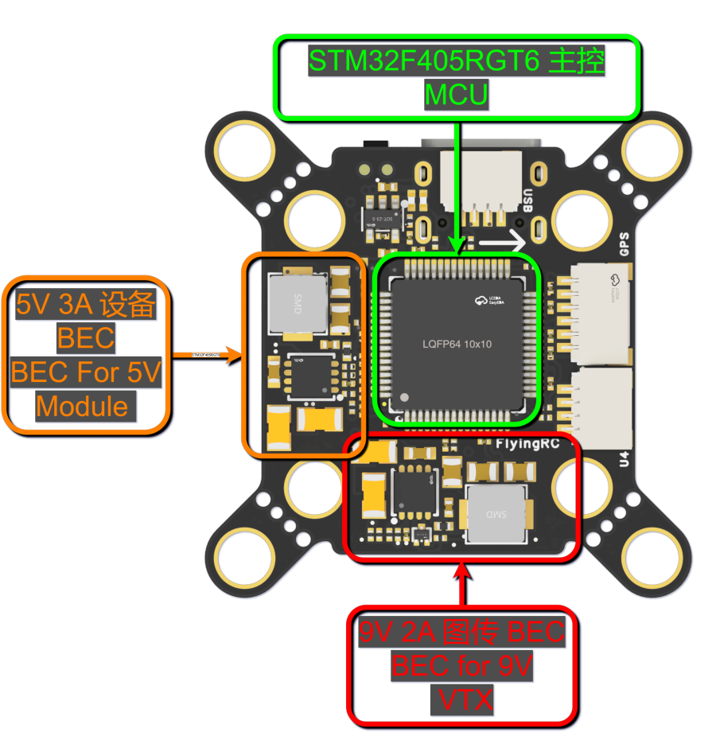

飞控3D示意图-正面

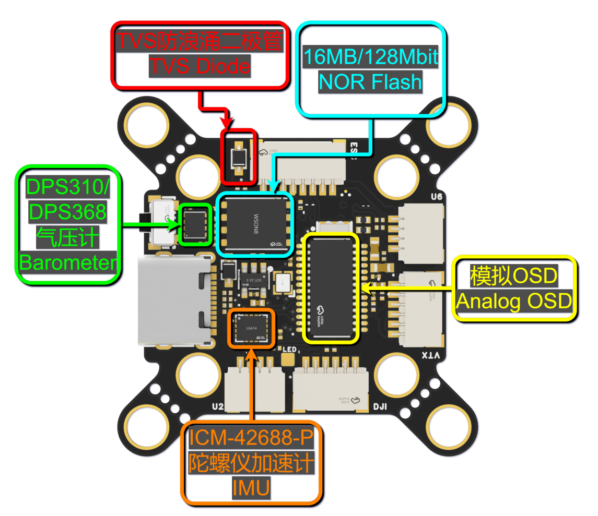

飞控3D示意图-反面

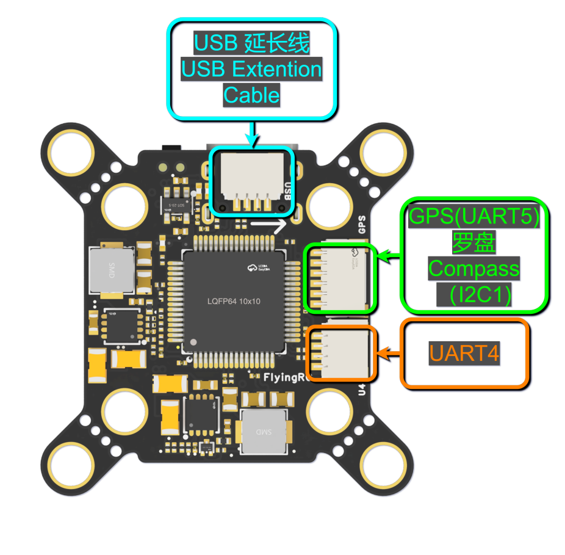

连接器功能示意图-正面

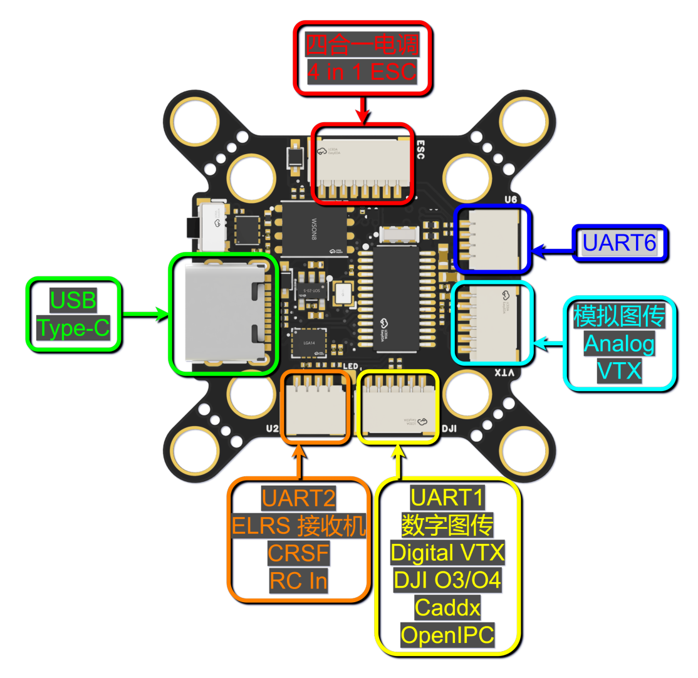

连接器、焊盘功能示意图-反面

**2. 使用前准备**

注意：因为不同厂商飞控和电调线序不同，请按照所使用的电调制作正确线序的8P电调连接线，如对线序有疑问可在客户群内咨询，线序错误及有可能导致飞控烧毁！！！本产品采用最新Betaflight官方引脚顺序，参考：Betaflight Connector Standard（官方说明页面）    插入8P母座时请务必保持两端平行进入，否则边缘插针可能弯曲或被顶出导致插座报废！！

### 接线图（BF，AP,INAV 固件均适用）：

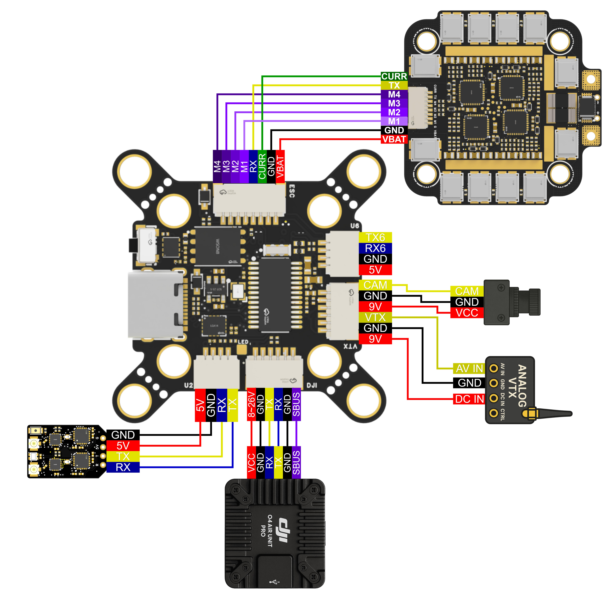

### 飞控接线示例图 (注：电调为V3.2版)

飞控SH1.0母座在板上有文字标出。

| 丝印/设备 | 飞控端引脚 | 设备端引脚 | 功能说明 |

|------|------|------|------|

| ESC/四合一电调 | VBAT | VBAT | 电池电压直通，为电调提供主动力电源输入 |

|  | GND | GND | 地线，信号和电源的公共参考地 |

|  | RX | TX | 接收端连接的TX发送端 |

|  | CURR | CURR | 飞控UART接收端连接电调电流回传引脚，用于读取实时电流数据 |

|  | M1 | M1 | 电机1信号线，控制第1号电机转速 |

|  | M2 | M2 | 电机2信号线，控制第2号电机转速 |

|  | M3 | M3 | 电机3信号线，控制第3号电机转速 |

|  | M4 | M4 | 电机4信号线，控制第4号电机转速 |

| U6/其他外设 | RX | TX | 飞控UART接收端连接TX发送端 |

|  | TX | RX | 飞控UART发送端连接RX接收端 |

|  | GND | GND | 地线 |

|  | 5V | 5V | 5V供电输出 |

| VTX/模拟图传&模拟摄像头 | CAM | CAM | 摄像头模拟视频信号输入 |

|  | GND | GND | 地线 |

|  | 9V | VCC | 9V稳压供电输出，为模拟摄像头提供工作电源 |

|  | VTX | AV IN | 模拟视频信号输出 |

|  | GND | GND | 地线 |

|  | 9V | DC IN | 9V稳压供电输出，为模拟图传发射模块提供工作电源 |

| DJI/DJI天空端 | 8~26V | VCC | 宽电压供电输入，8~26V（兼容2S-6S电池） |

|  | GND | GND | 地线（第一组） |

|  | RX | TX | 飞控UART接收端连接TX发送端，将遥测数据和配置响应发送给飞控 |

|  | TX | RX | 飞控UART发送端连接RX接收端，飞控发送OSD叠加数据和配置命令 |

|  | GND | GND | 地线（第二组，用于信号完整性） |

|  | SBUS | SBUS | SBUS信号线 |

| U2/ELRS接收机 | 5V | 5V | 5V供电输出 |

|  | GND | GND | 地线 |

|  | TX | RX | 飞控UART发送端 |

|  | RX | TX | 飞控UART接收端 |

| GPS/GPS | SCL | SCL | I2C时钟线 |

|  | SDA | SDA | I2C数据线 |

|  | TX | RX | 飞控UART发送端 |

|  | RX | TX | 飞控UART接收端 |

|  | GND | GND | 地线 |

|  | 5V | 5V | 5V供电输出 |

电调目前有V3.2和V4.0两个版本，  接线顺序有所区别，V4.0符合BF线序规范。飞友请注意V3.2和V4.0的外观区别.

**1.V4.0的8P插座上印有“注意线序”的字样**

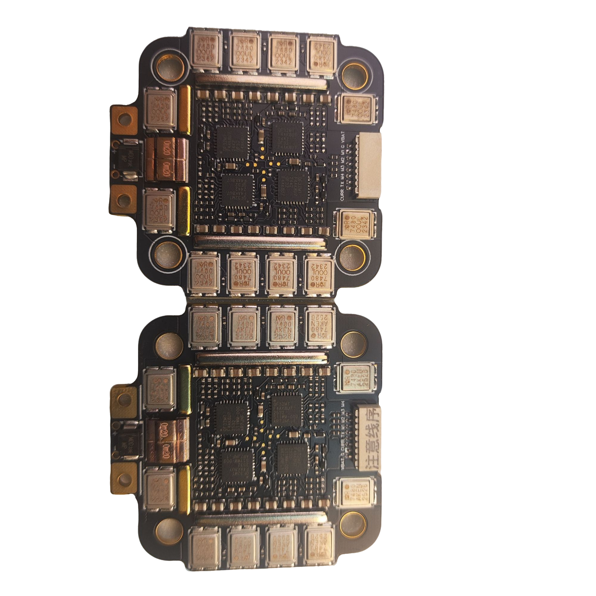

V3.2                           V4.0

**2.两个版本上均印有版本号**

**3.V4.0上印有S/N码**

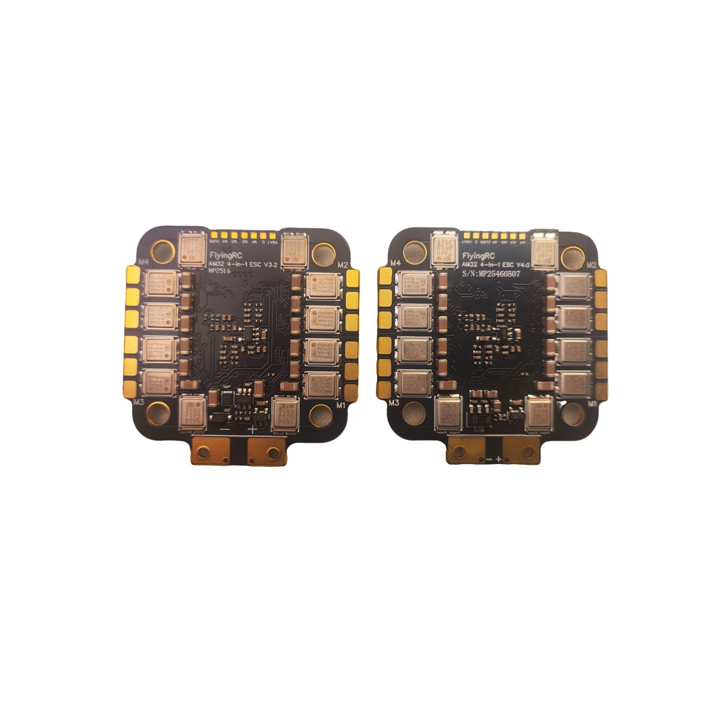

V3.2                           V4.0

电调连接 - 查看产品说明书和购买链接

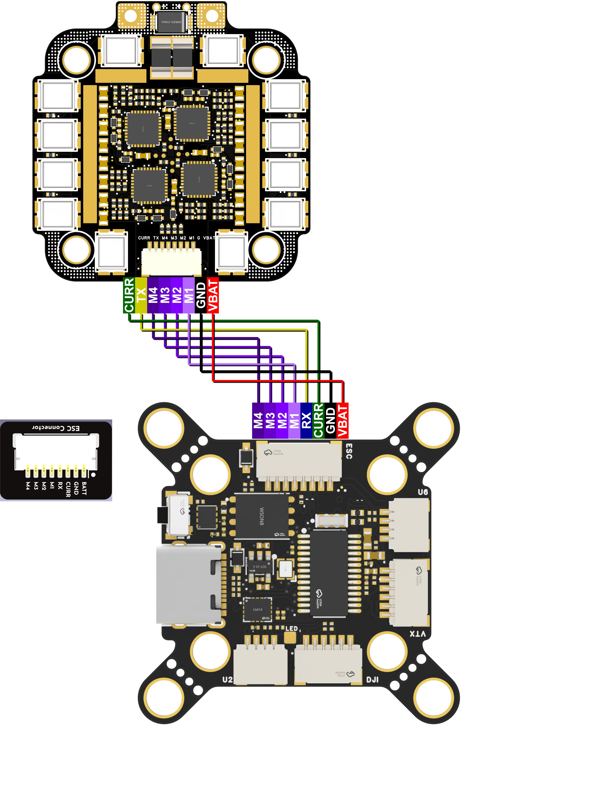

与FlyingRC® 4IN1 75A 金封电调连接(注：电调为V3.2版)

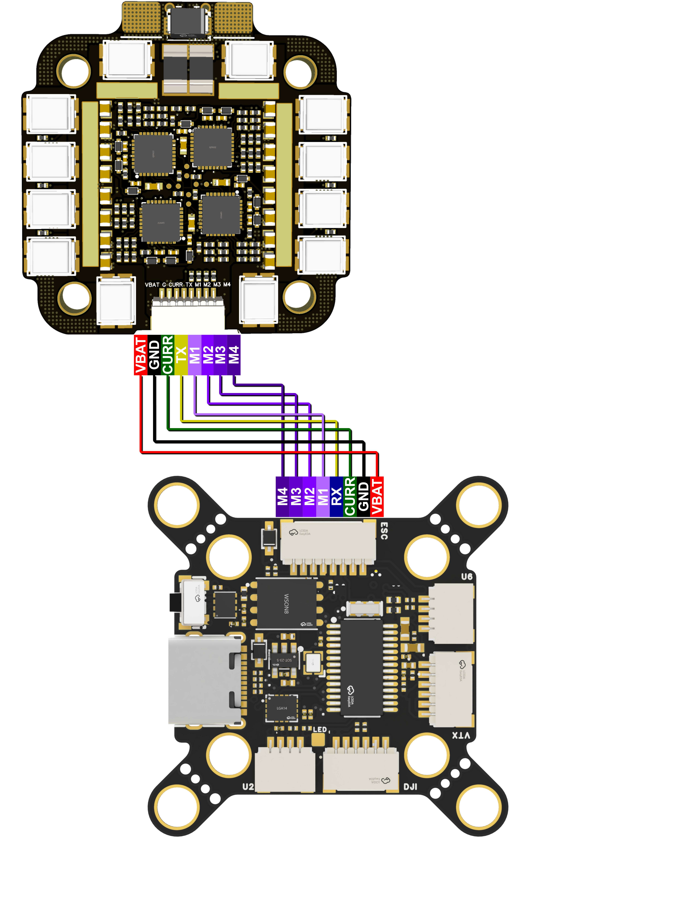

与FlyingRC® 4IN1 75A 金封电调连接(注：电调为V4.0版)

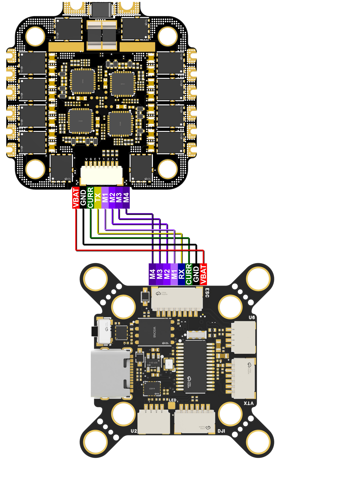

与FlyingRC® 4IN1 45A 金封电调连接

ELRS接收机 - 查看产品说明书和购买链接注意TX,RX交换关系！（飞控TX - 接收机RX，飞控RX-接收机TX)

与FlyingRC® ELRS接收机连接

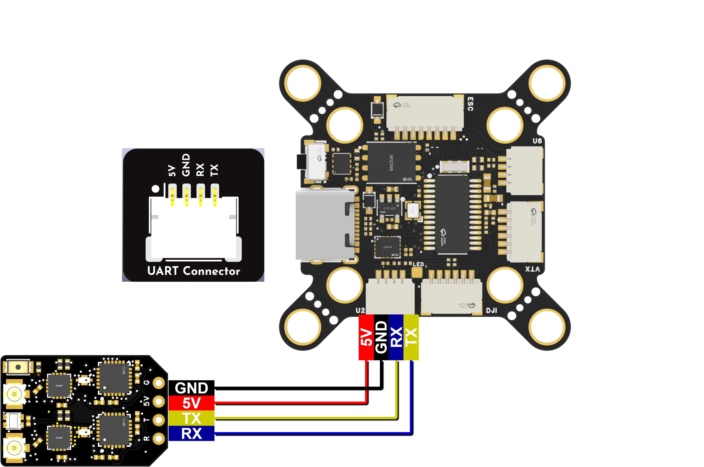

GPS - 查看产品说明书和购买链接

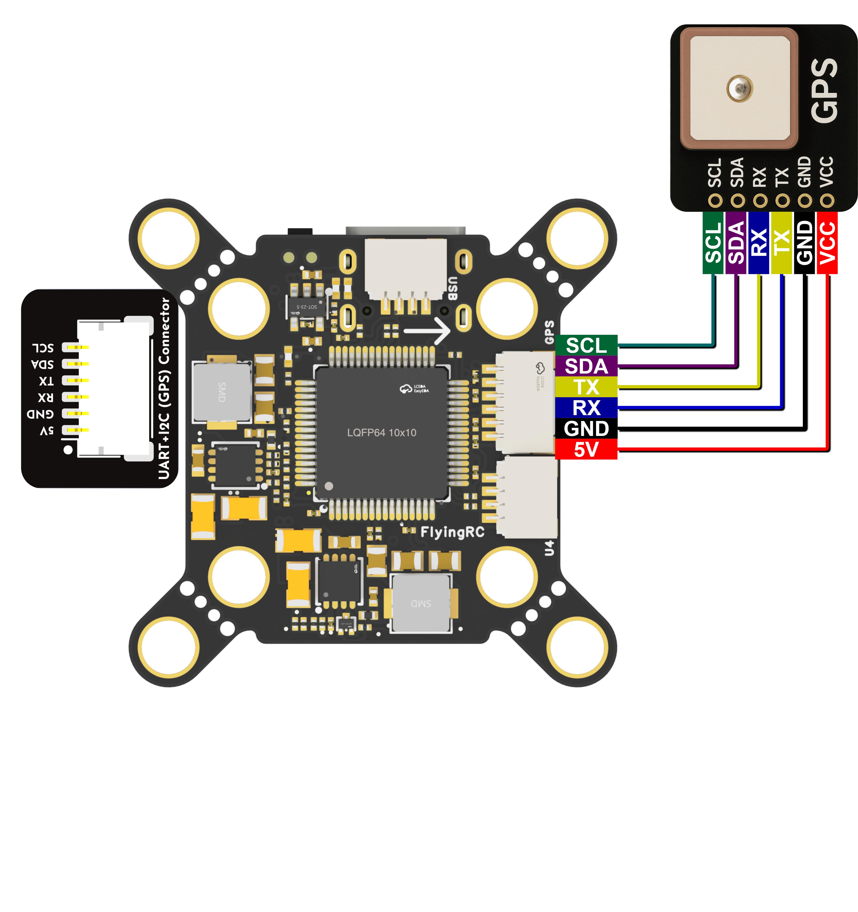

与FlyingRC® GPS连接

数字图传

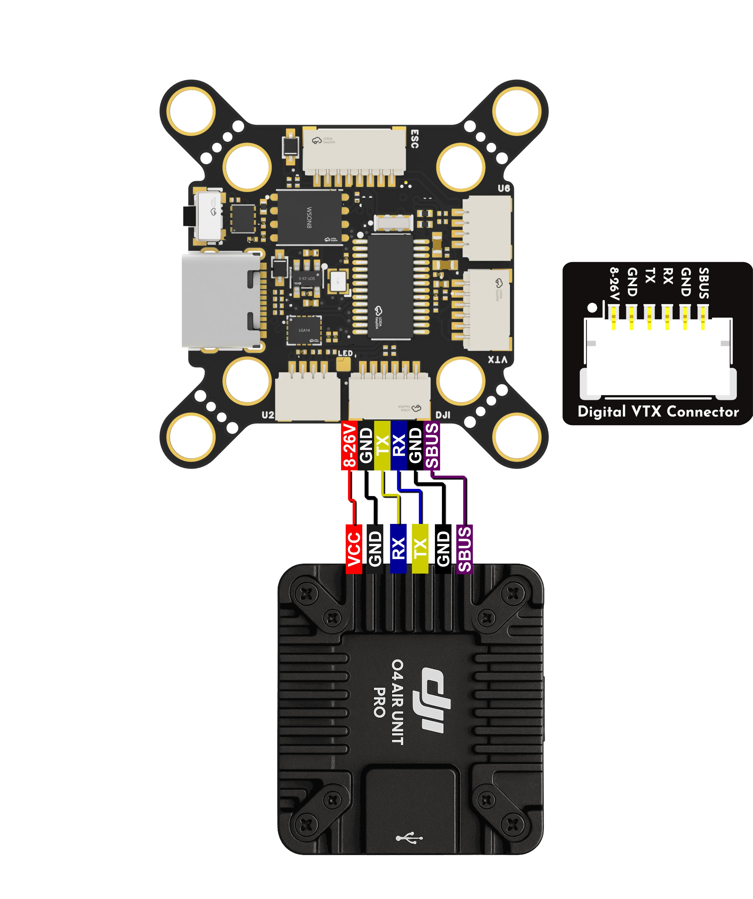

与数字图传连接(F4D飞控支持SBUS)

模拟摄像头和图传

与模拟摄像头和图传连接

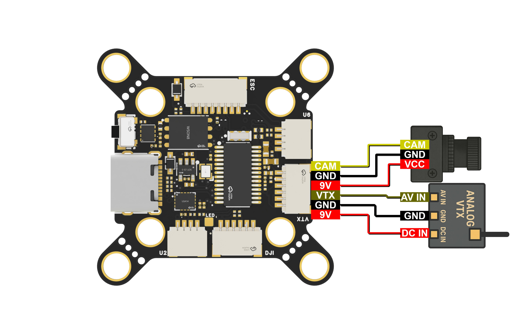

**3. 飞控固件刷写**

推荐使用BF固件、AP固件、INAV固件，出厂默认已经刷好BF固件，

下面接线会使用BF固件举例，

最新稳定版（截至2025/06/15）固件下载链接：

ArduPlane4.6.1Matek F405-TEArduPlane4.6.1Matek F405-TE(下载）

ArduCopter4.6.1Matek F405-TEArduCopter4.6.1Matek_F405-TE(下载）

INAV:Matek F405TE

BF:

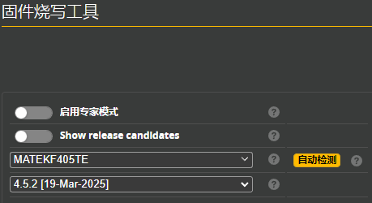

BF固件烧录教程：B站专栏----Ardupilot固定翼-飞控固件的刷写与版本更新

请注意：BF、Ardupilot提供有限技术支持，INAV无技术支持

飞控接口详解：

串口（UARTx 、Serialx）

！！！注意，在Ardupilot固件中Serial编号与UART/USART编号非一一对应，对应表如下图！！！

| Ardupilot UART Mapping |  |  |  |  |

|------|------|------|------|------|

| PCB 丝印 | UART 编号 | 配置 Config | 协议 Protocol | SERIAL_X |

| USB | USB | USB |  | SERIAL0 |

| DJI | UART1 | telem1 | with DMA | SERIAL1 |

| U2 | UART2 | RC input/Receiver | CRSF | SERIAL6 |

| ESC (R3) | UART3 | ESC Telemetry | NO DMA | SERIAL2 |

| U4 | UART4 | User Define | NO DMA | SERIAL4 |

| GPS | UART5 | GPS | NO DMA | SERIAL3 |

| U6 | UART6 | User Define | TX6 with DMA | SERIAL5 |

Ardupilot串口对应表

！！！注意，接线以后要对应的调整飞控参数，例如在上面的示例图中，GPS连接到了R2，T2，在下方串口对应表中可找到R2，T2对应Serial3，那么要把Serial3_Protocol设置为GPS，并且确认其它端口的功能没有被设置为GPS！！！

若在Serial6上使用ELRS等非SBUS/PPM协议接收机，需要设置brd_alt_config 为 1。

PWM输出功能

| PWM Channels |  |  |  |  |

|------|------|------|------|------|

| PWM Group | PWM 通道 | GPIO | Timer | DMA/DShot |

| Group1 | S1 | PWM1 GPIO50 | TIM8_CH4 | DMA/DShot |

|  | S2 | PWM2 GPIO51 | TIM8_CH3 | DMA/DShot |

| Group2 | S3 | PWM3 GPIO52 | TIM1_CH3N | DMA/DShot |

|  | S4 | PWM4GPIO53 | TIM1_CH1 | DMA/DShot |

PWM输出功能表

同组（Group）的PWM端口不可同时用于Dshot电调和50Hz PWM舵机

（3）I2C总线

| I2C |  |  |  |

|------|------|------|------|

| I2C 编号 | 配置 Config | 参数 Parameterl | Value |

| I2C1 | Compass | COMPASS_AUTODEC | 1 |

|  | onboard Baro DPS310 / DSP368 | Address | 0x76 |

|  | Digital Airspeed I2C | ARSPD_BUS | 1 |

|  | MS4525 | ARSPD_TYPE | 1 |

|  | DLVR-L10D | ARSPD_TYPE | 9 |

I2C总线表

ADC模拟信号输入

| ADC |  |  |  |  |

|------|------|------|------|------|

| 引脚 | Voltage  Tolerance | 定义 Definition | Config | Value |

| Vbat | 1K:20K divider builtin | on board battery voltage | BATT_VOLT_PIN | 14 |

|  | 0~28V |  | BATT_VOLT_MULT | 21 |

| Curr | 0~3.3V | on board  current sensor | BATT_CURR_PIN | 15 |

|  |  |  | BATT_AMP_PERVLT | 66.7 |

ADC模拟信号输入表

Betaflight通用参数设置：

陀螺仪安装方向：CW90Flip

Ardupilot通用参数设置：

LOG_BACKEND_TYPE = 4，开启TF卡黑匣子功能，记录飞行日志

BATT_VOLT_PIN     10

BATT_VOLT_MULT   11.0，电压计比例默认值，误差5%，额外校准非必须

BATT_CURR_PIN     11

INAV通用参数设置：

电压计比例默认值1100

技术问题咨询

若遇技术问题，建议先查阅产品说明书；也可前往AI平台、B站等渠道获取帮助。同时欢迎群友互相协助，分享已知解决方案。

维修服务

保修服务期限及内容

·  已焊接产品、人为损坏不享受免费保修。

·  配套易损配件不在保修范围内，可至 FlyingRC® 淘宝店另行购买。

若首次使用后没有发现产品存在问题，视为产品性能正常，不存在质量问题。后续使用中出现任何问题，视为用户不规范操作的所致。FlyingRC®提供两种售后服务供用户选择。

适用条件：用户购买产品1年内，可享受1次优惠以旧换新，需寄回故障产品。

折扣规则：按淘宝店正常售价7折购买全新同款同配置产品；换新品不再享受维修和售后服务。

付费维修寄送要求：

客户寄修前请先电话或微信联系工作人员，说明电路损坏原因与故障情况，确认是否可修。

产品寄出后，请主动提供运单号。未与维修工程师沟通直接寄回，若出现快递丢失、无法维修等情况，损失由客户自行承担。

随货请附纸条，注明：产品具体故障、故障原因、操作过程，并填写联系方式、回寄地址。拒收顺丰及到付件。

未附纸条导致无法联系、无法维修的，后果由客户承担。客户超过 3 个月未联系的，产品将按无主件报废处理。

因客户参数设置错误导致产品异常，工程师重新刷固件或校正参数的，将收取检测费 10–20 元。

| 维修内容 | 项目编号 | 更换芯片型号 | 材料费+手工费=维修费 |

|------|------|------|------|

| 飞控主控 | 1 | STM32F405RGT6 | 30+15=45 |

|  | 2 | STM32H743VIT6 | 50+30=80 |

|  | 3 | STM32H743VIH6 | 65+45=110 |

| 电调主控 | 4 | QF32F4AK8U7 | 8+10=18 |

|  | 5 | AT32F421K8U7 | 6+10=16 |

| 飞控传感器 | 6 | ICM-42688-P | 70+12=82 |

|  | 7 | ICM-42605 | 50+12=62 |

|  | 8 | SPL06 | 4+10=16 |

|  | 9 | DPS310/DPS368 | 25+12=37 |

| 飞控电源芯片 | 10 | MP9943 | 7+10=17 |

|  | 11 | MP9447 | 10+10=20 |

|  | 12 | MP9942 | 8+10=18 |

|  | 13 | LM25148 | 26+15=41 |

|  | 14 | LDO | 4+5=9 |

| 电调场效应管 | 15 | IRF7480 | 5+5=10 |

|  | 16 | HYG022N04LS1C1 | 3+5=8 |

| 其它元器件 | 17 | 电阻、电容、插座等 | 2+5=7 |

注：表格里是单一原件维修价格。

请注意：自行维修、打胶、PCB烧坏/击穿（全部芯片烧毁）和进水（元器件/PCB腐蚀）的飞控没有继续使用和维修价值，FlyingRC®不提供维修服务,客户可以选择7折以旧换新。

FlyingRC® 其它产品介绍

---

## USB 驱动与连接

--8<-- "shared/flight-controller/usb-driver.md"

---

## 接收机连接

--8<-- "shared/flight-controller/receiver-wiring.md"

---

## 安全须知

--8<-- "shared/safety.md"

---

## 首次使用检查

--8<-- "shared/first-use-check.md"

---

## 技术支持

--8<-- "shared/support.md"

---

## 售后与保修

--8<-- "shared/warranty.md"

---

## FlyingRC® 其它产品

--8<-- "shared/other-products.md"

---

## 免责声明

--8<-- "shared/disclaimer.md"

