# FlyingRC® F4Wing Mini 固定翼飞控

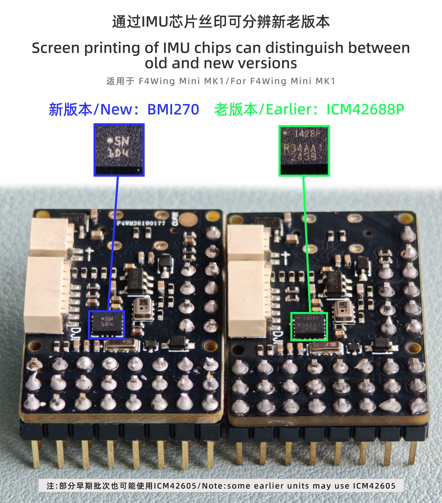{ width="320" }

**型号**：F4Wing Mini MK1  
**类别**：固定翼飞控  
**状态**：在售  
**官方零售价参考**：89 元

---

## 产品简介

超 Mini 体积固定翼飞控，适用于小型及微型固定翼（F80、微爪、Arwing Mini 等）。Type-C 直插，可直插 ELRS 接收机与高清图传，支持 ArduPilot / INAV / Betaflight。

### 产品特点

- 超 Mini：27.9×20.3×11.2 mm，未焊排针约 2.8 g，焊好排针约 5.3 g
- STM32F405RGT6，M4 内核，168 MHz，1 MB Flash
- ICM42688P / ICM42605 / BMI270（视批次），SPA06 / SPL06 气压计
- 板载双 LDO，传感器独立供电
- 7 路 PWM，3 组串口 + SBUS，1×I2C
- 高清直插（SH1.0 6P），支持高清 OSD，不支持模拟 OSD
- SH1.0 2P 电池电压输入（最高 6S），飞控本体需 **5V 外部供电**

---

## 基础参数

| 项目 | 参数 |
|------|------|
| 型号 | FlyingRC® F4Wing Mini |
| 主控 | STM32F405RGT6，168 MHz，Flash 1 MB，RAM 192 KB |
| IMU | ICM42688P / ICM42605；BMI270（2026/5/25 后上市） |
| 气压计 | SPL06-001 / SPA06-003 |
| 磁力计 | 无 |
| 模拟 OSD | 无 |
| 尺寸 | 27.9 × 20.3 × 11.2 mm |
| 安装孔 | 17.8 × 17.8 mm，M1.2 |
| 质量 | 2.8 g（未焊排针）/ 5.3 g（焊好）/ 6.4 g（焊好+底座） |
| UART | UART1、UART4（DJI 高清）、UART5 |
| PWM | 7（含 LED） |
| I2C | 1 |
| SBUS | 1 |
| 板载 BEC | 无 |
| 电源输入 | 5V |
| VBAT 监测 | 2.5–30 V，1–6S LiPo |
| USB | 板载 Type-C 直插 |
| 黑匣子 | 无 |
| LED 灯带 | 支持 WS2812 |
| 工作温度 | -10–100 ℃ |
| 存储温度 | 0–40 ℃ |
| 固件 | ArduPilot ✓ / INAV ✓ / Betaflight ✓ / PX4 ✗ |

### 硬件版本

| 版本 | 传感器 | 状态 |
|------|--------|------|
| HW V1 | SPL06 气压计 | 已停产 |
| HW V2 | ICM42688P + SPL06 | EOL |
| HW V3 | ICM42605 + SPA06 | — |
| V5 | BMI270 + SPA06-003 | — |

---

## 使用方法

!!! info "安装方向"

    安装时 **Type-C 口朝向机头方向**。

### 布局

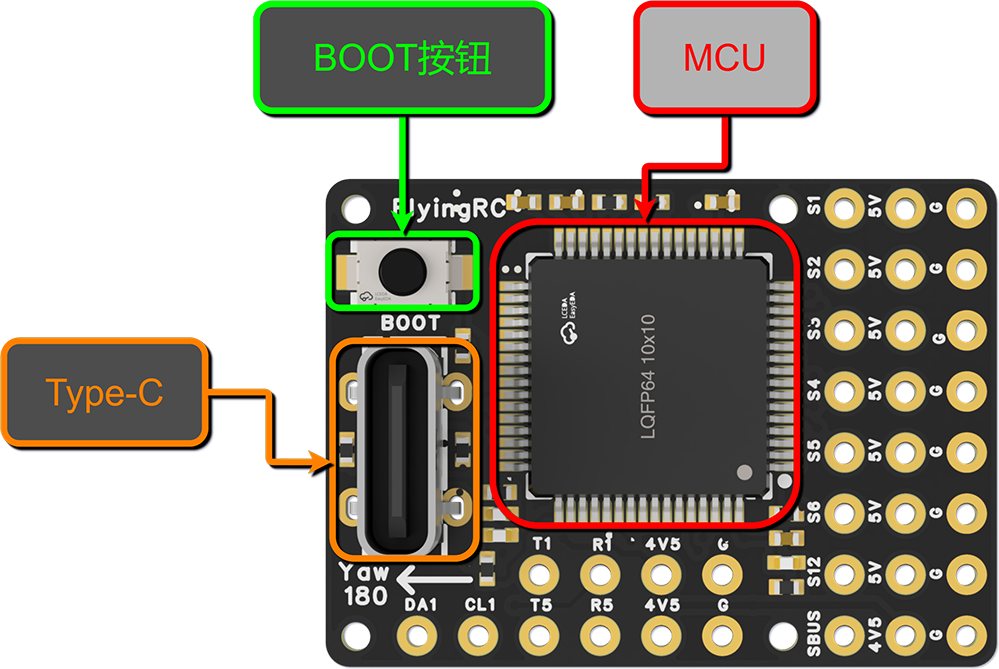

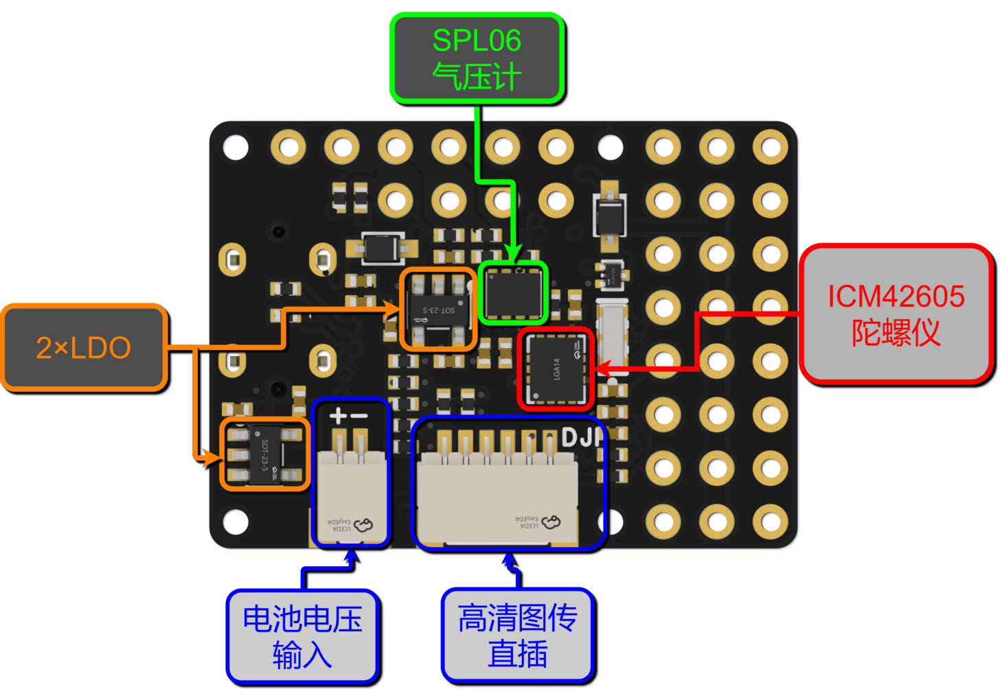

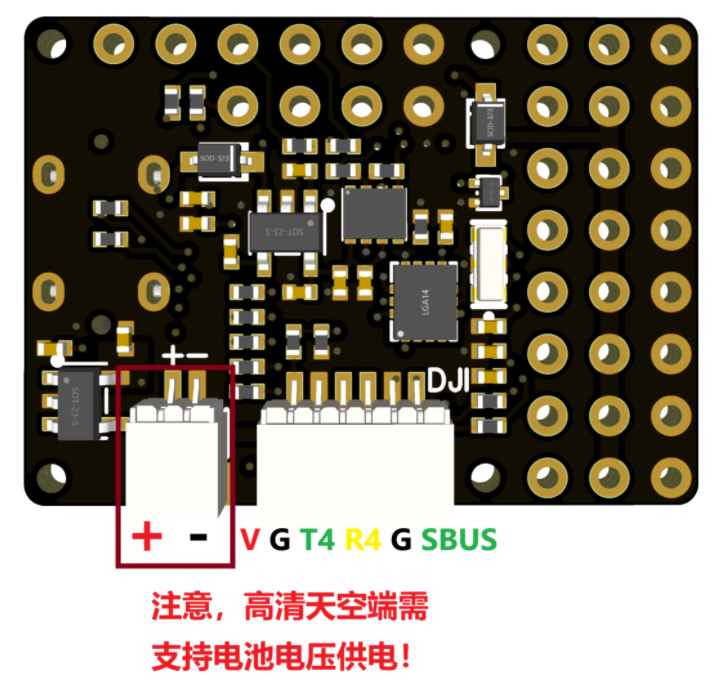

### 电池电压输入（SH1.0 2P）

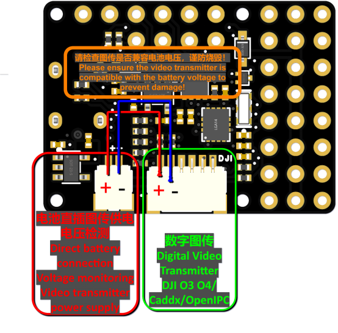

| 引脚 | 名称 | 定义 |
|------|------|------|
| 1 | - | 接电池负极 |
| 2 | + | 接电池正极，仅飞控供电与电压监测 |

### 高清图传直插（SH1.0 6P）

| 引脚 | 名称 | 定义 |
|------|------|------|
| 1 | SBUS | DJI SBUS 遥控信号输入（UART2） |
| 2 | G | GND |
| 3 | R4 | OSD MSP RX（UART4） |
| 4 | T4 | OSD MSP |
| 5 | G | GND |
| 6 | V | 电池直连供电 |

### 接线示例

#### 外置独立 BEC

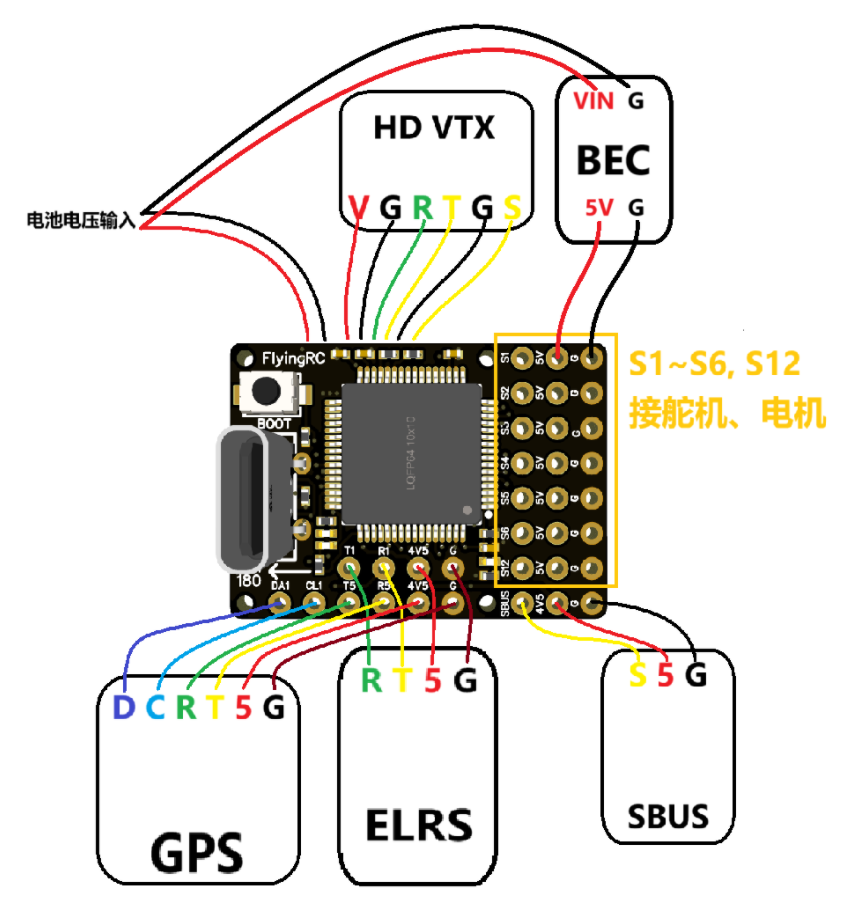

可选用店内 FlyingRC® 5A BEC。

#### 电调内置 BEC

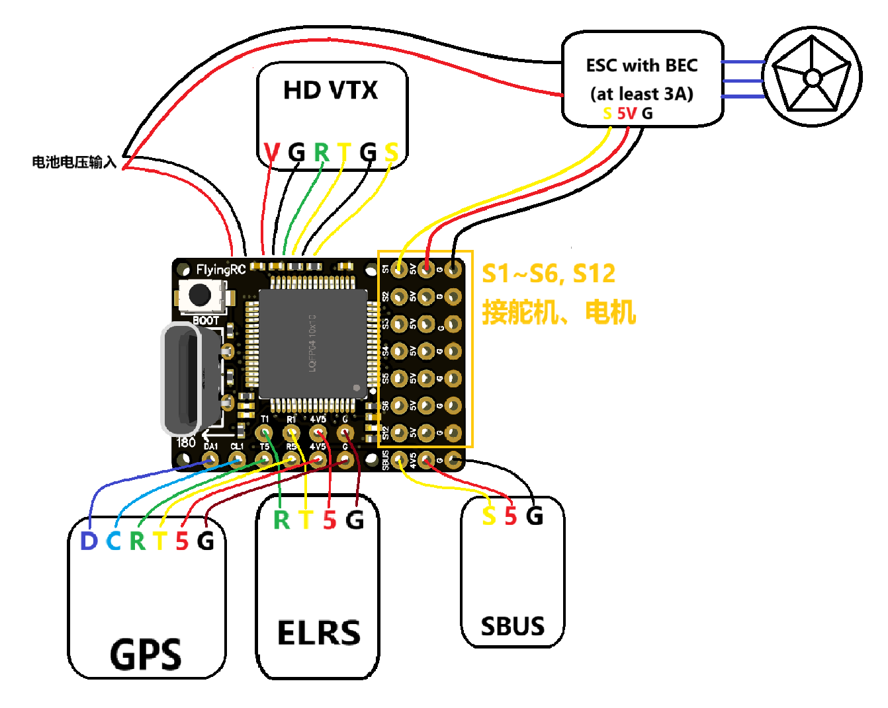

注意电调 BEC 输出需 **&gt;3A**；3A 约可带 2–3 个 9g 舵机，5A 约 4–5 个。推荐 FlyingRC® 75A ESC V2.5（带 BEC，板载 4.5A）。

#### 与外设连接

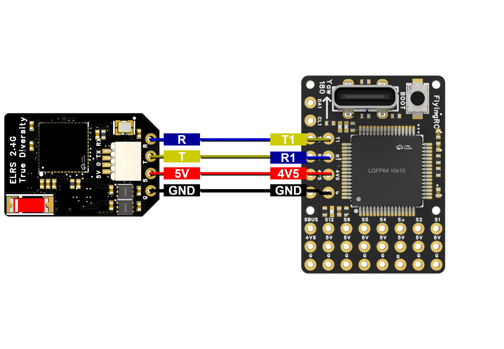

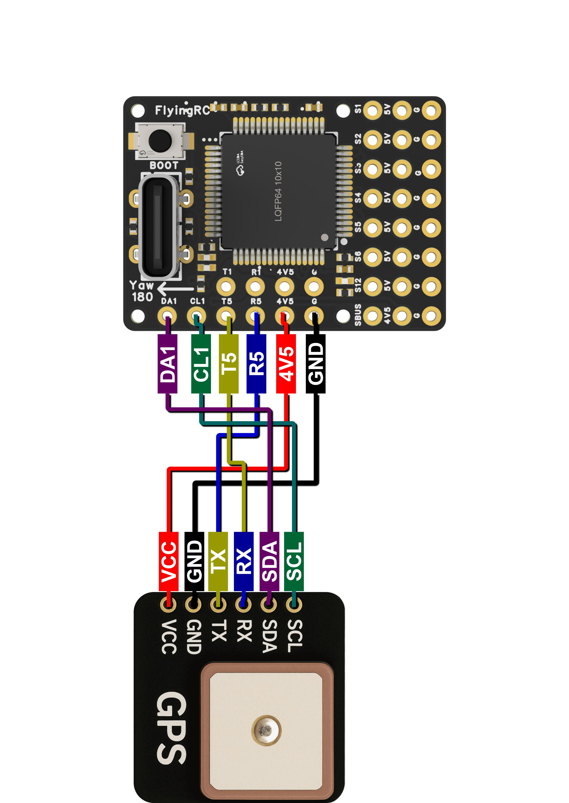

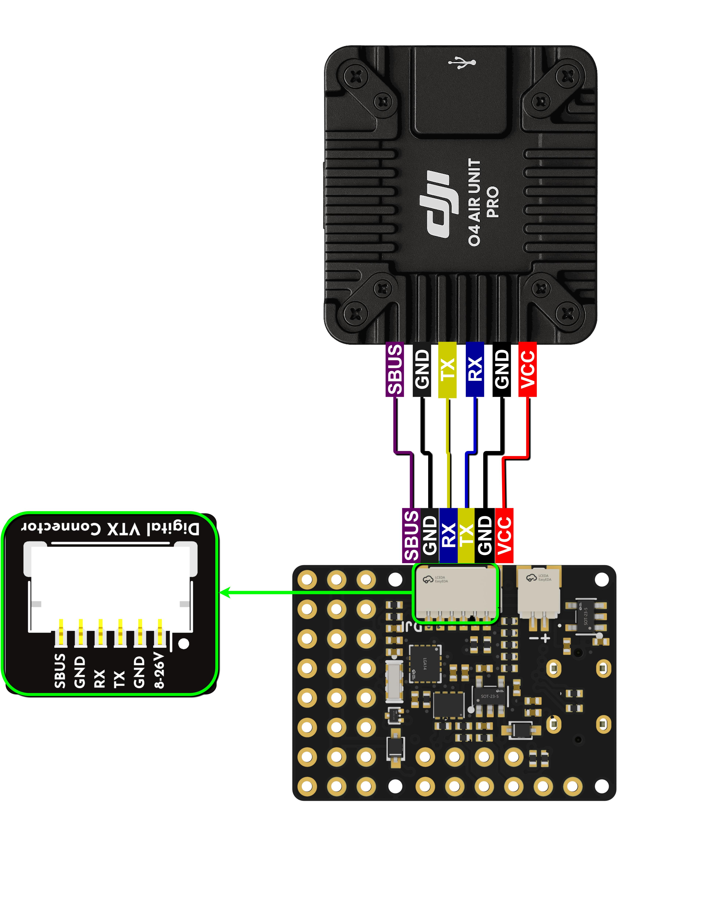

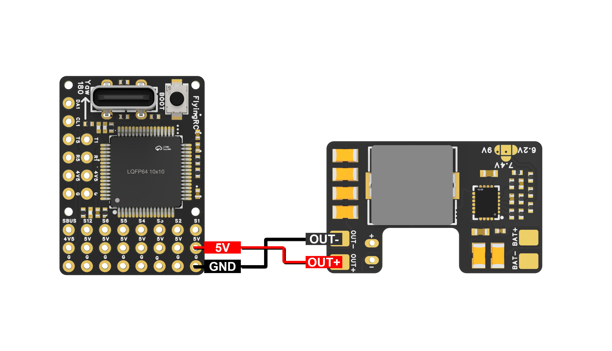

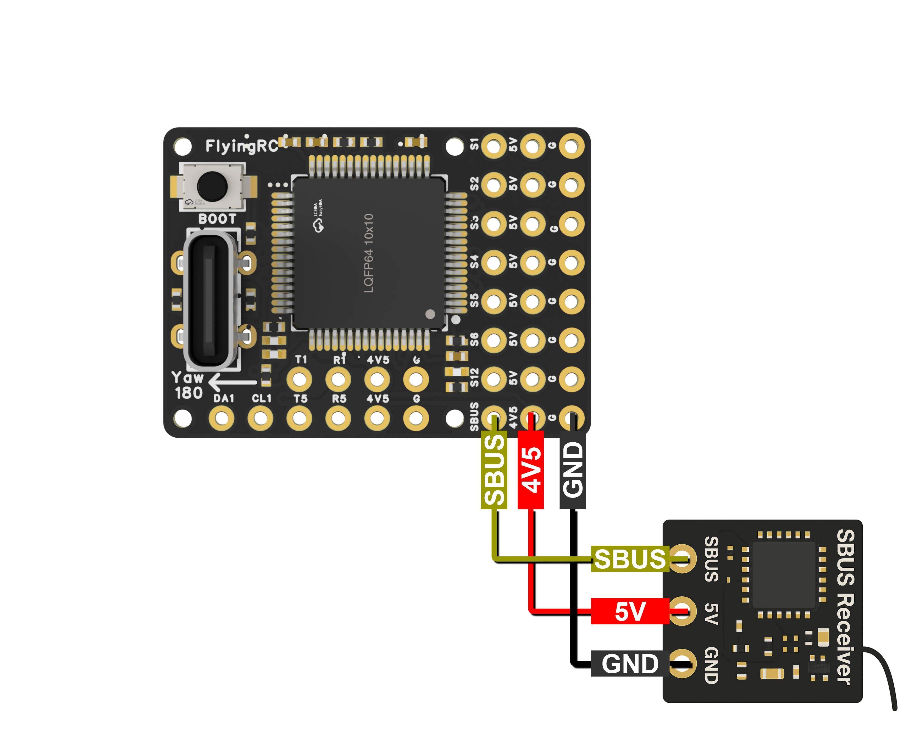

### PWM 输出分组

| Group | 通道 | 定时器 | 说明 |
|-------|------|--------|------|
| 1 | S1, S2 | TIM8 | DMA/DShot |
| 2 | S3, S4 | TIM1 | DMA/DShot |
| 3 | S5, S6 | TIM2 | DMA/DShot |
| 7 | LED | TIM3_CH4 | SERVO12_FUNCTION 120，NTF_LED_TYPES neopixel |

- 同组内启用 DShot 后，该组需统一为 DShot，不可与 PWM 混用。
- 同组舵机与电机混用时，按舵机最低 PWM 频率运行。
- S12 可接 WS2812 灯带。

### 串口映射（ArduPilot）

| UART | 硬件 | 默认功能 | SERIAL |
|------|------|----------|--------|
| USB | USB | console | SERIAL0 |
| TX1 RX1 | USART1 | RC input | SERIAL1 |
| TX5 RX5 | UART5 | GPS1 | SERIAL3 |
| TX4 RX4 | UART4 | MSP OSD | SERIAL4 |
| SBUS | USART2 | RC | — |

推荐：ELRS → RX1/TX1（Serial1），GPS → RX5/TX5（Serial3）。

### I2C 设备

- Compass：COMPASS_AUTODEC，总线 1
- 板载气压计地址 **0x76**，**外部不可再接 0x76 设备**
- 空速计：MS4525（ARSPD_TYPE 1）或 DLVLR-L10D（ARSPD_TYPE 9）

### 排针焊接

工具见 [焊接注意事项](../../shared/soldering.md)。  
焊接演示视频：B 站搜索「FlyingRC F4Wing Mini 排针焊接演示」。

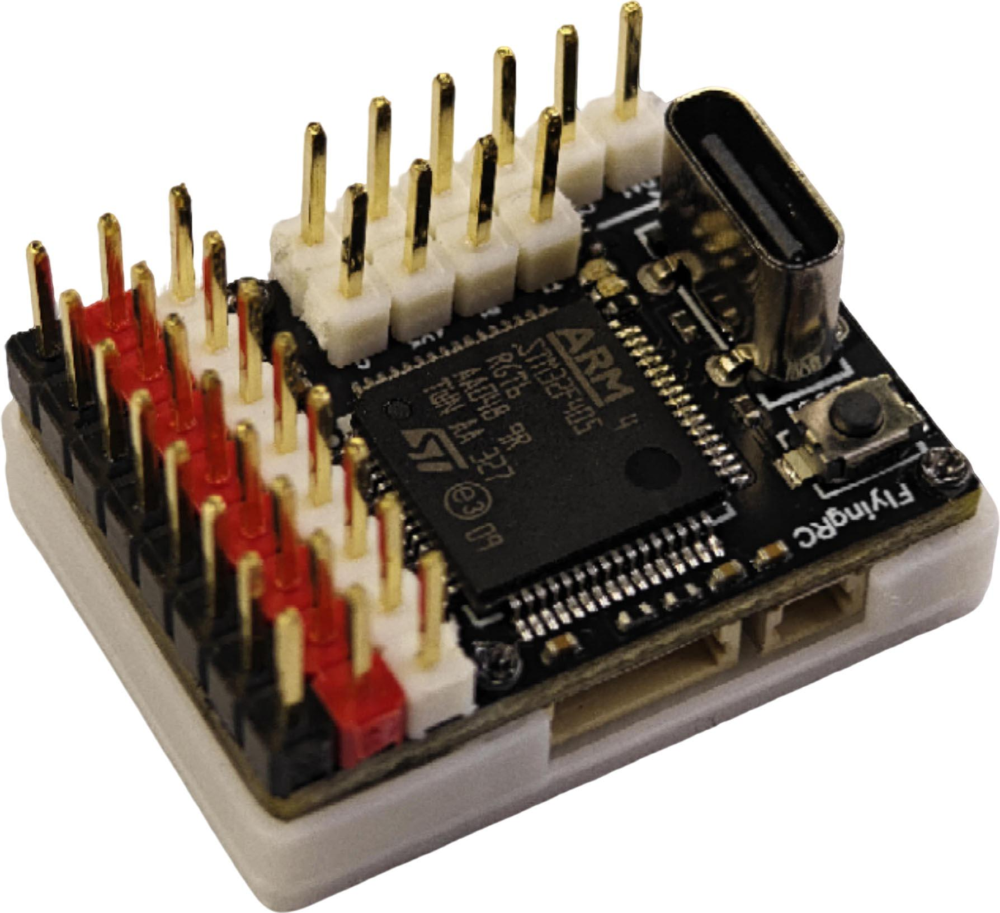{ width="360" }

---

## 固件安装

--8<-- "shared/flight-controller/ardupilot-flashing.md"

--8<-- "shared/flight-controller/inav-flashing.md"

--8<-- "shared/flight-controller/betaflight-flashing.md"

--8<-- "shared/flight-controller/usb-driver.md"

---

## 接收机连接

--8<-- "shared/flight-controller/receiver-wiring.md"

---

## 安全须知

--8<-- "shared/safety.md"

---

## 首次使用检查

--8<-- "shared/first-use-check.md"

---

## 技术支持

--8<-- "shared/support.md"

!!! note "固件支持范围"

    本产品仅 ArduPilot 固件提供有限技术支持，INAV、BF 无技术支持。

---

## 售后与保修

--8<-- "shared/warranty.md"

---

## 常见问题

--8<-- "shared/faq.md"

---

## 品牌介绍

--8<-- "shared/brand-intro.md"

---

## FlyingRC® 其它产品

--8<-- "shared/other-products.md"

---

## 免责声明

--8<-- "shared/disclaimer.md"
