# FlyingRC® F4WSE MK1.5 产品手册

> 状态：在售 · 类别：flight-controller · 内容自原 WPS 说明书迁入

---

## 一、FlyingRC介绍

## 二、产品概述

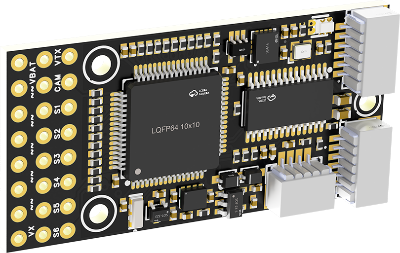

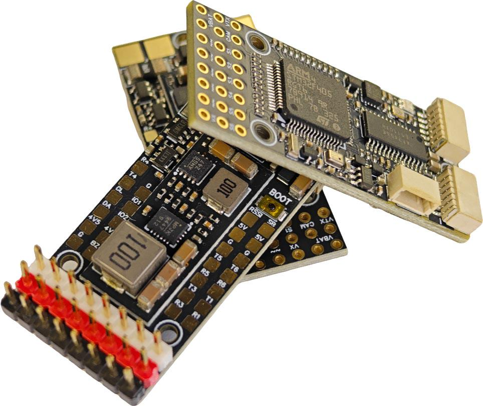

## 技术参数

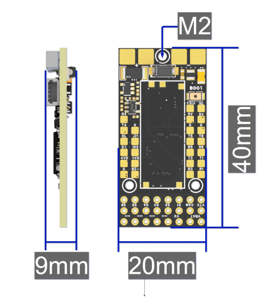

## 基础参数

传感器

型 号

FlyingRC® F4WSE

IMU(陀螺仪和加速度计)

ICM-42688-P

尺 寸

20mm*40mm*9mm

气 压 计

SPL06-001

质 量

9g

磁 力 计

无板载磁力计

模拟OSD

AT7465E

主控

电源输出

主控芯片

主控STM32F405RGT6

BEC芯片型号

MP9943+MP9447

主频

168 MHz

板载降压模块BEC-设备

5V2A

Flash

1 MB

板载降压模块BEC-舵机

5V4A

RAM

192 k

接口

固件

UART

5组串口，

Betaflight

支持(出厂默认)

UART1,UART3, UART4，UART5，

INAV

支持

UART6

Ardupilot

支持

PWM

基础版6个+高阶版6个，其中一个LED

PX4

不支持

I2C

1

电流 ADC 采样

支持，持续40A，瞬间80A

SWD调试

无

工作环境

蜂鸣器接口

有，支持无源蜂鸣器

VBAT供电范围

7-28V DC IN  2-6S LiPo

LED灯带接口

支持WS2812

电源输入

同VBAT供电范围

USB-TYPE-C

外置USB小板

工作温度范围

-10-100℃

黑匣子存储

外接TF卡模块，可用容量4-8GB，最高支持32GB

存储温度范围

0-40℃

SBUS

飞控内置反向器

连接至任意UART2　RX接口

高阶套餐--飞控完全体

## 产品特点

体积小，适合小型FPV载机或改装手抛机使用

创新设计，可扩展性强。基础版可以制作Y3或者四轴无人机。高阶版提供PWM扩展板，一共12路PWM，大型载机，垂起固定翼（VTOL）也可以使用。

使用高精度陀螺仪与气压计，对比同类型飞控稳定性大幅度提升。

板载电流计，内置双路5V BEC,同体积飞控拥有最强的BEC电流输出能力。

外置USB小板，外置TF卡小板，装机布局更灵活。

支持Ardupilot和INAV固件。

可接LED灯带，实现炫酷飞行。

### 硬件布局

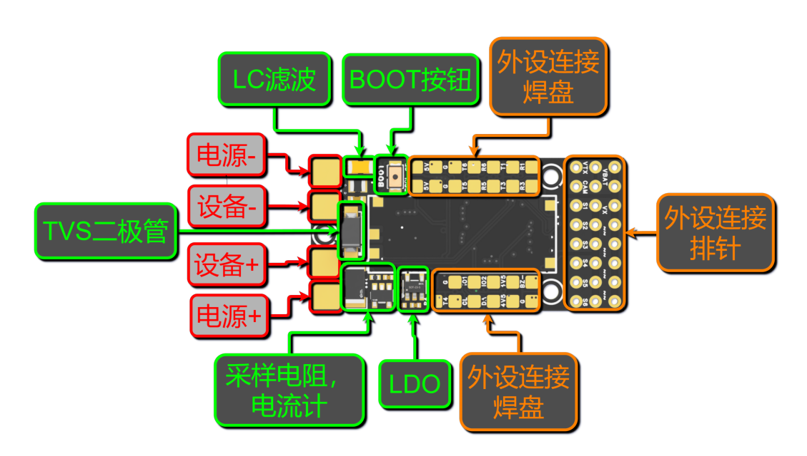

飞控3D示意图-正面

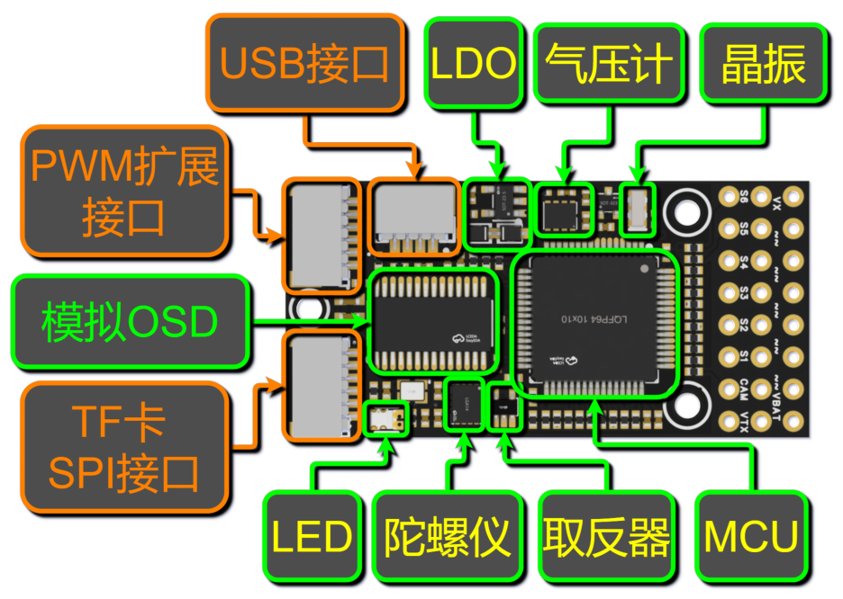

飞控3D示意图-反面

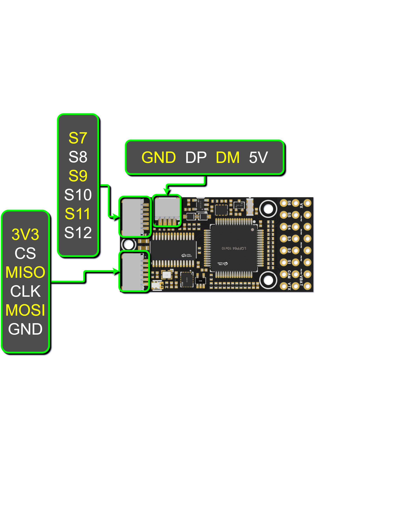

连接器功能示意图

## 三、使用方法

使用前准备

工具及耗材准备：

数控烙铁/焊台（推荐T12系列或者936系列），焊锡丝（推荐63%含锡量），硅胶线（信号线推荐使用28~30AWG硅胶线，电源线推荐使用14~18AWG），35V470uF固态电容（并联在电源输入焊盘，可以不焊），10V2A降压模块（可选配，大疆高清图传系统、蜗牛高清图传系统及某些滤波做的不是很好的模拟摄像头和图传需使用）。

### USB小板与赠送连接线焊接

USB小板与连接线焊接线序

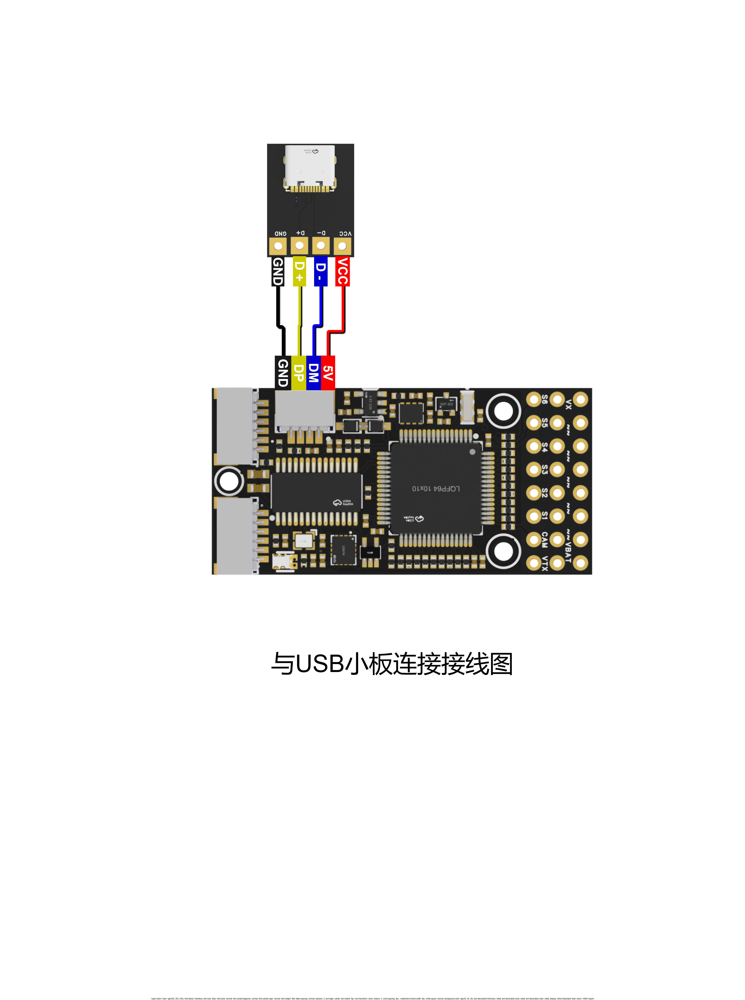

### 与USB小板连接接线图

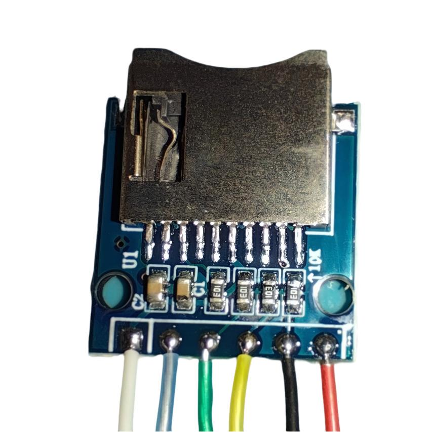

TF卡小板与连接线焊接线序

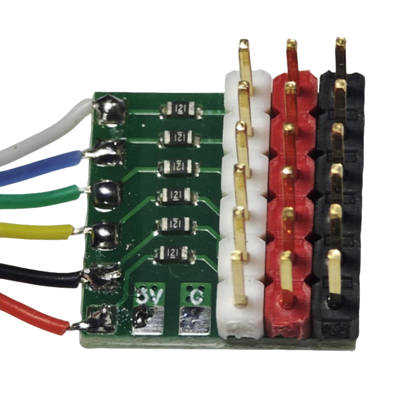

### 扩展板排针与连接线焊接图

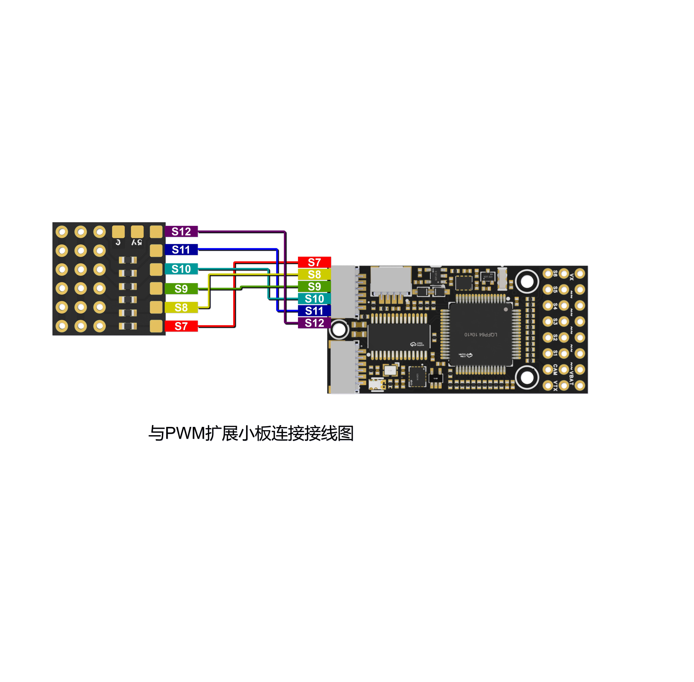

接口顺序图

PWM扩展接口引脚定义

引脚序号

引脚名称

引脚定义

1

S12

PWM_CH12 电调/舵机

2

S11

PWM_CH11电调/舵机

3

S10

PWM_CH10电调/舵机

4

S9

PWM_CH9电调/舵机

5

S8

PWM_CH8电调/舵机

6

S7

PWM_CH7电调/舵机

### 飞控与舵机扩展板焊接线序

注意事项

信号线需使用硅胶线，飞控接线端子型号为SH1.0，体积较小，插拔时请用手抵住插座后部，以防插座受力脱落.

飞控固件

固定翼推荐使用ArduPlane固件及INAV固件，出厂默认已经刷好ArduPlane固件

下面接线会使用Ardupilot固件举例，

最新稳定版（截至2025/01/06）固件网盘下载链接：

ArduPlane  MatekF405-TE

ArduCopter MatekF405-TE

INAV      MatekF405TE_SD

BF        MatekF405-TE

飞控直接兼容MatekF405-TE 固件，可通过地面站如：Mission Planner直接刷写

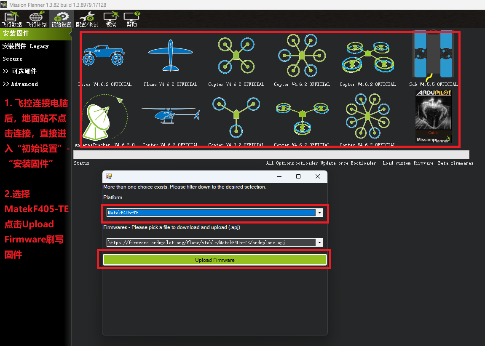

飞控配置文件请点击：MTKS F405TE_SD

固件烧录教程请点击：B站专栏----Ardupilot固定翼-飞控固件的刷写与版本更新

Ardupilot固件使用教程请点击：FlyingRC® F4Wing MK5使用教程

### Ardupilot接线

飞控完整接线示例图

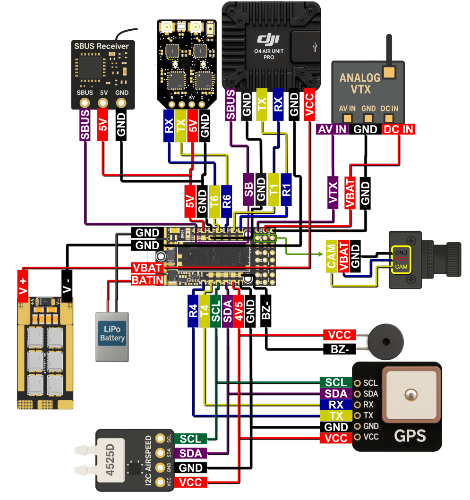

插口功能定义图

插口

定义

功能

说明

数字图传

VCC

DJI图传VCC

图传供电

GND

电源地

主功率地，

RX

串口 1 接收 RX

图传→飞控上行回传数据

TX

串口 1 发送 TX

飞控→图传下行数据

GND

信号参考地

图传信号专用地线，抗干扰

SBUS

SBUS 遥控信号输入

接收机 SBUS 信号线接入，接收遥控器指令

SBUS接收机

SBUS

SBUS 遥控信号输入

SBUS 遥控信号输入，接收遥控器指令

5V

USB 供电

电脑 USB5V 输入，可单独给飞控上电调试

GND

USB 参考地

USB 信号接地

定位系统

4V5

GPS 模块供电

4.5V 稳压输出，给 GPS + 电子罗盘供电

GND

GPS 模块地

定位模组公共地线

R4

串口 4 接收 RX

GPS 模块 TX→飞控 RX，读取定位坐标数据

T4

串口 4 发送 TX

飞控 TX→GPS 模块 RX，下发配置指令

SDA

I2C 数据总线

连接板载 / 外置电子罗盘，读取地磁航向数据

SCL

I2C 时钟总线

罗盘 I2C 通信时钟信号

接收机

4V5

接收机 模块供电

4.5V 稳压输出，给 接收机供电

GND

接收机 模块地

接收机接地

R6

串口 6 接收 RX

接收机 模块 TX→飞控 RX，读取接收机数据

T6

串口 6 发送 TX

飞控 TX→接收机 模块 RX，下发指令

电调

VBAT

电调供电

直接接入主电源，给飞控与电调回路供电

GND

功率主地

电调地线汇总

电池

BAT IN

动力电池输入

主电源

GND

功率主地

动力电池负极

VTX 图传

VBAT

VTX DC IN

动力电池电压供电

GND

VTX GND

电源地

AV IN

摄像头 CAM

视频信号输入

摄像头

CAM

CAM AV

模拟视频信号

VBAT

CAM VCC

电池电压给摄像头供电

GND

CAM GND

共地

I2C设备

SDA

I2C 数据总线

I2C 数据总线

SCL

I2C 时钟总线

I2C 时钟总线

GND

模块地

模块地

4V5

4.5V 稳压供电

4.5V 稳压供电

蜂鸣器

VCC

蜂鸣器正极

供电

BZ-

蜂鸣器负极

蜂鸣器驱动负极

ELRS接收机 - 查看产品说明书和购买链接

### 与FlyingRC® ELRS接收机连接接线图

SBUS

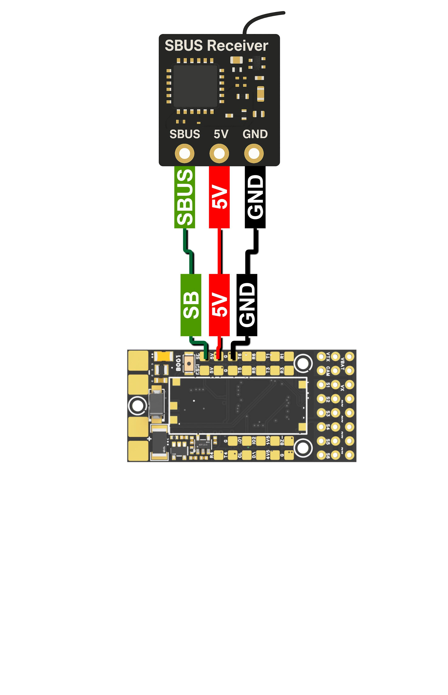

### 与SBUS连接接线图

GPS - 查看产品说明书和购买链接

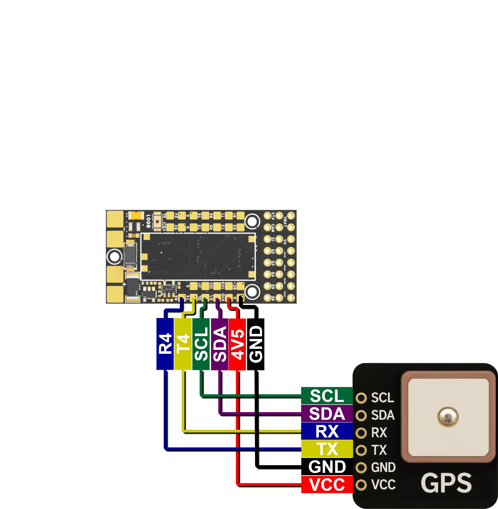

### 与FlyingRC® GPS连接接线图

模拟摄像头与图传

### 与模拟摄像头与图传连接接线图

带SBUS数字图传 (DJI,Walksnail)

### 与带SBUS数字图传连接接线图

ESC- 查看产品说明书和购买链接

与FlyingRC® AM32 Mini 40A电调连接接线图

飞控焊盘均在板上有文字标出其功能，如，T4代表UART4 TX端口，R1代表USART1 RX端口。

！！！注意，在Ardupilot固件中Serial编号与UART/USART编号非一一对应，对应表如下图！！！

！！！注意，焊接以后要对应的调整飞控参数，例如在上面的示例图中，GPS连接到了R4，T4，在下方串口对应表中可找到R4，T4对应Serial4，那么要把Serial4_Protocol设置为GPS，并且确认其它端口的功能没有被设置为GPS！！！

I/0接口/串口映射

PWM输出功能

PWM Group

PWM Channels

GPIO

Timer

DMA/DShot

Group1

PWM 5V tolerant I/O

S1

PWM1 GPIO50

TIM8_CH4

DMA/DShot

S2

PWM2 GPIO51

TIM8_CH3

DMA/DShot

Group2

S3

PWM3 GPIO52

TIM1_CH3N

DMA/DShot

S4

PWM4 GPIO53

TIM1_CH1

DMA/DShot

Goup3

S5

PWM5 GPIO54

TIM2_CH4

DMA/DShot

S6

PWM6 GPIO55

TIM2_CH3

DMA/DShot

S7

PWM7 GPIO56

TIM2_CH2

DMA/DShot

S8

PWM8 GPIO57

TIM2_CH1

DMA/DShot

Goup4

S9

PWM9 GPIO58

TIM12_CH1

NO DMA

Goup5

S10

PWM10 GPIO59

TIM13_CH1

NO DMA

Goup6

S11

PWM11 GPIO60

TIM4_CH1

NO DMA

Goup7

LED pad

PWM12 GPIO61

TIM3_CH4

DMA/DShot

SERVO12_FUNCTION 120, NTF_LED_TYPES neopixel

输出通道对DShot与常规PWM混合工作模式设有分组限制：

即对某一分组内的任一输出通道启用DShot协议时，该分组下所有输出通道均需统一配置并作为DShot通道使用，不可与PWM通道混用。

若同一分组内同时接入舵机与电机，需确保该分组按照舵机规格参数运行最低PWM频率。

例如：若舵机最高支持50Hz，则该分组下的电调也必须工作在50Hz。

LED pad为PWM扩展版S12端口，可以接WS2812灯带显示飞控状态

同组（Group）的PWM端口不可同时用于Dshot电调和50Hz PWM舵机

S9~S11无DMA功能，不能使用DShot协议电调

串口映射对应列表

PCB 丝印

UART 编号

协议 Protocol

配置 Config

SERIAL_X

UART 5V tolerant I/O

USB

USB

console

SERIAL0

TX1 RX1

USART1

with DMA

telem1

SERIAL1

TX3 RX3

USART3

NO DMA

telem2

SERIAL2

TX5 RX5

UART5

NO DMA

GPS1

SERIAL3

TX4 RX4

UART4

NO DMA

USER

SERIAL4

TX6 RX6

USART6

TX6 with DMA

USER

SERIAL5

SBUS

USART2

with DMA

RC input/Receiver

SERIAL6

BRD_ALT_CONFIG 0 Default

Sbs pad

SBUS

Ardupilot固件UART/USART与SERIAL对应关系，及其默认功能

USART2因为飞控体积原因仅引出SBUS焊盘，RX2，TX2功能不可用

数据量较大的设备，例如CRSF接收器，高清天空端，推荐连接在带有DMA功能的端口，如USART1（SERIAL1）

I2C总线

I2C 编号

配置 Config

参数 Parameterl

Value

I2C1

5V tolerant I/O

Compass

COMPASS_AUTODEC

1

onboard Baro SPL06 - 001

Address

0x76

Digital Airspeed I2C

ARSPD_BUS

1

MS4525

ARSPD_TYPE

1

DLVLR - L10D

ARSPD_TYPE

9

内置气压计占用0x76地址，不可在外部接入任何地址为0x76的设备

ADC模拟信号输入

RSSI Pad

0 - 3.3V

RSSI ADC

RSSI_ANA_PIN

8

Analog RSSI

RSSI_TYPE

2

也可用于外接电流计，用法见此，PIN值如表中所示为8

Ardupilot通用参数设置：

LOG_BACKEND_TYPE = 1，开启TF卡黑匣子功能，记录飞行日志

BATT_VOLT_PIN     14

BATT_VOLT_MULT   21.0，电压计比例默认值，误差5%，额外校准非必须

BATT_CURR_PIN     15

BATT_AMP_PERVLT  39.2，电流计比例默认值，误差10%，需要额外校准

INAV通用参数设置：

电压计比例默认值2100，误差5%，额外校准非必须

电流计比例默认值255，误差10%，需要额外校准

## 四、技术问题咨询

若遇技术问题，建议先查阅产品说明书；也可前往AI平台、B站等渠道获取帮助。同时欢迎群友互相协助，分享已知解决方案。

请注意：本产品Ardupilot固件提供有限技术支持，INAV和BF固件无技术支持

## 五、维修服务

保修服务期限及内容

·  已焊接产品、人为损坏不享受免费保修。

·  配套易损配件不在保修范围内，可至 FlyingRC® 淘宝店另行购买。

若首次使用后没有发现产品存在问题，视为产品性能正常，不存在质量问题。后续使用中出现任何问题，视为用户不规范操作的所致。FlyingRC®提供两种售后服务供用户选择。

适用条件：用户购买产品1年内，可享受1次优惠以旧换新，需寄回故障产品。

折扣规则：按淘宝店正常售价7折购买全新同款同配置产品；换新品不再享受维修和售后服务。

付费维修寄送要求：

客户寄修前请先电话或微信联系工作人员，说明电路损坏原因与故障情况，确认是否可修。

产品寄出后，请主动提供运单号。未与维修工程师沟通直接寄回，若出现快递丢失、无法维修等情况，损失由客户自行承担。

随货请附纸条，注明：产品具体故障、故障原因、操作过程，并填写联系方式、回寄地址。拒收顺丰及到付件。

未附纸条导致无法联系、无法维修的，后果由客户承担。客户超过 3 个月未联系的，产品将按无主件报废处理。

因客户参数设置错误导致产品异常，工程师重新刷固件或校正参数的，将收取检测费 10–20 元。

维修内容

项目编号

更换芯片型号

材料费+手工费=维修费

飞控主控

1

STM32F405RGT6

30+15=45

2

STM32H743VIT6

50+30=80

3

STM32H743VIH6

65+45=110

电调主控

4

QF32F4AK8U7

8+10=18

5

AT32F421K8U7

6+10=16

飞控传感器

6

ICM-42688-P

70+12=82

7

ICM-42605

50+12=62

8

SPL06

4+10=16

9

DPS310/DPS368

25+12=37

飞控电源芯片

10

MP9943

7+10=17

11

MP9447

10+10=20

12

MP9942

8+10=18

13

LM25148

26+15=41

14

LDO

4+5=9

电调场效应管

15

IRF7480

5+5=10

16

HYG022N04LS1C1

3+5=8

其它元器件

17

电阻、电容、插座等

2+5=7

注：表格里是单一原件维修价格。

请注意：自行维修、打胶、PCB烧坏/击穿（全部芯片烧毁）和进水（元器件/PCB腐蚀）的飞控没有继续使用和维修价值，FlyingRC®不提供维修服务,客户可以选择7折以旧换新。

FlyingRC® 其它产品介绍

全新升级7

**1. 飞控类39**

**2. 电调类42**

**3. 飞塔类44**

4. BEC 降压电路类48

5. 模块类50

6. 其他类51

飞控类

全新升级、功能更强

FlyingRC官方零售价：140元

中文说明书   Product Manual   去淘宝购买

经典产品、设计独特、好评如潮

中文说明书  Product Manual

性能强劲，双陀螺仪

FlyingRC官方零售价：299元

中文说明书  Product Manual

性能强劲，双陀螺仪,BEC输出能力强

FlyingRC官方零售价：259元

中文说明书  Product Manual  去淘宝购买

2025年 爆款产品,设计感爆棚,全网最Mini

FlyingRC官方零售价：89元

中文说明书   Product Manual  去淘宝购买

全新升级、功能更强

FlyingRC官方零售价：269元/299元

中文说明书 Product Manual 去淘宝购买

算力强大 飞行稳定精准 接口丰富 操控自如

中文说明书   Product Manual

算力强大 飞行稳定精准 接口丰富 操控自如

FlyingRC官方零售价：129元

中文说明书   Product Manual  去淘宝购买

电调类

本店销量No.4

高端产品,英飞凌金封MOS,工艺最佳,单路持续75AFlyingRC官方零售价：269元

中文说明书 Product Manual 去淘宝购买

性能出色，性价比高，入门首选

FlyingRC官方零售价：149元

中文说明书 Product Manual  去淘宝购买

设计独特，独家产品 用于无人机等空中、陆地、水上双动力设备    FlyingRC官方零售价：89元

中文说明书 Product Manual 去淘宝购买

英飞凌金封MOS 工艺出色 过流能力强大

FlyingRC官方零售价：87元（不带BEC版本）

中文说明书 Product Manual 去淘宝购买

设计独特，独家产品 用于无人机等空中、陆地、水上双动力设备    FlyingRC官方零售价：188元

中文说明书 Product Manual 去淘宝购买

客户可以用自己的功率板，制作不同规格电调

FlyingRC官方零售价：47元

中文说明书 Product Manual 去淘宝购买

超Mini 用于小型和微型机 过流能力强 运行稳定 FlyingRC官方零售价：43元

中文说明书 Product Manual 去淘宝购买

飞塔类

H743穿越机飞控+四合一穿越机75A金封电调

专业飞行首选，旗舰用料工艺，良心价格

FlyingRC官方零售价：560元

飞控中文说明书   电调中文说明书

FC Product Manual  ESC Product Manual

去淘宝购买

F405穿越机飞控+四合一穿越机75A金封电调

爆款组合，性能出色，良心价格

FlyingRC官方零售价：398元

飞控中文说明书    电调中文说明书

FC Product Manual ESC Product Manual

去淘宝购买

H743穿越机飞控+四合一穿越机45A电调

爆款组合，性能出色，价格亲民

FlyingRC官方零售价：439元

飞控中文说明书     电调中文说明书

FC Product Manual  ESC Product Manual

去淘宝购买

F405穿越机飞控+四合一穿越机45A电调

爆款组合，实惠之选，价格亲民

FlyingRC官方零售价：278元

飞控中文说明书     电调中文说明书

FC Product Manual  ESC Product Manual

去淘宝购买

F4WSE PRO飞控+二合一40A电调

独特设计、独家产品、爆款组合

FlyingRC官方零售价：227元

飞控中文说明书      电调中文说明书

FC Product Manual   ESC Product Manual

去淘宝购买

BEC 降压电路类

多电压可选 行业首选，物美价廉

FlyingRC官方零售价：74元

中文说明书 Product Manual 去淘宝购买

多电压可选 行业首选，物美价廉

FlyingRC官方零售价：18元

中文说明书 Product Manual 去淘宝购买

多电压可选 行业首选，物美价廉

FlyingRC官方零售价：36元

中文说明书 Product Manual 去淘宝购买

多电压可选，持续5A输出

FlyingRC官方零售价：17元

中文说明书  Product Manual  去淘宝购买

独立降压，稳定供电，让飞行更安全

FlyingRC官方零售价：18元

中文说明书  Product Manual  去淘宝购买

模块类

超高分辨率、低功耗、行业首选

FlyingRC官方零售价：129元

中文说明书  Product Manual  去淘宝购买

行业首选，物美价廉

FlyingRC官方零售价：199元

中文说明书 Product Manual 去淘宝购买

其他类

行业首选，物美价廉

FlyingRC官方零售价：109元

中文说明书  Product Manual 去淘宝购买

真分集接收,温度补偿，高功率接收

FlyingRC官方零售价：109元

中文说明书  Product Manual  去淘宝购买

支持BL，BL32，AM32 简单好用

FlyingRC官方零售价：9.9元/7.9元（A口/C口）焊好

FlyingRC官方零售价：6.9元/5.9元（A口/C口）自己焊

中文说明书 Product Manual 去淘宝购买

一体设计，全网最Mini MS4525D协议，I2C接口

FlyingRC官方零售价：95元

中文说明书  Product Manual  去淘宝购买

一体设计，全网最Mini MS4525D协议，I2C接口

FlyingRC官方零售价：    95元

中文说明书  Product Manual

一体设计，全网最Mini MS4525D协议，I2C接口

FlyingRC官方零售价：39元

中文说明书  Product Manual  去淘宝购买

长距离传输，高速率，稳定性强

FlyingRC官方零售价：46元

中文说明书  Product Manual  去淘宝购买

支持各种开源飞控 多尺寸可选 搜星能力强 性价高

FlyingRC官方零售价：68元(18*18mm款)

中文说明书  Product Manual  去淘宝购买

FlyingRC®官网

www.FlyingRC®.cn

淘宝店铺

闲鱼店铺

群号1016199449

电话:021-58204886 手机:13122492475   微信:13122492475、18019464804

---

## USB 驱动与连接

--8<-- "shared/flight-controller/usb-driver.md"

---

## 接收机连接

--8<-- "shared/flight-controller/receiver-wiring.md"

---

## 安全须知

--8<-- "shared/safety.md"

---

## 首次使用检查

--8<-- "shared/first-use-check.md"

---

## 技术支持

--8<-- "shared/support.md"

---

## 售后与保修

--8<-- "shared/warranty.md"

---

## FlyingRC® 其它产品

--8<-- "shared/other-products.md"

---

## 免责声明

--8<-- "shared/disclaimer.md"

