# FlyingRC® U-Blox M10 GPS 产品手册

> 状态：在售 · 类别：gps · 内容自原 WPS 说明书迁入

---

## 一、FlyingRC介绍

## 产品概述

FlyingRC® U-Blox M10 GPS 目前有3款，分别是18*18mm，20*20mm，28*28mm

其中18*18mm款不带罗盘，20*20mm款和28*28mm款均内置IST5883罗盘。

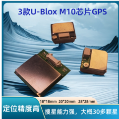

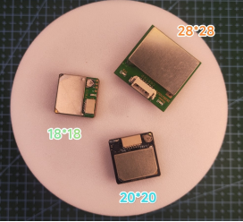

18*18mm款介绍

M10 GPS是一款高性能面向车载组合导航领域的定位G-MOUSE。该产品采用了UBLOX 1050-KB低功耗芯片,支持同时接收多达四个全球导航卫星系统（GPS、GLONASS、伽利略和北斗）。大量可见卫星使接收器能够选择最佳信号。这将最大限度地提高定位精度，尤其是在具有挑战性的条件下，具备全方位功能，能满足专业定位的严格要求。体积小巧，集成flash，支持修改保存参数，准确的定位。

## 技术参数

| 项目 | 说明 | 产品参数 |
|------|------|------|
| 芯片特性 | 芯片 | U-blox UBX - 1050 - KB |
|  | 频率 | L1, 1575.42MHz； |
|  | 波特率 | 4800bps - 921600bps (默认 38400bps) |
|  | 通道 | 72CH |
| 灵敏度 | 跟踪 | -167dBm |
|  | 捕捉 | -159dBm |
|  | 冷启动 | -147dBm |
| 启动时间 | 冷启动 | 平均 32 秒 |
|  | 温启动 | 平均 10 秒 |
|  | 热启动 | 平均 1 秒 |
| 精度 | 水平精度 | 2.0 米 CEP 2D RMS SBAS 辅助（开阔天空处） |
|  | 时间精度 | 30 ns |
| 工作限制 | 最大高度 | 80000 米 |
|  | 最大速度 | 500 m/s |
|  | 最大加速度 | ≤ 4G |
| 输出数据 | 输出电平 | TTL 电平 |
|  | 输出协议 | NMEA0183 标准协议 / UBX |
|  | 更新频率 | 0.25 - 10 Hz（默认 1Hz） |
| 物理特性 | 外形尺寸 | 18 x 18 x 8mm |
|  | 重量 | 12 克 |
| 工作环境 | 工作温度 | -40℃ to 85℃ |
|  | 储存温度 | -40℃ to 85℃ |
|  | PPS 灯 | 未定位前 PPS 灯不亮，定位成功后，PPS 灯闪烁 |

管脚定义

| 名称 | 描述 |
|------|------|
| VCC | 系统主电源，供电电压为 + 3.3V~+5V, 工作时消耗电流约 25mA |
| TX | UART/TTL 接口，TXD |
| RX | UART/TTL 接口，RXD |
| GND | 接地 |

产品亮点

1.行业标准的 18*18*4mm 高灵敏度 GPS 天线

**2.采用 0.5PPM 高精度 TCXO**

**3.内建 RTC 晶体及皮法电容更快的热启动**

4.内建 LNA，低噪声信号放大器

5.采用 U-BLOX 1050-KB 芯片，支持温启动

6.带 flash，支持 0.25-10Hz 定位更新速率修改保存

7.支持 AssistNow Online 和 AssistNow Offline Service 等 A-GPS 服务

8.GPS、北斗、GLONASS、伽利略（WAAS、EGNOS、MSAS、GAGAN）混合引擎

20*20款介绍

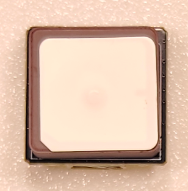

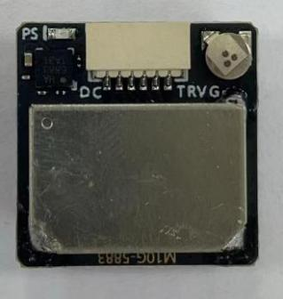

## 技术参数

| 参数 | 说明 | 详情 |
|------|------|------|
| 芯片特性 | 芯片 | U-blox M10050 - KB |
|  | 频率 | GPS L1，GLONASS L1，BDS B1，GALILEO E1，SBAS L1，QZSS L1 |
|  | 工作模式 | GPS，GLONASS，BDS，GALILEO，SBAS 和 QZSS。默认 GPS + GLONASS + SBAS + QZSS 联合定位。对精度要求高的客户，建议用 GPS + GLONASS + SBAS + QZSS + GALILEO 或者 GPS + BDS + SBAS + QZSS + GALILEO 联合定位模式 |
|  | 通道 | 72 搜索通道 |
| 灵敏度 | 跟踪 | -167dBm |
|  | 重捕 | -160dBm |
|  | 冷启动 | -148dBm |
|  | 热启动 | -156dBm |
| 精度 | 水平精度 | 2.0 米 CEP 2D RMS SBAS 辅助（开阔天空处） |
|  | 速度精度 | 0.1m/s 95%（SA off） |
|  | 时间精度 | 1ns |
| 启动时间 | 冷启动 | 26s |
|  | 暖启动 | 24s |
|  | 热启动 | 1s |
| 输出数据 | 波特率 | 默认 38400bps |
|  | 输出电平 | TTL 电平 |
|  | 输出协议 | NMEA - 0183 协议 |
|  | NMEA 语句 | RMC，VTG，GGA，GSA，GSV，GLL |
|  | 更新频率 | 1Hz - 10Hz，默认 1Hz |
|  | FLASH | 4M FLASH，可以更改配置，断电不丢失 |
| 工作限制 | 高度 | <50,000m |
|  | 速度 | <515m/s |
|  | 重力加速度 | <4g |
| 电源消耗 | 电压 | 直流 3.6V - 5.5V，典型：5.0V |
|  | 电流 | 正常 50mA/5.0V |
| 物理参数 | 尺寸 | 20mm * 20mm * 6mm |
|  | 重量 | 12.0 克 |
|  | 连接器 | 1.25 间距 6pin 座子 |
| 环境 | 操作温度 | -40℃～+85℃ |
|  | 存储温度 | -40℃～+105℃ |
| 指示灯 | TX 灯 | 上电蓝灯闪烁，表示有数据输出 |
|  | PPS 灯 | 未定位该灯不亮；3D 定位后，开始闪烁 |
| 罗盘 | 罗盘 | 内部带电子罗盘 IST5883 |

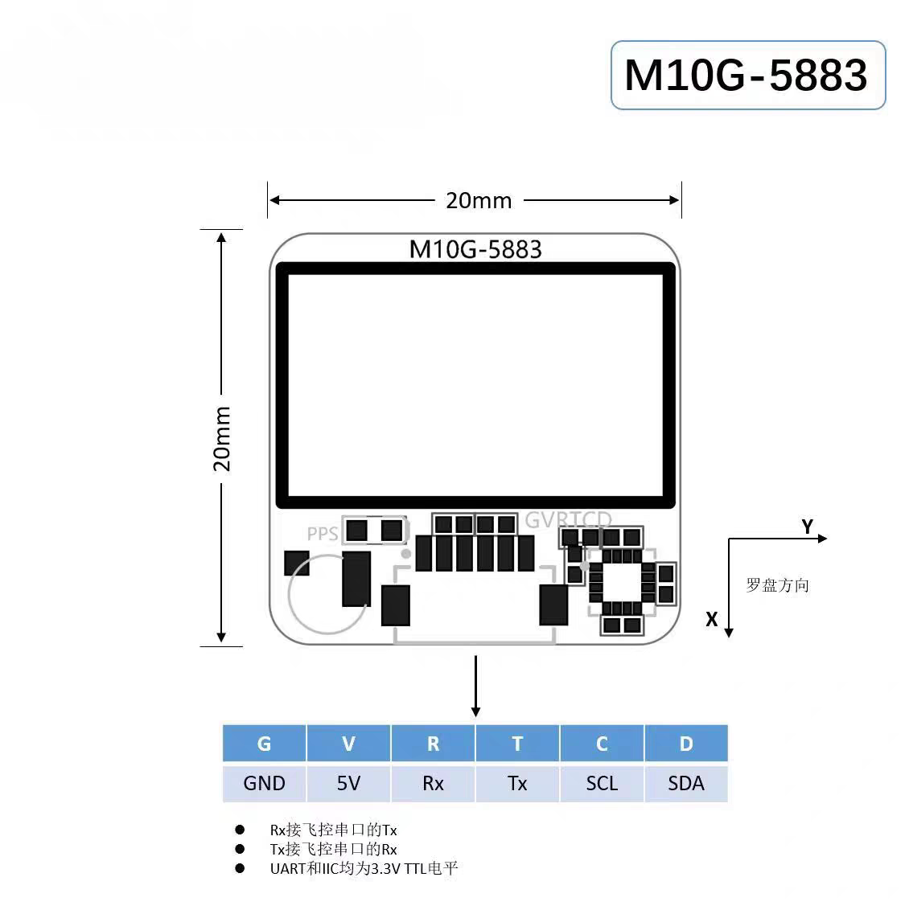

M10G-5883 U-Blox M10 GPS模块（20×20mm）技术图

管脚定义

| 序号 | 名称 | I/O | 描述 | 特性 |
|------|------|------|------|------|
| 1 | SDA | D | 串行数据-I2C 总线主/从数据 | 罗盘数据引脚 |
| 2 | SCL | C | 串行数据-I2C 时钟线主/从数据 | 罗盘数据引脚 |
| 3 | TX | T | UART 通讯接口，TTL 电平 | GPS 数据输出引脚 |
| 4 | RX | R | UART 通讯接口，TTL 电平 | GPS 数据输入引脚 |
| 5 | 5V | V | 主电源，直流输入 | DC 3.6V - 5.5V；推荐 5.0V |
| 6 | GND | G | 接地 | 接地 |

指示灯:

TX 灯，上电绿灯闪烁，表示有数据输出。

绿灯，PPS 灯，未定位该灯不亮；3D 定位后，开始闪烁。

## 产品特点

采用M10G-5883 GNSS模组采用UBLOX最新一代芯片M10

采用高性能小体积进口天线

迷你易安装采用高性能小体积进口天线，小型化设计，性能不缩水重量轻至7g，非常适合小型穿越机/圈圈机/轻型固定翼使用

28*28款介绍

## 技术参数

| 参数 | 说明 | 详情 |
|------|------|------|
| 芯片特性 | 芯片 | U-blox M10050 - KB |
|  | 频率 | GPS L1，GLONASS L1，BDS B1，GALILEO E1，SBAS L1，QZSS L1 |
|  | 工作模式 | GPS，GLONASS，BDS，GALILEO，SBAS 和 QZSS。默认 GPS + GLONASS + SBAS + QZSS 联合定位。对精度要求高的客户，建议用 GPS + GLONASS + SBAS + QZSS + GALILEO 或者 GPS + BDS + SBAS + QZSS + GALILEO 联合定位模式 |
|  | 通道 | 72 搜索通道 |
| 灵敏度 | 跟踪 | -167dBm |
|  | 重捕 | -160dBm |
|  | 冷启动 | -148dBm |
|  | 热启动 | -156dBm |
| 精度 | 水平精度 | 2.0 米 CEP 2D RMS SBAS 辅助（开阔天空处） |
|  | 速度精度 | 0.1m/s 95%（SA off） |
|  | 时间精度 | 1ns |
| 启动时间 | 冷启动 | 26s |
|  | 暖启动 | 24s |
|  | 热启动 | 1s |
| 输出数据 | 波特率 | 默认 38400bps |
|  | 输出电平 | TTL 电平 |
|  | 输出协议 | NMEA - 0183 协议 |
|  | NMEA 语句 | RMC，VTG，GGA，GSA，GSV，GLL |
|  | 更新频率 | 1Hz - 10Hz，默认 1Hz |
|  | FLASH | 4M FLASH，可以更改配置，断电不丢失 |
| 工作限制 | 高度 | <50,000m |
|  | 速度 | <515m/s |
|  | 重力加速度 | <4g |
| 电源消耗 | 电压 | 直流 3.6V - 5.5V，典型：5.0V |
|  | 电流 | 正常 50mA/5.0V |
| 物理参数 | 尺寸 | 28mm28mm8.5mm |
|  | 重量 | 13.0 克 |
|  | 连接器 | 1.25 间距 6pin 座子 |
| 环境 | 操作温度 | -40℃～+85℃ |
|  | 存储温度 | -40℃～+105℃ |
| 指示灯 | TX 灯 | 上电蓝灯闪烁，表示有数据输出 |
|  | PPS 灯 | 未定位该灯不亮；3D 定位后，开始闪烁 |
| 罗盘 | 罗盘 | 内部带电子罗盘 IST5883 |

管脚定义:

| 序号 | 名称 | I/O | 描述 | 特性 |
|------|------|------|------|------|
| 1 | SDA | D | 串行数据-I2C 总线主/从数据 | 罗盘数据引脚 |
| 2 | SCL | C | 串行数据-I2C 时钟线主/从数据 | 罗盘数据引脚 |
| 3 | TX | T | UART 通讯接口，TTL 电平 | GPS 数据输出引脚 |
| 4 | RX | R | UART 通讯接口，TTL 电平 | GPS 数据输入引脚 |
| 5 | VCC | V | 主电源，直流输入 | DC 3.6V - 5.5V；推荐 5.0V |
| 6 | GND | G | 接地 | 接地 |
| No. | Name | I/O | Description | Features |
| 1 | SDA | D | Serial Data - I2C Bus Master/Slave Data | Compass data pin |
| 2 | SCL | C | Serial Data - I2C Clock Line Master/Slave Data | Compass data pin |
| 3 | TX | T | UART Communication Interface, TTL Logic Level | GPS data output pin |
| 4 | RX | R | UART Communication Interface, TTL Logic Level | GPS data input pin |
| 5 | VCC | V | Main Power Supply, DC Input | DC 3.6V - 5.5V；5.0V recommended |
| 6 | GND | G | Ground | Ground |

管脚定义图：

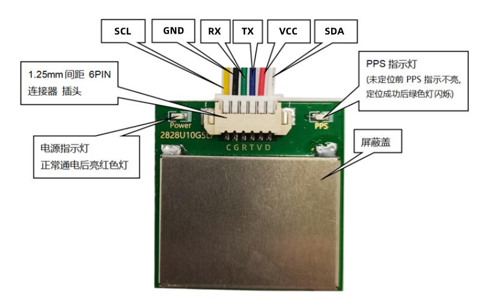

## 三、使用方法

BF固件:

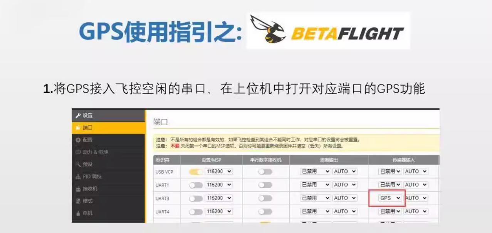

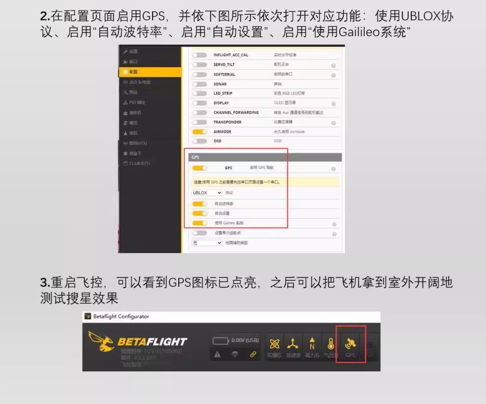

INAV固件:

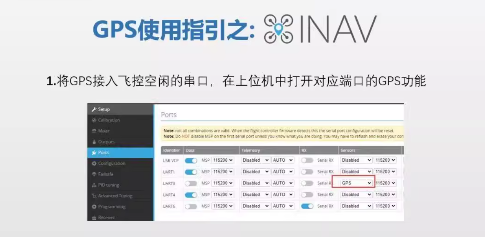

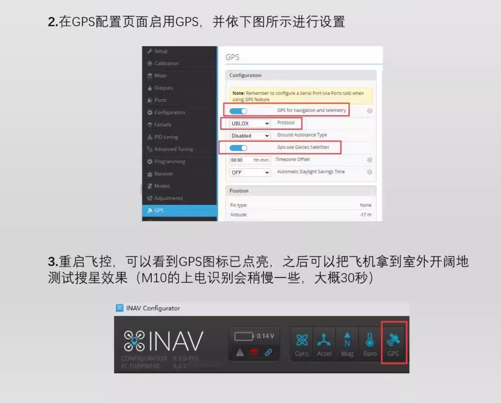

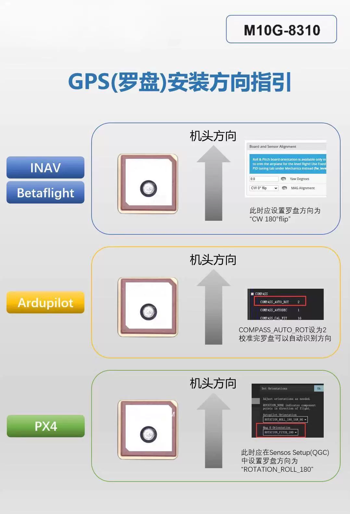

注意事项

请勿在高温、潮湿或强电磁干扰的环境下使用接收机，以免影响设备性能和使用寿命。

避免接收机受到剧烈撞击或跌落，防止内部硬件损坏。

定期检查接收机的连接线路，确保连接牢固，无松动或损坏。

在使用过程中，如发现设备异常，应立即停止使用，并联系专业技术人员进行检修。

## 四、技术问题咨询

若遇技术问题，建议先查阅产品说明书；也可前往AI平台、B站等渠道获取帮助。同时欢迎群友互相协助，分享已知解决方案。

请注意：本产品Ardupilot固件提供有限技术支持，INAV和BF固件无技术支持

## 五、维修服务

本品不提供售后维修服务

## 六、FlyingRC® 其它产品介绍

飞控类

| 产品1.FlyingRC® F4WSE F405 Pro主控固定翼飞控            本店销量No.1 / 全新升级、功能更强 / FlyingRC官方零售价：140元 / 中文说明书   Product Manual   去淘宝购买 |  |
|------|------|
| 产品2.FlyingRC® F4WSE - F405主控固定翼飞控(停产) / 经典产品、设计独特、好评如潮 / 中文说明书  Product Manual |  |
| 产品3.FlyingRC® H7Wlite H743主控固定翼飞控(停产) / 性能强劲，双陀螺仪 / FlyingRC官方零售价：299元 / 中文说明书  Product Manual |  |
| 产品4.FlyingRC® H7Wlite Pro H743主控固定翼飞控         本店销量No.7 / 性能强劲，双陀螺仪,BEC输出能力强 / FlyingRC官方零售价：259元 / 中文说明书  Product Manual  去淘宝购买 |  |
| 产品5.FlyingRC® F4Wing Mini F405主控固定翼飞控           本店销量No.2 / 2025年 爆款产品,设计感爆棚,全网最Mini / FlyingRC官方零售价：89元 / 中文说明书   Product Manual  去淘宝购买 |  |
| 产品6.FlyingRC® H7D Pro H743主控穿越机飞控                 本店销量No.3 / 全新升级、功能更强 / FlyingRC官方零售价：269元/299元 / 中文说明书 Product Manual 去淘宝购买 |  |
| 产品7.FlyingRC® H7D MK1 H743主控双陀螺仪穿越机飞控(停产) / 算力强大 飞行稳定精准 接口丰富 操控自如 / 中文说明书   Product Manual |  |
| 产品8.FlyinRC® F4D MK1 F405主控 20\30.5孔距 穿越机飞控    本店销量No.9 / 算力强大 飞行稳定精准 接口丰富 操控自如 / FlyingRC官方零售价：129元 / 中文说明书   Product Manual  去淘宝购买 |  |

电调类

| 产品9.FlyingRC® 4IN1 75A ESC 四合一穿越机金封电调 / 本店销量No.4 / 高端产品,英飞凌金封MOS,工艺最佳,单路持续75AFlyingRC官方零售价：269元 / 中文说明书 Product Manual 去淘宝购买 |  |
|------|------|
| 产品10.FlyingRC® 4IN1 45A ESC  四合一穿越机电调 / 性能出色，性价比高，入门首选 / FlyingRC官方零售价：149元 / 中文说明书 Product Manual  去淘宝购买 |  |
| 产品11.FlyingRC® AM32 Dual ESC 40A 二合一电调                本店销量No.12 / 设计独特，独家产品 用于无人机等空中、陆地、水上双动力设备    FlyingRC官方零售价：89元 / 中文说明书 Product Manual 去淘宝购买 |  |
| 产品12.FlyingRC® AM32 ESC 75A V2.5单体金封电调                 本店销量No.6 / 英飞凌金封MOS 工艺出色 过流能力强大 / FlyingRC官方零售价：87元（不带BEC版本） / 中文说明书 Product Manual 去淘宝购买 |  |
| 产品13.FlyingRC® AM32 75A CAN总线单体金封电调 / 设计独特，独家产品 用于无人机等空中、陆地、水上双动力设备 / FlyingRC官方零售价：188元 / 中文说明书  Product Manual  去淘宝购买 / 【产品配图待补】 / 产品14.FlyingRC® AM32 ESC单体金封电调控制板(带BEC) / 客户可以用自己的功率板，制作不同规格电调 / FlyingRC官方零售价：47元 / 中文说明书 Product Manual 去淘宝购买 |  |
| 产品15.FlyingRC® AM32 Mini ESC 40A V1单体电调           本店销量No.10 / 超Mini 用于小型和微型机 过流能力强 运行稳定 FlyingRC官方零售价：43元 / 中文说明书 Product Manual 去淘宝购买 |  |

飞塔类

| 产品16.FlyingRC® 高阶版飞塔套装 / H743穿越机飞控+四合一穿越机75A金封电调 / 专业飞行首选，旗舰用料工艺，良心价格 / FlyingRC官方零售价：528元 / 飞控中文说明书   电调中文说明书 / FC Product Manual  ESC Product Manual / 去淘宝购买 |  |
|------|------|
| 产品17.FlyingRC® 进阶版飞塔套装 / F405穿越机飞控+四合一穿越机75A金封电调 / 爆款组合，性能出色，良心价格 / FlyingRC官方零售价：398元 / 飞控中文说明书    电调中文说明书 / FC Product Manual ESC Product Manual / 去淘宝购买 |  |
| 产品18.FlyingRC® 进阶版飞塔套装 / H743穿越机飞控+四合一穿越机45A电调 / 爆款组合，性能出色，价格亲民 / FlyingRC官方零售价：408元 / 飞控中文说明书     电调中文说明书 / FC Product Manual  ESC Product Manual / 去淘宝购买 |  |
| 产品19.FlyingRC® 基础版飞塔套装 / F405穿越机飞控+四合一穿越机45A电调 / 爆款组合，实惠之选，价格亲民 / FlyingRC官方零售价：278元 / 飞控中文说明书     电调中文说明书 / FC Product Manual  ESC Product Manual / 去淘宝购买 |  |
| 产品20.FlyingRC® 固定翼飞塔套装 / F4WSE PRO飞控+二合一40A电调 / 独特设计、独家产品、爆款组合 / FlyingRC官方零售价：237元 / 飞控中文说明书      电调中文说明书 / FC Product Manual   ESC Product Manual / 去淘宝购买 |  |

BEC 降压电路类

| 产品21.FlyingRC® 10A 12S BEC降压模块 / 多电压可选 行业首选，物美价廉 / FlyingRC官方零售价：74元 / 中文说明书 Product Manual 去淘宝购买 |  |
|------|------|
| 产品22.FlyingRC® 5A 2-12S BEC降压模块 / 多电压可选 行业首选，物美价廉 / FlyingRC官方零售价：31元 / 中文说明书 Product Manual 去淘宝购买 / 【产品配图待补】 / 产品23.FlyingRC® 10A 8S BEC降压模块 / 多电压可选 行业首选，物美价廉 / FlyingRC官方零售价：36元 / 中文说明书 Product Manual 去淘宝购买 |  |
| 产品24.FlyingRC® 5A 6S BEC降压模块  本店销量No.5 / 多电压可选，持续5A输出 / FlyingRC官方零售价：17元 / 中文说明书  Product Manual  去淘宝购买 |  |
| 产品25.FlyingRC® Mini BEC For DJI O4 / 独立降压，稳定供电，让飞行更安全 / FlyingRC官方零售价：18元 / 中文说明书  Product Manual  去淘宝购买 |  |

模块类

| 产品26.FlyingRC® RM3100 SPI Module 罗盘模块 / 超高分辨率、低功耗、行业首选 / FlyingRC官方零售价：129元 / 中文说明书  Product Manual  去淘宝购买 |  |
|------|------|
| 产品27.FlyingRC® L4CAN RM3100 CAN总线罗盘模块 / 行业首选，物美价廉 / FlyingRC官方零售价：199元 / 中文说明书 Product Manual 去淘宝购买 |  |

其他类

| 产品28.FlyingRC® 10A 12S 400A穿越机分电板                      本店销量No.8 / 行业首选，物美价廉 / FlyingRC官方零售价：109元 / 中文说明书  Product Manual 去淘宝购买 |  |
|------|------|
| 产品29.FlyingRC®  ELRS 2.4G 分集ELIS接收机                 本店销量No.11 / 真分集接收,温度补偿，高功率接收 / FlyingRC官方零售价：109元 / 中文说明书  Product Manual  去淘宝购买 |  |
| 产品30.FlyingRC®  AM32电调调参器 / 支持BL，BL32，AM32 简单好用 / FlyingRC官方零售价：9.9元/7.9元（A口/C口）焊好 / FlyingRC官方零售价：6.9元/5.9元（A口/C口）自己焊 / 中文说明书 Product Manual 去淘宝购买 |  |
| 产品31.FlyingRC® I2C无空速管数字新款空速计 / 一体设计，全网最Mini MS4525D协议，I2C接口 / FlyingRC官方零售价：95元 / 中文说明书  Product Manual  去淘宝购买 |  |
| 产品32.FlyingRC® 无空速管数字空速计 / 一体设计，全网最Mini MS4525D协议，I2C接口 / FlyingRC官方零售价：    95元 / 中文说明书  Product Manual  去淘宝购买 |  |
| 产品33.FlyingRC® I2C 外置电流计 / 一体设计，全网最Mini MS4525D协议，I2C接口 / FlyingRC官方零售价：39元 / 中文说明书  Product Manual  去淘宝购买 |  |
| 产品34.FlyingRC® L4 CAN RC/GPS Adapter  CAN总线串口&PWM扩展板 / 长距离传输，高速率，稳定性强 / FlyingRC官方零售价：46元 / 中文说明书  Product Manual  去淘宝购买 |  |
| 产品35.FlyingRC® U-Blox M10 GPS / 支持各种开源飞控 多尺寸可选 搜星能力强 性价高 / FlyingRC官方零售价：68元(18*18mm款) / 中文说明书  Product Manual  去淘宝购买 |  |

| FlyingRC®官网 / www.FlyingRC®.cn | 淘宝店铺 | 闲鱼店铺 | 群号1016199449 |
|------|------|------|------|

电话:021-58204886 手机:13122492475   微信:13122492475、18019464804

---

## 安全须知

--8<-- "shared/safety.md"

---

## 首次使用检查

--8<-- "shared/first-use-check.md"

---

## 技术支持

--8<-- "shared/support.md"

---

## 售后与保修

--8<-- "shared/warranty.md"

---

## FlyingRC® 其它产品

--8<-- "shared/other-products.md"

---

## 免责声明

--8<-- "shared/disclaimer.md"

