# FlyingRC® H7D Pro MK2 H743主控穿越机飞控产品手册

> 状态：在售 · 类别：flight-controller · 内容自原 WPS 说明书迁入

---

## 一、FlyingRC介绍

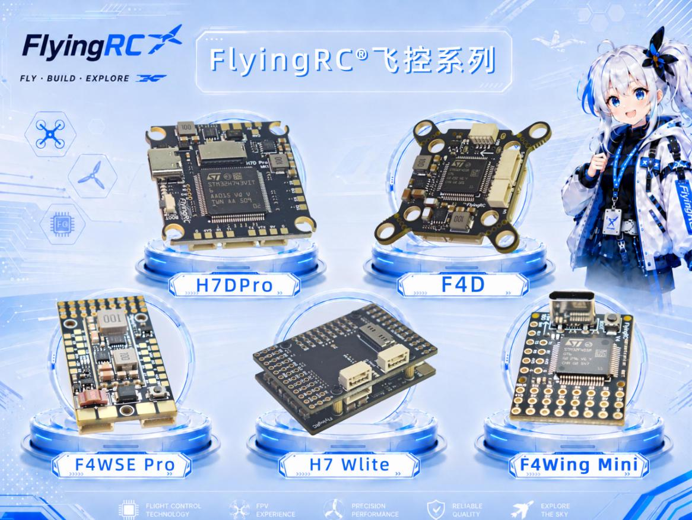

## 产品概述

H7D Pro版本与H7D版本相比增加了

**1.CAN总线接口**

**2.SWD调试焊盘**

**3.双3A BEC**

4.额外PWM输出焊盘

5.支持PX4固件

6.可选单/双42688陀螺仪

改动如下：

1.内置Flash改为外置TF卡，可支持多达64g黑匣子

**2.符合BF规范的标准插座**

**3.半孔减震柱安装孔，方便安装减震柱**

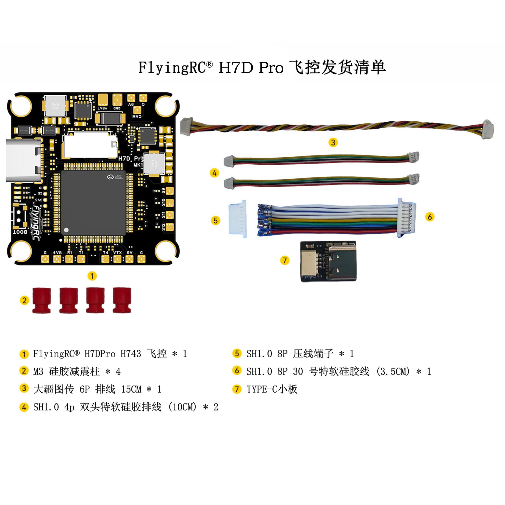

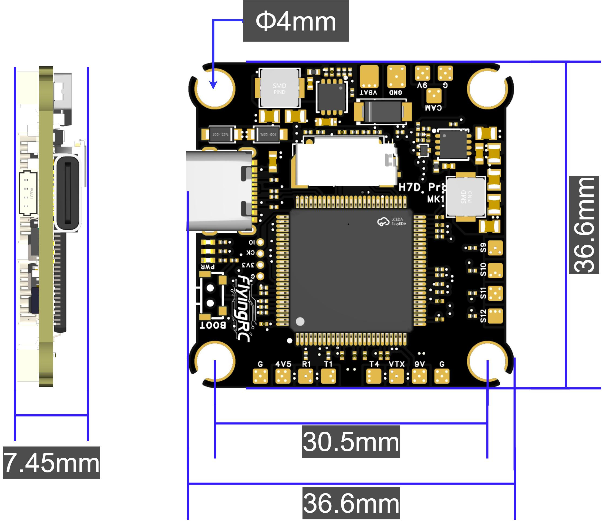

| 基础参数 | 传感器 |  |  |

|------|------|------|------|

| 型 号 | FlyingRC® H7D Pro | IMU(陀螺仪和加速度计) | 一颗或两颗Invensense 3代 ICM-42688-P |

| 尺 寸 | 36.6mm*36.6mm*7.45mm | 气 压 计 | SPA06-003 |

| 孔 距 | 30.5mm | 磁 力 计 | 无板载磁力计 |

| 质 量 | 9g | 模拟OSD | AT7465E |

| 主控 | 电源输出 |  |  |

| 主控芯片 | 主控STM32H743VIT6 | BEC芯片型号 | MP9443 + MP9943 |

| 主频 | 480 MHz | 板载降压模块BEC-设备 | 5V3A |

| Flash | 2 MB | 板载降压模块BEC-图传 | 9V3A |

| RAM | 1 MB |  |  |

| 接口 | 固件支持 |  |  |

| UART | 7组串口 | Betaflight | 支持(出厂默认) |

|  | UART1,UART2, UART3仅引出RX | INAV | 支持 |

|  | UART4-7, UART8仅引出TX | Ardupilot | 支持 |

| PWM | 13个（包括1个LED） | PX4 | 支持 |

| I2C | 1 |  |  |

| 电流 ADC 采样 | 支持 |  |  |

| SWD调试 | 无 | 工作环境 |  |

| 蜂鸣器接口 | 有，支持无源蜂鸣器 | VBAT供电范围 | 12-28V DC IN 3-6S LiPo |

| LED灯带接口 | 支持WS2812 | 电源输入 | 同VBAT供电范围 |

| USB-TYPE-C | 板载直插 | 工作温度范围 | -10-100℃ |

| 黑匣子存储 | 板载TF卡槽，最大支持32G | 存储温度范围 | 0-40℃ |

| SBUS | H7主控内置反向器 |  |  |

|  | SBUS可连接至任意RX接口 |  |  |

## 技术参数

主控STM32H743VIT6，双陀螺仪ICM-42688-P + BMI270，气压计DPS310或DPS368

Analog/HD OSD，7xUARTs（UART4仅引出TX，UART3仅引出RX），13xPWMs（4 + 4 + 4 + 1），1I2C，1ADC（RSSI），On-Board 9V BEC PinIO

黑匣子：板载TF卡槽

12~28V DC IN（3~6S LiPo，建议使用5s或6s Lipo或4s LiHV）

双BEC，MP9443 + MP9943方案，5V3A（设备）& 9V3A（图传，摄像头）

尺寸及重量：36.6mm×36.6mm×7.45mm，9.3g

## 产品特点

STM32H743VIT6主控，2MB Flash，1MB RAM，480MHz，性能强悍。

单/双陀螺仪ICM-42688-P，陀螺仪+加速计，专为无人机优化。

30.5mm孔距， M4标准螺孔（加装减震柱后适配M3螺丝），支持4~12寸穿越机。

13PWM输出，支持同时连接双4合1电调，支持X8或8轴。

预留了 DJI、CAN、GPS、LED、ESC、接收机等接口，可根据需求配置对应 UART 协议；同时留有摄像头、模拟图传、UART1、正负极等焊盘。

使用双高精度陀螺仪与高精度气压计，对比同类型飞控稳定性大幅度提升（使用AP固件时效果明显）。

拥有强大的BEC电流输出能力（设备供电5V3A）。

板载9V BEC 可通过 PINIO1（BF固件中User1）开关，地面调试时无需担心图传过热烧毁。

板载TF卡槽，存储容量无需担忧，可保存多次飞行数据。

符合Beatflight最新官方接口规范

## 使用方法

### 布局/LAYOUT：

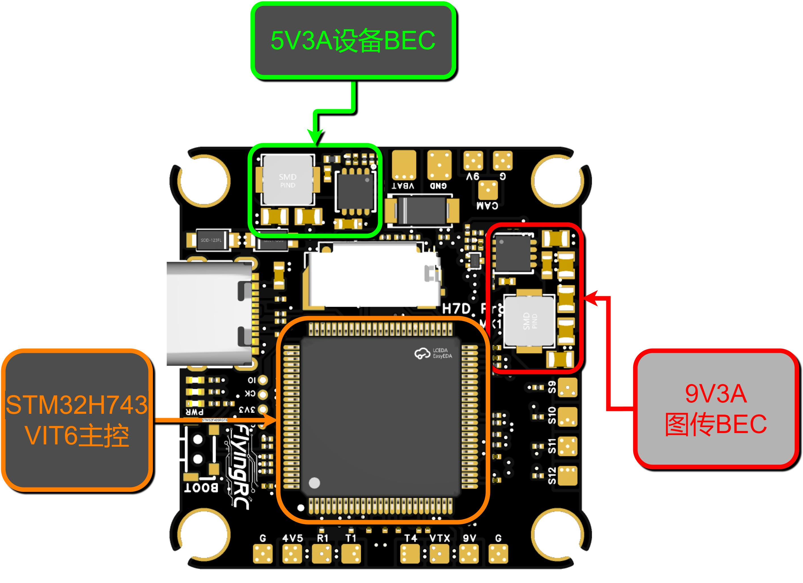

飞控3D示意图-正面

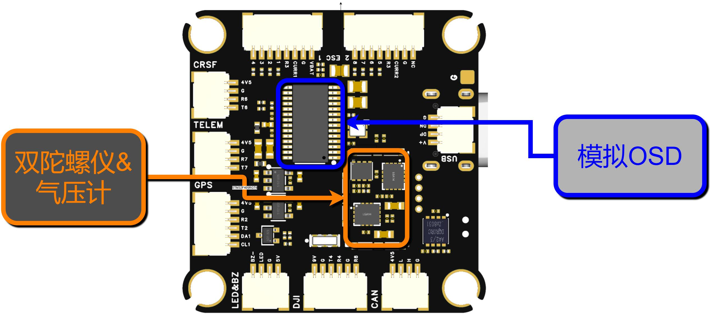

飞控3D示意图-反面

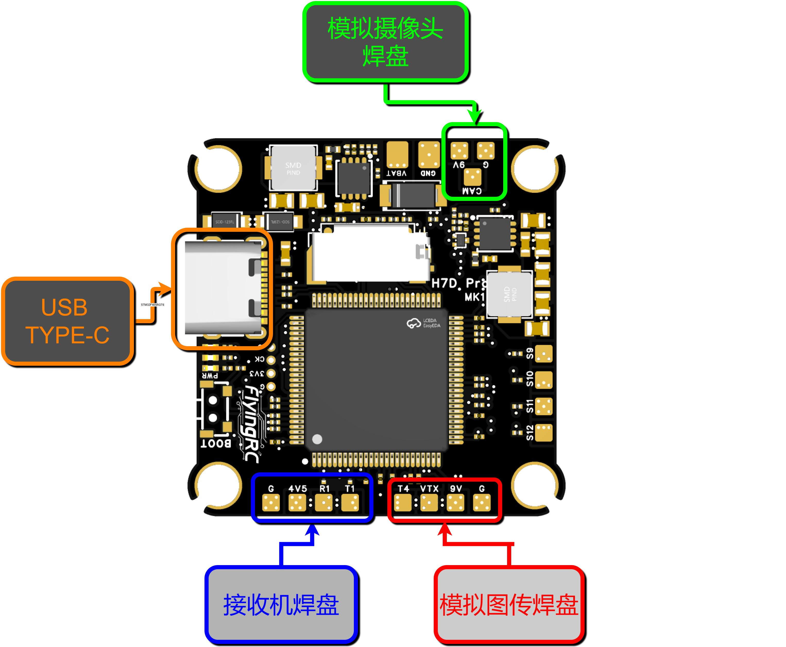

连接器、焊盘功能示意图-正面

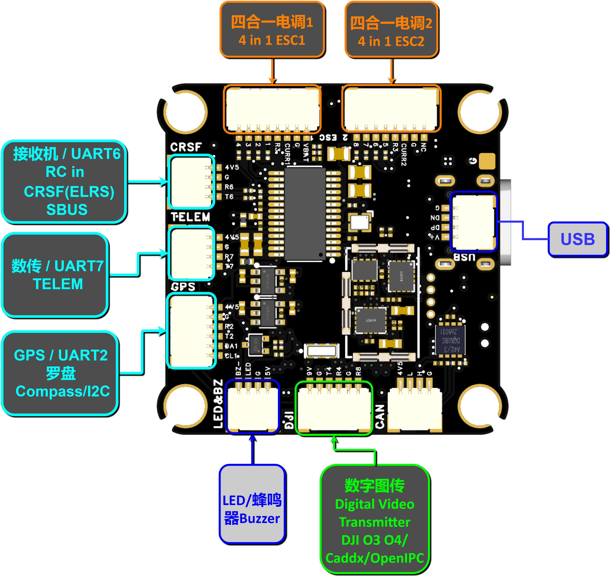

连接器、焊盘功能示意图-反面

| 丝印/功能 | 丝印 | 功能说明 |

|------|------|------|

| CRSF接收机端口（UART6） | 4V5 | 5V受控供电输出 |

|  | G | 地线（GND），所有信号的参考地 |

|  | R6 | UART6的接收端（RX6），连接接收机的TX（发送端） |

|  | T6 | UART6的发送端（TX6），连接接收机的RX（接收端） |

| ESC1四合一电调1（UART3） | 4 | 电机4信号输出线，信号控制第4号电机的转速 |

|  | 3 | 电机3信号输出线，信号控制第3号电机的转速 |

|  | 2 | 电机2信号输出线，信号控制第2号电机的转速 |

|  | 1 | 电机1信号输出线，信号控制第1号电机的转速 |

|  | R3 | UART3接收端（RX3），用于接收电调回传数据（遥测信息，如电机转速、电调温度等） |

|  | CURR1 | 电流传感器模拟输入端，用于电池mAh消耗计算和电流限制功能 |

|  | G | 地线（GND） |

|  | VBAT | 电池电压供电（VBAT），直接连接电池正极 |

| ESC2四合一电调2（UART3） | 8 | 电机8信号输出线，控制第8号电机的转速 |

|  | 7 | 电机7信号输出线，控制第7号电机的转速 |

|  | 6 | 电机6信号输出线，控制第6号电机的转速 |

|  | 5 | 电机5信号输出线，控制第5号电机的转速 |

|  | R3 | UART3接收端（RX3），用于接收第二块电调的遥测数据 |

|  | CURR2 | 第二块电调的电流传感器模拟输入端，ADC读取后计算第二组电池/电调的总电流 |

|  | G | 地线（GND） |

|  | NC | 空脚（Not Connected），内部未连接，无电气功能 |

| TELEM数传端口（UART7） | 4V5 | 5V受控供电输出 |

|  | G | 地线（GND） |

|  | R7 | UART7接收端（RX7），连接数传模块的TX端 |

|  | T7 | UART7发送端（TX7），连接数传模块的RX端 |

| GPSGPS模块+罗盘端口（UART2） | 4V5 | 5V受控供电输出 |

|  | G | 地线（GND） |

|  | R2 | UART2接收端（RX2），连接GPS模块的TX端 |

|  | T2 | UART2发送端（TX2），连接GPS模块的RX端 |

|  | DA1 | I2C数据线（SDA1），用于与磁力计（罗盘）芯片通信 |

|  | CL1 | I2C时钟线（SCL1），由飞控主控产生时钟信号，与DA1配合实现I2C通信 |

| LED&BZLED灯带+蜂鸣器端口 | BZ- | 蜂鸣器负极驱动引脚 |

|  | LED | LED灯带数据线，驱动WS2812B/WS2811等可编程RGB LED灯带（单线协议） |

|  | G | 地线（GND） |

|  | 5V | 5V供电输出，为LED灯带和蜂鸣器提供工作电压 |

| DJI数字图传端口 | 9V | 9V稳压供电输出，专门为数字图传天空端模块供电 |

|  | G | 地线（GND） |

|  | T4 | UART4发送端（TX4），连接图传天空端的RX端 |

|  | R4 | UART4接收端（RX4），连接图传天空端的TX端 |

|  | G | 用于信号完整性，减少串扰和噪声干扰 |

|  | R8 | UART8接收端（RX8），辅助通信端口 |

| CAN — CAN总线接口 | G | 地线（GND），所有CAN设备共地 |

|  | L | CAN High信号线（丝印绘制错误） |

|  | H | CAN Low信号线（丝印绘制错误） |

|  | 4V5 | 5V受控供电输出 |

| USB — USB接口 | G | 地线（GND），与电脑USB地共地 |

|  | DN | USB Data-（D-）信号线 |

|  | DP | USB Data+（D+）信号线 |

|  | V+ | USB 5V电源输入 |

| 焊盘/功能 | 丝印 | 功能说明 |

| 模拟摄像头焊盘 | 9V | 9V稳压供电输出 |

|  | G | 地线（GND） |

|  | CAM | 摄像头视频信号输入端 |

| 接收机焊盘 | G | 地线（GND），所有信号的参考地 |

|  | 4V5 | 5V受控供电输出 |

|  | R1 | UART6的接收端（RX1），连接接收机的TX（发送端） |

|  | T1 | UART6的发送端（TX1），连接接收机的RX（接收端） |

| 模拟图传焊盘 | T4 | UART4的发送端（TX4） |

|  | VTX | 模拟图传视频信号输出端（CVBS） |

|  | 9V | 9V稳压供电输出 |

|  | G | 地线（GND） |

| PWM | S9 | PWM信号焊盘第9通道，可配置为电机输出或舵机输出 |

|  | S10 | PWM信号焊盘第10通道，可配置为电机输出或舵机输出 |

|  | S11 | PWM信号焊盘第11通道，可配置为电机输出或舵机输出 |

|  | S12 | PWM信号焊盘第12通道，可配置为电机输出或舵机输出 |

使用前准备

请注意：因为不同厂商飞控和电调线序不同，请按照所使用的电调制作正确线序的8P电调连接线，如对线序有疑问可在客户群内咨询，线序错误及有可能导致飞控烧毁！！！

### 接线图（BF，AP,INAV固件均适用）

飞控焊盘功能已在板上直接标注文字，例如：T4 代表 UART4 TX 端口，R1 代表 USART1 RX 端口。

4IN1 75A 金封电调  - 查看产品说明书和购买链接

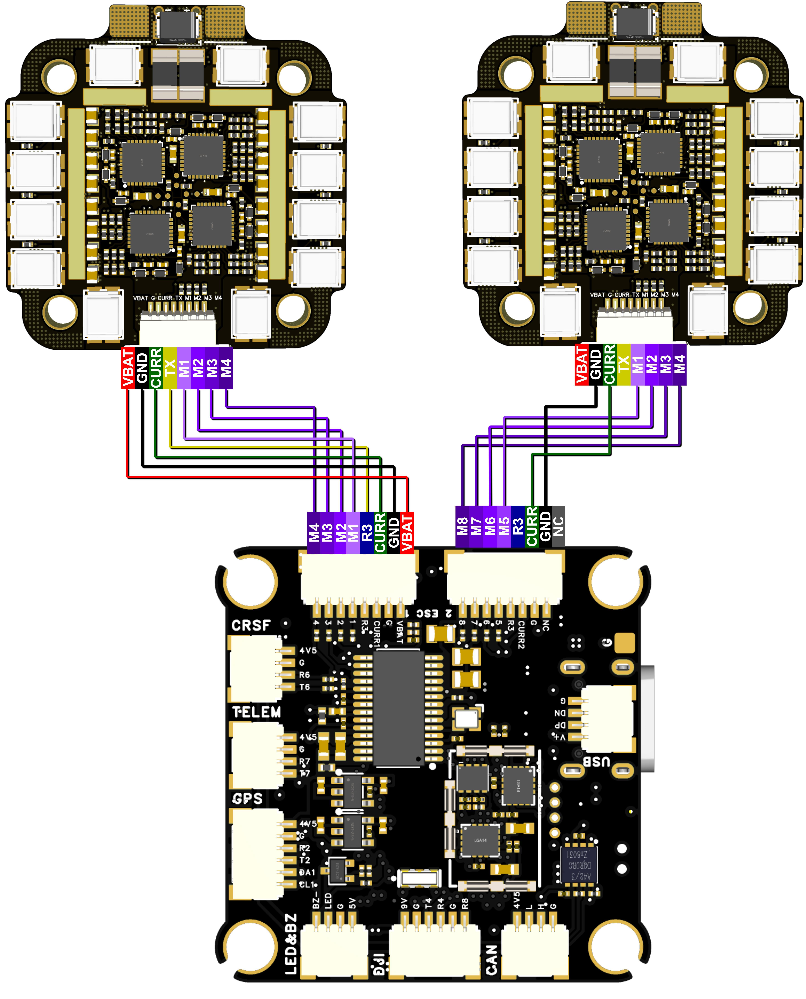

与FlyingRC® 4IN1 75A 金封电调连接(注：电调为V4.0版)

ELRS接收机 - 查看产品说明书和购买链接

注意TX,RX交换关系！（飞控TX - 接收机RX，飞控RX-接收机TX)，

若在UART6(Serial7，丝印SBUS&CRSF)上使用ELRS等非SBUS/PPM协议接收机，需要设置brd_alt_config 为 1。

设置完成后务必断电重启！

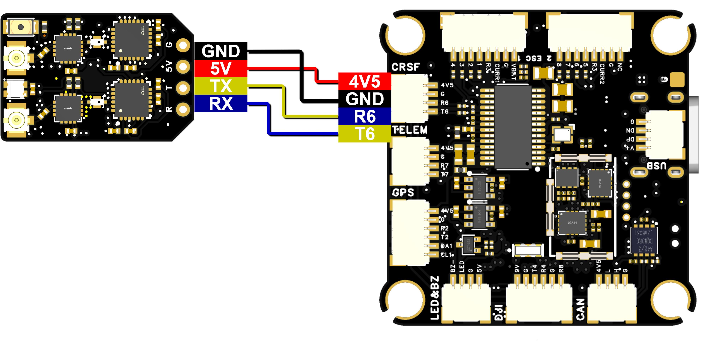

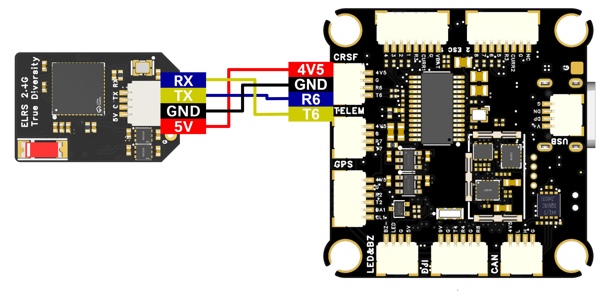

与FlyingRC® ELRS接收机连接

### 与RM3100接线图 - 查看产品说明书和购买链接

GPS - 查看产品说明书和购买链接

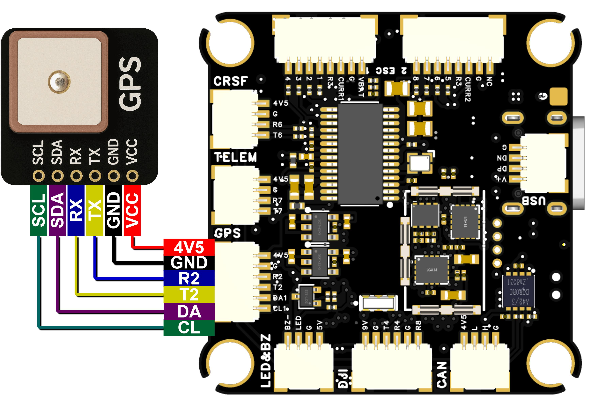

与FlyingRC® GPS连接

数字图传

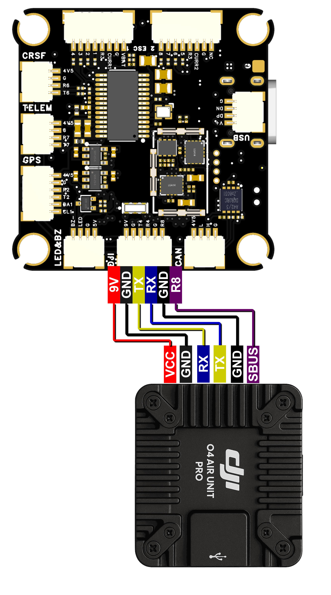

与数字图传连接

蜂鸣器和LED

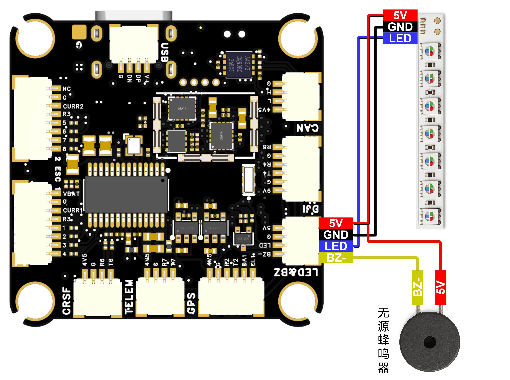

与蜂鸣器和LED连接

12S440A分电板 - 查看产品说明书和购买链接

CAN总线 - 查看产品说明书和购买链接

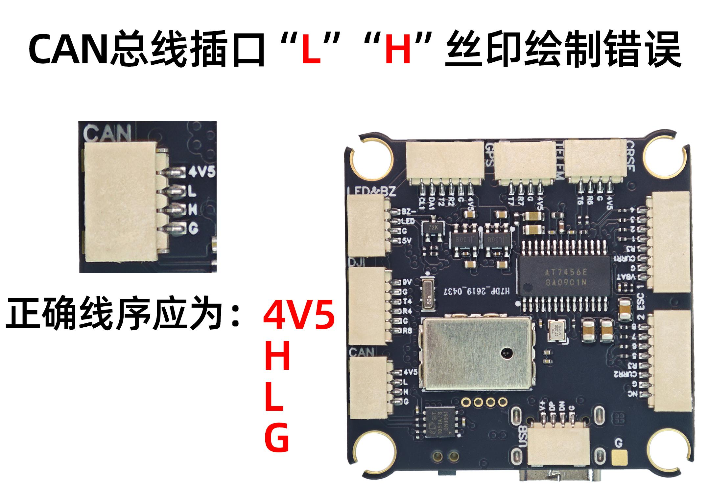

飞控固件刷写

推荐使用BF固件、AP固件、INAV固件，出厂默认已经刷好BF4.4.2固件，

### 下面接线会使用BF固件举例

固件是FlyingRC®官方编译的，并不存在与地面站的固件列表。请到官方群或者官网内下载固件。

飞控配置文件：FLRC H7D

说明书链接更新滞后，扫描页面底部二维码进QQ群，群文件包含最新固件！

BF固件烧录教程：B站专栏----Ardupilot固定翼-飞控固件的刷写与版本更新

请注意：BF、Ardupilot提供有限技术支持，INAV无技术支持

飞控接口详解：

串口（UARTx 、Serialx）

！！！注意，在Ardupilot固件中Serial编号与UART/USART编号非一一对应，对应表如下图！！！

| PCB 丝印 |  |  | UART 编号 | 配置 Config | SERIAL_X |

|------|------|------|------|------|------|

| USB | PA11/PA12 | 5 V tolerant I/O | USB | console | SERIAL0 |

| RX7 TX7 RTS7 CTS7 | PE7/8/9/10 | 3.3 V tolerant I/O | UART7 | telem1 | SERIAL1 |

| TX1 RX1 | PA9/PA10 | 5 V tolerant I/O | USART1 | telem2 | SERIAL2 |

| TX2 RX2 | PD5/PD6 | 5 V tolerant I/O | USART2 | GPS1 | SERIAL3 |

| TX3 RX3 | PD8/PD9 | 5 V tolerant I/O | USART3 | GPS2 | SERIAL4 |

| TX8 RX8 | PE1/PE0 | 5 V tolerant I/O | UART8 | USER | SERIAL5 |

| TX4 RX4 | PB9/PB8 | 5 V tolerant I/O | UART4 | USER | SERIAL6 |

| TX6 RX6 | PC6/PC7 | 5 V tolerant I/O | USART6 | RC input/Receiver | SERIAL7 |

|  |  |  | RX6 | SBUS/IBUS/DSM/PPM |  |

|  |  |  | TX6 | FPORT/SRXL2 |  |

Ardupilot串口对应表

！！！注意，接线以后要对应的调整飞控参数，例如在上面的示例图中，GPS连接到了R2，T2，在下方串口对应表中可找到R2，T2对应Serial3，那么要把Serial3_Protocol设置为GPS，并且确认其它端口的功能没有被设置为GPS！！！

若在Serial7上使用ELRS等非SBUS/PPM协议接收机，需要设置brd_alt_config 为 1。

（2）PWM输出功能

| PWM Group | PWM 通道 |  |  | GPIO | Timer |

|------|------|------|------|------|------|

| Group1 | S1 | PB0 | 5V tolerant I/O | PWM1 GPIO50 | TIM8_CH2N |

|  | S2 | PB1 | 3.3V tolerant I/O | PWM2 GPIO51 | TIM8_CH3N |

| Group2 | S3 | PA0 | 5V tolerant I/O | PWM3 GPIO52 | TIM5_CH1 |

|  | S4 | PA1 | 5V tolerant I/O | PWM4 GPIO53 | TIM5_CH2 |

|  | S5 | PA2 | 5V tolerant I/O | PWM5 GPIO54 | TIM5_CH3 |

|  | S6 | PA3 | 5V tolerant I/O | PWM6 GPIO55 | TIM5_CH4 |

| Group3 | S7 | PD12 | 5V tolerant I/O | PWM7 GPIO56 | TIM4_CH1 |

|  | S8 | PD13 | 5V tolerant I/O | PWM8 GPIO57 | TIM4_CH2 |

|  | S9 | PD14 | 5V tolerant I/O | PWM9 GPIO58 | TIM4_CH3 |

|  | S10 | PD15 | 5V tolerant I/O | PWM10 GPIO59 | TIM4_CH4 |

| Group4 | S11 | PE5 | 5V tolerant I/O | PWM11 GPIO60 | TIM15_CH1 |

|  | S12 | PE6 | 5V tolerant I/O | PWM12 GPIO61 | TIM15_CH2 |

| Group5 | LED | PA8 | 5V tolerant I/O | PWM13 GPIO62 | TIM1_CH1 |

|  |  |  |  | SERVO13_FUNCTION 120, NTF_LED_TYPES neopixel |  |

PWM输出功能表

LED pad为S13端口，可以接WS2812灯带可在BF地面站中自由设置（AP固件显示飞控状态）

同组（Group）的PWM端口不可同时用于Dshot电调和50Hz PWM舵机

（3）I2C总线

| I2C 编号 |  |  | 配置 Config | 参数 Parameterl | Value |

|------|------|------|------|------|------|

| I2C1  CL1/DA1 | PB6/PB7 | 5V tolerant I/O | Compass | COMPASS_AUTODEC | 1 |

I2C总线表

ADC模拟信号输入

| 引脚 Pin |  |  | 定义 Definition | Config | Value |

|------|------|------|------|------|------|

| Vbat pad / 1K:10K divider builtin | PC0 | 0 - 36V | Vbat ADC / onboard battery voltage sense | BATT_VOLT_PIN / BATT_VOLT_MULT | 10 / 11.0 |

| Curr pad | PC1 | 0 - 3.3V | Current ADC / onboard current sense | BATT_CURR_PIN / BATT_AMP_PERVLT | 11 66.7 |

| CU2 Pad | PA7 | 0 - 3.3V | Current2 ADC | BATT2_CURR_PIN / BATT2_AMP_PERVLT | 7    / |

ADC模拟信号输入表

Betaflight通用参数设置：

陀螺仪安装方向：CW90Flip

Ardupilot通用参数设置：

LOG_BACKEND_TYPE = 4，开启Flash黑匣子功能，记录飞行日志

BATT_VOLT_PIN     10

BATT_VOLT_MULT   21.0，电压计比例默认值，误差5%，额外校准非必须

BATT_CURR_PIN     11

INAV通用参数设置：

电压计比例默认值21000

技术问题咨询

若遇技术问题，建议先查阅产品说明书；也可前往AI平台、B站等渠道获取帮助。同时欢迎群友互相协助，分享已知解决方案。

维修服务

保修服务期限及内容

·  已焊接产品、人为损坏不享受免费保修。

·  配套易损配件不在保修范围内，可至 FlyingRC® 淘宝店另行购买。

若首次使用后没有发现产品存在问题，视为产品性能正常，不存在质量问题。后续使用中出现任何问题，视为用户不规范操作的所致。FlyingRC®提供两种售后服务供用户选择。

适用条件：用户购买产品1年内，可享受1次优惠以旧换新，需寄回故障产品。

折扣规则：按淘宝店正常售价7折购买全新同款同配置产品；换新品不再享受维修和售后服务。

付费维修寄送要求：

客户寄修前请先电话或微信联系工作人员，说明电路损坏原因与故障情况，确认是否可修。

产品寄出后，请主动提供运单号。未与维修工程师沟通直接寄回，若出现快递丢失、无法维修等情况，损失由客户自行承担。

随货请附纸条，注明：产品具体故障、故障原因、操作过程，并填写联系方式、回寄地址。拒收顺丰及到付件。

未附纸条导致无法联系、无法维修的，后果由客户承担。客户超过 3 个月未联系的，产品将按无主件报废处理。

因客户参数设置错误导致产品异常，工程师重新刷固件或校正参数的，将收取检测费 10–20 元。

| 维修内容 | 项目编号 | 更换芯片型号 | 材料费+手工费=维修费 |

|------|------|------|------|

| 飞控主控 | 1 | STM32F405RGT6 | 30+15=45 |

|  | 2 | STM32H743VIT6 | 50+30=80 |

|  | 3 | STM32H743VIH6 | 65+45=110 |

| 电调主控 | 4 | QF32F4AK8U7 | 8+10=18 |

|  | 5 | AT32F421K8U7 | 6+10=16 |

| 飞控传感器 | 6 | ICM-42688-P | 70+12=82 |

|  | 7 | ICM-42605 | 50+12=62 |

|  | 8 | SPL06 | 4+10=16 |

|  | 9 | DPS310/DPS368 | 25+12=37 |

| 飞控电源芯片 | 10 | MP9943 | 7+10=17 |

|  | 11 | MP9447 | 10+10=20 |

|  | 12 | MP9942 | 8+10=18 |

|  | 13 | LM25148 | 26+15=41 |

|  | 14 | LDO | 4+5=9 |

| 电调场效应管 | 15 | IRF7480 | 5+5=10 |

|  | 16 | HYG022N04LS1C1 | 3+5=8 |

| 其它元器件 | 17 | 电阻、电容、插座等 | 2+5=7 |

注：表格里是单一原件维修价格。

请注意：自行维修、打胶、PCB烧坏/击穿（全部芯片烧毁）和进水（元器件/PCB腐蚀）的飞控没有继续使用和维修价值，FlyingRC®不提供维修服务,客户可以选择7折以旧换新。

FlyingRC® 其它产品介绍

飞控类

| 产品1.FlyingRC® F4WSE F405 Pro主控固定翼飞控            本店销量No.1 / 全新升级、功能更强 / FlyingRC官方零售价：140元 / 中文说明书   Product Manual   去淘宝购买 |  |

|------|------|

| 产品2.FlyingRC® F4WSE - F405主控固定翼飞控(停产) / 经典产品、设计独特、好评如潮 / 中文说明书  Product Manual |  |

| 产品3.FlyingRC® H7Wlite H743主控固定翼飞控(停产) / 性能强劲，双陀螺仪 / FlyingRC官方零售价：299元 / 中文说明书  Product Manual |  |

| 产品4.FlyingRC® H7Wlite Pro H743主控固定翼飞控         本店销量No.7 / 性能强劲，双陀螺仪,BEC输出能力强 / FlyingRC官方零售价：259元 / 中文说明书  Product Manual  去淘宝购买 |  |

| 产品5.FlyingRC® F4Wing Mini F405主控固定翼飞控           本店销量No.2 / 2025年 爆款产品,设计感爆棚,全网最Mini / FlyingRC官方零售价：89元 / 中文说明书   Product Manual  去淘宝购买 |  |

| 产品6.FlyingRC® H7D Pro H743主控穿越机飞控                 本店销量No.3 / 全新升级、功能更强 / FlyingRC官方零售价：269元/299元 / 中文说明书 Product Manual 去淘宝购买 |  |

| 产品7.FlyingRC® H7D MK1 H743主控双陀螺仪穿越机飞控(停产) / 算力强大 飞行稳定精准 接口丰富 操控自如 / 中文说明书   Product Manual |  |

| 产品8.FlyinRC® F4D MK1 F405主控 20\30.5孔距 穿越机飞控    本店销量No.9 / 算力强大 飞行稳定精准 接口丰富 操控自如 / FlyingRC官方零售价：129元 / 中文说明书   Product Manual  去淘宝购买 |  |

电调类

| 产品9.FlyingRC® 4IN1 75A ESC 四合一穿越机金封电调 / 本店销量No.4 / 高端产品,英飞凌金封MOS,工艺最佳,单路持续75AFlyingRC官方零售价：269元 / 中文说明书 Product Manual 去淘宝购买 |  |

|------|------|

| 产品10.FlyingRC® 4IN1 45A ESC  四合一穿越机电调 / 性能出色，性价比高，入门首选 / FlyingRC官方零售价：149元 / 中文说明书 Product Manual  去淘宝购买 |  |

| 产品11.FlyingRC® AM32 Dual ESC 40A 二合一电调                本店销量No.12 / 设计独特，独家产品 用于无人机等空中、陆地、水上双动力设备    FlyingRC官方零售价：89元 / 中文说明书 Product Manual 去淘宝购买 |  |

| 产品12.FlyingRC® AM32 ESC 75A V2.5单体金封电调                 本店销量No.6 / 英飞凌金封MOS 工艺出色 过流能力强大 / FlyingRC官方零售价：87元（不带BEC版本） / 中文说明书 Product Manual 去淘宝购买 |  |

| 产品13.FlyingRC® AM32 ESC单体金封电调控制板(带BEC) / 客户可以用自己的功率板，制作不同规格电调 / FlyingRC官方零售价：47元 / 中文说明书 Product Manual 去淘宝购买 |  |

| 产品14.FlyingRC® AM32 Mini ESC 40A V1单体电调           本店销量No.10 / 超Mini 用于小型和微型机 过流能力强 运行稳定 FlyingRC官方零售价：43元 / 中文说明书 Product Manual 去淘宝购买 |  |

飞塔类

| 产品15.FlyingRC® 高阶版飞塔套装 / H743穿越机飞控+四合一穿越机75A金封电调 / 专业飞行首选，旗舰用料工艺，良心价格 / FlyingRC官方零售价：528元 / 飞控中文说明书   电调中文说明书 / FC Product Manual  ESC Product Manual / 去淘宝购买 |  |

|------|------|

| 产品16.FlyingRC® 进阶版飞塔套装 / F405穿越机飞控+四合一穿越机75A金封电调 / 爆款组合，性能出色，良心价格 / FlyingRC官方零售价：398元 / 飞控中文说明书    电调中文说明书 / FC Product Manual ESC Product Manual / 去淘宝购买 |  |

| 产品17.FlyingRC® 进阶版飞塔套装 / H743穿越机飞控+四合一穿越机45A电调 / 爆款组合，性能出色，价格亲民 / FlyingRC官方零售价：408元 / 飞控中文说明书     电调中文说明书 / FC Product Manual  ESC Product Manual / 去淘宝购买 |  |

| 产品18.FlyingRC® 基础版飞塔套装 / F405穿越机飞控+四合一穿越机45A电调 / 爆款组合，实惠之选，价格亲民 / FlyingRC官方零售价：278元 / 飞控中文说明书     电调中文说明书 / FC Product Manual  ESC Product Manual / 去淘宝购买 |  |

| 产品19.FlyingRC® 固定翼飞塔套装 / F4WSE PRO飞控+二合一40A电调 / 独特设计、独家产品、爆款组合 / FlyingRC官方零售价：237元 / 飞控中文说明书      电调中文说明书 / FC Product Manual   ESC Product Manual / 去淘宝购买 |  |

BEC 降压电路类

| 产品20.FlyingRC® 10A 12S BEC降压模块 / 多电压可选 行业首选，物美价廉 / FlyingRC官方零售价：74元 / 中文说明书 Product Manual 去淘宝购买 |  |

|------|------|

| 产品21.FlyingRC® 10A 8S BEC降压模块 / 多电压可选 行业首选，物美价廉 / FlyingRC官方零售价：36元 / 中文说明书 Product Manual 去淘宝购买 |  |

| 产品22.FlyingRC® 5A 6S BEC降压模块  本店销量No.5 / 多电压可选，持续5A输出 / FlyingRC官方零售价：17元 / 中文说明书  Product Manual  去淘宝购买 |  |

| 产品23.FlyingRC® Mini BEC For DJI O4 / 独立降压，稳定供电，让飞行更安全 / FlyingRC官方零售价：18元 / 中文说明书  Product Manual  去淘宝购买 |  |

模块类

| 产品24.FlyingRC® RM3100 SPI Module 罗盘模块 / 超高分辨率、低功耗、行业首选 / FlyingRC官方零售价：129元 / 中文说明书  Product Manual  去淘宝购买 |  |

|------|------|

| 产品25.FlyingRC® L4CAN RM3100 CAN总线罗盘模块 / 行业首选，物美价廉 / FlyingRC官方零售价：199元 / 中文说明书 Product Manual 去淘宝购买 |  |

其他类

| 产品26.FlyingRC® 10A 12S 400A穿越机分电板                      本店销量No.8 / 行业首选，物美价廉 / FlyingRC官方零售价：109元 / 中文说明书  Product Manual 去淘宝购买 |  |

|------|------|

| 产品27.FlyingRC®  ELRS 2.4G 分集ELIS接收机                 本店销量No.11 / 真分集接收,温度补偿，高功率接收 / FlyingRC官方零售价：109元 / 中文说明书  Product Manual  去淘宝购买 |  |

| 产品28.FlyingRC®  AM32电调调参器 / 支持BL，BL32，AM32 简单好用 / FlyingRC官方零售价：9.9元/7.9元（A口/C口）焊好 / FlyingRC官方零售价：6.9元/5.9元（A口/C口）自己焊 / 中文说明书 Product Manual 去淘宝购买 |  |

| 产品29.FlyingRC® I2C无空速管数字新款空速计 / 一体设计，全网最Mini MS4525D协议，I2C接口 / FlyingRC官方零售价：95元 / 中文说明书  Product Manual  去淘宝购买 |  |

| 产品30.FlyingRC® 无空速管数字空速计 / 一体设计，全网最Mini MS4525D协议，I2C接口 / FlyingRC官方零售价：    95元 / 中文说明书  Product Manual  去淘宝购买 |  |

| 产品31.FlyingRC® I2C 外置电流计 / 一体设计，全网最Mini MS4525D协议，I2C接口 / FlyingRC官方零售价：39元 / 中文说明书  Product Manual  去淘宝购买 |  |

| 产品32.FlyingRC® L4 CAN RC/GPS Adapter  CAN总线串口&PWM扩展板 / 长距离传输，高速率，稳定性强 / FlyingRC官方零售价：46元 / 中文说明书  Product Manual  去淘宝购买 |  |

| 产品33.FlyingRC® U-Blox M10 GPS / 支持各种开源飞控 多尺寸可选 搜星能力强 性价高 / FlyingRC官方零售价：68元(18*18mm款) / 中文说明书  Product Manual  去淘宝购买 |  |

| FlyingRC®官网 / www.FlyingRC®.cn | 淘宝店铺 | 闲鱼店铺 | 群号1016199449 |

|------|------|------|------|

电话:021-58204886 手机:13122492475   微信:13122492475、18019464804

---

## USB 驱动与连接

--8<-- "shared/flight-controller/usb-driver.md"

---

## 接收机连接

--8<-- "shared/flight-controller/receiver-wiring.md"

---

## 安全须知

--8<-- "shared/safety.md"

---

## 首次使用检查

--8<-- "shared/first-use-check.md"

---

## 技术支持

--8<-- "shared/support.md"

---

## 售后与保修

--8<-- "shared/warranty.md"

---

## FlyingRC® 其它产品

--8<-- "shared/other-products.md"

---

## 免责声明

--8<-- "shared/disclaimer.md"

