# FlyingRC® H7Wlite H743 MK2控固定翼飞控产品手册

> 状态：在售 · 类别：flight-controller · 内容自原 WPS 说明书迁入

---

## 一、FlyingRC介绍

## 产品概述

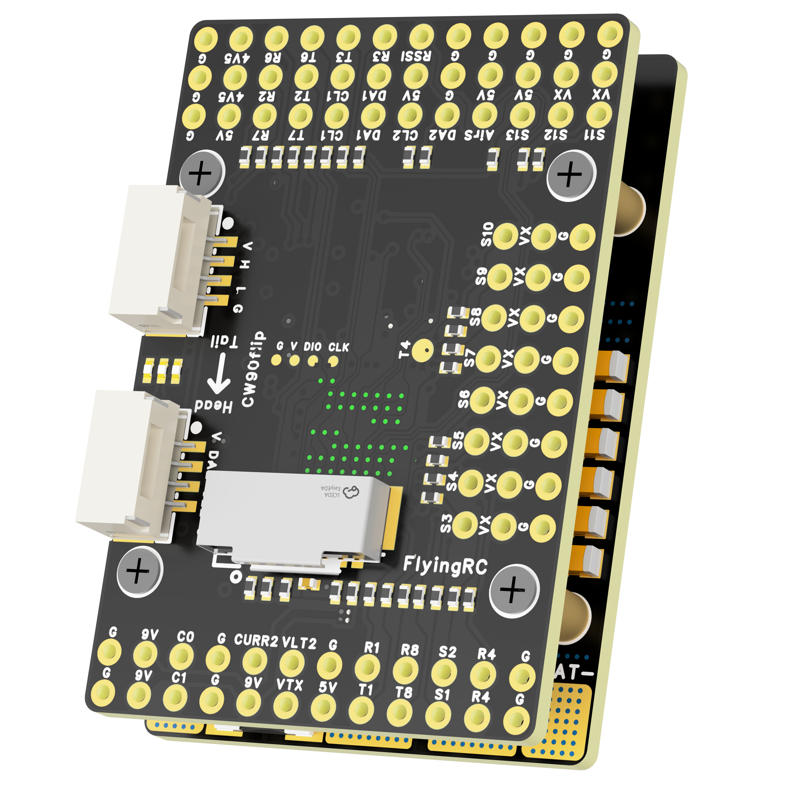

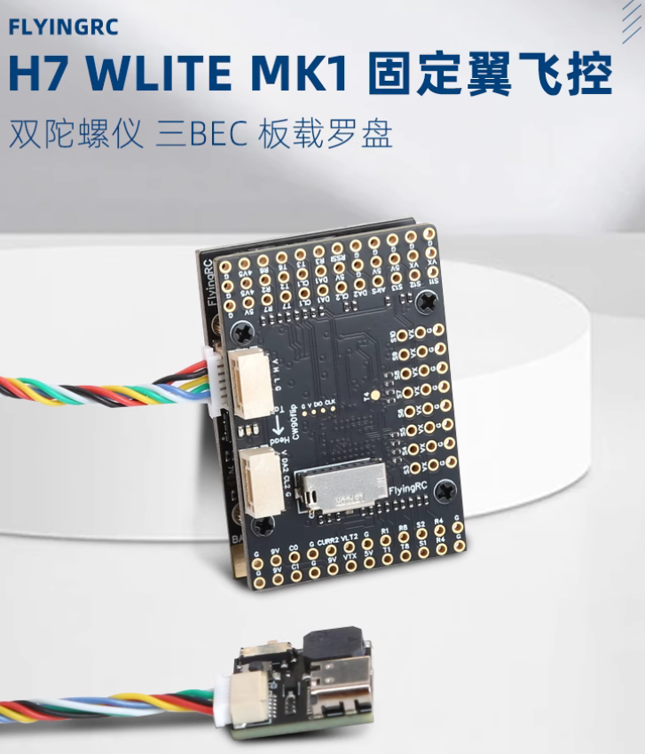

**1. 技术参数**

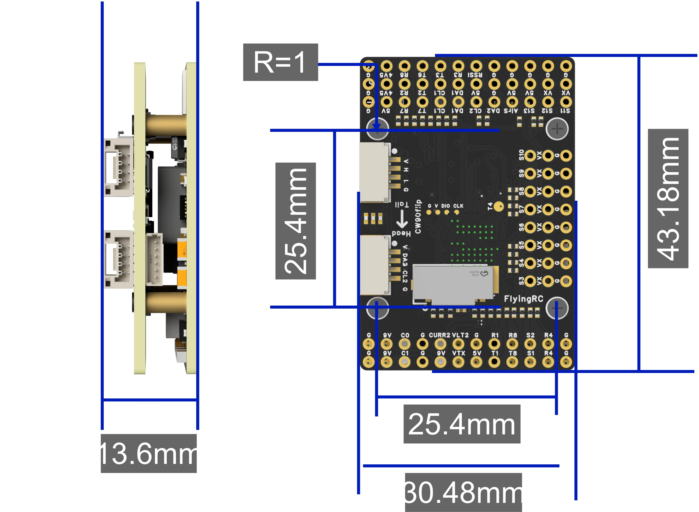

主控STM32H743VIH6，陀螺仪BMI270*2，气压计SPA06-003，板载罗盘QMC5883P

Analog/HD OSD, 7xUARTs, 13xPWMs, 2xI2C, 1xCAN, 4xADC (VLT2, CURR2, ASPD, RSSI), On-Board 9V BEC PinIO, On-Board Dual CAM Switch PinIO

黑匣子：板载TF卡槽，最大支持32GB

12~28V DC IN（3~6S LiPo）

Triple BEC, LM61495 + MP9943+ MP9943方案，5V/6.2V/7.4V 10A (舵机) & 5V 3A (设备) & 9V 3A (图传，摄像头)

尺寸及重量：30.5mm*44.5mm*7.5mm, 26g

## 基础参数

传感器

型 号

FlyingRC® H7Wlite

IMU(陀螺仪和加速度计)

BMI270*2

尺 寸

30.5mm*44.5mm*7.5mm

气 压 计

SPA06-003

质 量

26g

磁 力 计

QMC5883P

模拟OSD

AT7465E

主控

电源输出

主控芯片

主控STM32H743VIH6

BEC芯片型号

LM61495 + MP9943+ MP9943

主频

480 MHz

板载降压模块BEC-设备

5V3A

Flash

2 MB

板载降压模块BEC-图传

9V3A

RAM

1 MB

板载降压模块BEC-舵机

5V10A，可调至6V，7V

接口

固件支持

UART

7组串口

Betaflight

支持(出厂默认)

UART1,UART2, UART3，UART4

INAV

支持

UART6,  UART7，UART8

Ardupilot

支持

PWM

13个（包括1个LED）

PX4

支持

I2C

2

电流 ADC 采样

板载电流计，持续100A

SWD调试

有

工作环境

蜂鸣器接口

有，无源蜂鸣器在USB小板上

VBAT供电范围

7-28V DC IN  2-6S LiPo

LED灯带接口

支持WS2812

电源输入

同VBAT供电范围

USB-TYPE-C

外置USB小板

工作温度范围

-10-100℃

黑匣子存储

板载TF卡槽

存储温度范围

0-40℃

SBUS

H7主控内置反向器

SBUS可连接至任意RX接口

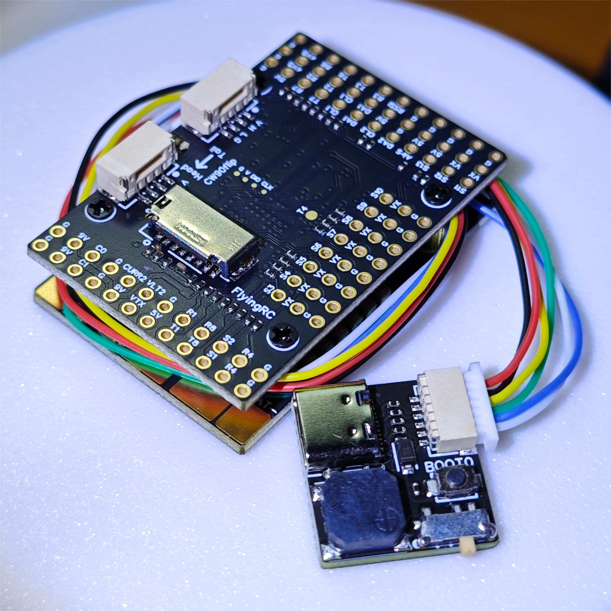

**2. 产品特点**

STM32H743VIH6主控，2MB Flash，1MB RAM，480MHz，性能强悍，BGA先进封装，小体积，高扩展性。

BMI270*2，均专为无人机优化，具有优秀的固件兼容性。

SPA06-003气压计，国产高精度传感器。

同体积下性能最强（包括算力，传感器能力，板载BEC带载能力）。

优化体积，飞控体积较小适合用于各种尺寸的载机。

13PWM输出，垂起也绰绰有余，可以使用CAN总线扩展板额外扩展PWM。

全插针设计，电调，舵机，接收机，GPS，模拟图传，模拟摄像头，高清图传，LED灯带均可通过排针连接到飞控，或者选择直接焊接到排针焊盘，多一种选择。

使用双高精度陀螺仪与高精度气压计，对比同类型飞控稳定性大幅度提升（使用AP固件时效果明显）。

在同体积飞控中拥有最强的BEC电流输出能力（三路板载降压供电总输出最高可达120W）。

支持双模拟摄像头切换，前、后摄像头，视角更广，飞行更有乐趣。

板载9V BEC 可通过 PINIO1（BF固件中User1）开关，地面调试时无需担心图传过热烧毁。

板载TF卡槽，SDIO总线连接，速率高，最大支持32GB，存储容量无需担忧，可保存多次飞行数据。

## 使用方法

### 布局/LAYOUT：

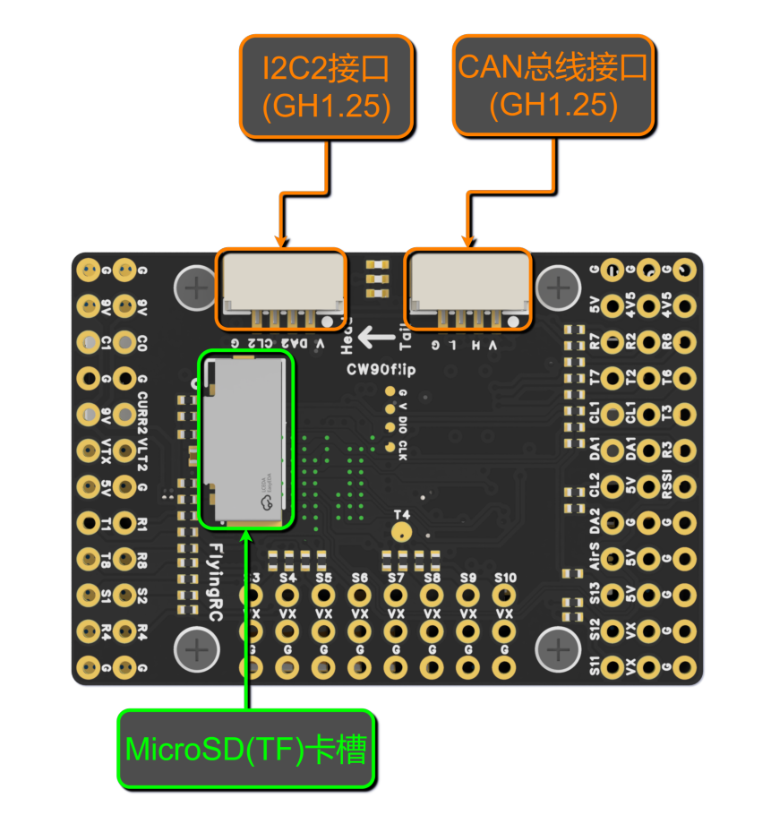

飞控板顶层示意图

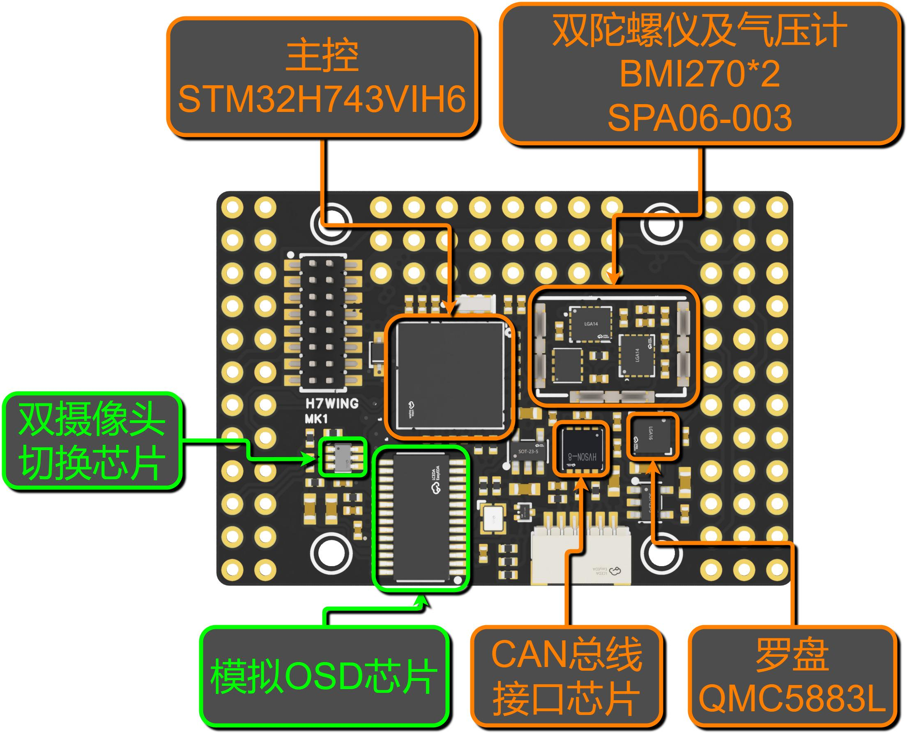

飞控板底层示意图

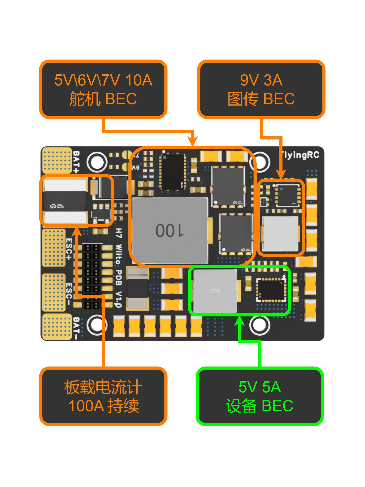

电源板顶层示意图

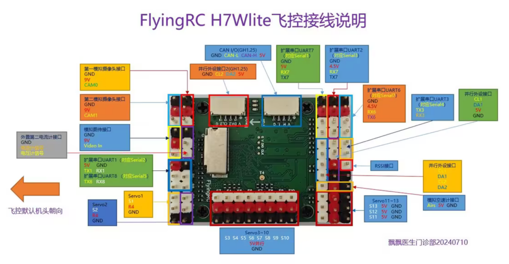

外设端口定义图

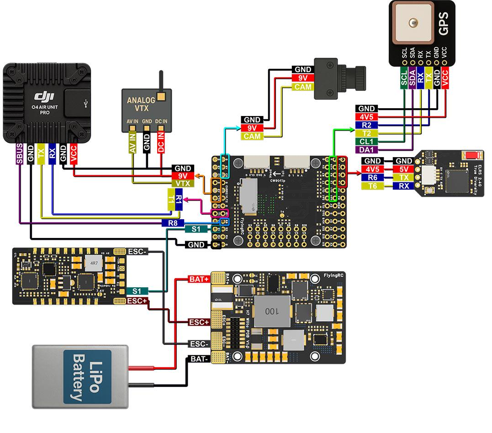

### 飞控完整接线示例图

### 单独设备接线-详解

ELRS接收机 - 查看产品说明书和购买链接

### 与FlyingRC® ELRS接收机连接接线图

GPS - 查看产品说明书和购买链接

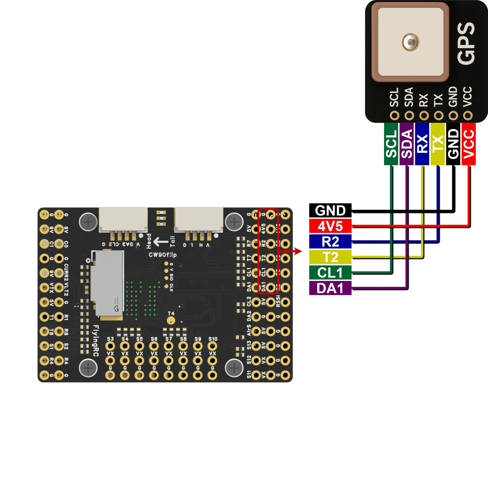

### 与FlyingRC® GPS连接接线图

数字图传

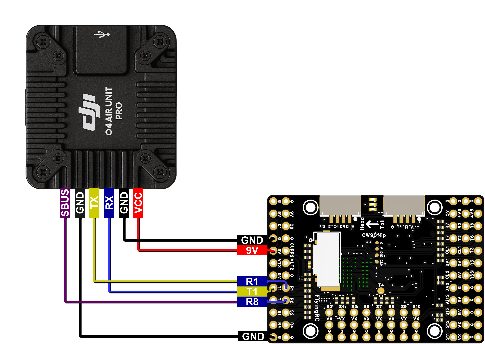

### 与大疆数字图传接线图

模拟摄像头

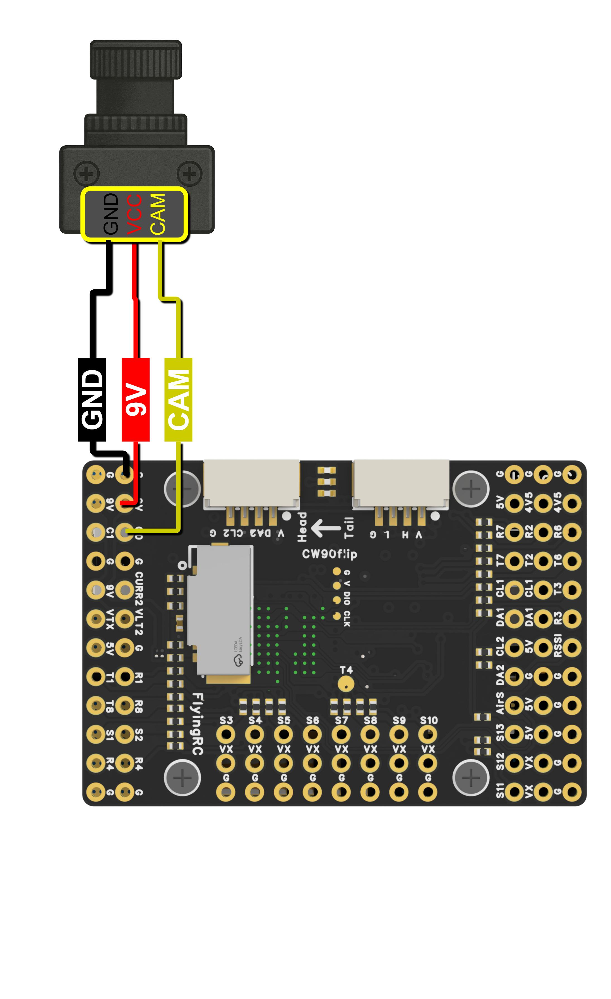

### 与模拟摄像头连接接线图

模拟图传

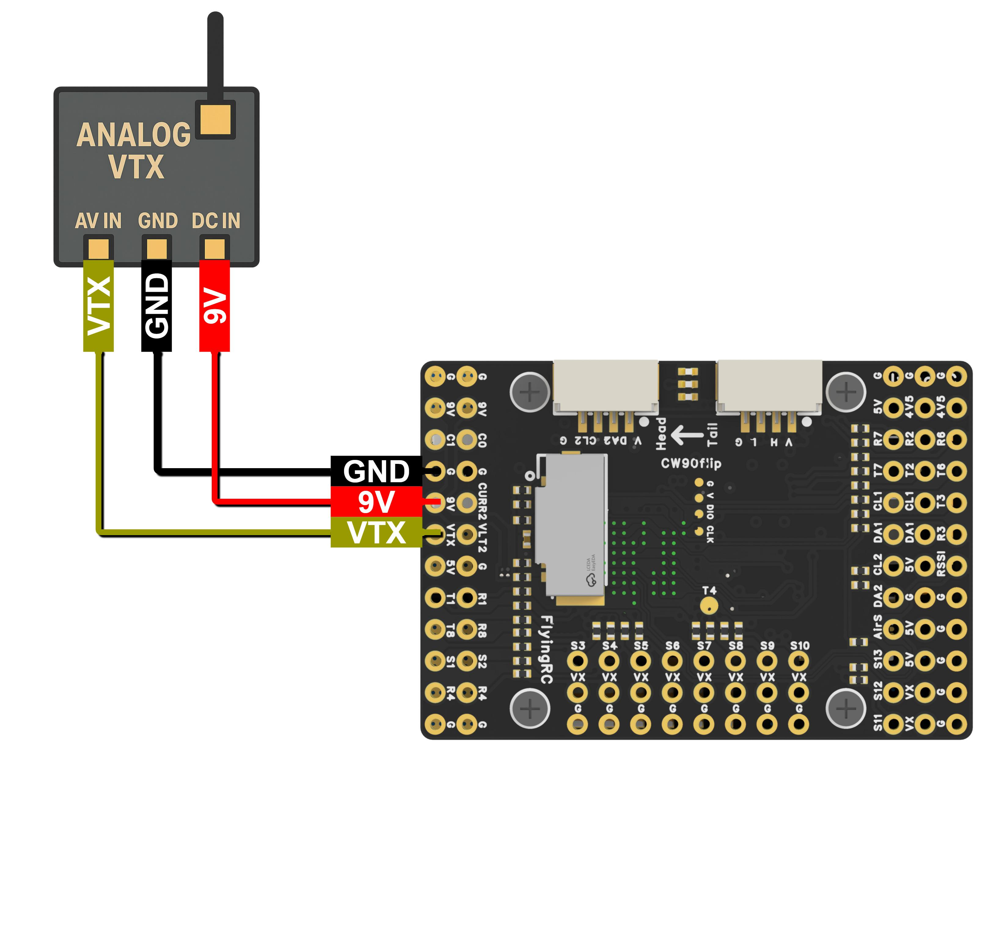

### 与模拟图传连接接线图

注意：如果需要通过串口设置模拟图传调参，可以将图传调参线连接至任意串口RX。

单体电调- 查看产品说明书和购买链接

与FlyingRC® AM32 75A 金封单体电调连接接线图

注：如果需要接两个电调，第二个电调信号线接s2，电源线和第一个电调并联。

(7)电池电源

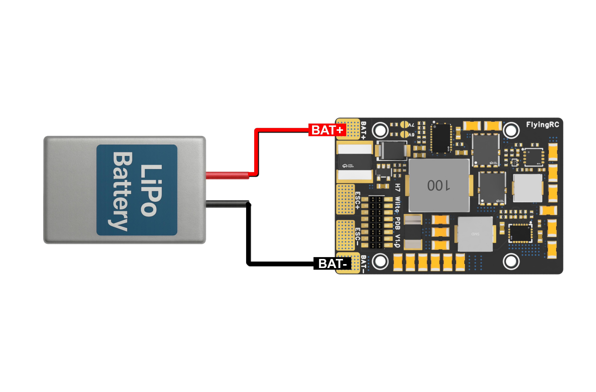

### 与电池电源连接接线图

(8)排针功能示意表

左侧排针

丝印

设备

定义

丝印

设备

定义

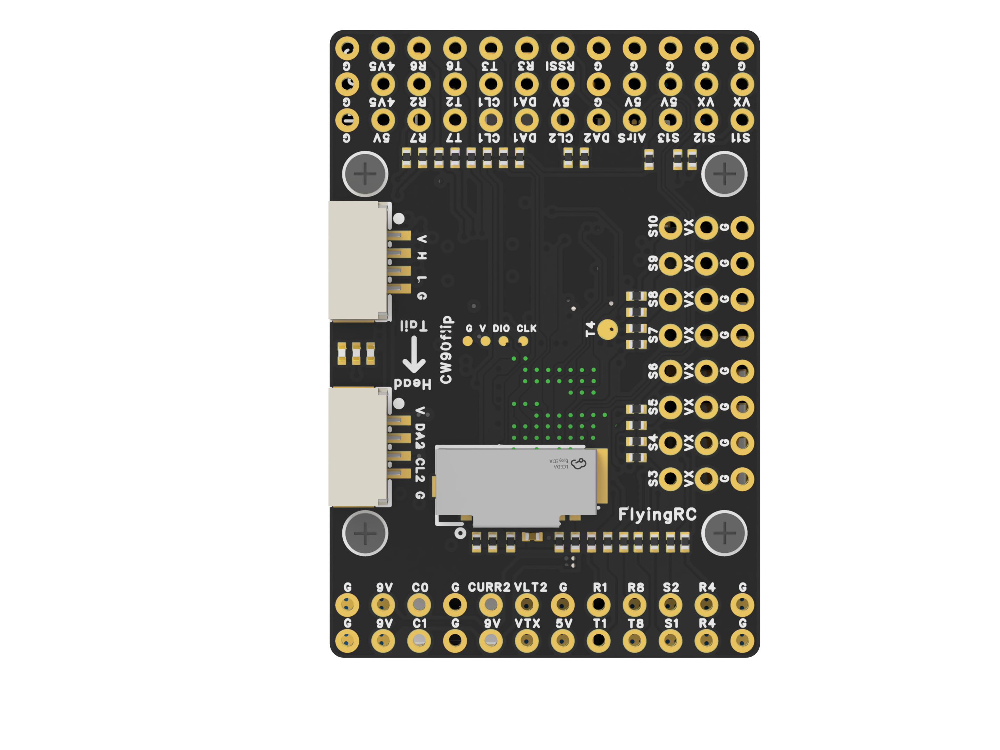

G

模拟摄像头2

共地

G

模拟摄像头1

共地

9V

摄像头供电

9V

摄像头供电

C1

摄像头信号

C0

摄像头信号

G

数字图传/模拟图传

G

外置电流计

共地

9V

CURR2

电流计信号

VTX

模拟图传

VLT2

电压计信号

5V

拓展串口1

G

拓展串口1

T1

数字图传

拓展串口1

R1

数字图传

拓展串口1

T8

拓展串口8

R8

数字图传

拓展串口8

S1

单体电调

1号电机&舵机信号输出

S2

2号电机&舵机

2号电机&舵机信号输出

R4

1号电机&舵机信号输出

R4

2号电机&舵机信号输出

G

数字图传

共地

G

共地

下侧排针

第一排丝印

S3

S4

S5

S6

S7

S8

S9

S10

设备

电机&舵机

定义

电机&舵机信号输出

第二排丝印

VX

VX

VX

VX

VX

VX

VX

VX

设备

电机&舵机

定义

5V输出

第三排丝印

G

G

G

G

G

G

G

G

设备

电机&舵机

定义

共地

丝印

设备

定义

丝印

设备

定义

丝印

设备

定义

G

拓展串口7

G

GPS

拓展串口2

G

ELRS接收机

拓展串口6

5V

4V5

4V5

R7

R2

R6

T7

T2

T6

CL1

I2C时钟

并行外设接口

CL1

I2C时钟

T3

拓展串口3

DA1

I2C数据

DA1

I2C数据

R3

CL2

I2C时钟

5V

5V输出

RSSI

RSSI接口

DA2

I2C数据

G

共地

G

共地

AirS

模拟空速计

空速计数据

5V

模拟空速计

空速计5V输出

G

模拟空速计

S13

电机&舵机

信号输出

5V

电机&舵机

5V输出

G

电机&舵机

S12

信号输出

VX

5V输出

G

S11

信号输出

VX

5V输出

G

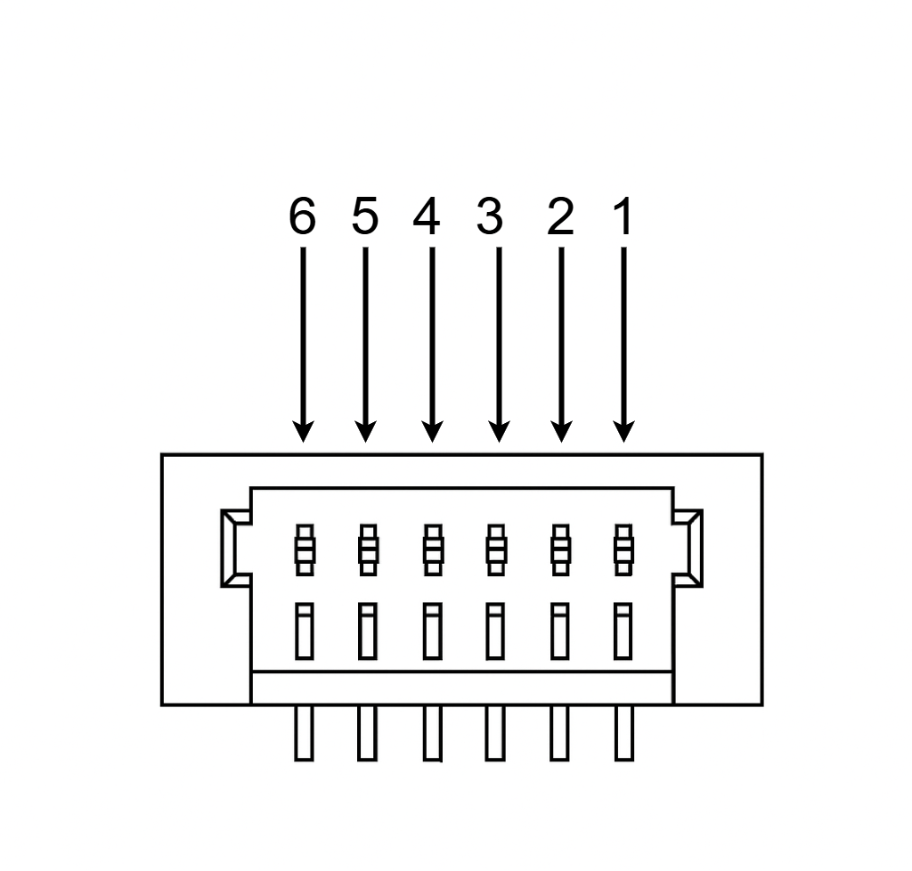

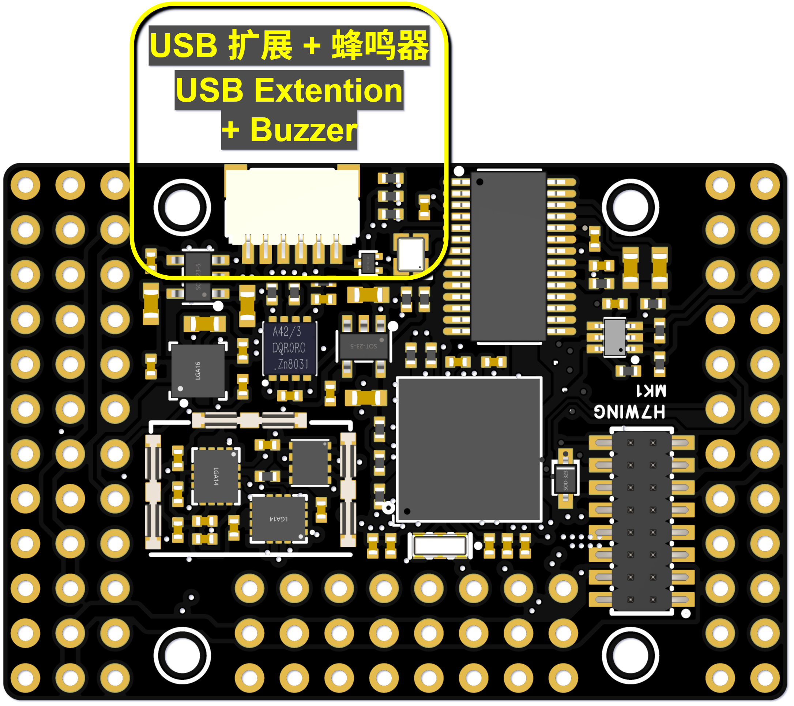

CAN总线接口

引脚序号

引脚名称

引脚定义

1

G

GND （负极）

2

L

CAN_Low CAN 总线差分信号低电平

3

H

CAN_High CAN 总线差分信号高电平

4

V

5V供电

GPS接口引脚定义

引脚序号

引脚名称

引脚定义

1

4V5

GPS供电

2

G

GND （负极）

3

T2

GPS串口通信发射端，接GPS RX端口

4

R2

GPS串口通信接收端

5

DA

I2C SDA端口，接罗盘SDA口

6

CL

I2C SCL端口，接罗盘SCL口

飞控端口/Ports：

PWM Channels

PWM

Group

PWM Channels

GPIO

Timer

Group1

S1

PWM1 GPIO50

TIM8_CH2N

5V tolerant I/O

PB0

S2

PWM2 GPIO51

TIM8_CH3N

**3.3V tolerant I/O**

PB1

Group2

S3

PWM3 GPIO52

TIM5_CH1

5V tolerant I/O

PA0

S4

PWM4 GPIO53

TIM5_CH2

5V tolerant I/O

PA1

S5

PWM5 GPIO54

TIM5_CH3

5V tolerant I/O

PA2

S6

PWM6 GPIO55

TIM5_CH4

5V tolerant I/O

PA3

Group3

S7

PWM7 GPIO56

TIM4_CH1

5V tolerant I/O

PD12

S8

PWM8 GPIO57

TIM4_CH2

5V tolerant I/O

PD13

S9

PWM9 GPIO58

TIM4_CH3

5V tolerant I/O

PD14

S10

PWM10 GPIO59

TIM4_CH4

5V tolerant I/O

PD15

Group4

S11

PWM11 GPIO60

TIM15_CH1

5V tolerant I/O

PE5

S12

PWM12 GPIO61

TIM15_CH2

5V tolerant I/O

PE6

Group5

LED

PWM13 GPIO62

TIM1_CH1

5V tolerant I/O

PA8

SERVO13_FUNCTION 120, NTF_LED_TYPES neopixel

PWM1–PWM13 均支持 DShot 与 PWM输出。但是输出通道对DShot与常规PWM混合工作模式设有分组限制：即对某一分组内的任一输出通道启用DShot协议时，该分组下所有输出通道均需统一配置并作为DShot通道使用，不可与PWM通道混用。

若同一分组内同时接入舵机与电机，需确保该分组按照舵机规格参数运行最低PWM频率。

例如：若舵机最高支持50Hz，则该分组下的电调也必须工作在50Hz。

PWM输出对应表

注意！相同TIM的PWM端口不可同时用于Dshot协议 & PWM协议，推荐S1&S2使用Dshot协议连接电调，其余端口使用PWM连接舵机。

ArduPilot 固件 UART 映射表

PCB 丝印

UART

Config

SERIAL_X

USB

USB

console

SERIAL0

5V tolerant I/O

PA11/PA12

RX7 TX7 RTS7 CTS7

UART7

telem1

SERIAL1

**3.3V tolerant I/O**

PE7/8/9/10

TX1 RX1

USART1

telem2

SERIAL2

5V tolerant I/O

PA9/PA10

TX2 RX2

USART2

GPS1

SERIAL3

5V tolerant I/O

PD5/PD6

TX3 RX3

USART3

GPS2

SERIAL4

5V tolerant I/O

PD8/PD9

TX8 RX8

UART8

USER

SERIAL5

5V tolerant I/O

PE1/PE0

TX4 RX4

UART4

USER

SERIAL6

5V tolerant I/O

PB9/PB8

TX6 RX6

USART6

RC input/Receiver

SERIAL7

5V tolerant I/O

PC6/PC7

RX6

SBUS/IBUS/DSM/PPM

TX6

FPORT/SRX2

UART串口对应表及默认功能

注意！AP固件的UART端口数 ≠ Serial串口数，例如R7、T7对应Serial1而不是Serial7。

若在Serial7上使用ELRS等非SBUS/PPM协议接收机，需要设置brd_alt_config 为 1。

I2C&CAN

编号

配置 Config

参数 Parameterl

Value

I2C1

PB6/PB7

5V tolerant I/O

Compass

COMPASS_AUTODEC

1

I2C2

CL2/DA2 on JST-GH-4P

PB10/PB11

5V tolerant I/O

on board Baro DPS310

Address

0x76

Digital Airspeed I2C

MS4525

DVR-L10D

ARSPD_BUS

ARSPD_TYPE

ARSPD_TYPE

0

1

9

CAN1

PD0/PD1

5V tolerant I/O

CAN Node

CAN_D1_PROTOCOL

CAN_P1_DRIVER

1

1

CAN GPS

CAN Compass

CAN Airspeed sensor

GPS_TYPE

COMPASS_TYPEMASK

ARSPD_TYPE

9

0

8

I2C&CAN总线参数设置表

注意！板载QMC5883L罗盘连接在I2C2上，如需外置相同型号的罗盘请连接至I2C1端口。

AP固件其它参数设置：

BATT_VOLT_MULT 21

BATT_AMP_PERVLT 80

固件刷写/Firmware Flashing：

AP固件：Arduplane4.5.4

INAV固件：INAV7.1.2

刷写固件教程：Ardupilot固件刷写教程 For FlyingRC®

飞控使用教程/Ardupilot Tutorial：飘飘大佬AP固件最新版教程

技术问题咨询

若遇技术问题，建议先查阅产品说明书；也可前往AI平台、B站等渠道获取帮助。同时欢迎群友互相协助，分享已知解决方案。

维修服务

保修服务期限及内容

·  已焊接产品、人为损坏不享受免费保修。

·  配套易损配件不在保修范围内，可至 FlyingRC® 淘宝店另行购买。

若首次使用后没有发现产品存在问题，视为产品性能正常，不存在质量问题。后续使用中出现任何问题，视为用户不规范操作的所致。FlyingRC®提供两种售后服务供用户选择。

适用条件：用户购买产品1年内，可享受1次优惠以旧换新，需寄回故障产品。

折扣规则：按淘宝店正常售价7折购买全新同款同配置产品；换新品不再享受维修和售后服务。

付费维修寄送要求：

客户寄修前请先电话或微信联系工作人员，说明电路损坏原因与故障情况，确认是否可修。

产品寄出后，请主动提供运单号。未与维修工程师沟通直接寄回，若出现快递丢失、无法维修等情况，损失由客户自行承担。

随货请附纸条，注明：产品具体故障、故障原因、操作过程，并填写联系方式、回寄地址。拒收顺丰及到付件。

未附纸条导致无法联系、无法维修的，后果由客户承担。客户超过 3 个月未联系的，产品将按无主件报废处理。

因客户参数设置错误导致产品异常，工程师重新刷固件或校正参数的，将收取检测费 10–20 元。

维修内容

项目编号

更换芯片型号

材料费+手工费=维修费

飞控主控

1

STM32F405RGT6

30+15=45

2

STM32H743VIT6

50+30=80

3

STM32H743VIH6

65+45=110

电调主控

4

QF32F4AK8U7

8+10=18

5

AT32F421K8U7

6+10=16

飞控传感器

6

ICM-42688-P

70+12=82

7

ICM-42605

50+12=62

8

SPL06

4+10=16

9

DPS310/DPS368

25+12=37

飞控电源芯片

10

MP9943

7+10=17

11

MP9447

10+10=20

12

MP9942

8+10=18

13

LM25148

26+15=41

14

LDO

4+5=9

电调场效应管

15

IRF7480

5+5=10

16

HYG022N04LS1C1

3+5=8

其它元器件

17

电阻、电容、插座等

2+5=7

注：表格里是单一原件维修价格。

请注意：自行维修、打胶、PCB烧坏/击穿（全部芯片烧毁）和进水（元器件/PCB腐蚀）的飞控没有继续使用和维修价值，FlyingRC®不提供维修服务,客户可以选择7折以旧换新。

FlyingRC® 其它产品介绍

FlyingRC®官网

www.FlyingRC®.cn

淘宝店铺

闲鱼店铺

群号1016199449

电话:021-58204886 手机:13122492475   微信:13122492475、18019464804

---

## USB 驱动与连接

--8<-- "shared/flight-controller/usb-driver.md"

---

## 接收机连接

--8<-- "shared/flight-controller/receiver-wiring.md"

---

## 安全须知

--8<-- "shared/safety.md"

---

## 首次使用检查

--8<-- "shared/first-use-check.md"

---

## 技术支持

--8<-- "shared/support.md"

---

## 售后与保修

--8<-- "shared/warranty.md"

---

## FlyingRC® 其它产品

--8<-- "shared/other-products.md"

---

## 免责声明

--8<-- "shared/disclaimer.md"

