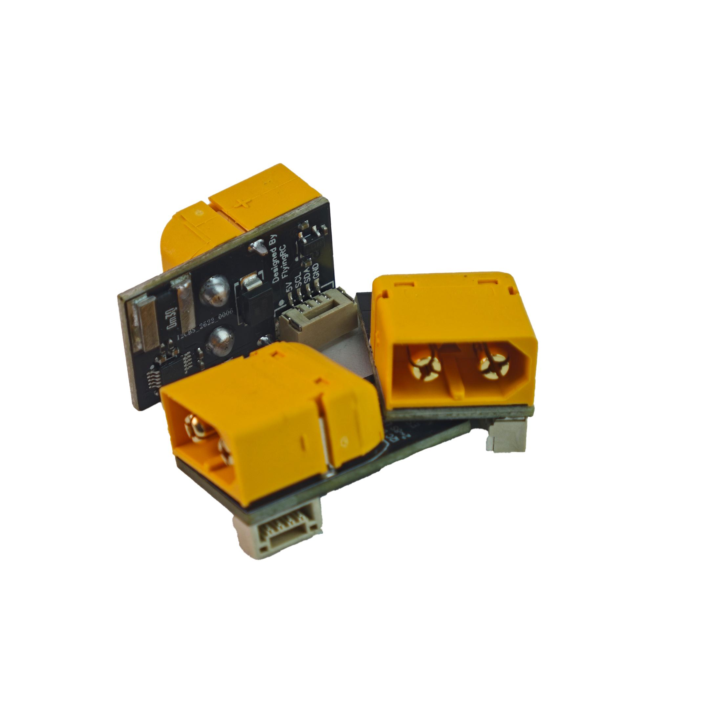
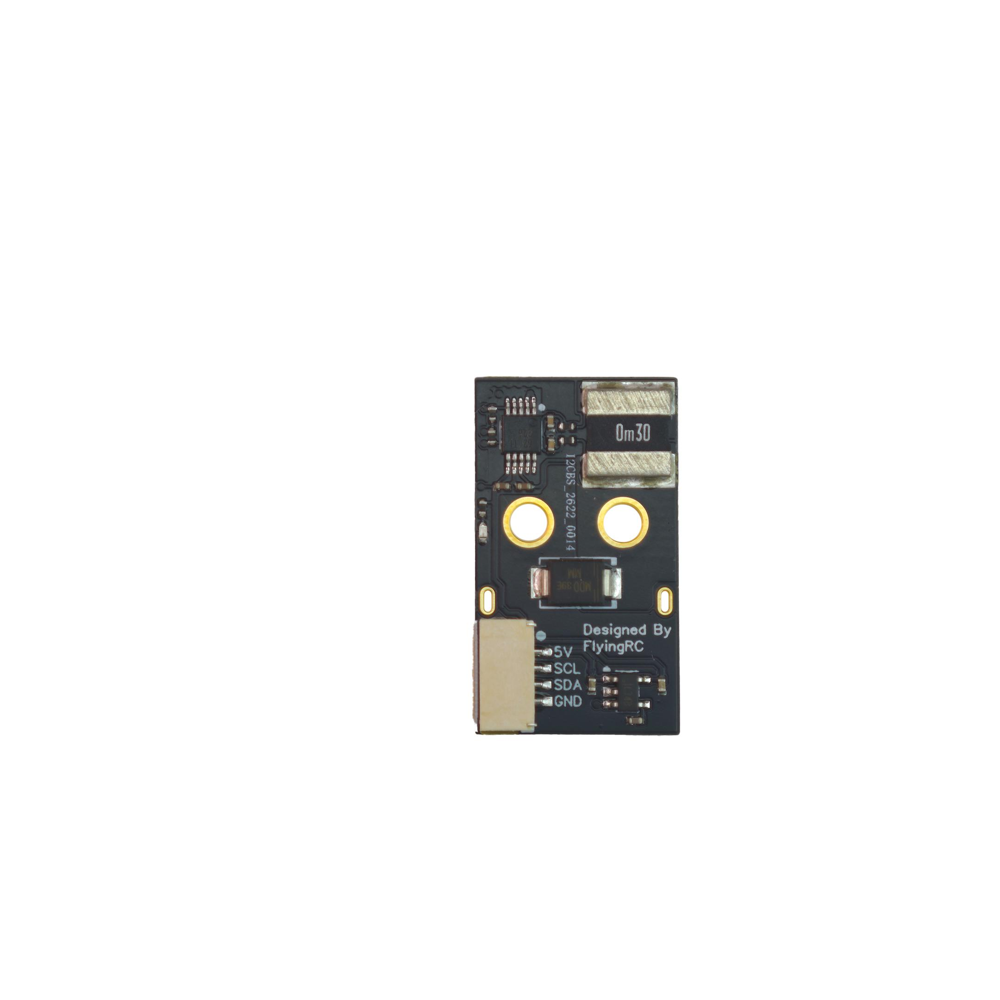
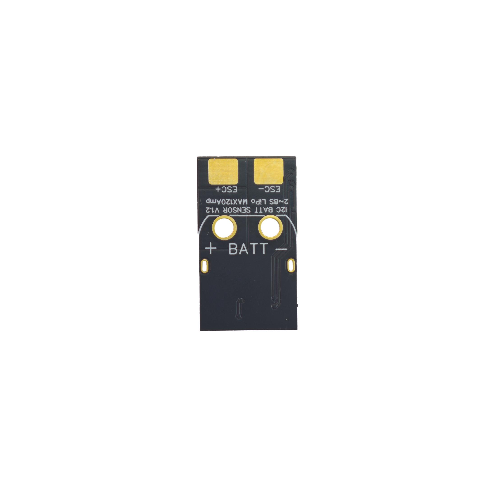
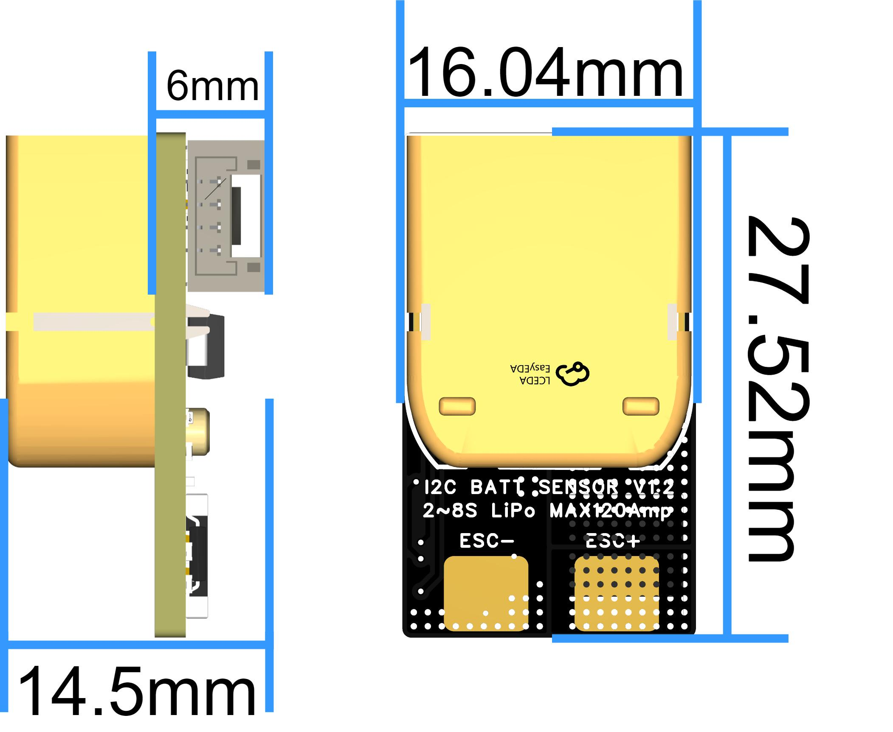
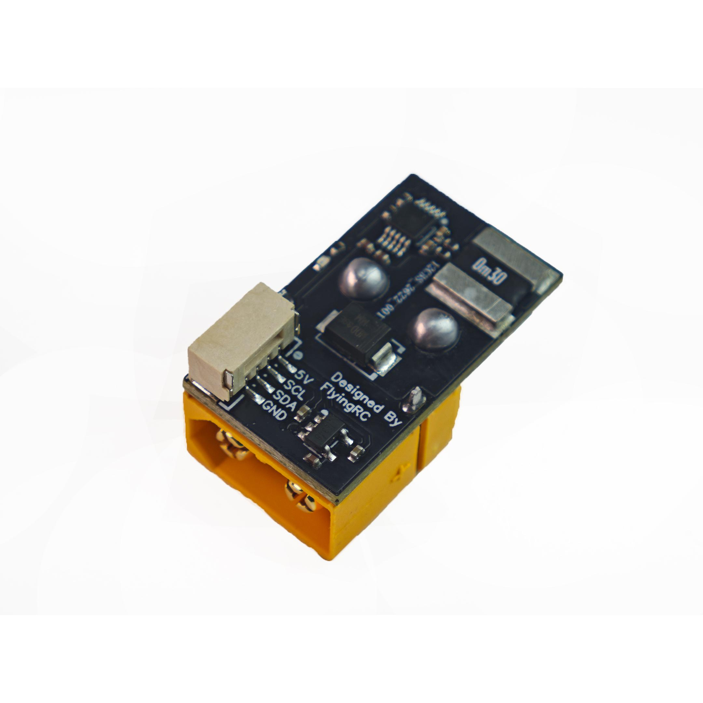
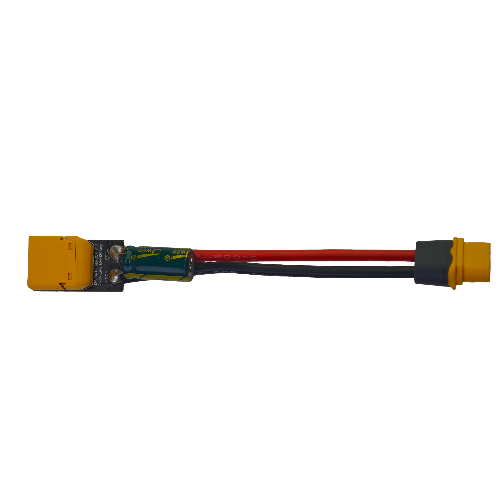
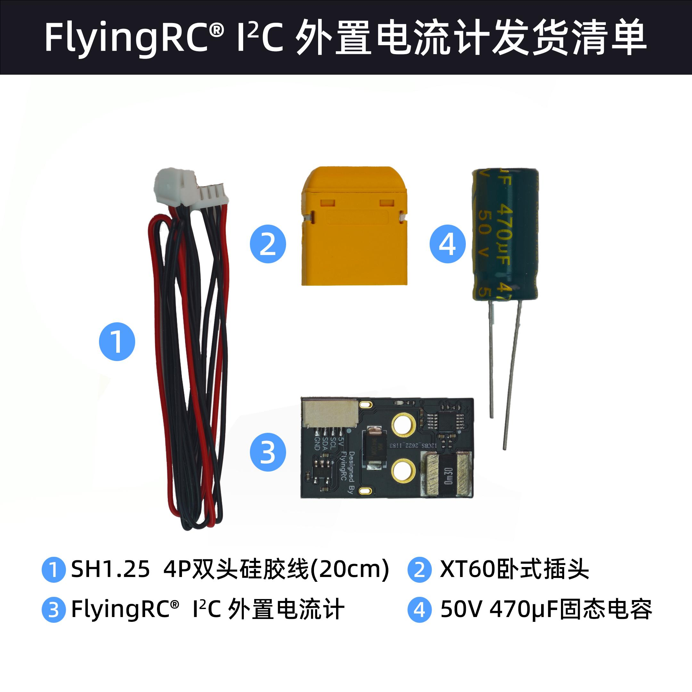
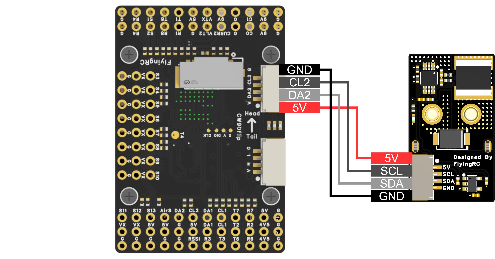

# FlyingRC®I2C 外置电流计产品手册

> 状态：在售 · 类别：module · 内容自原 WPS 说明书迁入

---

## 一、FlyingRC介绍

## 产品概述

## 技术参数

| 基础参数 | 接口 |  |  |
|------|------|------|------|
| 型 号 | FlyingRC® I2C 外置电流计 | VBAT供电范围 | 2-8S LiPo |
| 尺 寸 | 16.04mm*27.52mm*6mm（无插座） / 16.04mm*27.52mm*14.5mm（有插座） | 工作温度范围 | -10-100℃ |
| 质 量 | 2.4g（无插座） / 6.8g（有插座） | 存储温度范围 | 0-40℃ |
| 支持固件 |  |  |  |
| Ardupilot | PX4 |  |  |

## 产品特点

高精度，高分辨率

大量程，耐低温

支持Ardupilot和PX4固件飞控

使用简单，供电稳定

焊接插头注意事项

XT60插头要插到底

焊接时注意烙铁头不要碰到焊盘旁边元件导致短路或者元件脱落。

焊接后图片

电源线规格:Amass正品XT60母头,长度10cm,14AWG硅胶线,一端焊好，一端上锡

焊接好插头和电源线

发货清单

## 三、使用方法

ArduPilot INA226 电流计参数设置

本产品使用 INA226 I2C 电流/电压检测芯片。连接到 ArduPilot 飞控后，请在 Mission Planner / QGroundControl 的完整参数表中设置以下参数：

BATT_MONITOR  = 21        # INA2xx / INA226

BATT_I2C_BUS  = 0 或 1    # 根据飞控的 I2C 总线顺序设置

BATT_I2C_ADDR = 64        # INA226 默认地址 0x40，对应十进制 64

BATT_SHUNT    = 0.0003    # 采样电阻值，单位 Ω；0.0003Ω = 0.3mΩ

设置完成后，请重启飞控使参数生效。

注意：部分飞控的 ArduPilot I2C 总线编号与硬件丝印不完全一致。例如某些飞控物理接口标注为 I2C2，但在 ArduPilot 参数中可能对应 BATT_I2C_BUS = 0。如果设置后无法读取电流/电压数据，请尝试将 BATT_I2C_BUS 在 0 和 1 之间切换，并在每次修改后重启飞控。

### 接线

与FlyingRC® H7Wlite H743主控固定翼飞控接线图

**3. 通用参数设置**

Ardupilot通用参数设置：

BATT_MONITOR  = 21        # INA2xx / INA226

BATT_I2C_BUS  = 0 或 1    # 根据飞控的 I2C 总线顺序设置

BATT_I2C_ADDR = 64        # INA226 默认地址 0x40，对应十进制 64

BATT_SHUNT    = 0.0003    # 采样电阻值，单位 Ω；0.0003Ω = 0.3mΩ

## 四、技术问题咨询

若遇技术问题，建议先查阅产品说明书；也可前往AI平台、B站等渠道获取帮助。同时欢迎群友互相协助，分享已知解决方案。

请注意：本产品Ardupilot固件提供有限技术支持，INAV和BF固件无技术支持

维修服务

本品本品不提供售后维修服务

FlyingRC® 其它产品介绍

飞控类

| 产品1.FlyingRC® F4WSE F405 Pro主控固定翼飞控            本店销量No.1 / 全新升级、功能更强 / FlyingRC官方零售价：140元 / 中文说明书   Product Manual   去淘宝购买 |  |
|------|------|
| 产品2.FlyingRC® F4WSE - F405主控固定翼飞控(停产) / 经典产品、设计独特、好评如潮 / 中文说明书  Product Manual |  |
| 产品3.FlyingRC® H7Wlite H743主控固定翼飞控(停产) / 性能强劲，双陀螺仪 / FlyingRC官方零售价：299元 / 中文说明书  Product Manual |  |
| 产品4.FlyingRC® H7Wlite Pro H743主控固定翼飞控         本店销量No.7 / 性能强劲，双陀螺仪,BEC输出能力强 / FlyingRC官方零售价：259元 / 中文说明书  Product Manual  去淘宝购买 |  |
| 产品5.FlyingRC® F4Wing Mini F405主控固定翼飞控           本店销量No.2 / 2025年 爆款产品,设计感爆棚,全网最Mini / FlyingRC官方零售价：89元 / 中文说明书   Product Manual  去淘宝购买 |  |
| 产品6.FlyingRC® H7D Pro H743主控穿越机飞控                 本店销量No.3 / 全新升级、功能更强 / FlyingRC官方零售价：269元/299元 / 中文说明书 Product Manual 去淘宝购买 |  |
| 产品7.FlyingRC® H7D MK1 H743主控双陀螺仪穿越机飞控(停产) / 算力强大 飞行稳定精准 接口丰富 操控自如 / 中文说明书   Product Manual |  |
| 产品8.FlyinRC® F4D MK1 F405主控 20\30.5孔距 穿越机飞控    本店销量No.9 / 算力强大 飞行稳定精准 接口丰富 操控自如 / FlyingRC官方零售价：129元 / 中文说明书   Product Manual  去淘宝购买 |  |

电调类

| 产品9.FlyingRC® 4IN1 75A ESC 四合一穿越机金封电调 / 本店销量No.4 / 高端产品,英飞凌金封MOS,工艺最佳,单路持续75AFlyingRC官方零售价：269元 / 中文说明书 Product Manual 去淘宝购买 |  |
|------|------|
| 产品10.FlyingRC® 4IN1 45A ESC  四合一穿越机电调 / 性能出色，性价比高，入门首选 / FlyingRC官方零售价：149元 / 中文说明书 Product Manual  去淘宝购买 |  |
| 产品11.FlyingRC® AM32 Dual ESC 40A 二合一电调                本店销量No.12 / 设计独特，独家产品 用于无人机等空中、陆地、水上双动力设备    FlyingRC官方零售价：89元 / 中文说明书 Product Manual 去淘宝购买 |  |
| 产品12.FlyingRC® AM32 ESC 75A V2.5单体金封电调                 本店销量No.6 / 英飞凌金封MOS 工艺出色 过流能力强大 / FlyingRC官方零售价：87元（不带BEC版本） / 中文说明书 Product Manual 去淘宝购买 |  |
| 产品13.FlyingRC® AM32 ESC单体金封电调控制板(带BEC) / 客户可以用自己的功率板，制作不同规格电调 / FlyingRC官方零售价：47元 / 中文说明书 Product Manual 去淘宝购买 |  |
| 产品14.FlyingRC® AM32 Mini ESC 40A V1单体电调           本店销量No.10 / 超Mini 用于小型和微型机 过流能力强 运行稳定 FlyingRC官方零售价：43元 / 中文说明书 Product Manual 去淘宝购买 |  |

飞塔类

| 产品15.FlyingRC® 高阶版飞塔套装 / H743穿越机飞控+四合一穿越机75A金封电调 / 专业飞行首选，旗舰用料工艺，良心价格 / FlyingRC官方零售价：528元 / 飞控中文说明书   电调中文说明书 / FC Product Manual  ESC Product Manual / 去淘宝购买 |  |
|------|------|
| 产品16.FlyingRC® 进阶版飞塔套装 / F405穿越机飞控+四合一穿越机75A金封电调 / 爆款组合，性能出色，良心价格 / FlyingRC官方零售价：398元 / 飞控中文说明书    电调中文说明书 / FC Product Manual ESC Product Manual / 去淘宝购买 |  |
| 产品17.FlyingRC® 进阶版飞塔套装 / H743穿越机飞控+四合一穿越机45A电调 / 爆款组合，性能出色，价格亲民 / FlyingRC官方零售价：408元 / 飞控中文说明书     电调中文说明书 / FC Product Manual  ESC Product Manual / 去淘宝购买 |  |
| 产品18.FlyingRC® 基础版飞塔套装 / F405穿越机飞控+四合一穿越机45A电调 / 爆款组合，实惠之选，价格亲民 / FlyingRC官方零售价：278元 / 飞控中文说明书     电调中文说明书 / FC Product Manual  ESC Product Manual / 去淘宝购买 |  |
| 产品19.FlyingRC® 固定翼飞塔套装 / F4WSE PRO飞控+二合一40A电调 / 独特设计、独家产品、爆款组合 / FlyingRC官方零售价：237元 / 飞控中文说明书      电调中文说明书 / FC Product Manual   ESC Product Manual / 去淘宝购买 |  |

BEC 降压电路类

| 产品20.FlyingRC® 10A 12S BEC降压模块 / 多电压可选 行业首选，物美价廉 / FlyingRC官方零售价：74元 / 中文说明书 Product Manual 去淘宝购买 |  |
|------|------|
| 产品21.FlyingRC® 10A 8S BEC降压模块 / 多电压可选 行业首选，物美价廉 / FlyingRC官方零售价：36元 / 中文说明书 Product Manual 去淘宝购买 |  |
| 产品22.FlyingRC® 5A 6S BEC降压模块  本店销量No.5 / 多电压可选，持续5A输出 / FlyingRC官方零售价：17元 / 中文说明书  Product Manual  去淘宝购买 |  |
| 产品23.FlyingRC® Mini BEC For DJI O4 / 独立降压，稳定供电，让飞行更安全 / FlyingRC官方零售价：18元 / 中文说明书  Product Manual  去淘宝购买 |  |

模块类

| 产品24.FlyingRC® RM3100 SPI Module 罗盘模块 / 超高分辨率、低功耗、行业首选 / FlyingRC官方零售价：129元 / 中文说明书  Product Manual  去淘宝购买 |  |
|------|------|
| 产品25.FlyingRC® L4CAN RM3100 CAN总线罗盘模块 / 行业首选，物美价廉 / FlyingRC官方零售价：199元 / 中文说明书 Product Manual 去淘宝购买 |  |

其他类

| 产品26.FlyingRC® 10A 12S 400A穿越机分电板                      本店销量No.8 / 行业首选，物美价廉 / FlyingRC官方零售价：109元 / 中文说明书  Product Manual 去淘宝购买 |  |
|------|------|
| 产品27.FlyingRC®  ELRS 2.4G 分集ELIS接收机                 本店销量No.11 / 真分集接收,温度补偿，高功率接收 / FlyingRC官方零售价：109元 / 中文说明书  Product Manual  去淘宝购买 |  |
| 产品28.FlyingRC®  AM32电调调参器 / 支持BL，BL32，AM32 简单好用 / FlyingRC官方零售价：9.9元/7.9元（A口/C口）焊好 / FlyingRC官方零售价：6.9元/5.9元（A口/C口）自己焊 / 中文说明书 Product Manual 去淘宝购买 |  |
| 产品29.FlyingRC® I2C无空速管数字新款空速计 / 一体设计，全网最Mini MS4525D协议，I2C接口 / FlyingRC官方零售价：95元 / 中文说明书  Product Manual  去淘宝购买 |  |
| 产品30.FlyingRC® 无空速管数字空速计 / 一体设计，全网最Mini MS4525D协议，I2C接口 / FlyingRC官方零售价：    95元 / 中文说明书  Product Manual  去淘宝购买 |  |
| 产品31.FlyingRC® I2C 外置电流计 / 一体设计，全网最Mini MS4525D协议，I2C接口 / FlyingRC官方零售价：39元 / 中文说明书  Product Manual  去淘宝购买 |  |
| 产品32.FlyingRC® L4 CAN RC/GPS Adapter  CAN总线串口&PWM扩展板 / 长距离传输，高速率，稳定性强 / FlyingRC官方零售价：46元 / 中文说明书  Product Manual  去淘宝购买 |  |
| 产品33.FlyingRC® U-Blox M10 GPS / 支持各种开源飞控 多尺寸可选 搜星能力强 性价高 / FlyingRC官方零售价：68元(18*18mm款) / 中文说明书  Product Manual  去淘宝购买 |  |

| FlyingRC®官网 / www.FlyingRC®.cn | 淘宝店铺 | 闲鱼店铺 | 群号1016199449 |
|------|------|------|------|

电话:021-58204886 手机:13122492475   微信:13122492475、18019464804

---

## 安全须知

--8<-- "shared/safety.md"

---

## 首次使用检查

--8<-- "shared/first-use-check.md"

---

## 技术支持

--8<-- "shared/support.md"

---

## 售后与保修

--8<-- "shared/warranty.md"

---

## FlyingRC® 其它产品

--8<-- "shared/other-products.md"

---

## 免责声明

--8<-- "shared/disclaimer.md"

