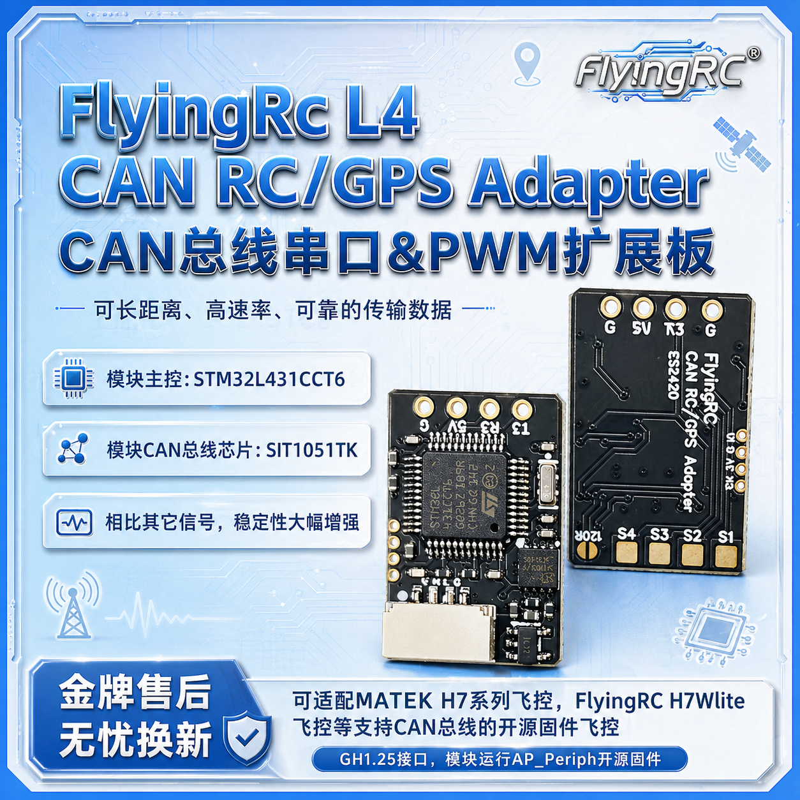
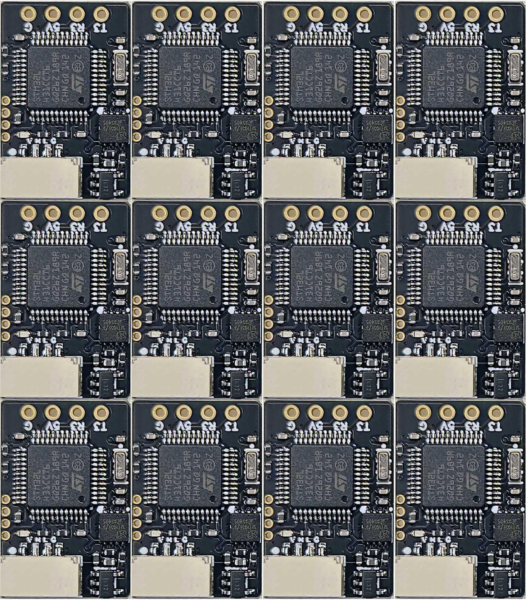

# FlyingRC® L4 CAN 扩展板 产品手册

> 状态：在售 · 类别：module · 内容自原 WPS 说明书迁入

---

## 一、FlyingRC介绍

## 二、产品概述

## 技术参数

产品尺寸：14mm*21mm*6mm

产品重量：1.7g

板子层数:4层

板厚1.60mm

发货内容：CAN RC Adapter模块*1，2.54mm 4p镀金排针*1，GH1.25反向双头硅胶线*1。

模块主控：STM32L431CCT6，

模块CAN总线芯片：SIT1051TK

模块运行AP_Periph开源固件。

## 产品特点

可长距离、高速率、可靠的传输数据，相比其它信号，稳定性大幅增强。

可适配MATEK H7系列飞控，FlyingRC® H7Wlite飞控等支持CAN总线的开源固件飞控。GH1.25接口。

模块可连接一个串口设备（ELRS接收机；GPS等），并且支持4路PWM输出，可用于拓展舵机/电调通道。模块预留SWDIO接口，支持二次开发（无技术支持）。

## 三、使用方法

固件升级：接收机出厂固件版本为3.5.5，需将TX模块固件升级到3.x以上，以确保兼容性。

进入绑定模式：连续对接收机进行三次通断电操作，每次间隔1秒，当RGB指示灯快速闪烁两次时，接收机进入绑定模式。

绑定设置：配置遥控或发射模块与接收机进行绑定，绑定成功后，接收机RGB指示灯常亮。

注意事项

请勿在高温、潮湿或强电磁干扰的环境下使用CAN RC Adapter模块，以免影响设备性能和使用寿命。

避免模块受到剧烈撞击或跌落，防止内部硬件损坏。

定期检查CAN RC Adapter模块的连接线路，确保连接牢固，无松动或损坏。

在使用过程中，如发现设备异常，应立即停止使用，并联系专业技术人员进行检修。

## 四、技术问题咨询

若遇技术问题，建议先查阅产品说明书；也可前往AI平台、B站等渠道获取帮助。同时欢迎群友互相协助，分享已知解决方案。

请注意：本产品Ardupilot固件提供有限技术支持，INAV和BF固件无技术支持

## 五、维修服务

本品不提供维修服务

FlyingRC® 其它产品介绍

---

## 安全须知

--8<-- "shared/safety.md"

---

## 首次使用检查

--8<-- "shared/first-use-check.md"

---

## 技术支持

--8<-- "shared/support.md"

---

## 售后与保修

--8<-- "shared/warranty.md"

---

## FlyingRC® 其它产品

--8<-- "shared/other-products.md"

---

## 免责声明

--8<-- "shared/disclaimer.md"

