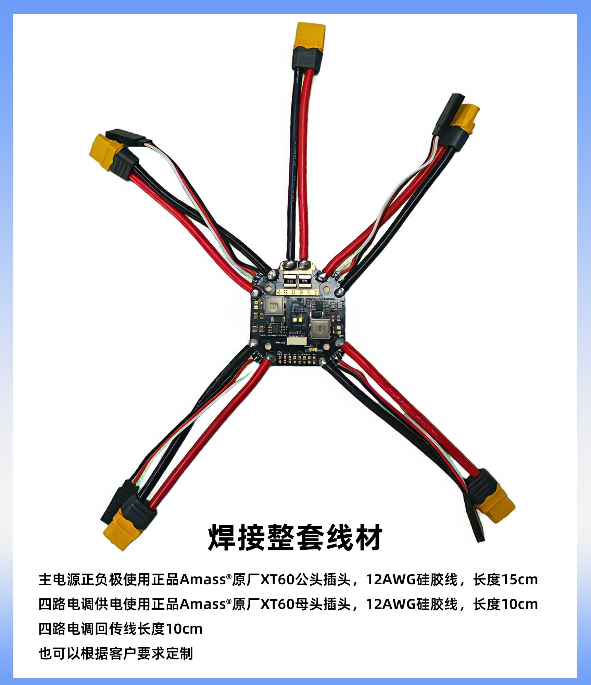
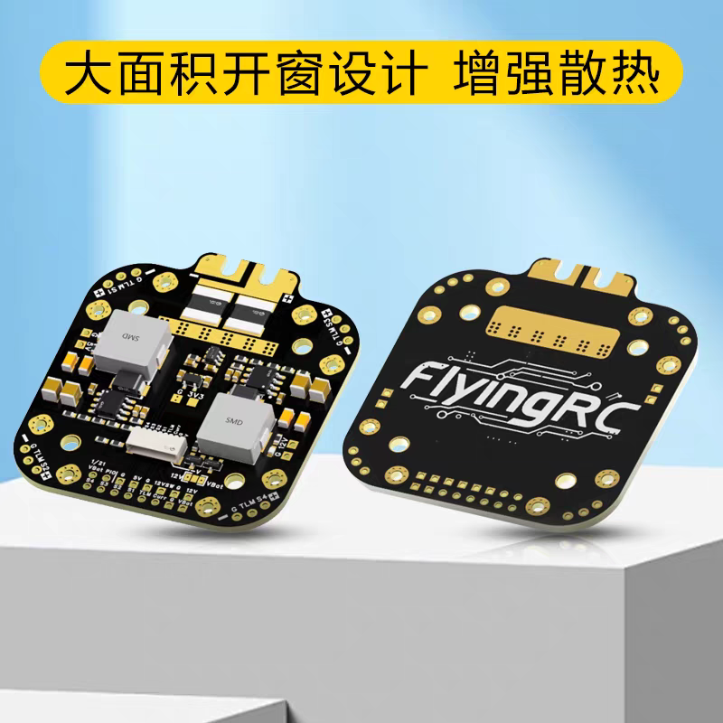
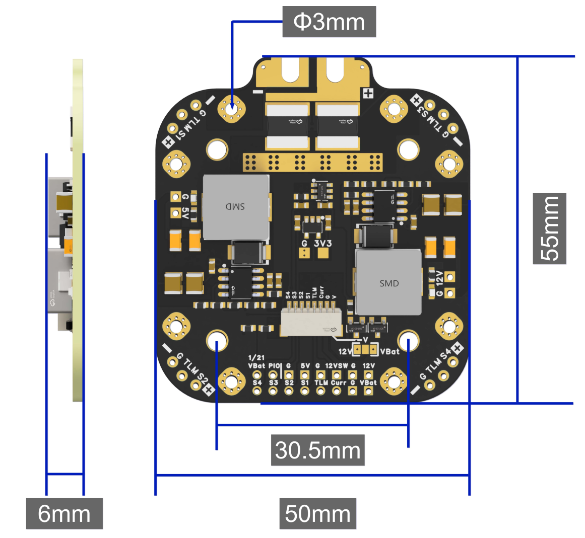
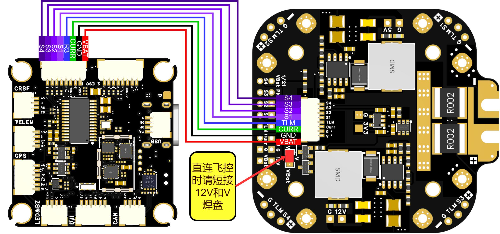

# FlyingRC® 12S 440A穿越机分电板产品手册

> 状态：在售 · 类别：power · 内容自原 WPS 说明书迁入

---

FlyingRC介绍

## 产品概述

产品3D尺寸图

## 技术参数

产品尺寸：55mm x 50mm x 6mm

安装孔距：30.5mm x 30.5mm，3mm 孔径

产品重量：21.5g

PCB:6层板；外层2oz，内层2oz；板厚2.0；1u沉金

输入电压范围：6-60V DC 输入（2-12S LiPo 电池）

分电板最大输出电流：4 x (80A 连续电流、110A 峰值电流)

板载BEC输出：5V 5A & 12V 4A

工作温度范围：-20~100℃

## 产品特点

支持最高12S输入

大面积开窗设计，增强散热

板载超高精度电流传感器，范围高达440A

支持4 个 80A 连续电流、110A 峰值电流的电调电源输出

内置 1k:20k电压分压器

可同时输出5V/12V电压

板载2个BEC红色工作指示灯

板载SH1.0 8pin连接器连接飞控，或可使用焊盘焊接至飞控

板载双BEC，5V可稳定输出5A，12V可稳定输出4A

可控12V电压输出（12VSW焊盘输入高电平时，关断12V输出）

板载3.3V LDO，可输出最大500mA电流

配备“V”焊盘，可通过焊接跳线焊盘选择输出12V或电池电压

焊接建议：350-400°C，Sn63Pb37 焊锡

## 三、使用方法

产品与四路单体电调（FlyingRC® AM32 75A ESC V2.5）接线图

产品与飞控（FlyingRC® H7DPro MK1 FC）接线图

飞控电压计设置：1/21V

飞控电流计设置：7.5mV/A

## 四、技术问题咨询

若遇技术问题，建议先查阅产品说明书；也可前往AI平台、B站等渠道获取帮助。同时欢迎群友互相协助，分享已知解决方案。

## 五、维修服务

保修服务期限及内容：若用户在装机前测试或第一次使用时，经正常检测发现产品存在质量问题，且自购买之日起一年内FlyingRC®对产品主体提供免费更换（没有焊接的情况下）或者维修服务，客户无需支付任何费用。产品配件属于易损品，不在保修范围内，损坏可以在FlyingRC®淘宝店铺购买。

若首次使用后没有发现产品存在问题，视为产品性能正常，不存在质量问题。后续使用中出现任何问题，视为用户不规范操作的所致。FlyingRC®提供两种售后服务供用户选择。

适用条件：用户购买产品1年内，可享受1次优惠以旧换新，需寄回故障产品。

折扣规则：按淘宝店正常售价7折购买全新同款同配置产品；换新品不再享受维修和售后服务。

付费维修寄送要求：

客户寄修前请先电话或微信联系工作人员，说明电路损坏原因与故障情况，确认是否可修。

产品寄出后，请主动提供运单号。未与维修工程师沟通直接寄回，若出现快递丢失、无法维修等情况，损失由客户自行承担。

随货请附纸条，注明：产品具体故障、故障原因、操作过程，并填写联系方式、回寄地址。拒收顺丰及到付件。

未附纸条导致无法联系、无法维修的，后果由客户承担。客户超过 3 个月未联系的，产品将按无主件报废处理。

因客户参数设置错误导致产品异常，工程师重新刷固件或校正参数的，将收取检测费 10–20 元。

| 维修内容 | 项目编号 | 更换芯片型号 | 材料费+手工费=维修费 |

|------|------|------|------|

| 飞控主控 | 1 | STM32F405RGT6 | 30+15=45 |

|  | 2 | STM32H743VIT6 | 50+30=80 |

|  | 3 | STM32H743VIH6 | 65+45=110 |

| 电调主控 | 4 | QF32F4AK8U7 | 8+10=18 |

|  | 5 | AT32F421K8U7 | 6+10=16 |

| 飞控传感器 | 6 | ICM-42688-P | 70+12=82 |

|  | 7 | ICM-42605 | 50+12=62 |

|  | 8 | SPL06 | 4+10=16 |

|  | 9 | DPS310/DPS368 | 25+12=37 |

| 飞控电源芯片 | 10 | MP9943 | 7+10=17 |

|  | 11 | MP9447 | 10+10=20 |

|  | 12 | MP9942 | 8+10=18 |

|  | 13 | LM25148 | 26+15=41 |

|  | 14 | LDO | 4+5=9 |

| 电调场效应管 | 15 | IRF7480 | 5+5=10 |

|  | 16 | HYG022N04LS1C1 | 3+5=8 |

| 其它元器件 | 17 | 电阻、电容、插座等 | 2+5=7 |

FlyingRC® 其它产品介绍

---

## 安全须知

--8<-- "shared/safety.md"

---

## 焊接注意

--8<-- "shared/soldering.md"

---

## 首次使用检查

--8<-- "shared/first-use-check.md"

---

## 技术支持

--8<-- "shared/support.md"

---

## 售后与保修

--8<-- "shared/warranty.md"

---

## FlyingRC® 其它产品

--8<-- "shared/other-products.md"

---

## 免责声明

--8<-- "shared/disclaimer.md"

