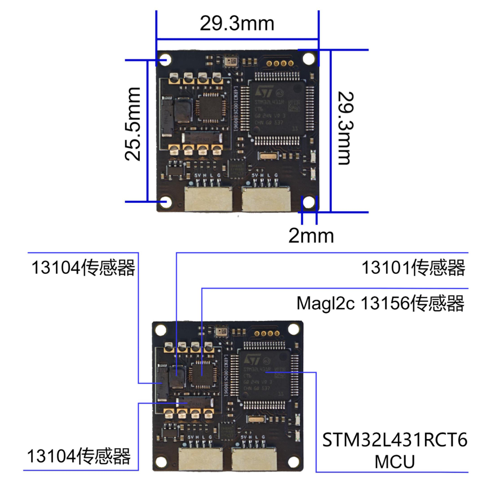
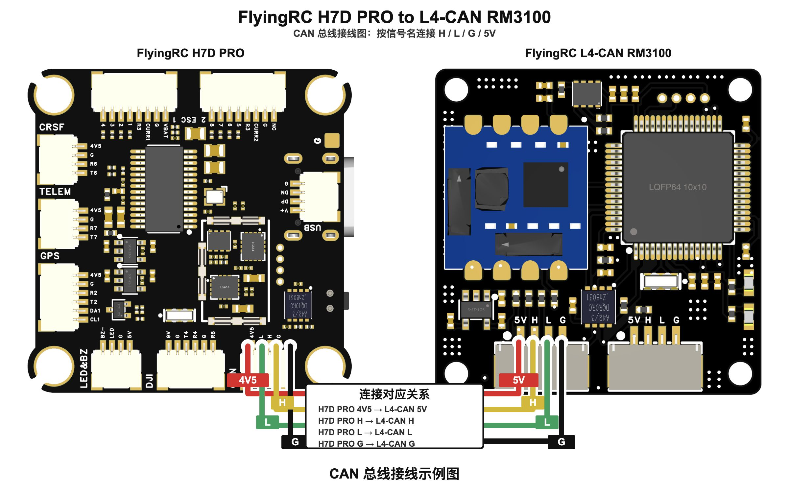
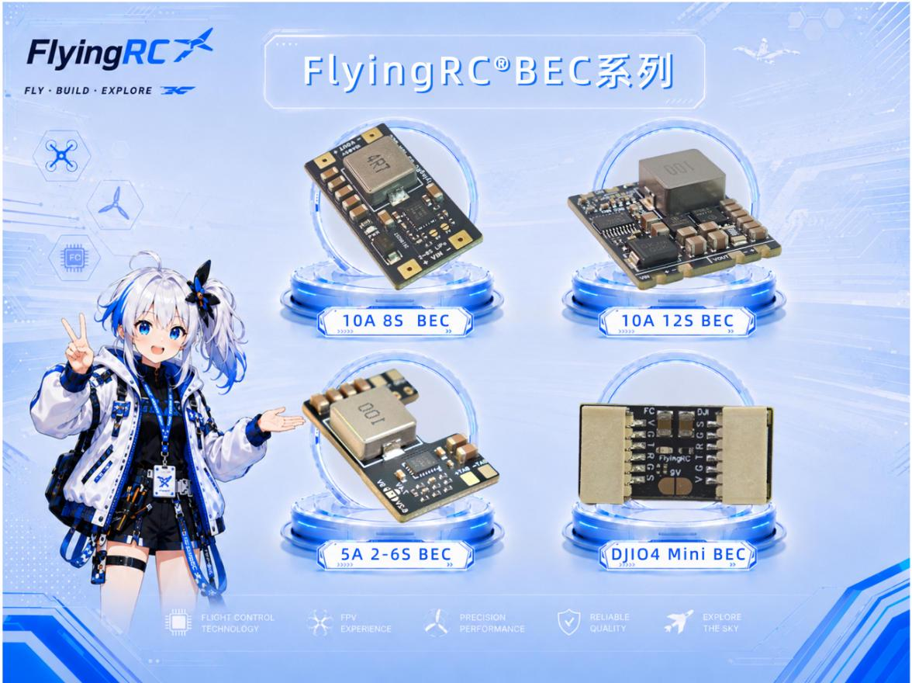
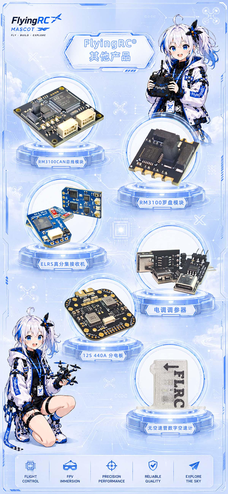

# FlyingRC® L4CAN RM3100 CAN总线罗盘模块说明书

> 状态：在售 · 类别：module · 内容自原 WPS 说明书迁入

---

## 一、FlyingRC介绍

## 产品概述

产品简介​

FlyingRC® L4CAN RM3100 CAN总线罗盘模块是一款专业级 CAN 总线磁力计，搭载 RM3100 地磁芯片与 ArduPilot AP_Periph 外设固件。由2个X/Y轴磁传感器Sen-XY-f(13104)、1个Z轴磁传感器Sen-Z-f(13101)和1个ASIC控制器MagI2C组成。10倍于霍尔传感器的分辨率和低于20倍的噪音，使得RM3100成为了同类产品中高性能的磁传感器，保证了航向和方位测量的精确性。基于专利磁感技术的PNI传感器不仅具备超低音下的高分辨率和重复性数据输出，而且采样率高、无磁滞现象，也不需要进行温度校准。

## 产品特点

采用工业级RM3100磁力计,高分辨率,

优秀的抗干扰性,确保精准的航向数据

响应速度快，具备更好的通信稳定性

### 支持CAN通信，满足需要远距离安装接线的需求

支持AP和PX4固件

灵活易安装

**1.3 技术参数**

产品参数：

尺寸：29.3mm*29.3mm*9.0mm

重量(不加底座)：4.5g

重量(加底座)：10.5g

板子层数:4层

板厚1.64mm

是否沉金:是 1u

发货内容：

L4CAN RM3100 CAN总线罗盘模块×1

3D打印底座×1

4P GH1.25 20CM反向双头硅胶线×1

M2*4 自攻螺丝×4

模块主控：STM32L431RCT6

| 基础参数 | 主控 |  |  |

|------|------|------|------|

| 产品型号 | FlyingRC® L4CAN RM3100 CAN总线罗盘模块 | 芯片 | STM32L431RCT6 |

| 产品尺寸 | 29.3mm*29.3mm*9.0mm | 主频 | 80MHz |

| 安装孔 | M2/25.5mm | 闪存 | 256KB |

| 产品重量 | 4.5g | RAM | 64KB |

| 产品+底座重量 | 10.5g |  |  |

| RM3100参数 | 接口 |  |  |

| 测量范围 | ±400μT | CAN 接口 | 支持 DroneCAN 协议 |

| 灵敏度 | 13 nT | UART2 | MSP 协议输出 |

| 噪声 | 15 nT | UART3 | 外接 GNSS 定位模块专用 |

| 噪声密度 | 1.2 nT/Hz | ST 调试接口 | SWCLK、SWDIO |

| 线性度（±200μT内） | 0.5% | 指示灯状态 |  |

| 磁滞（±200μT内） | ≤15 nT | 蓝灯快闪 | 设备启动中 |

| 重复性（±200μT内） | ≤8 nT | 蓝灯慢闪 | 正常工作 |

| 单轴最大采样率 | 440 Hz | 红灯 | 3.3V 电源指示 |

| 三轴最大采样率 | 550 Hz |  |  |

| 电气参数 | 飞控参数设置 |  |  |

| 供电电压 | 4.5~5.5V（板载 5V 焊盘 / 引脚供电） | 接 1 号 CAN 总线 | CAN_P1_DRIVER = 1 |

| 工作电流 | 22 毫安 | 接 2 号 CAN 总线 | CAN_P2_DRIVER = 1 |

| 工作温度 | -40℃ ~ 85℃ | 地磁自动磁偏角校正 | COMPASS_AUTODEC = 1 |

## 使用方法

使用提示：

设备出厂预装 MatekL431-GPS 固件；

磁力计需远离电源线、电调、电机、铁质金属物料，间距不小于10厘米；

若 CAN 总线接线过长，需短接板上 120Ω 终端电阻跳帽。

### 与FlyingRC® H7D Pro飞控接线图

技术问题咨询

若遇技术问题，建议先查阅产品说明书；也可前往AI平台、B站等渠道获取帮助。同时欢迎群友互相协助，分享已知解决方案。

维修服务

本品不提供售后维修服务

FlyingRC® 其它产品介绍

飞控类

| 产品1.FlyingRC® F4WSE F405 Pro主控固定翼飞控            本店销量No.1 / 全新升级、功能更强 / FlyingRC官方零售价：140元 / 中文说明书   Product Manual   去淘宝购买 |  |

|------|------|

| 产品2.FlyingRC® F4WSE - F405主控固定翼飞控(停产) / 经典产品、设计独特、好评如潮 / 中文说明书  Product Manual |  |

| 产品3.FlyingRC® H7Wlite H743主控固定翼飞控(停产) / 性能强劲，双陀螺仪 / FlyingRC官方零售价：299元 / 中文说明书  Product Manual |  |

| 产品4.FlyingRC® H7Wlite Pro H743主控固定翼飞控         本店销量No.7 / 性能强劲，双陀螺仪,BEC输出能力强 / FlyingRC官方零售价：259元 / 中文说明书  Product Manual  去淘宝购买 |  |

| 产品5.FlyingRC® F4Wing Mini F405主控固定翼飞控           本店销量No.2 / 2025年 爆款产品,设计感爆棚,全网最Mini / FlyingRC官方零售价：89元 / 中文说明书   Product Manual  去淘宝购买 |  |

| 产品6.FlyingRC® H7D Pro H743主控穿越机飞控                 本店销量No.3 / 全新升级、功能更强 / FlyingRC官方零售价：269元/299元 / 中文说明书 Product Manual 去淘宝购买 |  |

| 产品7.FlyingRC® H7D MK1 H743主控双陀螺仪穿越机飞控(停产) / 算力强大 飞行稳定精准 接口丰富 操控自如 / 中文说明书   Product Manual |  |

| 产品8.FlyinRC® F4D MK1 F405主控 20\30.5孔距 穿越机飞控    本店销量No.9 / 算力强大 飞行稳定精准 接口丰富 操控自如 / FlyingRC官方零售价：129元 / 中文说明书   Product Manual  去淘宝购买 |  |

电调类

| 产品9.FlyingRC® 4IN1 75A ESC 四合一穿越机金封电调 / 本店销量No.4 / 高端产品,英飞凌金封MOS,工艺最佳,单路持续75AFlyingRC官方零售价：269元 / 中文说明书 Product Manual 去淘宝购买 |  |

|------|------|

| 产品10.FlyingRC® 4IN1 45A ESC  四合一穿越机电调 / 性能出色，性价比高，入门首选 / FlyingRC官方零售价：149元 / 中文说明书 Product Manual  去淘宝购买 |  |

| 产品11.FlyingRC® AM32 Dual ESC 40A 二合一电调                本店销量No.12 / 设计独特，独家产品 用于无人机等空中、陆地、水上双动力设备    FlyingRC官方零售价：89元 / 中文说明书 Product Manual 去淘宝购买 |  |

| 产品12.FlyingRC® AM32 ESC 75A V2.5单体金封电调                 本店销量No.6 / 英飞凌金封MOS 工艺出色 过流能力强大 / FlyingRC官方零售价：87元（不带BEC版本） / 中文说明书 Product Manual 去淘宝购买 |  |

| 产品13.FlyingRC® AM32 ESC单体金封电调控制板(带BEC) / 客户可以用自己的功率板，制作不同规格电调 / FlyingRC官方零售价：47元 / 中文说明书 Product Manual 去淘宝购买 |  |

| 产品14.FlyingRC® AM32 Mini ESC 40A V1单体电调           本店销量No.10 / 超Mini 用于小型和微型机 过流能力强 运行稳定 FlyingRC官方零售价：43元 / 中文说明书 Product Manual 去淘宝购买 |  |

飞塔类

| 产品15.FlyingRC® 高阶版飞塔套装 / H743穿越机飞控+四合一穿越机75A金封电调 / 专业飞行首选，旗舰用料工艺，良心价格 / FlyingRC官方零售价：528元 / 飞控中文说明书   电调中文说明书 / FC Product Manual  ESC Product Manual / 去淘宝购买 |  |

|------|------|

| 产品16.FlyingRC® 进阶版飞塔套装 / F405穿越机飞控+四合一穿越机75A金封电调 / 爆款组合，性能出色，良心价格 / FlyingRC官方零售价：398元 / 飞控中文说明书    电调中文说明书 / FC Product Manual ESC Product Manual / 去淘宝购买 |  |

| 产品17.FlyingRC® 进阶版飞塔套装 / H743穿越机飞控+四合一穿越机45A电调 / 爆款组合，性能出色，价格亲民 / FlyingRC官方零售价：408元 / 飞控中文说明书     电调中文说明书 / FC Product Manual  ESC Product Manual / 去淘宝购买 |  |

| 产品18.FlyingRC® 基础版飞塔套装 / F405穿越机飞控+四合一穿越机45A电调 / 爆款组合，实惠之选，价格亲民 / FlyingRC官方零售价：278元 / 飞控中文说明书     电调中文说明书 / FC Product Manual  ESC Product Manual / 去淘宝购买 |  |

| 产品19.FlyingRC® 固定翼飞塔套装 / F4WSE PRO飞控+二合一40A电调 / 独特设计、独家产品、爆款组合 / FlyingRC官方零售价：237元 / 飞控中文说明书      电调中文说明书 / FC Product Manual   ESC Product Manual / 去淘宝购买 |  |

BEC 降压电路类

| 产品20.FlyingRC® 10A 12S BEC降压模块 / 多电压可选 行业首选，物美价廉 / FlyingRC官方零售价：74元 / 中文说明书 Product Manual 去淘宝购买 |  |

|------|------|

| 产品21.FlyingRC® 10A 8S BEC降压模块 / 多电压可选 行业首选，物美价廉 / FlyingRC官方零售价：36元 / 中文说明书 Product Manual 去淘宝购买 |  |

| 产品22.FlyingRC® 5A 6S BEC降压模块  本店销量No.5 / 多电压可选，持续5A输出 / FlyingRC官方零售价：17元 / 中文说明书  Product Manual  去淘宝购买 |  |

| 产品23.FlyingRC® Mini BEC For DJI O4 / 独立降压，稳定供电，让飞行更安全 / FlyingRC官方零售价：18元 / 中文说明书  Product Manual  去淘宝购买 |  |

模块类

| 产品24.FlyingRC® RM3100 SPI Module 罗盘模块 / 超高分辨率、低功耗、行业首选 / FlyingRC官方零售价：129元 / 中文说明书  Product Manual  去淘宝购买 |  |

|------|------|

| 产品25.FlyingRC® L4CAN RM3100 CAN总线罗盘模块 / 行业首选，物美价廉 / FlyingRC官方零售价：199元 / 中文说明书 Product Manual 去淘宝购买 |  |

其他类

| 产品26.FlyingRC® 10A 12S 400A穿越机分电板                      本店销量No.8 / 行业首选，物美价廉 / FlyingRC官方零售价：109元 / 中文说明书  Product Manual 去淘宝购买 |  |

|------|------|

| 产品27.FlyingRC®  ELRS 2.4G 分集ELIS接收机                 本店销量No.11 / 真分集接收,温度补偿，高功率接收 / FlyingRC官方零售价：109元 / 中文说明书  Product Manual  去淘宝购买 |  |

| 产品28.FlyingRC®  AM32电调调参器 / 支持BL，BL32，AM32 简单好用 / FlyingRC官方零售价：9.9元/7.9元（A口/C口）焊好 / FlyingRC官方零售价：6.9元/5.9元（A口/C口）自己焊 / 中文说明书 Product Manual 去淘宝购买 |  |

| 产品29.FlyingRC® I2C无空速管数字新款空速计 / 一体设计，全网最Mini MS4525D协议，I2C接口 / FlyingRC官方零售价：95元 / 中文说明书  Product Manual  去淘宝购买 |  |

| 产品30.FlyingRC® 无空速管数字空速计 / 一体设计，全网最Mini MS4525D协议，I2C接口 / FlyingRC官方零售价：    95元 / 中文说明书  Product Manual  去淘宝购买 |  |

| 产品31.FlyingRC® I2C 外置电流计 / 一体设计，全网最Mini MS4525D协议，I2C接口 / FlyingRC官方零售价：39元 / 中文说明书  Product Manual  去淘宝购买 |  |

| 产品32.FlyingRC® L4 CAN RC/GPS Adapter  CAN总线串口&PWM扩展板 / 长距离传输，高速率，稳定性强 / FlyingRC官方零售价：46元 / 中文说明书  Product Manual  去淘宝购买 |  |

| 产品33.FlyingRC® U-Blox M10 GPS / 支持各种开源飞控 多尺寸可选 搜星能力强 性价高 / FlyingRC官方零售价：68元(18*18mm款) / 中文说明书  Product Manual  去淘宝购买 |  |

| FlyingRC®官网 / www.FlyingRC®.cn | 淘宝店铺 | 闲鱼店铺 | 群号1016199449 |

|------|------|------|------|

电话:021-58204886 手机:13122492475   微信:13122492475、18019464804

---

## 安全须知

--8<-- "shared/safety.md"

---

## 首次使用检查

--8<-- "shared/first-use-check.md"

---

## 技术支持

--8<-- "shared/support.md"

---

## 售后与保修

--8<-- "shared/warranty.md"

---

## FlyingRC® 其它产品

--8<-- "shared/other-products.md"

---

## 免责声明

--8<-- "shared/disclaimer.md"

