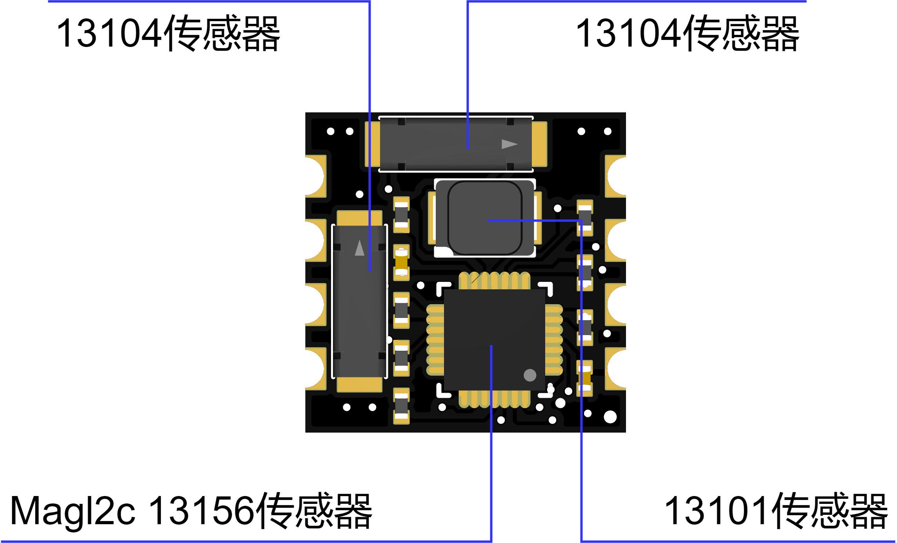
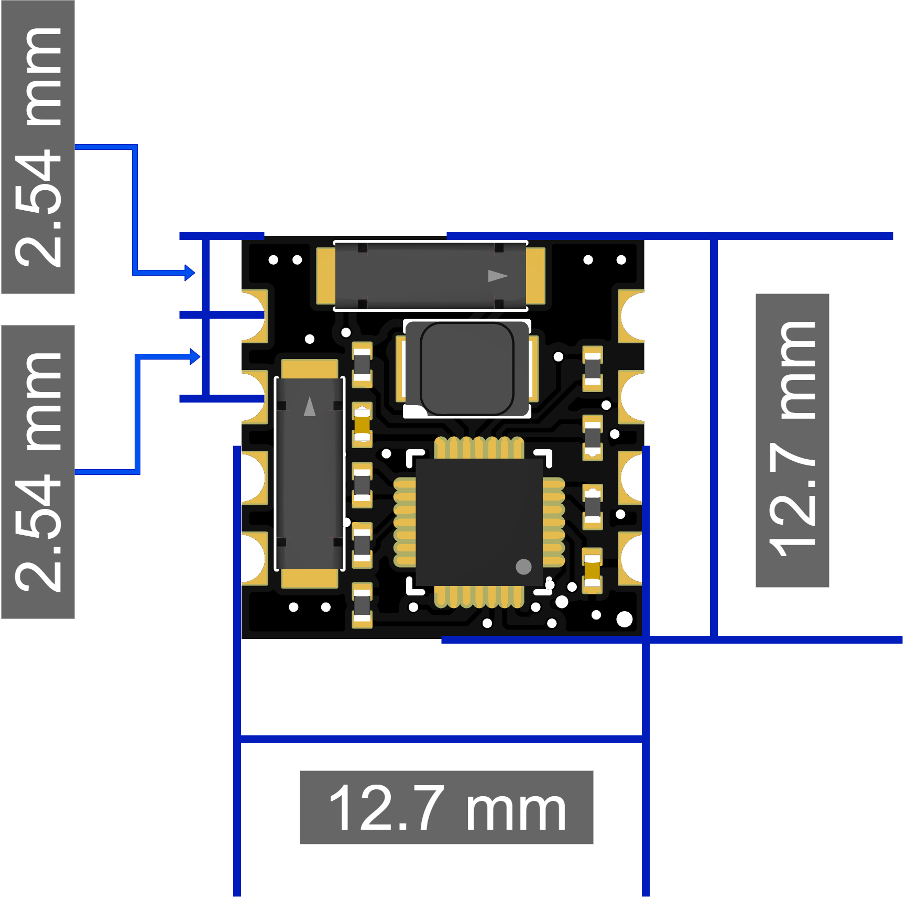
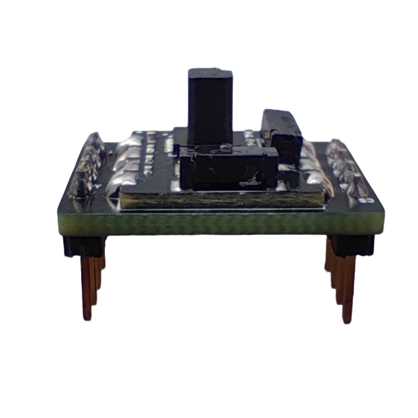
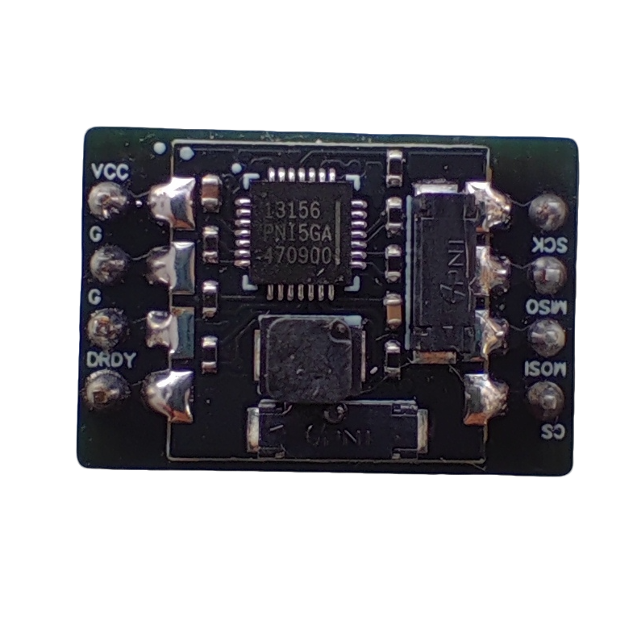
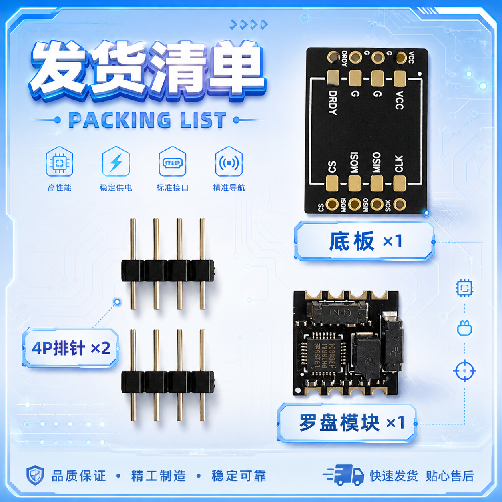
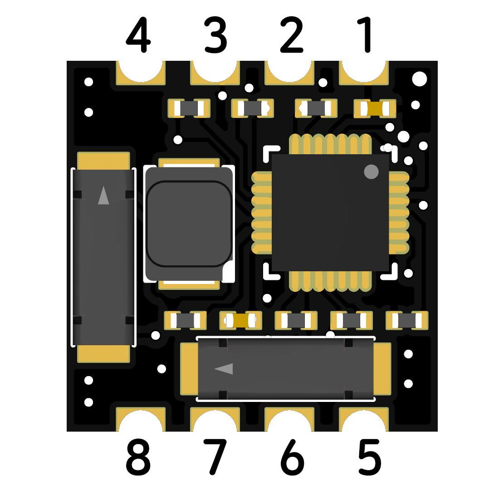
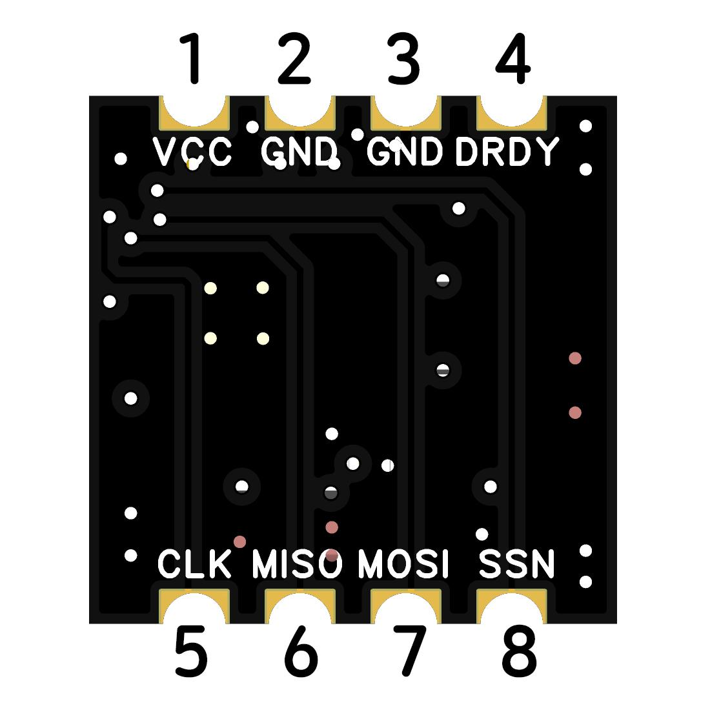
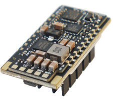

# FlyingRC® RM3100 SPI Module罗盘模块说明书

> 状态：在售 · 类别：module · 内容自原 WPS 说明书迁入

---

## 一、FlyingRC介绍

## 产品概述

**1.1 产品简介​**

RM3100磁传感器套件是由2个X/Y轴磁传感器Sen-XY-f(13104)、1个Z轴磁传感器Sen-Z-f(13101)和1个ASIC控制器MagI2C组成。10倍于霍尔传感器的分辨率和低于20倍的噪音，使得RM3100成为了同类产品中高性能的磁传感器，保证了航向和方位测量的精确性。基于专利磁感技术的PNI传感器不仅具备超低音下的高分辨率和重复性数据输出，而且采样率高、无磁滞现象，也不需要进行温度校准。

**1.2 典型应用​**

无人机 / 航模电子罗盘​

车载导航、姿态航向参考系统​

机器人定位、地质勘探、磁场检测​

工业仪表、安防设备、AR/VR 姿态感知

**1.3 技术参数**

产品尺寸：12.70mm*12.70mm*7.42mm

产品重量：0.53g

板子层数:4层

板厚1.16mm

是否沉金:是 1u

发货内容：罗盘模块

芯片组：PNI RM3100 三轴地磁/磁力传感器芯片

焊接好底板和排针侧面图

焊接好底板和排针俯视图

**2.技术参数**

参数名称

数值

单位

测量范围

±400

μT

灵敏度

13

nT

噪声

15

nT

噪声密度

**1.2**

nT/Hz

线性度（±200μT内）

0.5

%

磁滞（±200μT内）

≤15

nT

重复性（±200μT内）

≤8

nT

单轴最大采样率

440

Hz

三轴最大采样率

550

Hz

**3. 引脚定义（RM3100‑8Pin）**

俯视模块（背面丝印正读），引脚排序：上排从左到右为Pin1~Pin4，下排从左到右为Pin5~Pin8

Pin号

引脚丝印

引脚别名

功能描述

1

VCC

VDD

电源输入,推荐3.3V

2

GND

GND

电源地

3

GND

GND

电源地（双GND设计，增强抗干扰）

4

DRDY

DRDY

数据就绪（高电平有效，测量完成后置高）

5

CLK

SCK

SPI时钟

6

MISO

SDO

SPI主机入从机出（主机输入，从机输出）

7

MOSI

SDI

SPI主机出从机入（主机输出，从机输入）

8

SSN

CS/片选

SPI从机选择（低电平有效）

### 4、设备接线表

RM3100模块引脚

主控SPI引脚

说明

VCC(Pin1)

**3.3V电源**

推荐3.3V，范围2.0~3.6V

GND(Pin2/Pin3)

GND

双GND可任意接一个或同时接

CLK(Pin5)

SPI_SCK

SPI时钟，主机输出

MISO(Pin6)

SPI_MISO

SPI主机入，从机出

MOSI(Pin7)

SPI_MOSI

SPI主机出，从机入

SSN(Pin8)

SPI_CS

SPI片选，低电平有效

DRDY(Pin4)

主控中断引脚（可选）

数据就绪中断，可用于触发读取，轮询模式可悬空

注：模块安装完成后，必须在现场完成全姿态校准，方可投入使用

技术问题咨询

若遇技术问题，建议先查阅产品说明书；也可前往AI平台、B站等渠道获取帮助。同时欢迎群友互相协助，分享已知解决方案。

维修服务

本品不提供售后维修服务

FlyingRC® 其它产品介绍

**1. 飞控类38**

**2. 电调类41**

**3. 飞塔类43**

4. BEC 降压电路类47

5. 模块类49

6. 其他类50

飞控类

全新升级、功能更强

FlyingRC官方零售价：140元

中文说明书   Product Manual   去淘宝购买

经典产品、设计独特、好评如潮

中文说明书  Product Manual

性能强劲，双陀螺仪

FlyingRC官方零售价：299元

中文说明书  Product Manual

性能强劲，双陀螺仪,BEC输出能力强

FlyingRC官方零售价：259元

中文说明书  Product Manual  去淘宝购买

2025年 爆款产品,设计感爆棚,全网最Mini

FlyingRC官方零售价：89元

中文说明书   Product Manual  去淘宝购买

全新升级、功能更强

FlyingRC官方零售价：269元/299元

中文说明书 Product Manual 去淘宝购买

算力强大 飞行稳定精准 接口丰富 操控自如

中文说明书   Product Manual

算力强大 飞行稳定精准 接口丰富 操控自如

FlyingRC官方零售价：129元

中文说明书   Product Manual  去淘宝购买

电调类

本店销量No.4

高端产品,英飞凌金封MOS,工艺最佳,单路持续75AFlyingRC官方零售价：269元

中文说明书 Product Manual 去淘宝购买

性能出色，性价比高，入门首选

FlyingRC官方零售价：149元

中文说明书 Product Manual  去淘宝购买

设计独特，独家产品 用于无人机等空中、陆地、水上双动力设备    FlyingRC官方零售价：89元

中文说明书 Product Manual 去淘宝购买

英飞凌金封MOS 工艺出色 过流能力强大

FlyingRC官方零售价：87元（不带BEC版本）

中文说明书 Product Manual 去淘宝购买

客户可以用自己的功率板，制作不同规格电调

FlyingRC官方零售价：47元

中文说明书 Product Manual 去淘宝购买

超Mini 用于小型和微型机 过流能力强 运行稳定 FlyingRC官方零售价：43元

中文说明书 Product Manual 去淘宝购买

飞塔类

H743穿越机飞控+四合一穿越机75A金封电调

专业飞行首选，旗舰用料工艺，良心价格

FlyingRC官方零售价：528元

飞控中文说明书   电调中文说明书

FC Product Manual  ESC Product Manual

去淘宝购买

F405穿越机飞控+四合一穿越机75A金封电调

爆款组合，性能出色，良心价格

FlyingRC官方零售价：398元

飞控中文说明书    电调中文说明书

FC Product Manual ESC Product Manual

去淘宝购买

H743穿越机飞控+四合一穿越机45A电调

爆款组合，性能出色，价格亲民

FlyingRC官方零售价：408元

飞控中文说明书     电调中文说明书

FC Product Manual  ESC Product Manual

去淘宝购买

F405穿越机飞控+四合一穿越机45A电调

爆款组合，实惠之选，价格亲民

FlyingRC官方零售价：278元

飞控中文说明书     电调中文说明书

FC Product Manual  ESC Product Manual

去淘宝购买

F4WSE PRO飞控+二合一40A电调

独特设计、独家产品、爆款组合

FlyingRC官方零售价：237元

飞控中文说明书      电调中文说明书

FC Product Manual   ESC Product Manual

去淘宝购买

BEC 降压电路类

多电压可选 行业首选，物美价廉

FlyingRC官方零售价：74元

中文说明书 Product Manual 去淘宝购买

多电压可选 行业首选，物美价廉

FlyingRC官方零售价：36元

中文说明书 Product Manual 去淘宝购买

多电压可选，持续5A输出

FlyingRC官方零售价：17元

中文说明书  Product Manual  去淘宝购买

独立降压，稳定供电，让飞行更安全

FlyingRC官方零售价：18元

中文说明书  Product Manual  去淘宝购买

模块类

超高分辨率、低功耗、行业首选

FlyingRC官方零售价：129元

中文说明书  Product Manual  去淘宝购买

行业首选，物美价廉

FlyingRC官方零售价：199元

中文说明书 Product Manual 去淘宝购买

其他类

行业首选，物美价廉

FlyingRC官方零售价：109元

中文说明书  Product Manual 去淘宝购买

真分集接收,温度补偿，高功率接收

FlyingRC官方零售价：109元

中文说明书  Product Manual  去淘宝购买

支持BL，BL32，AM32 简单好用

FlyingRC官方零售价：9.9元/7.9元（A口/C口）焊好

FlyingRC官方零售价：6.9元/5.9元（A口/C口）自己焊

中文说明书 Product Manual 去淘宝购买

一体设计，全网最Mini MS4525D协议，I2C接口

FlyingRC官方零售价：95元

中文说明书  Product Manual  去淘宝购买

一体设计，全网最Mini MS4525D协议，I2C接口

FlyingRC官方零售价：    95元

中文说明书  Product Manual  去淘宝购买

一体设计，全网最Mini MS4525D协议，I2C接口

FlyingRC官方零售价：39元

中文说明书  Product Manual  去淘宝购买

长距离传输，高速率，稳定性强

FlyingRC官方零售价：46元

中文说明书  Product Manual  去淘宝购买

支持各种开源飞控 多尺寸可选 搜星能力强 性价高

FlyingRC官方零售价：68元(18*18mm款)

中文说明书  Product Manual  去淘宝购买

FlyingRC®官网

www.FlyingRC®.cn

淘宝店铺

闲鱼店铺

群号1016199449

电话:021-58204886 手机:13122492475   微信:13122492475、18019464804

---

## 安全须知

--8<-- "shared/safety.md"

---

## 首次使用检查

--8<-- "shared/first-use-check.md"

---

## 技术支持

--8<-- "shared/support.md"

---

## 售后与保修

--8<-- "shared/warranty.md"

---

## FlyingRC® 其它产品

--8<-- "shared/other-products.md"

---

## 免责声明

--8<-- "shared/disclaimer.md"

