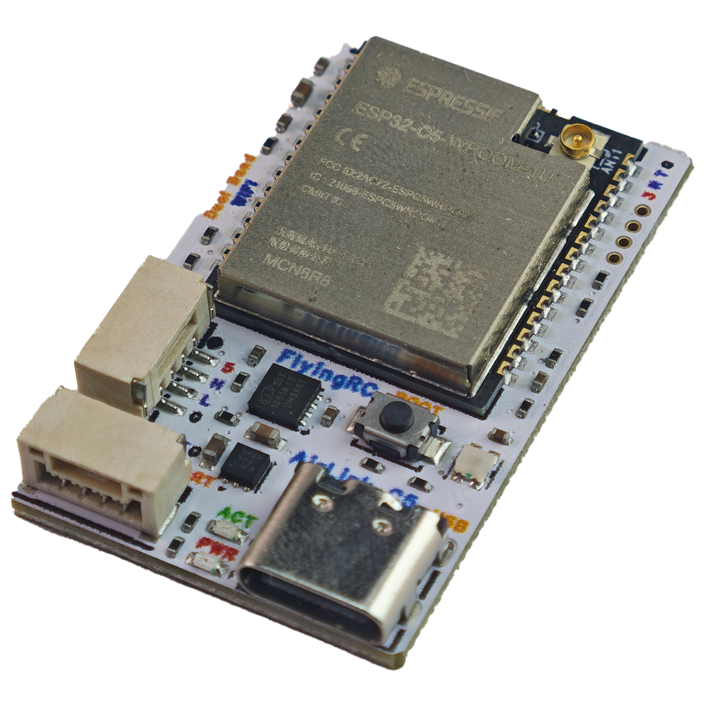
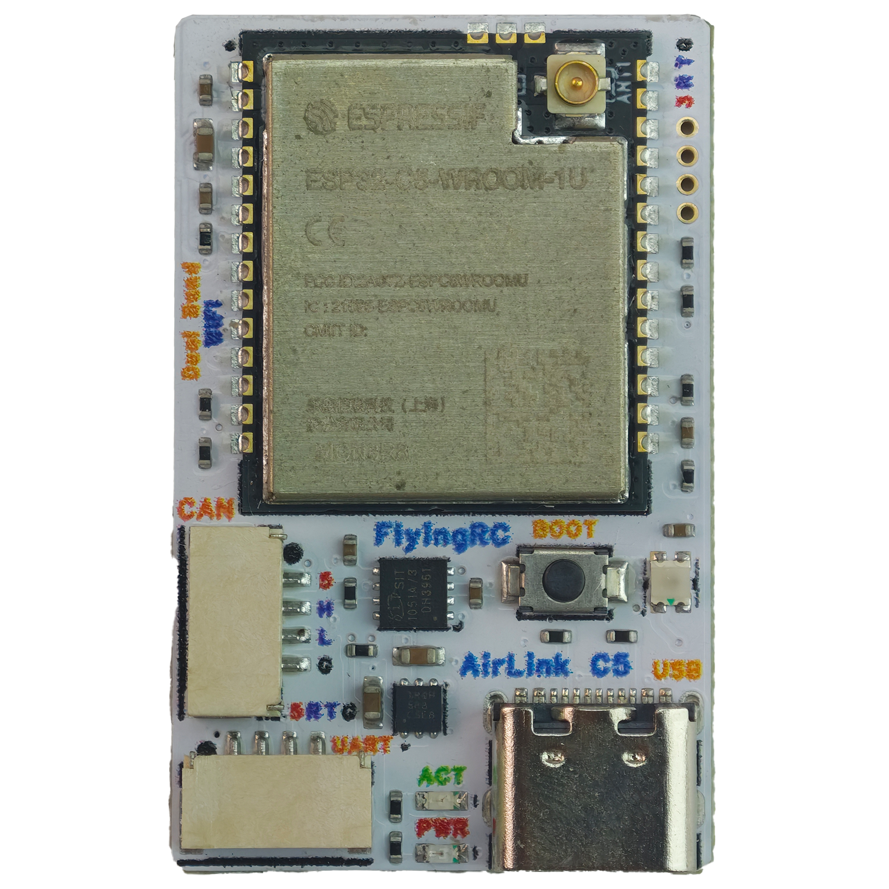
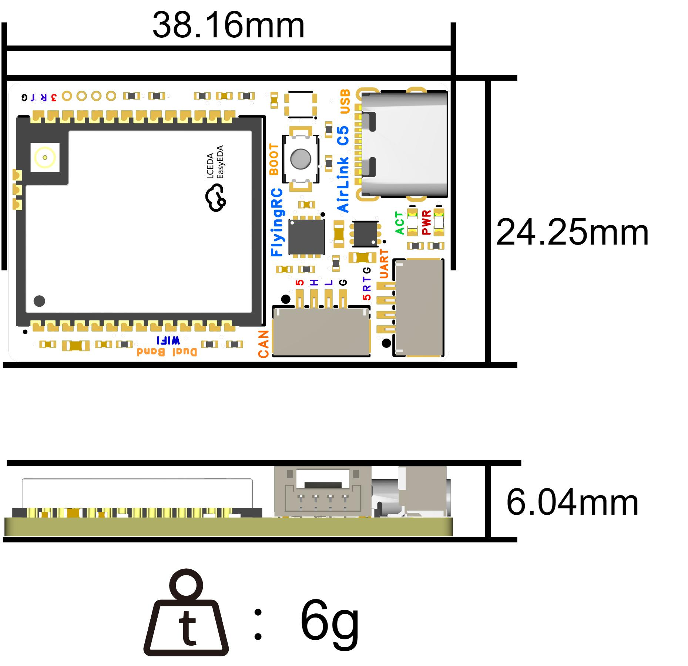
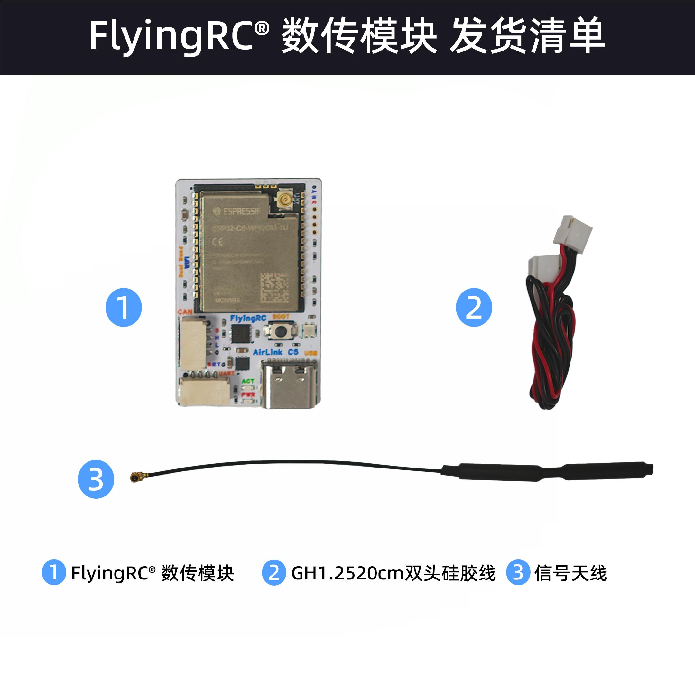
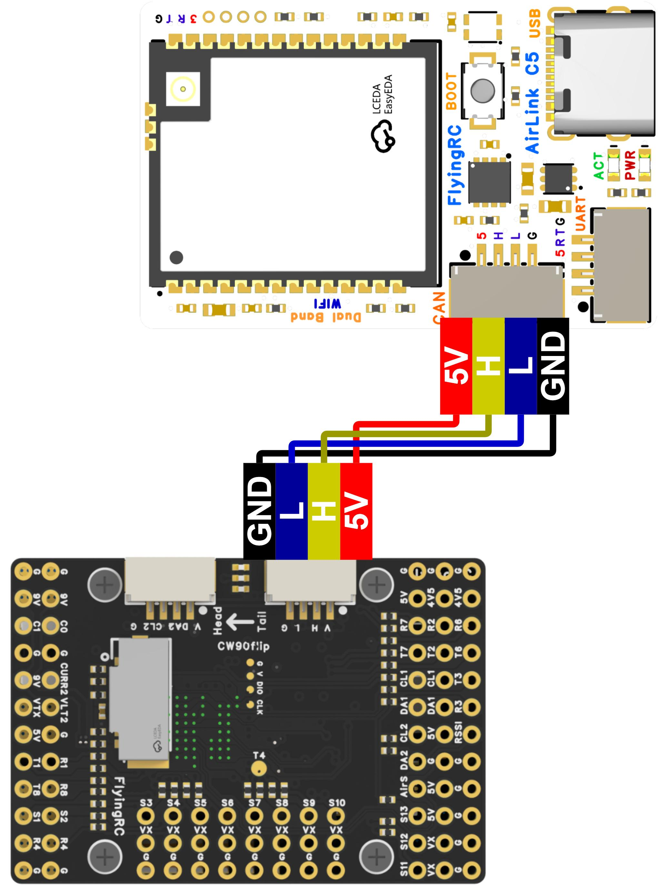
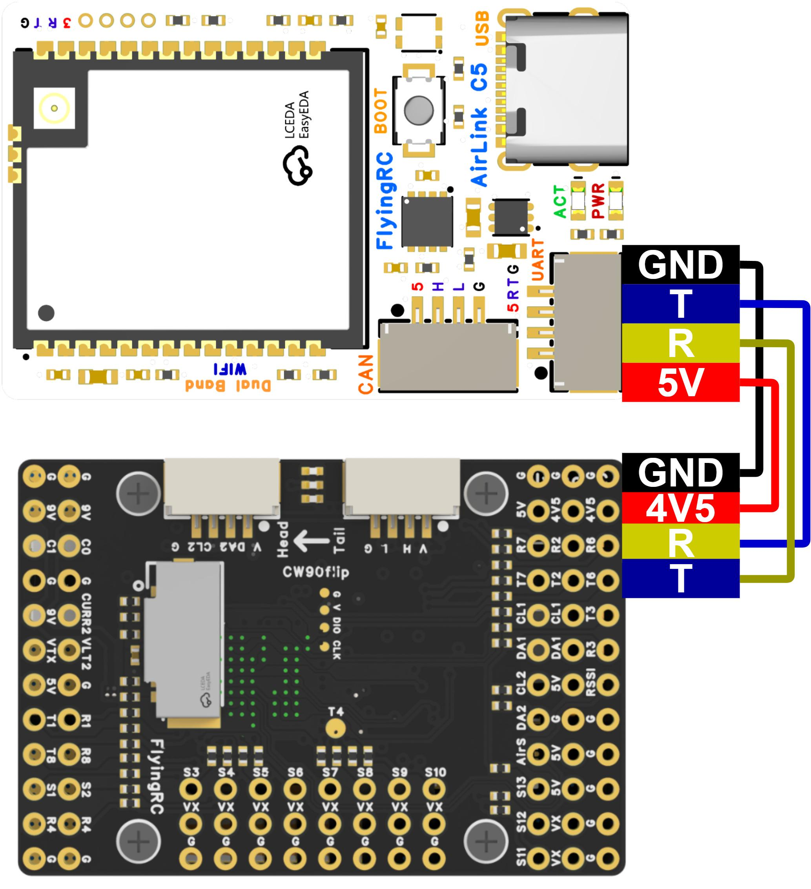

# FlyingRC®数传模块产品手册

> 状态：在售 · 类别：module · 内容自原 WPS 说明书迁入

---

## 一、FlyingRC介绍

## 产品概述

## 技术参数

## 基础参数

型 号

FlyingRC® 数传模块

供电范围

5V

尺 寸

38.16mm*24.25mm*6.04mm

工作温度范围

-40-85℃

质 量

6.4g

存储温度范围

0-40℃

CPU

RISC-V 单核，240 MHz

SRAM

384 KB

Wi-Fi

Wi-Fi 6，2.4 GHz + 5 GHz 双频

支持固件

Ardupilot

与传统WiFi数传相比，FlyingRC AirLink C5 增加了如下功能：

采用乐鑫ESP32-C5模组，支持WiFi 6 双频（2.4GHz + 5GHz），RISC-V单核主频240MHz，SRAM 384KB

业内少有集成CAN总线的WiFi数传，板载SIT1051A CAN收发器芯片，支持CAN 2.0协议

Type-C直插供电与调参，同时保留CAN和UART双通道，连接更灵活

**1. 技术参数**

## 基础参数

型       号

FlyingRC AirLink C5 数传模块

CAN收发器

SIT1051A（CAN 2.0兼容）

尺       寸

38.16mm × 24.25mm × 6.04mm

天线

外置IPEX天线座（-1U版本）

主 控 模 组

ESP32-C5-WROOM-1U（乐鑫科技）

工作温度范围

-40~85°C

质       量

6.4g

存储温度范围

0~40°C

主       控

电源输出

处理器

RISC-V 单核

板载降压模块 BEC

无

主频

240MHz

电  源  输  入

5V

SRAM

384KB

无线

WiFi 6（802.11ax）

工作环境

固件支持

电  源  输  入

5V

Ardupilot

支持

**2. 产品特点**

超小体积：38.16×24.25×6.04mm，仅重6.4克，适合各类固定翼及穿越机安装。背面搭配定制二次元涂装，辨识度极高。

支持WiFi 6 双频（2.4GHz + 5GHz），相比单频数传抗干扰能力更强，在复杂2.4GHz环境下可切换5GHz频段，通讯更稳定。

支持CAN总线连接（SH1.0 4P接口：5V / CAN_H / CAN_L / GND），板载SIT1051A收发器，可直连飞控CAN端口，实现低延迟双向数传。

支持UART连接（SH1.0 4P接口），兼容传统串口数传协议。

Type-C接口直插，供电与数据传输一步到位，连接稳定，寿命更长。

外置IPEX天线设计（ESP32-C5-WROOM-1U），相比板载天线版本信号更强，适合远距离或屏蔽环境使用。

支持Ardupilot固件，可通过MAVLink协议与地面站通讯，手机/电脑无线调参与数据回传。

板载BOOT按键，支持固件一键烧录与升级。

ACT/PWR双指示灯，工作状态与供电一目了然。

宽温设计，工作温度-40~85°C，适应各种极端飞行环境。

嘉立创量产SMT，PCB工艺：白色阻焊，沉金，4层板。

发货清单

## 三、使用方法

### 接线

与FlyingRC® H7Wlite H743主控固定翼飞控接线图

## 四、技术问题咨询

若遇技术问题，建议先查阅产品说明书；也可前往AI平台、B站等渠道获取帮助。同时欢迎群友互相协助，分享已知解决方案。

请注意：本产品Ardupilot固件提供有限技术支持，INAV和BF固件无技术支持

维修服务

本品本品不提供售后维修服务

FlyingRC® 其它产品介绍

**1. 飞控类38**

**2. 电调类41**

**3. 飞塔类43**

4. BEC 降压电路类47

5. 模块类49

6. 其他类50

飞控类

全新升级、功能更强

FlyingRC官方零售价：140元

中文说明书   Product Manual   去淘宝购买

经典产品、设计独特、好评如潮

中文说明书  Product Manual

性能强劲，双陀螺仪

FlyingRC官方零售价：299元

中文说明书  Product Manual

性能强劲，双陀螺仪,BEC输出能力强

FlyingRC官方零售价：259元

中文说明书  Product Manual  去淘宝购买

2025年 爆款产品,设计感爆棚,全网最Mini

FlyingRC官方零售价：89元

中文说明书   Product Manual  去淘宝购买

全新升级、功能更强

FlyingRC官方零售价：269元/299元

中文说明书 Product Manual 去淘宝购买

算力强大 飞行稳定精准 接口丰富 操控自如

中文说明书   Product Manual

算力强大 飞行稳定精准 接口丰富 操控自如

FlyingRC官方零售价：129元

中文说明书   Product Manual  去淘宝购买

电调类

本店销量No.4

高端产品,英飞凌金封MOS,工艺最佳,单路持续75AFlyingRC官方零售价：269元

中文说明书 Product Manual 去淘宝购买

性能出色，性价比高，入门首选

FlyingRC官方零售价：149元

中文说明书 Product Manual  去淘宝购买

设计独特，独家产品 用于无人机等空中、陆地、水上双动力设备    FlyingRC官方零售价：89元

中文说明书 Product Manual 去淘宝购买

英飞凌金封MOS 工艺出色 过流能力强大

FlyingRC官方零售价：87元（不带BEC版本）

中文说明书 Product Manual 去淘宝购买

客户可以用自己的功率板，制作不同规格电调

FlyingRC官方零售价：47元

中文说明书 Product Manual 去淘宝购买

超Mini 用于小型和微型机 过流能力强 运行稳定 FlyingRC官方零售价：43元

中文说明书 Product Manual 去淘宝购买

飞塔类

H743穿越机飞控+四合一穿越机75A金封电调

专业飞行首选，旗舰用料工艺，良心价格

FlyingRC官方零售价：528元

飞控中文说明书   电调中文说明书

FC Product Manual  ESC Product Manual

去淘宝购买

F405穿越机飞控+四合一穿越机75A金封电调

爆款组合，性能出色，良心价格

FlyingRC官方零售价：398元

飞控中文说明书    电调中文说明书

FC Product Manual ESC Product Manual

去淘宝购买

H743穿越机飞控+四合一穿越机45A电调

爆款组合，性能出色，价格亲民

FlyingRC官方零售价：408元

飞控中文说明书     电调中文说明书

FC Product Manual  ESC Product Manual

去淘宝购买

F405穿越机飞控+四合一穿越机45A电调

爆款组合，实惠之选，价格亲民

FlyingRC官方零售价：278元

飞控中文说明书     电调中文说明书

FC Product Manual  ESC Product Manual

去淘宝购买

F4WSE PRO飞控+二合一40A电调

独特设计、独家产品、爆款组合

FlyingRC官方零售价：237元

飞控中文说明书      电调中文说明书

FC Product Manual   ESC Product Manual

去淘宝购买

BEC 降压电路类

多电压可选 行业首选，物美价廉

FlyingRC官方零售价：74元

中文说明书 Product Manual 去淘宝购买

多电压可选 行业首选，物美价廉

FlyingRC官方零售价：36元

中文说明书 Product Manual 去淘宝购买

多电压可选，持续5A输出

FlyingRC官方零售价：17元

中文说明书  Product Manual  去淘宝购买

独立降压，稳定供电，让飞行更安全

FlyingRC官方零售价：18元

中文说明书  Product Manual  去淘宝购买

模块类

超高分辨率、低功耗、行业首选

FlyingRC官方零售价：129元

中文说明书  Product Manual  去淘宝购买

行业首选，物美价廉

FlyingRC官方零售价：199元

中文说明书 Product Manual 去淘宝购买

其他类

行业首选，物美价廉

FlyingRC官方零售价：109元

中文说明书  Product Manual 去淘宝购买

真分集接收,温度补偿，高功率接收

FlyingRC官方零售价：109元

中文说明书  Product Manual  去淘宝购买

支持BL，BL32，AM32 简单好用

FlyingRC官方零售价：9.9元/7.9元（A口/C口）焊好

FlyingRC官方零售价：6.9元/5.9元（A口/C口）自己焊

中文说明书 Product Manual 去淘宝购买

一体设计，全网最Mini MS4525D协议，I2C接口

FlyingRC官方零售价：95元

中文说明书  Product Manual  去淘宝购买

一体设计，全网最Mini MS4525D协议，I2C接口

FlyingRC官方零售价：    95元

中文说明书  Product Manual  去淘宝购买

一体设计，全网最Mini MS4525D协议，I2C接口

FlyingRC官方零售价：39元

中文说明书  Product Manual  去淘宝购买

长距离传输，高速率，稳定性强

FlyingRC官方零售价：46元

中文说明书  Product Manual  去淘宝购买

支持各种开源飞控 多尺寸可选 搜星能力强 性价高

FlyingRC官方零售价：68元(18*18mm款)

中文说明书  Product Manual  去淘宝购买

FlyingRC®官网

www.FlyingRC®.cn

淘宝店铺

闲鱼店铺

群号1016199449

电话:021-58204886 手机:13122492475   微信:13122492475、18019464804

---

## 安全须知

--8<-- "shared/safety.md"

---

## 首次使用检查

--8<-- "shared/first-use-check.md"

---

## 技术支持

--8<-- "shared/support.md"

---

## 售后与保修

--8<-- "shared/warranty.md"

---

## FlyingRC® 其它产品

--8<-- "shared/other-products.md"

---

## 免责声明

--8<-- "shared/disclaimer.md"

