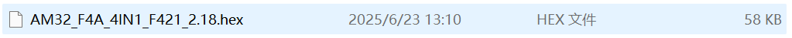
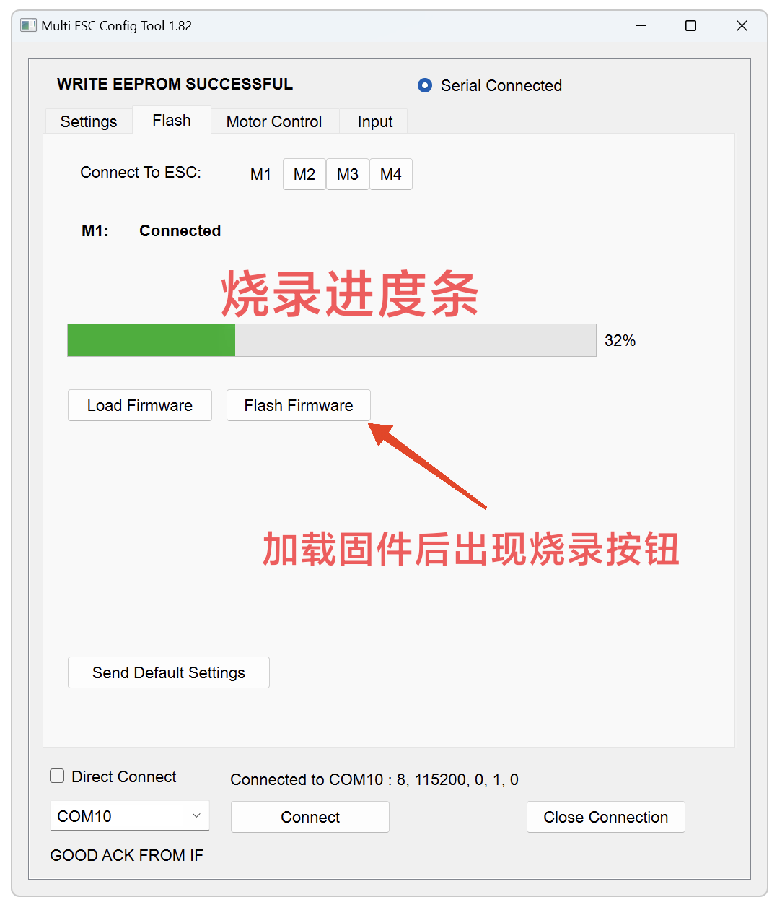
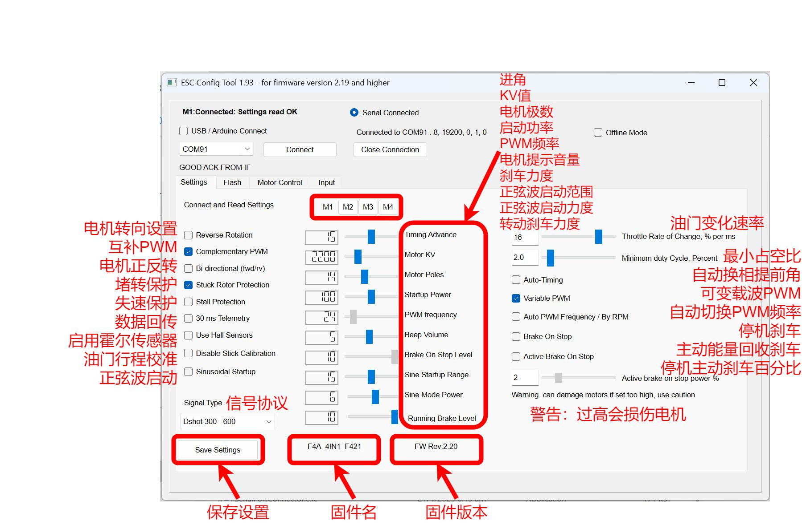

# AM32 固件与调参

## 出厂固件

FlyingRC® AM32 电调出厂默认已刷写 **正式版 AM32 固件**，并完成多电压旋转测试。

- 具体出厂版本以产品页 / 最新公告为准
- 参数默认出厂设置（部分场景可能附带爬车参数预设）

## 安全须知

!!! warning "刷写 / 调参前"

    1. **取下螺旋桨**
    2. 使用动力电池供电（部分通路需电调端供电）
    3. 使用**离线版**调参工具
    4. 关闭 BF 地面站，释放飞控端口

!!! danger "禁止网页版调参软件刷写"

    请勿使用网页版调参软件更新固件，可能导致电调 MCU 损坏。已发生多起案例，需返厂付费维修。

## 连接调参器

1. 下载 AM32-ESC-Tools（群文件 / 官网），解压后运行 `SerialPortConnector.exe`。
2. 按说明书将 FlyingRC® AM32 调参器接到电调信号线。
3. 在软件右下角选择对应 COM 口，点击 Connect。

## 烧录固件

1. 提前下载好目标版本固件（github 或群文件）。
2. 打开调参软件「Flash」页面。
3. 选择 M1 → Load Firmware → 选择固件文件。
4. 点击 **Flash Firmware**，等待进度完成。
5. 点击 **Send Default Settings** 恢复默认参数（跨版本更新建议不要省略）。
6. 对 M2/M3/M4 等通道重复（四合一 / 多路）。

## 主要参数

| 参数 | 说明 |
|------|------|
| KV 值 | 需调整至电机 KV 附近，偏差不超过 30%；偏差超过 100% 可能导致电机不转甚至损坏电调 |
| 进角 | **禁止随意调整**。错误调整会导致电调损坏且通常无法维修 |
| 失速保护 | 低 KV 电机（&lt;500）或开启正弦波启动时建议开启 |
| 正弦波启动 | 常见穿越机无需启用；攀爬车 / 低速大扭矩场景可开启 |

